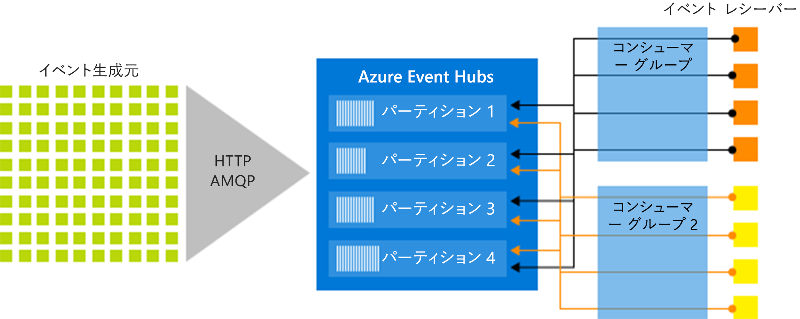

# Azure Event Hubs とは

Azure Event Hubs はビッグ データ ストリーミング プラットフォームであり、毎秒数百万のイベントを受け取って処理できるイベント インジェスト サービスです。 Event Hubs では、分散されたソフトウェアやデバイスから生成されるイベント、データ、またはテレメトリを処理および格納できます。 イベント ハブに送信されたデータは、任意のリアルタイム分析プロバイダーやバッチ処理/ストレージ アダプターを使用して、変換および保存できます。 

Event Hubs は、次のような一般的なシナリオで使用されます。

- 異常検出 (不正/外れ値)
- アプリケーションのログ記録
- クリックストリームなどの分析パイプライン
- ライブ ダッシュボード
- データのアーカイブ
- トランザクション処理
- ユーザー利用統計情報処理
- デバイス利用統計情報ストリーミング 

## Event Hubs を使用する理由

データは、データ ソースを処理してタイムリーに分析情報を取得する簡単な方法があって初めて価値があります。 Event Hubs が提供する分散ストリーム処理プラットフォームは、待ち時間が短く、Azure の内部および外部にあるデータおよび分析サービスとシームレスに統合して、完全なビッグ データ パイプラインを構築します。

Event Hubs はイベント パイプラインの "玄関口" を表し、ソリューション アーキテクチャでは "*イベント インジェスター*" と呼ばれることがよくあります。 イベント取り込みとは、イベント ストリームの生成とそのようなイベントの消費とを分離するために、イベント パブリッシャーとイベント コンシューマーとの間に置かれるコンポーネントやサービスです。 Event Hubs は、時間保持バッファーを備えた統合ストリーミング プラットフォームを提供し、イベント プロデューサーをイベント コンシューマーから切り離します。 

以降のセクションで、Azure Event Hubs サービスの主要な機能について説明します。 

## フル マネージド PaaS 

Event Hubs は構成または管理のオーバーヘッドがほとんどないマネージド サービスなので、ユーザーはビジネス ソリューションに集中できます。 [Apache Kafka エコシステム向けの Event Hubs](event-hubs-for-kafka-ecosystem-overview.md) では PaaS Kafka エクスペリエンスが提供され、独自のクラスターを管理、構成、実行する必要はありません。

## リアルタイム処理とバッチ処理のサポート

ストリームの取り込み、バッファー、格納、処理をリアルタイムで行い、アクションにつながる分析情報を取得します。 Event Hubs は[パーティション分割されたコンシューマー モデル](event-hubs-features.md#partitions)を使用して、複数のアプリケーションがストリームを同時に処理し、処理の速度を制御できるようにします。

長期保有またはマイクロ バッチ処理のために、ほぼリアルタイムでデータを [Azure Blob Storage](https://azure.microsoft.com/services/storage/blobs/) または [Azure Data Lake Store](https://azure.microsoft.com/services/data-lake-store/)  に[キャプチャ](event-hubs-capture-overview.md)します。 これは、リアルタイム分析の派生に使用するものと同じストリームで実現できます。 Capture の設定は手軽で、実行に伴う管理コストは生じません。また、Event Hubs の [スループット単位](event-hubs-features.md#throughput-units)に応じて自動的にスケールします。 Event Hubs Capture を使用することで、ユーザーはデータの収集ではなくデータ処理に専念できます。

また、Azure Event Hubs は サーバーレス アーキテクチャ用の [Azure Functions](/azure/azure-functions/) と統合します。

## 拡張性 

Event Hubs では、メガバイト単位のデータ ストリームで開始し、ギガバイトまたはテラバイトまで拡張できます。 [自動インフレ](event-hubs-auto-inflate.md)機能は、使用状況のニーズに合わせてスループット ユニットの数をスケーリングするために利用できる多くのオプションの 1 つです。 

## 充実したエコシステム

[Apache Kafka エコシステム向けの Event Hubs](event-hubs-for-kafka-ecosystem-overview.md) により、[Apache Kafka (1.0 以降)](https://kafka.apache.org/) のクライアントとアプリケーションは、クラスターを管理することなく Event Hubs と通信できます。
 
さまざまな[言語 (.NET、Java、Python、Go、Node.js)](https://github.com/Azure/azure-event-hubs) で使用可能な広範なエコシステムにより、Event Hubs からのストリームの処理を簡単に開始できます。 サポートされているすべてのクライアント言語が、低レベルの統合を提供します。

## 主なアーキテクチャ コンポーネント

Event Hubs はメッセージ ストリーム処理機能を備えていますが、従来のエンタープライズ メッセージングとは特性が異なります。 Event Hubs の機能は、高スループットおよびイベント処理のシナリオに基づいて構築されています。 Event Hubs には次の[主要コンポーネント](event-hubs-features.md)が含まれます。

- **イベント プロデューサー**: イベント ハブにデータを送信するエンティティ。 イベント パブリッシャーは、HTTPS、AMQP 1.0、または Apache Kafka (1.0 以降) を使用してイベントを発行できます。
- **パーティション**: 各コンシューマーは、メッセージ ストリームの特定のサブセット (パーティション) のみを読み取ります。
- **コンシューマー グループ**: イベント ハブ全体のビュー (状態、位置、またはオフセット)。 コンシューマー グループを使用することにより、複数のコンシューマー アプリケーションは、イベント ストリームの個別のビューをそれぞれ保有し、独自のペースで独自のオフセットによってストリームを別々に読み取ることができます。
- **スループット単位**: Event Hubs のスループット容量を制御する、購入前の容量の単位。
- **イベント レシーバー**: イベント ハブからイベント データを読み取るエンティティ。 Event Hubs のすべてのコンシューマーは AMQP 1.0 セッションを介して接続します。イベントは使用可能になると、このセッションを使用して配信されます。

次の図は、Event Hubs ストリーム処理のアーキテクチャを示しています。

## 次の手順

Event Hubs を使い始めるには、以下の記事をご覧ください。

* [Event Hubs に取り込む](event-hubs-quickstart-portal.md)
* [Event Hubs の機能の概要](event-hubs-features.md)
* [よく寄せられる質問](event-hubs-faq.md)

