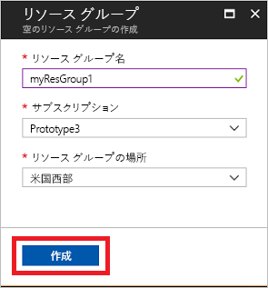
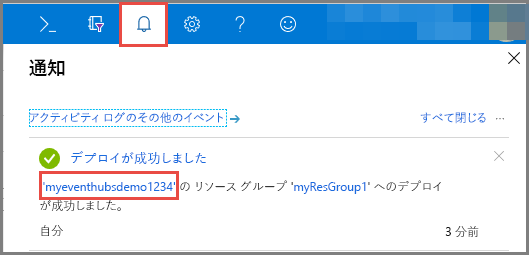
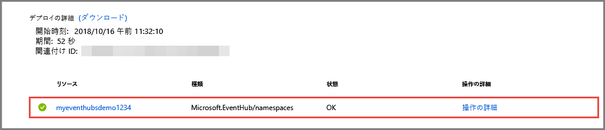

# クイック スタート: Azure portal を使用したイベント ハブの作成
Azure Event Hubs はビッグ データ ストリーミング プラットフォームであり、毎秒数百万のイベントを受け取って処理できるイベント インジェスト サービスです。 Event Hubs では、分散されたソフトウェアやデバイスから生成されるイベント、データ、またはテレメトリを処理および格納できます。 イベント ハブに送信されたデータは、任意のリアルタイム分析プロバイダーやバッチ処理/ストレージ アダプターを使用して、変換および保存できます。 Event Hubs の詳しい概要については、[Event Hubs の概要](event-hubs-about.md)と [Event Hubs の機能](event-hubs-features.md)に関するページをご覧ください。

このクイック スタートでは、[Azure portal](https://portal.azure.com) を使用してイベント ハブを作成します。

## 前提条件

このクイック スタートを実行するには、以下が必要です。

- Azure のサブスクリプション。 お持ちでない場合は、開始する前に[無料アカウントを作成](https://azure.microsoft.com/free/)してください。
- [Visual Studio 2017 Update 3 (バージョン 15.3, 26730.01)](https://www.visualstudio.com/vs) 以降。
- [.NET Standard SDK](https://www.microsoft.com/net/download/windows) バージョン 2.0 以降。

## リソース グループの作成

リソース グループは、Azure リソースの論理的なコレクションです。 すべてのリソースのデプロイと管理はリソース グループで行われます。 以下を実行してリソース グループを作成します。

1. [Azure Portal](https://portal.azure.com) にサインインします。
2. 左側のナビゲーションで、**[リソース グループ]** をクリックします。 **[追加]** をクリックします。

   ![リソース グループ - [追加] ボタン](./media/event-hubs-quickstart-portal/resource-groups1.png)

2. リソース グループに一意の名前を入力します。 現在選択されている Azure サブスクリプションでその名前を使用できるかどうかが、すぐに自動で確認されます。

3. **[サブスクリプション]** で、リソース グループを作成したい Azure サブスクリプションの名前をクリックします。

4. リソース グループの地理的な場所を選択します。

5. **Create** をクリックしてください。

   

## Event Hubs 名前空間を作成します

Event Hubs 名前空間は一意のスコープ コンテナーを提供します。このコンテナーは、1 つ以上のイベント ハブを作成する完全修飾ドメイン名によって参照されます。 ポータルを使用してリソース グループに名前空間を作成するには、以下の操作を実行します。

1. Azure portal で、画面の左上にある **[リソースの作成]** をクリックします。

2. **[モノのインターネット]**、**[Event Hubs]** の順にクリックします。

3. **[名前空間の作成]** で、名前空間の名前を入力します。 その名前が使用できるかどうかがすぐに自動で確認されます。

   

4. 入力した名前空間の名前が使用できることを確認したら、価格レベル (Basic または Standard) を選択します。 Azure サブスクリプション、リソース グループ、リソースが作成される場所を選択します。
 
5. **[作成]** をクリックして、名前空間を作成します。 システムがリソースを完全にプロビジョニングするまで、数分間待つことが必要な場合があります。
6. **[アラート]** を選択し、イベント ハブの名前空間と同じ名前の**デプロイ**を選択します。 

   
6. デプロイ内に作成されたリソースの一覧で、イベント ハブの名前空間を選択します。 

   
7. **[Event Hubs 名前空間]** ページで **[共有アクセス ポリシー]** を選択し、**[RootManageSharedAccessKey]** をクリックします。
    
8. コピー ボタンをクリックして **RootManageSharedAccessKey** 接続文字列をクリップボードにコピーします。 後で使用するため、メモ帳などの一時的な場所に、この接続文字列を保存します。
    
## イベント ハブの作成

名前空間内にイベント ハブを作成するには、以下の操作を実行します。

1. [Event Hubs 名前空間] ページで、**[イベント ハブ]** を選択します。
   
    ![左側のメニューで [イベント ハブ] を選択する](./media/event-hubs-quickstart-portal/create-event-hub3.png)

1. ウィンドウの上部にある **[+ イベント ハブ]** をクリックします。
   
    
1. イベント ハブの名前を入力し、 **[作成]** をクリックします。
   
    

お疲れさまでした。 ポータルを使用して Event Hubs 名前空間を作成し、その名前空間内にイベント ハブを作成しました。 

## 次の手順

この記事では、リソース グループ、Event Hubs 名前空間、イベント ハブを作成しました。 イベント ハブに対してイベントを送信または受信するためのステップ バイ ステップの手順については、次のチュートリアルをご覧ください。  

- **イベントをイベント ハブに送信する**: [.NET Core](event-hubs-dotnet-standard-getstarted-send.md)、[.NET Framework](event-hubs-dotnet-framework-getstarted-send.md)、[Java](event-hubs-java-get-started-send.md)、[Python](event-hubs-python-get-started-send.md)、[Node.js](event-hubs-node-get-started-send.md)、[Go](event-hubs-go-get-started-send.md)、[C](event-hubs-c-getstarted-send.md)
- **イベント ハブからイベントを受信する**: [.NET Core](event-hubs-dotnet-standard-getstarted-receive-eph.md)、[.NET Framework](event-hubs-dotnet-framework-getstarted-receive-eph.md)、[Java](event-hubs-java-get-started-receive-eph.md)、[Python](event-hubs-python-get-started-receive.md)、[Node.js](event-hubs-node-get-started-receive.md)、[Go](event-hubs-go-get-started-receive-eph.md)、[Apache Storm](event-hubs-storm-getstarted-receive.md)

[Azure portal]: https://portal.azure.com/
[3]: ./media/event-hubs-quickstart-portal/sender1.png
[4]: ./media/event-hubs-quickstart-portal/receiver1.png
