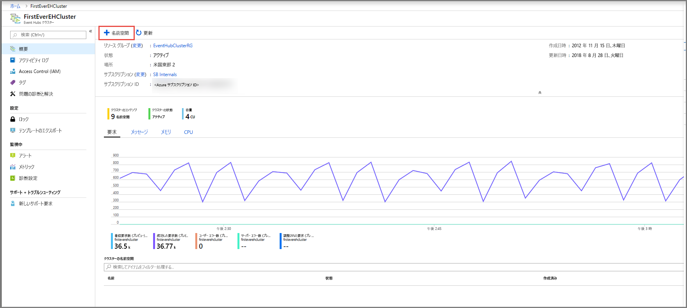
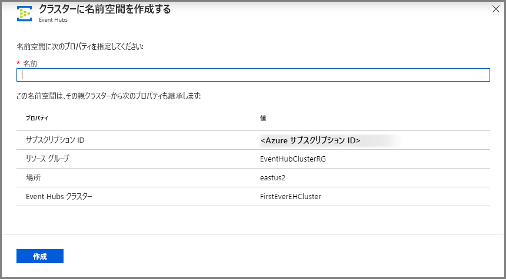
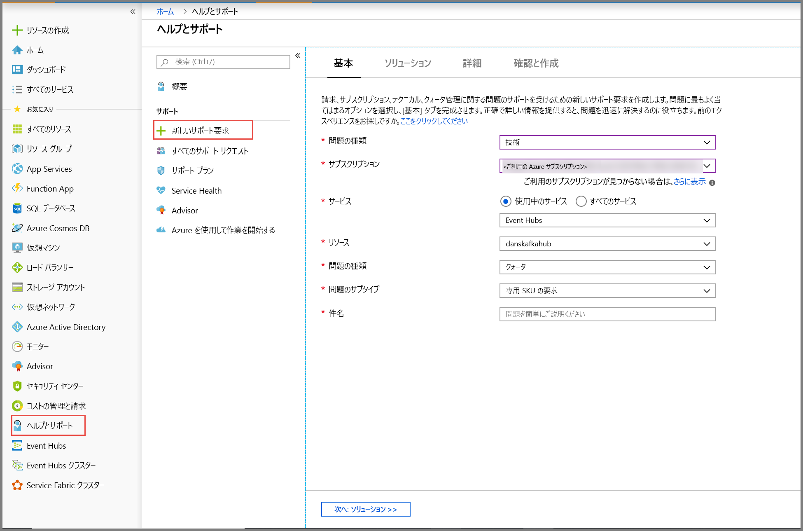
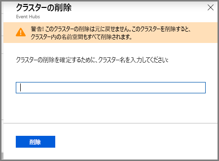

# クイック スタート:Azure portal を使用して専用の Event Hubs クラスターを作成する 
Event Hubs クラスターは、最も厳しいストリーミングのニーズを持つお客様にシングルテナント デプロイを提供します。 このサービスでは、99.99% の SLA が保証されており、専用の価格レベルでのみご利用いただけます。 [Event Hubs クラスター](event-hubs-dedicated-overview.md)では、1 秒あたり数百万のイベントを、保証された容量と 1 秒未満の待ち時間でイングレスすることができます。 クラスター内で作成された名前空間とイベント ハブには、標準サービスのすべての機能とそれ以外の機能が含まれますが、イングレスに関する制限はありません。 また、専用サービスには、一般的な [Event Hubs Capture](event-hubs-capture-overview.md) 機能が追加料金なしで含まれているため、[Azure Blob Storage](../storage/blobs/storage-blobs-introduction.md) または [Azure Data Lake Storage Gen 1](../data-lake-store/data-lake-store-overview.md) に対してデータ ストリームを自動的にバッチおよびログ処理することができます。

専用クラスターは、事前に割り当てられた CPU とメモリ リソースの量である**容量ユニット (CU)** を基準にプロビジョニングおよび請求が行われます。 クラスターごとに 1、2、4、8、12、16、または 20 の CU を購入することができます。 このクイックスタートでは、Azure portal を通じて 1 CU Event Hubs クラスターを作成する方法について説明します。

> [!NOTE]
> このセルフサービス エクスペリエンスは現在プレビュー段階として、[Azure portal](https://aka.ms/eventhubsclusterquickstart) 上で使用できます。 専用サービスについて質問がある場合は、[Event Hubs チーム](mailto:askeventhubs@microsoft.com)にお問い合わせください。

## 前提条件
このクイック スタートを実行するには、以下が必要です。

- Azure アカウント。 お持ちでない場合は、開始する前に[アカウントを購入](https://azure.microsoft.com/pricing/purchase-options/pay-as-you-go/)してください。 この機能は、無料の Azure アカウントではサポートされていません。 
- [Visual Studio](https://visualstudio.microsoft.com/vs/) 2017 Update 3 (バージョン 15.3, 26730.01) 以降。
- [.NET Standard SDK](https://dotnet.microsoft.com/download) バージョン 2.0 以降。
- [リソース グループを作成する](../event-hubs/event-hubs-create.md#create-a-resource-group)。

## Event Hubs 専用クラスターを作成する
Event Hubs クラスターは、1 つ以上の名前空間を作成できる固有のスコープ コンテナーを提供します。 このプレビュー段階のポータル セルフサービス エクスペリエンスでは、一部のリージョンに 1 CU のクラスターを作成できます。 1 CU よりも大きいクラスターが必要な場合、クラスターをスケールアップするための Azure サポート リクエストを作成後に送信できます。

Azure portal を使用して自分のリソース グループにクラスターを作成するには、次の手順を実行してください。

1. [このリンク先](https://aka.ms/eventhubsclusterquickstart)に移動して、Azure portal でクラスターを作成します。 反対に、左側のナビゲーション ウィンドウで **[すべてのサービス]** を選択し、検索バーに「Event Hubs クラスター」と入力して、結果の一覧から [Event Hubs クラスター] を選択します。
2. **[クラスターの作成]** ページで、以下を構成します。
    1. **クラスターの名前**を入力します。 その名前が使用できるかどうかがすぐに自動で確認されます。
    2. クラスターを作成する**サブスクリプション**を選択します。
    3. クラスターを作成する**リソース グループ**を選択します。
    4. クラスターの**場所**を選択します。 自分が希望するリージョンがグレー表示の場合、容量が一時的に不足していて、[サポート リクエスト](#submit-a-support-request)を Event Hubs チームに送信できます。
    5. ページの下部にある **[次へ: タグ]** ボタンを選択します。 システムがリソースを完全にプロビジョニングするまで、数分間待つことが必要な場合があります。

        ![Event Hubs クラスターの作成 - [基本] ページ](./media/event-hubs-dedicated-cluster-create-portal/create-event-hubs-clusters-basics-page.png)
3. **[タグ]** ページで、以下を構成します。
    1. 追加するタグの**名前**と**値**を入力します。 この手順は**省略可能**です。  
    2. **[確認および作成]** ボタンを選択します。

        ![Event Hubs クラスターの作成ページ - [タグ] ページ](./media/event-hubs-dedicated-cluster-create-portal/create-event-hubs-clusters-tags-page.png)
4. **[確認および作成]** ページで詳細を確認し、 **[作成]** を選択します。 

    ![Event Hubs クラスターの作成ページ - [確認および作成] ページ](./media/event-hubs-dedicated-cluster-create-portal/create-event-hubs-clusters-review-create-page.png)

## クラスター内に名前空間とイベント ハブを作成する

1. クラスター内に名前空間を作成するには、ご自分のクラスターの **[Event Hubs クラスター]** ページの上部のメニューから **[+名前空間]** を選択します。

    
2. [名前空間を作成する] ページで、次の手順を行います。
    1. **名前空間の名前**を入力します。  その名前が使用できるかどうかが確認されます。
    2. 名前空間は次のプロパティを継承します。
        1. サブスクリプション ID
        2. リソース グループ
        3. 場所
        4. クラスター名
    3. **[作成]** をクリックして、名前空間を作成します。 これで、ご自分のクラスターを管理できるようになりました。  

        
3. 名前空間を作成したら、名前空間内に通常作成する場合と同様に[イベント ハブを作成](event-hubs-create.md#create-an-event-hub)することができます。 

## サポート リクエストを送信します

作成後にクラスターのサイズを変更したい場合、または自分が希望するリージョンが使用できない場合、これらの手順に従ってサポート リクエストを送信してください。

1. [Azure portal](https://portal.azure.com) の左側のメニューから **[ヘルプとサポート]** を選択します。
2. [サポート] メニューから **[+ 新しいサポート リクエスト]** を選択します。
3. サポート ページで、次の手順を行います。
    1. **[問題の種類]** ドロップダウン リストで **[技術]** を選択します。
    2. **[サブスクリプション]** で、ご使用のサブスクリプションを選択します。
    3. **[サービス]** で、 **[使用中のサービス]** を選択し、 **[Event Hubs]** を選択します。
    4. **[リソース]** で、ご自分のクラスターが既にある場合は選択し、ない場合は **[General Question/Resource Not Available] (全般的な質問 / リソースを利用できません)** を選択します。
    5. **[問題の種類]** で、 **[クォータ]** を選択します。
    6. **[問題のサブタイプ]** ドロップダウン リストで、次の値のいずれかを選択します。
        1. **[Request for Dedicated SKU]\(専用 SKU のリクエスト\)** を選択して、ご自分のリージョンでの機能のサポートを要求します。
        2. ご自分の専用クラスターをスケールアップまたはスケールダウンしたい場合は、 **[Request to Scale Up or Scale Down Dedicated Cluster]\(専用クラスターのスケールアップまたはスケールダウンのリクエスト\)** を選択します。 
    7. **[件名]** で問題を説明します。

        

 ## 専用クラスターを削除する
 
1. クラスターを削除するには、上部のメニューで **[削除]** を選択します。 作成後、クラスターは 4 時間以上の使用に対して課金されることに注意してください。 
2. クラスターの削除を確認するメッセージが表示されます。
3. **クラスターの名前**を入力し、 **[削除]** をクリックしてクラスターを削除します。

    

## 次のステップ
この記事では、Event Hubs クラスターを作成しました。 イベント ハブに対するイベントの送受信、および Azure ストレージまたは Azure Data Lake Store へのイベントのキャプチャの詳細な手順については、次のチュートリアルをご覧ください。

- イベントの送受信 
    - [.NET Core](get-started-dotnet-standard-send-v2.md)
    - [Java](get-started-java-send-v2.md)
    - [Python](get-started-python-send-v2.md)
    - [JavaScript](get-started-java-send-v2.md)
- [Azure portal を使用して Event Hubs Capture を有効にする](event-hubs-capture-enable-through-portal.md)
- [Apache Kafka 用の Azure Event Hubs を使用する](event-hubs-for-kafka-ecosystem-overview.md)
