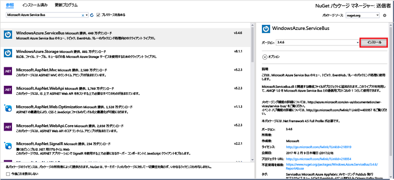

# <a name="send-events-to-azure-event-hubs-using-the-net-framework"></a>.NET Framework を使用して Azure Event Hubs にイベントを送信する
Azure Event Hubs はビッグ データ ストリーミング プラットフォームであり、毎秒数百万のイベントを受け取って処理できるイベント インジェスト サービスです。 Event Hubs では、分散されたソフトウェアやデバイスから生成されるイベント、データ、またはテレメトリを処理および格納できます。 イベント ハブに送信されたデータは、任意のリアルタイム分析プロバイダーやバッチ処理/ストレージ アダプターを使用して、変換および保存できます。 Event Hubs の詳しい概要については、[Event Hubs の概要](event-hubs-about.md)と [Event Hubs の機能](event-hubs-features.md)に関するページをご覧ください。

このチュートリアルでは、.NET Framework を使用し、C# で記述されたコンソール アプリケーションを使ってイベント ハブにイベントを送信する方法を示します。 

## <a name="prerequisites"></a>前提条件
このチュートリアルを完了するには、次の前提条件を用意しておく必要があります。

* [Microsoft Visual Studio 2017 以上](https://visualstudio.com)。

## <a name="create-an-event-hubs-namespace-and-an-event-hub"></a>Event Hubs 名前空間とイベント ハブを作成する
最初の手順では、[Azure Portal](https://portal.azure.com) を使用して Event Hubs 型の名前空間を作成し、アプリケーションがイベント ハブと通信するために必要な管理資格情報を取得します。 名前空間とイベント ハブを作成するには、[こちらの記事](event-hubs-create.md)の手順を実行した後、このチュートリアルに示されている手順に進みます。

次の記事の手順に従って、イベント ハブ名前空間用の接続文字列を取得します。[接続文字列を取得する](event-hubs-get-connection-string.md#get-connection-string-from-the-portal)。 このチュートリアルの中で、その接続文字列が後で必要になります。

## <a name="create-a-console-application"></a>コンソール アプリケーションの作成

Visual Studio で、 **コンソール アプリケーション** プロジェクト テンプレートを使用して、新しい Visual C# のデスクトップ アプリ プロジェクトを作成します。 プロジェクトの名前として「 **Sender**」と入力します。
   


## <a name="add-the-event-hubs-nuget-package"></a>Event Hubs NuGet パッケージの追加

1. ソリューション エクスプローラーで **[Sender]** プロジェクトを右クリックし、**[ソリューションの NuGet パッケージの管理]** をクリックします。 
2. **[参照]** タブをクリックして、`WindowsAzure.ServiceBus` を検索します。 **[インストール]** をクリックして、使用条件に同意します。 
   
    
   
    Visual Studio によりパッケージのダウンロードとインストールが実行され、 [Azure Service Bus ライブラリ NuGet パッケージ](https://www.nuget.org/packages/WindowsAzure.ServiceBus)への参照が追加されます。

## <a name="write-code-to-send-messages-to-the-event-hub"></a>イベント ハブにメッセージを送信するコードの記述

1. **Program.cs** ファイルの先頭に次の `using` ステートメントを追加します。
   
    ```csharp
    using System.Threading;
    using Microsoft.ServiceBus.Messaging;
    ```
2. **Program** クラスに次のフィールドを追加し、前のセクションで作成したイベント ハブの名前と、先ほど保存した名前空間レベルの接続文字列を値に代入します。 Azure portal 内のイベント ハブ ページの **RootManageSharedAccessKey** の下にある **[接続文字列 – プライマリ]** からご自分のイベント ハブ用の接続文字列をコピーできます。 詳細な手順については、[接続文字列の取得](event-hubs-get-connection-string.md#get-connection-string-from-the-portal)に関するページを参照してください。
   
    ```csharp
    static string eventHubName = "Your Event Hub name";
    static string connectionString = "namespace connection string";
    ```
3. **Program** クラスに次のメソッドを追加します。
   
      ```csharp
      static void SendingRandomMessages()
      {
          var eventHubClient = EventHubClient.CreateFromConnectionString(connectionString, eventHubName);
          while (true)
          {
              try
              {
                  var message = Guid.NewGuid().ToString();
                  Console.WriteLine("{0} > Sending message: {1}", DateTime.Now, message);
                  eventHubClient.Send(new EventData(Encoding.UTF8.GetBytes(message)));
              }
              catch (Exception exception)
              {
                  Console.ForegroundColor = ConsoleColor.Red;
                  Console.WriteLine("{0} > Exception: {1}", DateTime.Now, exception.Message);
                  Console.ResetColor();
              }
       
              Thread.Sleep(200);
          }
      }
      ```
   
      このメソッドは、200 ミリ秒の遅延時間でイベント ハブにイベントを継続的に送信します。
4. 最後に、**Main** メソッドに次の行を追加します。
   
      ```csharp
      Console.WriteLine("Press Ctrl-C to stop the sender process");
      Console.WriteLine("Press Enter to start now");
      Console.ReadLine();
      SendingRandomMessages();
      ```
5. プログラムを実行し、エラーがないことを確認します。
  
お疲れさまでした。 メッセージをイベント ハブに送信しました。

## <a name="next-steps"></a>次の手順
このクイック スタートでは、.NET Framework を使用してメッセージをイベント ハブに送信しました。 .NET Framework を使用してイベント ハブからイベントを受信する方法については、[.NET Framework を使用してイベント ハブからイベントを受信する方法](event-hubs-dotnet-framework-getstarted-receive-eph.md)に関するページを参照してください。

<!-- Images. -->
[19]: ./media/event-hubs-csharp-ephcs-getstarted/create-eh-proj1.png
[20]: ./media/event-hubs-csharp-ephcs-getstarted/create-eh-proj2.png
[21]: ./media/event-hubs-csharp-ephcs-getstarted/run-csharp-ephcs1.png
[22]: ./media/event-hubs-csharp-ephcs-getstarted/run-csharp-ephcs2.png

