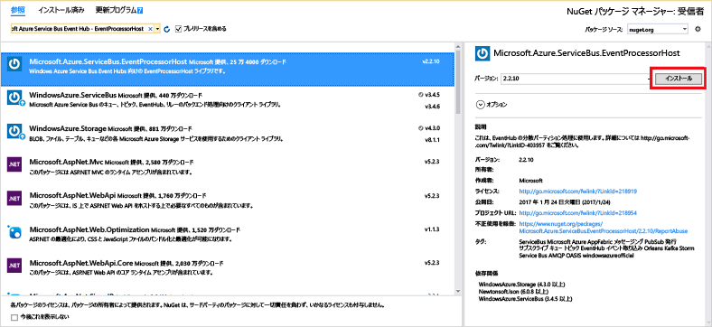

# <a name="quickstart-send-events-to-or-receive-events-from-azure-event-hubs-using-net-framework"></a>クイック スタート:.NET Framework を使用して Azure Event Hubs との間でイベントを送受信する
Azure Event Hubs はビッグ データ ストリーミング プラットフォームであり、毎秒数百万のイベントを受け取って処理できるイベント インジェスト サービスです。 Event Hubs では、分散されたソフトウェアやデバイスから生成されるイベント、データ、またはテレメトリを処理および格納できます。 イベント ハブに送信されたデータは、任意のリアルタイム分析プロバイダーやバッチ処理/ストレージ アダプターを使用して、変換および保存できます。 Event Hubs の詳しい概要については、[Event Hubs の概要](event-hubs-about.md)と [Event Hubs の機能](event-hubs-features.md)に関するページをご覧ください。

このチュートリアルでは、C# で .NET Framework コンソール アプリケーションを作成し、イベント ハブとの間でイベントを送受信する方法について説明します。 

## <a name="prerequisites"></a>前提条件
このチュートリアルを完了するには、次の前提条件を用意しておく必要があります。

- [Microsoft Visual Studio 2019](https://visualstudio.com)。
- **Event Hubs 名前空間とイベント ハブを作成する**。 最初の手順では、[Azure Portal](https://portal.azure.com) を使用して Event Hubs 型の名前空間を作成し、アプリケーションがイベント ハブと通信するために必要な管理資格情報を取得します。 名前空間とイベント ハブを作成するには、[こちらの記事](event-hubs-create.md)の手順に従います。 その後、次の記事の手順に従って、**イベント ハブ名前空間用の接続文字列**を取得します。[接続文字列を取得する](event-hubs-get-connection-string.md#get-connection-string-from-the-portal)。 このチュートリアルの中で、その接続文字列が後で必要になります。

## <a name="send-events"></a>送信イベント 
このセクションでは、イベント ハブにイベントを送信する .NET Framework コンソール アプリケーションの作成方法を説明します。 

### <a name="create-a-console-application"></a>コンソール アプリケーションの作成

Visual Studio で、 **コンソール アプリケーション** プロジェクト テンプレートを使用して、新しい Visual C# のデスクトップ アプリ プロジェクトを作成します。 プロジェクトの名前として「 **Sender**」と入力します。
   


### <a name="add-the-event-hubs-nuget-package"></a>Event Hubs NuGet パッケージの追加

1. ソリューション エクスプローラーで **[Sender]** プロジェクトを右クリックし、 **[ソリューションの NuGet パッケージの管理]** をクリックします。 
2. **[参照]** タブをクリックして、`WindowsAzure.ServiceBus` を検索します。 **[インストール]** をクリックして、使用条件に同意します。 
   
    
   
    Visual Studio によりパッケージのダウンロードとインストールが実行され、 [Azure Service Bus ライブラリ NuGet パッケージ](https://www.nuget.org/packages/WindowsAzure.ServiceBus)への参照が追加されます。

### <a name="write-code-to-send-messages-to-the-event-hub"></a>イベント ハブにメッセージを送信するコードの記述

1. **Program.cs** ファイルの先頭に次の `using` ステートメントを追加します。
   
    ```csharp
    using System.Threading;
    using Microsoft.ServiceBus.Messaging;
    ```
2. **Program** クラスに次のフィールドを追加し、前のセクションで作成したイベント ハブの名前と、先ほど保存した名前空間レベルの接続文字列を値に代入します。 Azure portal 内のイベント ハブ ページの **RootManageSharedAccessKey** の下にある **[接続文字列 – プライマリ]** からご自分のイベント ハブ用の接続文字列をコピーできます。 詳細な手順については、[接続文字列の取得](event-hubs-get-connection-string.md#get-connection-string-from-the-portal)に関するページを参照してください。
   
    ```csharp
    static string eventHubName = "Your Event Hub name";
    static string connectionString = "namespace connection string";
    ```
3. **Program** クラスに次のメソッドを追加します。
   
      ```csharp
      static void SendingRandomMessages()
      {
          var eventHubClient = EventHubClient.CreateFromConnectionString(connectionString, eventHubName);
          while (true)
          {
              try
              {
                  var message = Guid.NewGuid().ToString();
                  Console.WriteLine("{0} > Sending message: {1}", DateTime.Now, message);
                  eventHubClient.Send(new EventData(Encoding.UTF8.GetBytes(message)));
              }
              catch (Exception exception)
              {
                  Console.ForegroundColor = ConsoleColor.Red;
                  Console.WriteLine("{0} > Exception: {1}", DateTime.Now, exception.Message);
                  Console.ResetColor();
              }
       
              Thread.Sleep(200);
          }
      }
      ```
   
      このメソッドは、200 ミリ秒の遅延時間でイベント ハブにイベントを継続的に送信します。
4. 最後に、**Main** メソッドに次の行を追加します。
   
      ```csharp
      Console.WriteLine("Press Ctrl-C to stop the sender process");
      Console.WriteLine("Press Enter to start now");
      Console.ReadLine();
      SendingRandomMessages();
      ```
5. プログラムを実行し、エラーがないことを確認します。
  
## <a name="receive-events"></a>受信イベント
このセクションでは、[イベント プロセッサ ホスト](event-hubs-event-processor-host.md)を使用してイベント ハブからメッセージを受信する .NET Framework コンソール アプリケーションを作成します。 [イベント プロセッサ ホスト](event-hubs-event-processor-host.md)は、永続的なチェックポイントの管理によってイベント ハブのイベントの受信を簡素化し、並列してそれらのイベント ハブから受信する .NET クラスです。 イベント プロセッサ ホストを使用すると、さまざまなノードでホストされている場合でも、複数の受信側間でイベントを分割できます。 

[!INCLUDE [event-hubs-create-storage](../../includes/event-hubs-create-storage.md)]

### <a name="create-a-console-application"></a>コンソール アプリケーションの作成

Visual Studio で、**コンソール アプリケーション** プロジェクト テンプレートを使用して、新しい Visual C# のデスクトップ アプリ プロジェクトを作成します。 プロジェクトの名前として「 **Receiver**」と入力します。
   


### <a name="add-the-event-hubs-nuget-package"></a>Event Hubs NuGet パッケージの追加

1. ソリューション エクスプローラーで **[Receiver]** プロジェクトを右クリックし、 **[ソリューションの NuGet パッケージの管理]** をクリックします。
2. **[参照]** タブをクリックして、`Microsoft Azure Service Bus Event Hub - EventProcessorHost` を検索します。 **[インストール]** をクリックして、使用条件に同意します。
   
    
   
    Visual Studio によって、 [Azure Service Bus Event Hub - EventProcessorHost NuGet パッケージ](https://www.nuget.org/packages/Microsoft.Azure.ServiceBus.EventProcessorHost)への参照がすべての依存関係と共にダウンロード、インストール、追加されます。

### <a name="implement-the-ieventprocessor-interface"></a>IEventProcessor インターフェイスの実装

1. **[Receiver]** プロジェクトを右クリックし、 **[追加]** 、 **[クラス]** の順にクリックします。 新しいクラスの名前として「**SimpleEventProcessor**」と入力し、 **[追加]** をクリックしてクラスを作成します。
   
    
2. SimpleEventProcessor.cs ファイルの先頭に次のステートメントを追加します。
    
      ```csharp
      using Microsoft.ServiceBus.Messaging;
      using System.Diagnostics;
      ```
    
3. 次に、クラスの本文に次のコードを置き換えます。
    
      ```csharp
      class SimpleEventProcessor : IEventProcessor
      {
        Stopwatch checkpointStopWatch;
        
        async Task IEventProcessor.CloseAsync(PartitionContext context, CloseReason reason)
        {
            Console.WriteLine("Processor Shutting Down. Partition '{0}', Reason: '{1}'.", context.Lease.PartitionId, reason);
            if (reason == CloseReason.Shutdown)
            {
                await context.CheckpointAsync();
            }
        }
        
        Task IEventProcessor.OpenAsync(PartitionContext context)
        {
            Console.WriteLine("SimpleEventProcessor initialized.  Partition: '{0}', Offset: '{1}'", context.Lease.PartitionId, context.Lease.Offset);
            this.checkpointStopWatch = new Stopwatch();
            this.checkpointStopWatch.Start();
            return Task.FromResult<object>(null);
        }
        
        async Task IEventProcessor.ProcessEventsAsync(PartitionContext context, IEnumerable<EventData> messages)
        {
            foreach (EventData eventData in messages)
            {
                string data = Encoding.UTF8.GetString(eventData.GetBytes());
        
                Console.WriteLine(string.Format("Message received.  Partition: '{0}', Data: '{1}'",
                    context.Lease.PartitionId, data));
            }
        
            //Call checkpoint every 5 minutes, so that worker can resume processing from 5 minutes back if it restarts.
            if (this.checkpointStopWatch.Elapsed > TimeSpan.FromMinutes(5))
            {
                await context.CheckpointAsync();
                this.checkpointStopWatch.Restart();
            }
        }
      }
      ```
    
      このクラスは、**EventProcessorHost** から呼び出されて、イベント ハブから受信したイベントを処理します。 `SimpleEventProcessor` クラスは、ストップウォッチを使用して **EventProcessorHost** コンテキストで定期的にチェックポイント メソッドを呼び出します。 このプロセスにより、受信側が再起動した場合に、失われる処理中の作業が 5 分以内に収まることが保証されます。

### <a name="update-the-main-method-to-use-simpleeventprocessor"></a>SimpleEventProcessor を使用する Main メソッドを更新する

1. **Program** クラスで、ファイルの先頭に次の `using` ステートメントを追加します。
    
      ```csharp
      using Microsoft.ServiceBus.Messaging;
      ```
    
2. `Program` クラスの `Main` メソッドを次のコードに置き換え、先ほど保存したイベント ハブの名前と名前空間レベルの接続文字列、および前のセクションでコピーしたストレージ アカウントとキーを代入します。 
    
      ```csharp
      static void Main(string[] args)
      {
        string eventHubConnectionString = "{Event Hubs namespace connection string}";
        string eventHubName = "{Event Hub name}";
        string storageAccountName = "{storage account name}";
        string storageAccountKey = "{storage account key}";
        string storageConnectionString = string.Format("DefaultEndpointsProtocol=https;AccountName={0};AccountKey={1}", storageAccountName, storageAccountKey);
        
        string eventProcessorHostName = Guid.NewGuid().ToString();
        EventProcessorHost eventProcessorHost = new EventProcessorHost(eventProcessorHostName, eventHubName, EventHubConsumerGroup.DefaultGroupName, eventHubConnectionString, storageConnectionString);
        Console.WriteLine("Registering EventProcessor...");
        var options = new EventProcessorOptions();
        options.ExceptionReceived += (sender, e) => { Console.WriteLine(e.Exception); };
        eventProcessorHost.RegisterEventProcessorAsync<SimpleEventProcessor>(options).Wait();
        
        Console.WriteLine("Receiving. Press enter key to stop worker.");
        Console.ReadLine();
        eventProcessorHost.UnregisterEventProcessorAsync().Wait();
      }
      ```
    
3. プログラムを実行し、エラーがないことを確認します。
  
## <a name="next-steps"></a>次のステップ
次の記事を参照してください。 

- [EventProcessorHost](event-hubs-event-processor-host.md)
- [Azure Event Hubs の機能と用語](event-hubs-features.md)。
- [Event Hubs の FAQ](event-hubs-faq.md)


<!-- Links -->
[EventProcessorHost]: /dotnet/api/microsoft.servicebus.messaging.eventprocessorhost
[Event Hubs overview]: event-hubs-about.md
[Event Hubs Programming Guide]: event-hubs-programming-guide.md
[Azure Storage account]:../storage/common/storage-create-storage-account.md
[Event Processor Host]: event-hubs-event-processor-host.md
[Azure portal]: https://portal.azure.com
