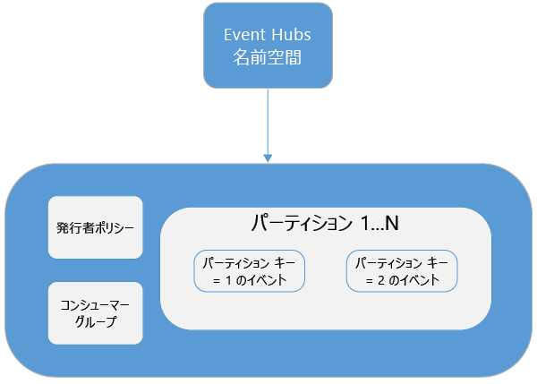
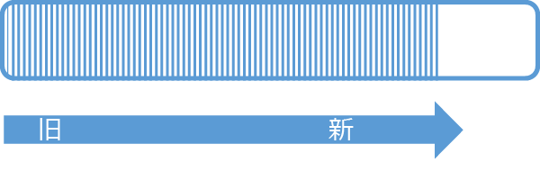
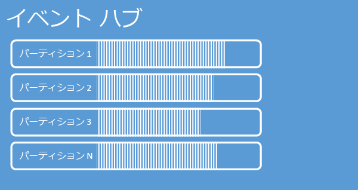
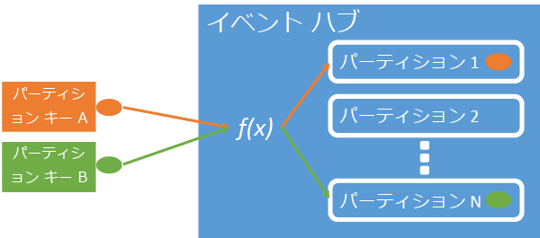
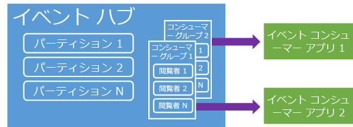
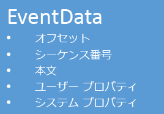

# Azure Event Hubs の概要
アダプティブ カスタマー エクスペリエンスを提供したり、継続的フィードバックや自動収集テレメトリ データによる製品レベル向上を狙った最新のソリューションの多くは、 多数の同時接続発行元からの膨大な量の情報を安全かつ確実に処理するにはどうすればよいかという課題に直面しています。 Microsoft Azure Event Hubs は、幅広いシナリオにおいて大量のデータを取り込むための基盤を提供する管理対象のプラットフォーム サービスです。 このようなシナリオの例としては、モバイル アプリでのビヘイビアー追跡、Web ファームからのトラフィック情報、コンソール ゲームにおけるゲーム中のイベント キャプチャ、産業機器またはコネクテッド カーから収集されたテレメトリ データなどがあります。 ソリューション アーキテクチャで Event Hubs が果たす一般的なロールは、イベント パイプラインの "玄関口" として機能することです (しばしば、"*イベント取り込み*" と呼ばれます)。 イベント取り込みとは、イベント ストリームの生成とそのようなイベントの消費とを分離するために、イベント パブリッシャーとイベント コンシューマーとの間に置かれるコンポーネントやサービスです。

Azure Event Hubs は、低遅延の動作と高い信頼性を確保しながら、クラウドに対する膨大なイベントとテレメトリ データの入口として利用できるイベント取り込みサービスです。 このサービスは、アプリケーションのインストルメンテーション、ユーザー エクスペリエンスやワークフローの処理、「モノのインターネット (IoT)」などのシナリオで、他のダウンストリーム サービスと組み合わせて使用した場合に、ひときわ有用性が高まります。 Event Hubs はメッセージ ストリーム処理機能を備えています。Event Hub はキューおよびトピックに類似したエンティティですが、従来のエンタープライズ メッセージングとは非常に異なる特性を持っています。 エンタープライズ メッセージング シナリオでは一般に、シーケンス処理、配信不能処理、トランザクションのサポート、厳密な配信保証などの高度な機能を必要とします。しかし、イベント取り込みで大切になるのは、イベント ストリームに対応する高いスループットと処理の柔軟性です。 このため、Event Hubs の機能は、高スループットおよびイベント処理のシナリオに重きが置かれているという点で、Service Bus のトピックとは異なります。 したがって、Event Hubs では、トピックで利用できるメッセージング機能の一部を実装しません。 それらの機能が必要な場合、トピックが最適な選択肢となります。

Event Hub は、Service Bus のキューおよびトピックの場合と同様に、Event Hubs の名前空間レベルに作成されます。 Event Hubs は、プライマリ API インターフェイスとして AMQP と HTTP を使用します。 次の図に、Event Hubs と Service Bus の関係を示します。

## 概念の概要
Event Hubs では、パーティション分割されたコンシューマー パターンを通してメッセージのストリーミングを実現します。 キューおよびトピックでは、[競合コンシューマー](https://msdn.microsoft.com/library/dn568101.aspx) モデルが使用されます。このモデルでは、各コンシューマーは同じキューまたはリソースからの読み取りを試みます。 このリソースの競合により、最終的にストリーム処理アプリケーションが複雑になり拡張性に制限が生じます。 Event Hubs ではパーティション分割されたコンシューマー パターンが使用されます。このパターンでは、各コンシューマーはメッセージ ストリームの特定のサブセット (またはパーティション) のみを読み取ります。 このパターンでは、イベント処理能力を水平方向に拡張 (スケールアウト) することができ、キューおよびトピックでは利用できない、ストリームに重点を置いたその他の機能が利用できます。

### パーティション
パーティションは、Event Hub で保持される順序付けされた一連のイベントです。 新しいイベントが到着すると、このシーケンスの末尾に追加されます。 パーティションは "コミット ログ" として考えることができます。

パーティションは構成された保有期間にわたりデータを保持します。この期間は、Event Hub のレベルで設定され、 Event Hub のすべてのパーティションに適用されます。 イベントの有効期限は時間で設定されます。イベントを明示的に削除することはできません。 Event Hub には、複数のパーティションが含まれています。 各パーティションは独立しており、独自のデータ シーケンスを含んでいます。 このため、パーティションはしばしば異なるペースで拡大します。

パーティションの数は、Event Hub の作成時に指定され、2 ～ 32 である必要があります (既定は 4 です)。 パーティションはデータ編成メカニズムであり、Event Hubs のスループットよりも、コンシューマー アプリケーションで必要とされるダウンストリーム並列処理の程度に深く関連します。 これにより、Event Hub でのパーティション数の選択は、予想される同時接続のリーダー数に直接関連付けられます。 Event Hub の作成後はパーティション数を変更できないので、長期的な拡張予測の観点から、この数を考慮する必要があります。 パーティション数の上限を 32 より大きくするには、Service Bus チームに連絡してください。

パーティションは識別可能であり、パーティションに直接送信できますが、特定のパーティションにデータを送信しないようにすることをお勧めします。 その代わり、「[イベント発行元](#event-publisher)」と「[発行元ポリシー](#capacity-and-security)」のセクションで紹介するより高いレベルの構造を使用できます。

Event Hubs のコンテキストでは、メッセージは *イベント データ*と呼ばれます。 イベント データには、イベント本文、ユーザー定義のプロパティ バッグ、およびイベントに関する種々のメタデータ (パーティションでのオフセットやストリーム シーケンスでの番号など) が含まれます。 パーティションには、一連のイベント データが格納されます。

## イベント発行元
Event Hub にイベントまたはデータを送信するエンティティはいずれも、 *イベント発行元*です。 イベント発行元は、HTTPS または AMQP 1.0 のいずれかを使用してイベントを発行できます。 イベント発行元は、Shared Access Signature (SAS) トークンを使用して Event Hub に身元を明らかにし、シナリオの要件に応じて、一意の ID を備えることも、共通の SAS トークンを使用することもできます。

SAS を使用する方法の詳細については、「[Service Bus による Shared Access Signature 認証](../service-bus-messaging/service-bus-shared-access-signature-authentication.md)」を参照してください。

### 発行元の一般的なタスク
このセクションでは、イベント発行元の一般的なタスクについて説明します。

#### SAS トークンを取得する
Shared Access Signature (SAS) は、Event Hubs の認証メカニズムです。 Service Bus は、名前空間と Event Hub のレベルでの SAS ポリシーを提供します。 SAS トークンは、SAS キーから生成されるものであり、特定の形式でエンコードされた URL の SHA ハッシュです。 Service Bus は、キー (ポリシー) の名前とトークンを使用することで、ハッシュを再生成し、送信者を認証することができます。 通常、イベント発行元の SAS トークンは特定の Event Hub への **送信** 特権のみを付加して作成されます。 この SAS トークン URL のメカニズムは、発行元ポリシーに導入された発行元識別のための基盤です。 SAS を使用する方法の詳細については、「[Service Bus による Shared Access Signature 認証](../service-bus-messaging/service-bus-shared-access-signature-authentication.md)」を参照してください。

#### イベントの発行
AMQP 1.0 または HTTPS を介してイベントを発行することができます。 Service Bus は、.NET クライアントから Event Hub へのイベント発行で使用できる [EventHubClient](https://msdn.microsoft.com/library/microsoft.servicebus.messaging.eventhubclient.aspx) クラスを提供します。 その他のランタイムとプラットフォームには、 [Apache Qpid](http://qpid.apache.org/)などの任意の AMQP 1.0 クライアントを使用できます。 イベントを個別に発行することも、複数のイベントを一括して発行すること (バッチ) もできます。 単一イベントであるかバッチであるかにかかわらず、単一パブリケーション (イベント データ インスタンス) には 256 KB の制限があります。 これより大きいイベントを発行すると、エラーが発生します。 発行元にとっては、Event Hub 内のパーティションを意識せずに、次のセクションで説明する *パーティション キー* のみを指定するか、または SAS トークンを介して ID のみを指定するのがベスト プラクティスです。

AMQP または HTTPS のどちらを使用するかは、使用シナリオによって決まります。 AMQP では、トランスポート レベルのセキュリティ (TLS) または SSL/TLS に加えて、永続的な双方向ソケットを確立する必要があります。 これは、ネットワーク トラフィックの観点からコスト高の操作となりますが、必要になるのは、AMQP セッションを開始するときだけです。 HTTPS では、初期のオーバーヘッドは小さいですが、要求のたびに SSL オーバーヘッドが追加されます。 イベントを頻繁に発行する発行元に対して、AMQP はパフォーマンスの強化、待機時間の短縮、およびスループットの向上をもたらします。

### パーティション キー
パーティション キーとは、データ編成を目的として受信イベント データを特定のパーティションにマップするために使用される値です。 パーティション キーは、送信者によって指定され、Event Hub に渡される値です。 これは静的なハッシュ関数で処理され、その結果、パーティション割り当てが作成されます。 イベントを発行するときにパーティション キーを指定しないと、ラウンド ロビン割り当てが使用されます。 パーティション キーを使用する場合、イベント発行元はそのパーティション キーのみを意識し、イベントの発行先となるパーティションを意識する必要はありません。 このようにキーとパーティションを分離することにより、送信者はイベントのダウンストリーム処理とストレージについて余分な情報を把握しなくてもよくなります。 パーティション キーは、ダウンストリーム処理の対象となるデータを整理する上で重要ですが、本質的にパーティション自体には関係しません。 デバイスごとまたはユーザーの一意の ID は適切なパーティション キーになりますが、地理的条件などのその他の属性を使用して関連するイベントを 1 つのパーティションにまとめることもできます。 次の図では、イベント送信者がパーティション キーを使用してパーティションにピン留めしています。

Event Hubs によって、同じパーティション キー値を共有するありとあらゆるイベントが正しい順序で同じパーティションに確実に配信されます。 重要なことは、パーティション キーを発行元ポリシーと併用する場合、次のセクションで説明するように、発行元の ID とパーティション キーの値が一致する必要があるということです。 一致しないと、エラーが発生します。

### イベント コンシューマー
Event Hub からイベント データを読み取るエンティティはいずれも、イベント コンシューマーです。 すべてのイベント コンシューマーは、コンシューマー グループ内のパーティションを通してイベント ストリームを読み取ります。 各パーティションは、一度に 1 つのアクティブ リーダーのみに対応します。 Event Hubs のすべてのコンシューマーは AMQP 1.0 セッションを介して接続します。このセッションでは、イベントは使用可能になると配信されます。 クライアントがデータの可用性をポーリングする必要はありません。

#### コンシューマー グループ
Event Hubs のパブリッシュ/サブスクライブのメカニズムは、コンシューマー グループを通して有効になります。 コンシューマー グループは、Event Hub 全体のビュー (状態、位置、またはオフセット) を表します。 コンシューマー グループを使用することにより、複数のコンシューマー アプリケーションは、イベント ストリームの個別のビューをそれぞれ保有し、独自のペースで独自のオフセットによってストリームを別々に読み取ることができます。 ストリーム処理アーキテクチャにおいて、各ダウンストリーム アプリケーションはコンシューマー グループに相当します。 (パーティションからさらに) 長期的なストレージにイベント データを書き込む場合、そのストレージ ライター アプリケーションはコンシューマー グループとなります。 複雑なイベント処理は、別の異なるコンシューマー グループで実行されます。 パーティションにはコンシューマー グループを介してのみアクセスできます。 Event Hub には既定のコンシューマー グループが常に存在します。標準レベルの Event Hub に対して最大 20 個のコンシューマー グループを作成できます。

コンシューマー グループ URI 表記の例を次に示します。

    //<my namespace>.servicebus.windows.net/<event hub name>/<Consumer Group #1>
    //<my namespace>.servicebus.windows.net/<event hub name>/<Consumer Group #2>

次の図に、コンシューマー グループ内のイベント コンシューマーを示します。

#### ストリームのオフセット
オフセットは、パーティション内のイベントの位置です。 オフセットは、クライアント側のカーソルと考えることができます。 オフセットはイベントのバイト位置です。 これにより、イベント コンシューマー (リーダー) は、イベント ストリーム内でのイベント読み取りの開始点を指定することができます。 オフセットは、タイムスタンプとして、またはオフセット値として指定することができます。 Event Hubs サービスの外部で独自のオフセット値を格納する場合は、コンシューマーの責任で行います。

パーティション内では、各イベントにオフセットが含まれます。 コンシューマーはこのオフセットを使用して、特定のパーティションにおけるイベント シーケンス内の場所を示します。 リーダーが接続するときには、オフセットを数字として、またはタイムスタンプ値として Event Hub に渡すことができます。

#### チェックポイント機能
"*チェックポイント処理*" とは、リーダーがパーティションにおけるイベント シーケンス内の位置をマークまたはコミットするために使用する処理です。 チェックポイント処理はコンシューマーの責任で行います。この処理はコンシューマー グループ内でパーティションごとに発生します。 つまり、コンシューマー グループごとに、各パーティション リーダーは、イベント ストリーム内でのその現在の位置を追跡する必要があり、データ ストリームが完了したと見なしたときにサービスに通知することができます。 リーダーがパーティションから切断し、その後再び接続すると、該当するコンシューマー グループ内の該当するパーティションの最後のリーダーによって最後に送信されたチェックポイントから読み取りが開始されます。 リーダーは接続の際に、このオフセットを Event Hub に渡して、読み取りを開始する場所を指定します。 このように、チェックポイント処理を使用することで、ダウンストリーム アプリケーションごとにイベントに "完了" のマークを付けると共に、異なるコンピューター上で実行中のリーダー間でフェールオーバーが発生した場合に回復性をもたらすことができます。 イベント データは Event Hub の作成時に指定された保有期間にわたって保持されるので、このチェックポイント処理よりも小さなオフセットを指定することによって、より古いデータに戻ることができます。 このメカニズムにより、チェックポイント処理ではフェールオーバーの回復性と制御されたイベント ストリーム再生を両方とも実現できます。

#### 一般的なコンシューマー タスク
このセクションでは、Event Hubs のイベント コンシューマーまたはリーダーの一般的なタスクについて説明します。 Event Hubs のすべてのコンシューマーは、AMQP 1.0 を介して接続します。 AMQP 1.0 とは、セッションと状態に対応する双方向の通信チャネルです。 各パーティションには、パーティションによって分離されたイベントの転送を容易にする AMQP 1.0 リンク セッションがあります。

##### パーティションに接続する
Event Hub からイベントを取得するために、コンシューマーはパーティションに接続する必要があります。 前述したように、パーティションには常にコンシューマー グループを介してアクセスします。 パーティション分割されたコンシューマー モデルの一部として、コンシューマー グループ内では常にパーティション上で 1 つのリーダーのみがアクティブになる必要があります。 パーティションに直接接続する場合は、一般的に、特定のパーティションへのリーダーの接続を調整するために、リース メカニズムが使用されます。 このため、コンシューマー グループ内のどのパーティションもアクティブなリーダーが 1 つだけである可能性があります。 リーダーのためにシーケンス内の位置を管理することは、チェックポイント処理によって達成される重要なタスクです。 この機能は、.NET クライアントの [EventProcessorHost](https://msdn.microsoft.com/library/microsoft.servicebus.messaging.eventprocessorhost.aspx) クラスを使用して簡略化されます。 [EventProcessorHost](https://msdn.microsoft.com/library/microsoft.servicebus.messaging.eventprocessorhost.aspx) はインテリジェントなコンシューマー エージェントです。次のセクションで説明します。

##### イベントを読み取る
特定のパーティションに対して AMQP 1.0 のセッションおよびリンクが開かれると、Event Hubs サービスによってイベントが AMQP 1.0 クライアントに配信されます。 この配信メカニズムでは、HTTP GET などのプル ベースのメカニズムよりも高いスループットおよび短い遅延時間を実現します。 イベントがクライアントに送信されるとき、イベント データの各インスタンスには、イベント シーケンスでのチェックポイント処理を容易にするために使用されるオフセットやシーケンス番号などの重要なメタデータが含まれます。

ストリーム処理の進捗状況を最適に管理できるように、ユーザーはこのオフセットを管理する必要があります。

## 容量とセキュリティ
Event Hubs は、ストリームの受信に対する拡張性の高い並列アーキテクチャです。 このため、Event Hubs に基づいてソリューションのサイズ変更およびスケーリングを行う場合、考慮すべき重要な側面がいくつかあります。 これらの容量制御の 1 つ目は "*スループット単位*" です。これは次のセクションで説明します。

### スループット単位
Event Hubs のスループット容量は、スループット単位によって制御されます。 スループット単位とは、購入済みの容量単位のことです。 1 つのスループット単位には、次の内容が含まれます。

* 受信: 最大で 1 秒あたり 1 MB または 1 秒あたり 1,000 イベント。
* 送信: 最大で 1 秒あたり 2 MB。

受信は、購入したスループット単位数によって提供される容量に調整されます。 この量を超えるデータを送信すると、"クォータを超過" 例外が発生します。 この量は、1 秒あたり 1 MB または 1 秒あたり 1,000 イベントで、どちらか早くに到達した方です。 送信では調整例外は生成されませんが、購入したスループット単位によって提供されるデータ転送量 (スループット単位あたり、2 MB/1 秒) に制限されます。 発行率の例外を受信したか、より高率の送信が予想されている場合は、Event Hub が作成された名前空間に対して購入したスループット単位の数を必ず確認してください。 より多くのスループット単位を取得するには、[Azure クラシック ポータル][Azure クラシック ポータル]で **[名前空間]** ページの **[スケール]** タブで設定を調整します。 Azure API を使用して、この設定を変更することもできます。

パーティションはデータ編成の概念ですが、スループット単位は純粋に容量の概念です。 スループット単位は 1 時間ごとに課金され、事前に購入します。 スループット単位を購入すると、少なくとも 1 時間の料金が課金されます。 Event Hubs 名前空間に対して最大 20 のスループット単位を購入できます。Azure アカウントのスループット単位数の上限は 20 です。 これらのスループット単位は、特定の名前空間のすべての Event Hubs 間で共有されます。

スループット単位はベスト エフォートの原則でプロビジョニングされるので、即時購入が常に可能であるとは限りません。 特定の容量を必要とする場合は、該当するスループット単位数を事前に購入しておくことをお勧めします。 20 を超えるスループット単位が必要な場合は、Azure サポートに連絡してより多くのスループット単位を購入できます。コミットメントを条件として 20 ブロック単位で、スループット単位数が 100 になるまで購入できます。 100 を超えて必要な場合、100 ブロック単位でスループット単位を購入することもできます。

Event Hubs での最適なスケールを実現するために、スループット単位とパーティションのバランスを慎重に保つことをお勧めします。 単一のパーティションの最大スケールは 1 つのスループット単位です。 スループット単位の数は、Event Hub 内のパーティション数以下とする必要があります。

料金の詳細については、「 [Event Hubs 料金](https://azure.microsoft.com/pricing/details/event-hubs/)」を参照してください。

### 発行元ポリシー
Event Hubs では、 *発行元ポリシー*を介してイベント プロデューサーをきめ細かく制御できます。 発行元ポリシーは、多数の独立したイベント パブリッシャーを支援するために設計されたランタイム機能セットです。 発行元ポリシーでは、次のメカニズムを使用して Event Hub にイベントを発行する際に、各発行元は独自の一意の識別子を使用します。

    //<my namespace>.servicebus.windows.net/<event hub name>/publishers/<my publisher name>

前もって発行元名を作成しておく必要はありませんが、独立した発行元 ID を保証するために、発行元名はイベントを発行するときに使用される SAS トークンと一致する必要があります。 SAS の詳細については、「[Service Bus での Shared Access Signature 認証](../service-bus-messaging/service-bus-shared-access-signature-authentication.md)」を参照してください。 発行元ポリシーを使用する場合は、 **PartitionKey** 値を発行元名に設定します。 適切に機能するために、これらの値が一致する必要があります。

## 概要
Azure Event Hubs では、一般的なアプリケーションおよびユーザー ワークフローを任意の規模で監視するために使用できる、非常にスケール性の高い、イベントとテレメトリ データの取り込みサービスを提供します。 低遅延で、かつ大きなスケールでパブリッシュ/サブスクライブ機能を実現する能力があるので、Event Hubs はビッグ データの "オン ランプ" として機能します。 発行元ベースの ID と失効リストを使用すると、これらの機能は一般的なモノのインターネット シナリオに拡張されます。 Event Hubs アプリケーションの開発の詳細については、「 [Event Hub プログラミング ガイド](event-hubs-programming-guide.md)」を参照してください。

## 次のステップ
これで、Event Hubs の概念を学習できました。さらに、次のシナリオに進むことができます。

* [Event Hubs の使用]
* [Event Hubs を使用する完全なサンプル アプリケーション]

[Azure クラシック ポータル]: http://manage.windowsazure.com
[Event Hubs の使用]: event-hubs-csharp-ephcs-getstarted.md
[Event Hubs を使用する完全なサンプル アプリケーション]: https://code.msdn.microsoft.com/windowsazure/Service-Bus-Event-Hub-286fd097

<!--HONumber=Nov16_HO2-->

