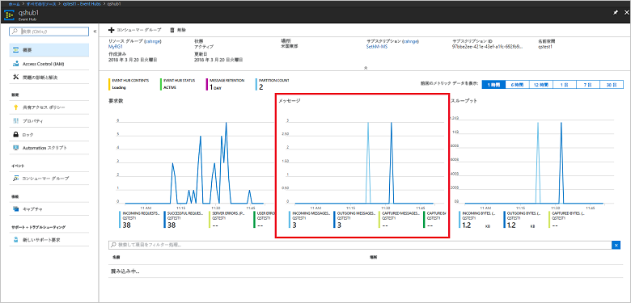

# <a name="quickstart-process-event-streams-using-azure-cli-and-java"></a>クイック スタート: Azure CLI と Java を使用したイベント ストリームの処理

Azure Event Hubs は高度にスケーラブルなデータ ストリーミング プラットフォームであり、毎秒数百万のイベントを受け取って処理できるインジェスト サービスでもあります。 このクイック スタートでは、Azure CLI を使用して Event Hubs リソースを作成したうえで、Java コードを使用してイベント ハブからイベント ストリームを送受信する方法について説明します。

このクイック スタートを完了するには、Azure サブスクリプションが必要です。 お持ちでない場合は、開始する前に[無料アカウントを作成][]してください。

## <a name="prerequisites"></a>前提条件

[!INCLUDE [cloud-shell-try-it.md](../../includes/cloud-shell-try-it.md)]

Azure CLI をローカルにインストールして使用する場合、このチュートリアルでは、Azure CLI バージョン 2.0.4 以降を実行していることが要件です。 バージョンを確認するには `az --version` を実行します。 インストールまたはアップグレードする必要がある場合は、「[Azure CLI 2.0 のインストール]( /cli/azure/install-azure-cli)」を参照してください。

## <a name="log-on-to-azure"></a>Azure へのログオン

Cloud Shell でコマンドを実行している場合、次の手順は必要ありません。 ローカルで CLI を実行している場合、次の手順を実行して Azure にログオンし、現在のサブスクリプションを設定します。

次のコマンドを実行して Azure にログオンします。

```azurecli-interactive
az login
```

現在のサブスクリプションのコンテキストを設定します。 `MyAzureSub` は、使用する Azure サブスクリプションの名前に置き換えてください。

```azurecli-interactive
az account set --subscription MyAzureSub
``` 

## <a name="provision-resources"></a>リソースをプロビジョニングする

次のコマンドを発行して、Event Hubs リソースをプロビジョニングします。 `myResourceGroup`、`namespaceName`、`eventHubName`、`storageAccountName` の各プレースホルダーを、適切な値に置き換えてください。

```azurecli-interactive
# Create a resource group
az group create --name myResourceGroup --location eastus

# Create an Event Hubs namespace
az eventhubs namespace create --name namespaceName --resource-group myResourceGroup -l eastus2

# Create an event hub
az eventhubs eventhub create --name eventHubName --resource-group myResourceGroup --namespace-name namespaceName

# Create a general purpose standard storage account
az storage account create --name storageAccountName --resource-group myResourceGroup --location eastus2 --sku Standard_RAGRS --encryption blob

# List the storage account access keys
az storage account keys list --resource-group myResourceGroup --account-name storageAccountName

# Get namespace connection string
az eventhubs namespace authorization-rule keys list --resource-group myResourceGroup --namespace-name namespaceName --name RootManageSharedAccessKey
```

後で使用するため、メモ帳などの一時的な場所に接続文字列をコピーして貼り付けます。

## <a name="stream-into-event-hubs"></a>Event Hubs へのストリーム

次の手順では、イベントがイベント ハブにストリーム配信され、イベント プロセッサ ホストを使用してそれらのイベントが受信されるサンプル コードをダウンロードします。 最初に、メッセージを送信します。

次のコマンドを発行して、[Event Hubs GitHub リポジトリ](https://github.com/Azure/azure-event-hubs)を複製します。

```bash
git clone https://github.com/Azure/azure-event-hubs.git
```

**SimpleSend** フォルダーに移動します (`\azure-event-hubs\samples\Java\Basic\SimpleSend\src\main\java\com\microsoft\azure\eventhubs\samples\SimpleSend`)。 SimpleSend.java ファイルを開き、`"Your Event Hubs namaspace name"` 文字列を、この記事の "Create an Event Hubs namespace" セクションで取得した Event Hubs 名前空間に置き換えます。

`"Your event hub"` はその名前空間内に作成したイベント ハブの名前に置き換え、`"Your policy name"` は名前空間の共有アクセス ポリシーの名前に置き換えます。 新しいポリシーを作成していない限り、既定値は **RootManageSharedAccessKey** です。 

最後に、`"Your primary SAS key"` を、前の手順のポリシーで使用する SAS キーの値に置き換えます。

### <a name="build-the-application"></a>アプリケーションのビルド 

`\azure-event-hubs\samples\Java\Basic\SimpleSend` フォルダーに戻って、次のビルド コマンドを発行します。

```shell
mvn clean package -DskipTests
```

### <a name="receive"></a>受信

次に、イベント プロセッサ ホストのサンプルをダウンロードします。これが、先ほど送信したメッセージを受信します。 **EventProcessorSample** フォルダーに移動します (`\azure-event-hubs\samples\Java\Basic\EventProcessorSample\src\main\java\com\microsoft\azure\eventhubs\samples\eventprocessorsample`)。

EventProcessorSample.java ファイルで、`----EventHubsNamespaceName-----` の値を、この記事の "Create an Event Hubs namespace" セクションで取得した Event Hubs 名前空間に置き換えます。 

このファイルの他の文字列値を置換します。`----EventHubName-----` はその名前空間内に作成したイベント ハブの名前に置き換え、`-----SharedAccessSignatureKeyName-----` は名前空間の共有アクセス ポリシーの名前に置き換えてください。 新しいポリシーを作成していない限り、既定値は **RootManageSharedAccessKey** です。

`---SharedAccessSignatureKey----` を、前の手順のポリシーで使用する SAS キーの値に置き換えます。また、`----AzureStorageConnectionString----` は作成したストレージ アカウントの接続文字列に置き換え、`----StorageContainerName----` は作成したストレージ アカウントにあるコンテナーの名前に置き換えます。 

最後に、`----HostNamePrefix----` をストレージ アカウントの名前に置き換えます。

### <a name="build-the-receiver"></a>レシーバーのビルド 

受信側アプリケーションをビルドするには、`\azure-event-hubs\samples\Java\Basic\EventProcessorSample` フォルダーに移動して、次のコマンドを発行します。

```shell
mvn clean package -DskipTests
```

### <a name="run-the-apps"></a>アプリの実行

ビルドが正常に完了したら、イベントを送受信する準備が整います。 最初に、**SimpleSend** アプリケーションを実行し、イベントが送信されるのを確認します。 プログラムを実行するには、`\azure-event-hubs\samples\Java\Basic\SimpleSend` フォルダーに移動して、次のコマンドを発行します。

```shell
java -jar ./target/simplesend-1.0.0-jar-with-dependencies.jar
```

次に、**EventProcessorSample** アプリを実行し、イベントが受信されるのを確認します。 プログラムを実行するには、`\azure-event-hubs\samples\Java\Basic\EventProcessorSample` フォルダーに移動して、次のコマンドを発行します。
   
```shell
java -jar ./target/eventprocessorsample-1.0.0-jar-with-dependencies.jar
```

両方のプログラムを実行した後、Azure portal の概要ページでイベント ハブをチェックして、受信/送信メッセージ数を確認できます。



## <a name="clean-up-resources"></a>リソースのクリーンアップ

次のコマンドを実行して、リソース グループ、名前空間、ストレージ アカウント、すべての関連リソースを削除します。 `myResourceGroup` は、作成したリソース グループの名前に置き換えます。

```azurecli
az group delete --resource-group myResourceGroup
```

## <a name="understand-the-sample-code"></a>サンプル コードを理解する

このセクションでは、サンプル コードの処理内容の詳細について説明します。

### <a name="send"></a>Send

SimpleSend.java ファイルでは、動作のほとんどが main() メソッド内で実行されます。 最初に、名前空間名、イベント ハブ名、SAS キー名、SAS キーにユーザー定義の値を使って接続文字列を構成するために、コードで `ConnectionStringBuilder` インスタンスが使用されます。

```java
final ConnectionStringBuilder connStr = new ConnectionStringBuilder()
        .setNamespaceName("Your Event Hubs namespace name")
        .setEventHubName("Your event hub")
        .setSasKeyName("Your policy name")
        .setSasKey("Your primary SAS key");
```

次に、イベント ペイロードが含まれている Java オブジェクトが Json に変換されます。

```java
final Gson gson = new GsonBuilder().create();

final PayloadEvent payload = new PayloadEvent(1);
byte[] payloadBytes = gson.toJson(payload).getBytes(Charset.defaultCharset());
EventData sendEvent = EventData.create(payloadBytes);  
```

このコード行で Event Hubs クライアントが作成されます。

```java
final EventHubClient ehClient = EventHubClient.createSync(connStr.toString(), executorService);
```

try/finally ブロックによって、1 つのイベント ラウンド ロビンが不特定のパーティションに送信されます。

```java
try {
    for (int i = 0; i < 100; i++) {

        String payload = "Message " + Integer.toString(i);
        //PayloadEvent payload = new PayloadEvent(i);
        byte[] payloadBytes = gson.toJson(payload).getBytes(Charset.defaultCharset());
        EventData sendEvent = EventData.create(payloadBytes);

        // Send - not tied to any partition
        // Event Hubs service will round-robin the events across all EventHubs partitions.
        // This is the recommended & most reliable way to send to EventHubs.
        ehClient.sendSync(sendEvent);
    }

    System.out.println(Instant.now() + ": Send Complete...");
    System.in.read();
} finally {
    ehClient.closeSync();
    executorService.shutdown();
}
```

### <a name="receive"></a>受信 

受信操作は、EventProcessorSample.java ファイルで実行されます。 最初に、Event Hubs 名前空間名とその他の資格情報を保持するための定数が宣言されます。

```java
String consumerGroupName = "$Default";
String namespaceName = "----NamespaceName----";
String eventHubName = "----EventHubName----";
String sasKeyName = "----SharedAccessSignatureKeyName----";
String sasKey = "----SharedAccessSignatureKey----";
String storageConnectionString = "----AzureStorageConnectionString----";
String storageContainerName = "----StorageContainerName----";
String hostNamePrefix = "----HostNamePrefix----";
```

SimpleSend プログラムと同様、接続文字列を構成するために、コードによって ConnectionStringBuilder インスタンスが作成されます。

```java
ConnectionStringBuilder eventHubConnectionString = new ConnectionStringBuilder()
    .setNamespaceName(namespaceName)
    .setEventHubName(eventHubName)
    .setSasKeyName(sasKeyName)
    .setSasKey(sasKey);
```

"*イベント プロセッサ ホスト*" は、永続的なチェックポイントの管理によってイベント ハブのイベントの受信を簡素化し、並列してそれらのイベント ハブから受信するクラスです。 次に、コードによって `EventProcessorHost` のインスタンスが作成されます。

```java
EventProcessorHost host = new EventProcessorHost(
    EventProcessorHost.createHostName(hostNamePrefix),
    eventHubName,
    consumerGroupName,
    eventHubConnectionString.toString(),
    storageConnectionString,
    storageContainerName);
```

エラー処理コードが宣言された後、`EventProcessor` クラス、`IEventProcessor` インターフェイスの実装がアプリによって定義されます。 受信されたイベントは、このクラスによって処理されます。

```java
public static class EventProcessor implements IEventProcessor
{
    private int checkpointBatchingCount = 0;
    ...
```

イベント ハブのこのパーティションでイベントが受信されると、`onEvents()` メソッドが呼び出されます。

```java
@Override
public void onEvents(PartitionContext context, Iterable<EventData> events) throws Exception
{
    System.out.println("SAMPLE: Partition " + context.getPartitionId() + " got event batch");
    int eventCount = 0;
    for (EventData data : events)
    {
        try
        {
         System.out.println("SAMPLE (" + context.getPartitionId() + "," + data.getSystemProperties().getOffset() + "," +
                data.getSystemProperties().getSequenceNumber() + "): " + new String(data.getBytes(), "UTF8"));
             eventCount++;
                
         // Checkpointing persists the current position in the event stream for this partition and means that the next
         // time any host opens an event processor on this event hub+consumer group+partition combination, it will start
         // receiving at the event after this one. Checkpointing is usually not a fast operation, so there is a tradeoff
         // between checkpointing frequently (to minimize the number of events that will be reprocessed after a crash, or
         // if the partition lease is stolen) and checkpointing infrequently (to reduce the impact on event processing
         // performance). Checkpointing every five events is an arbitrary choice for this sample.
         this.checkpointBatchingCount++;
         if ((checkpointBatchingCount % 5) == 0)
         {
            System.out.println("SAMPLE: Partition " + context.getPartitionId() + " checkpointing at " +
                    data.getSystemProperties().getOffset() + "," + data.getSystemProperties().getSequenceNumber());
            // Checkpoints are created asynchronously. It is important to wait for the result of checkpointing
            // before exiting onEvents or before creating the next checkpoint, to detect errors and to ensure proper ordering.
            context.checkpoint(data).get();
         }
    }
        catch (Exception e)
        {
            System.out.println("Processing failed for an event: " + e.toString());
        }
    }
    System.out.println("SAMPLE: Partition " + context.getPartitionId() + " batch size was " + eventCount + " for host " + context.getOwner());
}
```

## <a name="next-steps"></a>次の手順

この記事では、イベント ハブからイベントを送受信するために必要な Event Hubs 名前空間などのリソースを作成しました。 さらに学習するには、次のチュートリアルに進んでください。

> [!div class="nextstepaction"]
> [Event Hubs データ ストリームでデータの異常を視覚化する](event-hubs-tutorial-visualize-anomalies.md)

[無料アカウントを作成]: https://azure.microsoft.com/free/?ref=microsoft.com&utm_source=microsoft.com&utm_medium=docs&utm_campaign=visualstudio
[Install Azure CLI 2.0]: /cli/azure/install-azure-cli
[az group create]: /cli/azure/group#az-group-create
[fully qualified domain name]: https://wikipedia.org/wiki/Fully_qualified_domain_name
