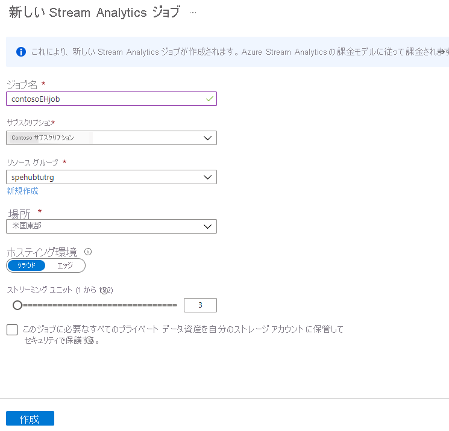
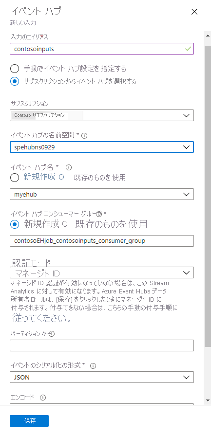

# <a name="tutorial-visualize-data-anomalies-in-real-time-events-sent-to-azure-event-hubs"></a>チュートリアル: Azure Event Hubs に送信されたリアルタイム イベントのデータの異常を視覚化する

Azure Event Hubs では、Azure Stream Analytics を使用して受信データをチェックし、異常を抜き出すことができます。抜き出した異常は Power BI で視覚化できます。 何千ものデバイスが常にリアルタイム データをイベント ハブに送信しており、合計すると 1 秒あたり数百万件のイベントが発生しているとします。 それだけの量のデータの異常やエラーを確認するにはどうすればよいのでしょうか。 たとえば、デバイスがクレジット カード トランザクションを送信していて、5 秒以内に複数の国で複数のトランザクションが発生していることをキャプチャする必要がある場合はどうすればよいでしょうか。 これは、誰かが盗んだクレジット カードを使って品物を購入するということが世界中で同時に起きた場合に発生することがあります。 

このチュートリアルでは、この例をシミュレートします。 クレジット カード トランザクションを作成してイベント ハブに送信するアプリケーションを実行します。 その後、Azure Stream Analytics を使用して、リアルタイムでデータ ストリームを読み取り、有効なトランザクションと無効なトランザクションを分離します。次に、Power BI を使用して、無効のタグが付けられたトランザクションを視覚的に特定します。

このチュートリアルで学習する内容は次のとおりです。
> [!div class="checklist"]
> * Event Hubs 名前空間を作成します
> * イベント ハブの作成
> * クレジット カード トランザクションを送信するアプリを実行する
> * これらのトランザクションを処理するように Stream Analytics ジョブを構成する
> * Power BI の視覚化を構成して結果を表示する

このチュートリアルを完了するには、Azure サブスクリプションが必要です。 お持ちでない場合は、開始する前に[無料アカウントを作成][]してください。

## <a name="prerequisites"></a>前提条件

[!INCLUDE [cloud-shell-try-it.md](../../includes/cloud-shell-try-it.md)]

- [Visual Studio](https://www.visualstudio.com/) のインストール。 
- Stream Analytics ジョブの出力を分析するには、Power BI アカウントが必要です。 [Power BI は無料で試す](https://app.powerbi.com/signupredirect?pbi_source=web)ことができます。

## <a name="set-up-resources"></a>リソースを設定する

このチュートリアルでは、Event Hubs 名前空間とイベント ハブが必要です。 これらのリソースは、Azure CLI または Azure PowerShell を使用して作成できます。 すべてのリソースに同じリソース グループと場所を使います。 最後に、リソース グループを削除することによって、すべてのものを一度に削除できます。

以降のセクションでは、これらの必要な手順を実行する方法について説明します。 CLI "*または*" PowerShell の指示に従って、次の手順を実行してください。

1. [リソース グループ](../azure-resource-manager/resource-group-overview.md)を作成します。 

2. Event Hubs 名前空間を作成します。 

3. イベント ハブを作成します。

> [!NOTE]
> 各スクリプトには、このチュートリアルの後半で必要となる変数が設定されています。 これらには、リソース グループ名 ($resourceGroup)、Event Hubs 名前空間 (**$eventHubNamespace**)、イベント ハブ名 (**$eventHubName**) があります。 これらは、この記事の後半でドル記号 ($) のプレフィックスを付けて参照します。そのため、スクリプトで設定されていることを覚えて置いてください。

<!-- some day they will approve the tab control; 
  When that happens, put CLI and PSH in tabs. -->

### <a name="set-up-your-resources-using-azure-cli"></a>Azure CLI を使用してリソースを設定する

次のスクリプトをコピーして Cloud Shell に貼り付けます。 既にログインしているものとすると、スクリプトが 1 行ずつ実行されます。

グローバルに一意でなければならない変数には `$RANDOM` が連結されています。 スクリプトが実行され、変数が設定されるときに、ランダムな数値文字列が生成され、固定文字列の末尾に連結されて一意の変数を作ります。

```azurecli-interactive
# Set the values for location and resource group name.
location=westus
resourceGroup=ContosoResourcesEH

# Create the resource group to be used
#   for all the resources for this tutorial.
az group create --name $resourceGroup \
    --location $location

# The Event Hubs namespace name must be globally unique, so add a random number to the end.
eventHubNamespace=ContosoEHNamespace$RANDOM
echo "Event Hub Namespace = " $eventHubNamespace

# Create the Event Hubs namespace.
az eventhubs namespace create --resource-group $resourceGroup \
   --name $eventHubNamespace \
   --location $location \
   --sku Standard

# The event hub name must be globally unique, so add a random number to the end.
eventHubName=ContosoEHhub$RANDOM
echo "event hub name = " $eventHubName

# Create the event hub.
az eventhubs eventhub create --resource-group $resourceGroup \
    --namespace-name $eventHubNamespace \
    --name $eventHubName \
    --message-retention 3 \
    --partition-count 2

# Get the connection string that authenticates the app with the Event Hubs service.
connectionString=$(az eventhubs namespace authorization-rule keys list \
   --resource-group $resourceGroup \
   --namespace-name $eventHubNamespace \
   --name RootManageSharedAccessKey \
   --query primaryConnectionString \
   --output tsv)
echo "Connection string = " $connectionString 
```

### <a name="set-up-your-resources-using-azure-powershell"></a>Azure PowerShell を使用してリソースを設定する

次のスクリプトをコピーして Cloud Shell に貼り付けます。 既にログインしているものとすると、スクリプトが 1 行ずつ実行されます。

グローバルに一意でなければならない変数には `$(Get-Random)` が連結されています。 スクリプトが実行され、変数が設定されるときに、ランダムな数値文字列が生成され、固定文字列の末尾に連結されて一意の変数を作ります。

```azurepowershell-interactive
# Log in to Azure account.
Login-AzureRMAccount

# Set the values for the location and resource group.
$location = "West US"
$resourceGroup = "ContosoResourcesEH"

# Create the resource group to be used  
#   for all resources for this tutorial.
New-AzureRmResourceGroup -Name $resourceGroup -Location $location

# The Event Hubs namespace name must be globally unique, so add a random number to the end.
$eventHubNamespace = "contosoEHNamespace$(Get-Random)"
Write-Host "Event Hub Namespace is " $eventHubNamespace

# The event hub name must be globally unique, so add a random number to the end.
$eventHubName = "contosoEHhub$(Get-Random)"
Write-Host "Event hub Name is " $eventHubName

# Create the Event Hubs namespace.
New-AzureRmEventHubNamespace -ResourceGroupName $resourceGroup `
     -NamespaceName $eventHubNamespace `
     -Location $location

# Create the event hub.
$yourEventHub = New-AzureRmEventHub -ResourceGroupName $resourceGroup `
    -NamespaceName $eventHubNamespace `
    -Name $eventHubName `
    -MessageRetentionInDays 3 `
    -PartitionCount 2

# Get the event hub key, and retrieve the connection string from that object.
# You need this to run the app that sends test messages to the event hub.
$eventHubKey = Get-AzureRmEventHubKey -ResourceGroupName $resourceGroup `
    -Namespace $eventHubNamespace `
    -AuthorizationRuleName RootManageSharedAccessKey

# Save this value somewhere local for later use.
Write-Host "Connection string is " $eventHubKey.PrimaryConnectionString
```

## <a name="run-app-to-produce-test-event-data"></a>アプリを実行してテスト イベント データを生成する

GitHub の Event Hubs の[サンプル](https://github.com/Azure/azure-event-hubs/tree/master/samples/DotNet)には、テスト データを生成する [Anomaly Detector アプリ](https://github.com/Azure/azure-event-hubs/tree/master/samples/DotNet/AnomalyDetector)が含まれています。 これは、クレジット カード トランザクションをイベント ハブに書き込むことによってクレジット カードの使用をシミュレートします。異常のタグが付けられるように、複数の場所での同じクレジット カードの複数のトランザクションをときどき書き込みます。 このアプリを実行するには、次の手順を実行します。 

1. GitHub から [Azure Event Hubs のサンプル](https://github.com/Azure/azure-event-hubs/archive/master.zip)をダウンロードし、ローカルに解凍します。

2. \azure-event-hubs-master\samples\DotNet\AnomalyDetector\ フォルダーに移動し、AnomalyDetector.sln をダブルクリックして Visual Studio でソリューションを開きます。 

3. Program.cs を開き、**Event Hubs connection string** を、スクリプトの実行時に保存した接続文字列に置き換えます。 

4. **Event Hub name** をイベント ハブ名に置き換えます。 F5 キーを押して、アプリケーションを実行します。 イベント ハブにイベントを送信し始め、1,000 件のイベントを送信するまで続けます。 データを取得するためにこのアプリを実行している必要がある場合がいくつかあります。 以降の手順では、そうした場合は適宜明記しています。

## <a name="set-up-azure-stream-analytics"></a>Azure Stream Analytics を設定する

これで、イベント ハブにデータをストリーミングできます。 そのデータを Power BI の視覚化で使用するには、まず、Power BI の視覚化に供給するデータを取得するよう Stream Analytics ジョブを設定します。

### <a name="create-the-stream-analytics-job"></a>Stream Analytics ジョブを作成する

1. Azure Portal で、**[リソースの作成]** をクリックします。 検索ボックスに「**stream analytics**」と入力し、**Enter** キーを押します。 **[Stream Analytics ジョブ]** を選択します。 [Stream Analytics ジョブ] ウィンドウで **[作成]** をクリックします。 

2. ジョブの次の情報を入力します。

   **[ジョブ名]**: 「**contosoEHjob**」を使用します。 このフィールドはジョブの名前で、グローバルに一意でなければなりません。

   **[サブスクリプション]**: ご使用のサブスクリプションを選択します。

   **[リソース グループ]**: イベント ハブと同じリソース グループ (**ContosoResourcesEH**) を使用します。

   **[場所]**: セットアップ スクリプトで使われるのと同じ場所 (**米国西部**) を使用します。

   

    その他のフィールドについては、既定値を指定できます。 **Create** をクリックしてください。 

### <a name="add-an-input-to-the-stream-analytics-job"></a>Stream Analytics ジョブへの入力の追加

ポータルの **[Stream Analytics ジョブ]** ウィンドウを開いていない場合は、ポータルで **[リソース グループ]** をクリックし、リソース グループ (**ContosoResourcesEH**) を選択して、Stream Analytics ジョブに戻ることができます。 このアクションでは、グループ内のすべてのリソースが表示され、Stream Analytics ジョブを選択できます。 

Steam Analytics ジョブの入力は、イベント ハブからのクレジット カード トランザクションです。

> [!NOTE]
> ドル記号 ($) で始まる変数の値は、前のセクションのスタートアップ スクリプトで設定されます。 ここで、それらのフィールド (Event Hubs 名前空間とイベント ハブ名) を指定する際に同じ値を使用する必要があります。

1. **[ジョブ トポロジ]** で **[入力]** をクリックします。

2. **[入力]** ウィンドウで、**[ストリーム入力の追加]** をクリックして [Event Hubs] を選択します。 表示される画面で、次のフィールドに入力します。

   **[入力のエイリアス]**: 「**contosoinputs**」を使用します。 このフィールドは、データのクエリを定義するときに使用する入力ストリームの名前です。

   **[サブスクリプション]**: ご使用のサブスクリプションを選択します。

   **[Event Hubs 名前空間]**: Event Hubs 名前空間 ($**eventHubNamespace**) を選択します。 

   **[イベント ハブ名]**: **[既存のものを使用]** をクリックし、イベント ハブ ($**eventHubName**) を選択します。

   **[イベント ハブ ポリシー名]**: **[RootManageSharedAccessKey]** を選択します。

   **[イベント ハブ コンシューマー グループ]**: 既定のコンシューマー グループを使用するため、このフィールドは空白のままにします。

   その他のフィールドについては、既定値を指定できます。

   

5. **[Save]** をクリックします。

### <a name="add-an-output-to-the-stream-analytics-job"></a>Stream Analytics ジョブへの出力の追加

1. **[ジョブ トポロジ]** で **[出力]** をクリックします。 このフィールドは、データのクエリを定義するときに使用する出力ストリームの名前です。

2. **[出力]** ウィンドウで **[追加]** をクリックし、**[Power BI]** を選びます。 表示される画面で、次のフィールドに入力します。

   **[出力エイリアス]**: 「**contosooutputs**」を使用します。 このフィールドは、出力の一意のエイリアスです。 

   **[データセット名]**: 「**contosoehdataset**」を使用します。 このフィールドは、Power BI で使用するデータセットの名前です。 

   **[テーブル名]**: 「**contosoehtable**」を使用します。 このフィールドは、Power BI で使用するテーブルの名前です。 

   その他のフィールドについては、既定値を指定できます。

   

3. **[承認]** をクリックして、Power BI アカウントにサインインします。

4. その他のフィールドについては、既定値を指定できます。

5. **[Save]** をクリックします。

### <a name="configure-the-query-of-the-stream-analytics-job"></a>Stream Analytics ジョブのクエリの構成

このクエリは、最終的に Power BI の視覚化に送信されるデータを取得するために使用します。 前にジョブを設定するときに定義した **contosoinputs** と **contosooutputs** を使用します。 このクエリは、同じクレジット カード番号のトランザクションが 5 秒以内に異なる場所で複数発生していて不正と思われるクレジット カード トランザクションを取得します。

1. **[ジョブ トポロジ]** で **[クエリ]** をクリックします。

2. クエリを次の内容に置き換えます。 

   ```SQL
   /* criteria for fraud:
      credit card purchases with the same card
      in different locations within 5 seconds
   */
   SELECT System.Timestamp AS WindowEnd, 
     COUNT(*) as FraudulentUses      
   INTO contosooutputs
   FROM contosoinputs CS1 TIMESTAMP BY [Timestamp]
       JOIN contosoinputs CS2 TIMESTAMP BY [Timestamp]
       /* where the credit card # is the same */
       ON CS1.CreditCardId = CS2.CreditCardId
       /* and time between the two is between 0 and 5 seconds */
       AND DATEDIFF(second, CS1, CS2) BETWEEN 0 AND 5
       /* where the location is different */
   WHERE CS1.Location != CS2.Location
   GROUP BY TumblingWindow(Duration(second, 1))
   ```

4. **[Save]** をクリックします。

### <a name="test-the-query-for-the-stream-analytics-job"></a>Stream Analytics ジョブのクエリのテスト 

1. テストを設定して実行している間に、Anomaly Detector アプリを実行して、イベント ハブにデータを送信します。 

2. [クエリ] ウィンドウで、**contosoinputs** 入力の横の点をクリックし、**[入力からのサンプル データ]** を選びます。

3. 3 分間分のデータを指定し、**[OK]** をクリックします。 データがサンプリングされたことが通知されるまで待ちます。

4. **[テスト]** をクリックし、結果が得られることを確認します。 結果は、クエリの右下にあるウィンドウの **[結果]** セクションに表示されます。

5. [クエリ] ウィンドウを閉じます。

### <a name="run-the-stream-analytics-job"></a>Stream Analytics ジョブの実行

Stream Analytics ジョブで、**[開始]**、**[今すぐ]**、**[開始]** の順にクリックします。 ジョブが正常に開始されると、ジョブの状態が **[停止済み]** から **[実行中]** に変わります。

## <a name="set-up-the-power-bi-visualizations"></a>Power BI の視覚化の設定

1. Power BI の視覚化を設定している間に、Anomaly Detector アプリを実行して、イベント ハブにデータを送信します。 実行するたびに 1,000 件しかトランザクションを生成しないので、複数回実行する必要があります。

2. [Power BI](https://powerbi.microsoft.com/) アカウントにサインインします。

3. **[マイ ワークスペース]** に移動します。

4. **[データセット]** をクリックします。

   Stream Analytics ジョブの出力を作成したときに指定したデータセット (**contosoehdataset**) が表示されます。 データセットが初めて表示されるまでに 5 から10 分かかる場合があります。

5. **[ダッシュボード]** をクリックし、**[作成]** をクリックして、**[ダッシュボード]** を選択します。

   ![[ダッシュボード] と [作成] ボタンのスクリーンショット。](./media/event-hubs-tutorial-visualize-anomalies/power-bi-add-dashboard.png)

6. ダッシュボードの名前を指定し、**[作成]** をクリックします。 「**Credit Card Anomalies**」を使用します。

   

7. [ダッシュボード] ページで **[タイルの追加]** をクリックします。**[リアルタイム データ]** セクションの **[カスタム ストリーミング データ]** を選択し、**[次へ]** をクリックします。

   

8. データセット (**contosoehdataset**) を選択し、**[次へ]** をクリックします。

   

9. 視覚化タイプとして **[カード]** を選択します。 **[フィールド]** で、**[値の追加]** をクリックし、**[fraudulentuses]** を選択します。

   

   **[次へ]** をクリックします。

10. タイトルを「**Fraudulent uses**」に設定し、サブタイトルを「**Sum in last few minutes**」に設定します。 **[Apply]** をクリックします。 タイルをダッシュボードに保存します。

    

11. 別の視覚化を追加します。 最初のいくつかの手順をもう一度繰り返します。

   * **[タイルの追加]** をクリックします。
   * **[カスタム ストリーミング データ]** を選択します。 
   * **[次へ]** をクリックします。
   * データセットを選択し、**[次へ]** をクリックします。 

12. **[視覚化タイプ]** で、**[折れ線グラフ]** を選択します。

13. **[軸]** で、**[値の追加]** をクリックし、**[windowend]** を選択します。 

14. **[値]** で、**[値の追加]** をクリックし、**[fraudulentuses]** を選択します。

15. **[表示する時間枠]** で、過去 5 分間を選びます。 **[次へ]** をクリックします。

16. タイトルに「**Show fraudulent uses over time**」を指定し、タイルのサブタイトルは空白のままにして、**[適用]** をクリックします。 ダッシュボードに戻ります。

17. Anomaly Detector アプリを再度実行して、データをイベント ハブに送信します。 データが分析されると **[Fraudulent uses]** タイルに変化が現れ、折れ線グラフにデータが表示されます。 

    

## <a name="clean-up-resources"></a>リソースのクリーンアップ

作成したすべてのリソースを削除する場合は、Power BI の視覚化データを削除してから、リソース グループを削除します。 リソース グループを削除すると、そのグループに含まれるすべてのリソースが削除されます。 この場合、イベント ハブ、Event Hubs 名前空間、Stream Analytics ジョブ、およびリソース グループ自体が削除されます。 

### <a name="clean-up-resources-in-the-power-bi-visualization"></a>Power BI の視覚エフェクトのリソースをクリーンアップする

Power BI アカウントにログインします。 **[マイ ワークスペース]** に移動します。 ダッシュボード名の行にあるごみ箱アイコンをクリックします。 次に、**[データセット]** に移動し、ごみ箱アイコンをクリックしてデータセット (**contosoehdataset**) を削除します。

### <a name="clean-up-resources-using-azure-cli"></a>Azure CLI を使用してリソースをクリーンアップする

リソース グループを削除するには、[az group delete](/cli/azure/group?view=azure-cli-latest#az-group-delete) コマンドを使います。

```azurecli-interactive
az group delete --name $resourceGroup
```

### <a name="clean-up-resources-using-powershell"></a>PowerShell を使用してリソースをクリーンアップする

リソース グループを削除するには、 [Remove-AzureRmResourceGroup](/powershell/module/azurerm.resources/remove-azurermresourcegroup) コマンドを使います。

```azurepowershell-interactive
Remove-AzureRmResourceGroup -Name $resourceGroup
```

## <a name="next-steps"></a>次の手順

このチュートリアルで学習した内容は次のとおりです。
> [!div class="checklist"]
> * Event Hubs 名前空間を作成します
> * イベント ハブの作成
> * イベントをシミュレートしてイベント ハブに送信するアプリを実行する
> * ハブに送信されたイベントを処理するように Stream Analytics ジョブを構成する
> * Power BI の視覚化を構成して結果を表示する

次の記事に進み、Azure Event Hubs について詳しく学習してください。

> [!div class="nextstepaction"]
> [.NET Standard で Azure Event Hubs へのメッセージ送信を開始する](event-hubs-dotnet-standard-getstarted-send.md)

[無料アカウントを作成]: https://azure.microsoft.com/free/?ref=microsoft.com&utm_source=microsoft.com&utm_medium=docs&utm_campaign=visualstudio
