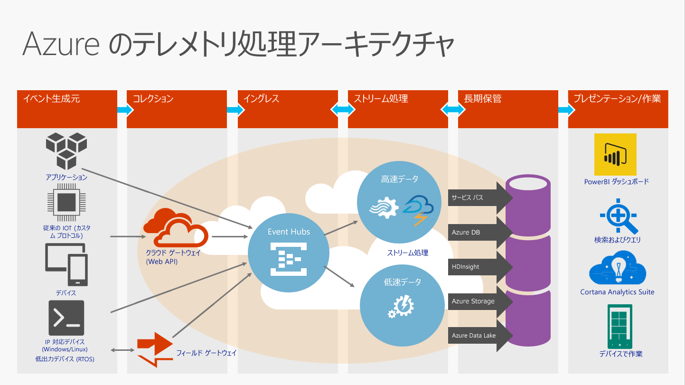
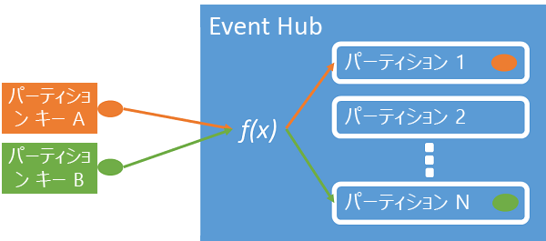
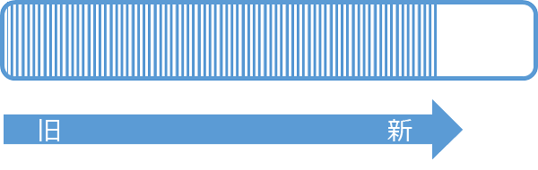
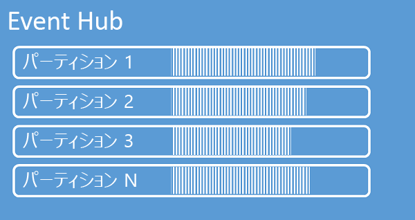

# <a name="what-is-azure-event-hubs"></a>Azure Event Hubs とは
Event Hubs は、拡張性の高いデータ ストリーミング プラットフォームで、毎秒数百万ものイベントを取り込むことができます。 イベント ハブに送信されたデータは、任意のリアルタイム分析プロバイダーやバッチ処理/ストレージ アダプターを使用して、変換および保存できます。 短い待機時間かつ大きなスケールでパブリッシュ/サブスクライブ機能を実現できるので、Event Hubs はビッグ データの "オン ランプ" として機能します。

## <a name="why-use-event-hubs"></a>Event Hubs を使用する理由
Event Hubs のイベントとテレメトリの処理機能は、次のような場合に特に役立ちます。

* アプリケーションのインストルメンテーション
* ユーザー エクスペリエンスやワークフロー処理
* モノのインターネット (IoT) のシナリオ

Event Hubs は、モバイル アプリでの動作追跡、Web ファームからのトラフィック情報、コンソール ゲームにおけるゲーム中のイベント キャプチャ、産業機器やコネクテッド カーから収集されたテレメトリ データにも対応します。

## <a name="azure-event-hubs-overview"></a>Azure Event Hubs の概要
ソリューション アーキテクチャで Event Hubs が果たす一般的な役割は、イベント パイプラインの "玄関口" です (しばしば "*イベント取り込み*" と呼ばれます)。 イベント取り込みとは、イベント ストリームの生成とそのようなイベントの消費とを分離するために、イベント パブリッシャーとイベント コンシューマーとの間に置かれるコンポーネントやサービスです。



Azure Event Hubs は、低待機時間と高信頼性を確保しながら、クラウド規模のイベントとテレメトリの取り込みを実現するイベント処理サービスです。 Event Hubs はメッセージ ストリーム処理機能を備えていて、従来のエンタープライズ メッセージングとは異なる特性を持っています。 Event Hubs の機能は、高スループットおよびイベント処理のシナリオに基づいて構築されています。 したがって、Event Hubs では、トピックなどのメッセージング エンティティで利用可能なメッセージング機能の一部が実装されていません。

イベント ハブは名前空間レベルで作成され、プライマリ API インターフェイスとして AMQP と HTTP を使用します。

## <a name="event-publishers"></a>イベント発行元
イベント ハブにデータを送信するエンティティは、いずれも "*イベント発行元*" です。 イベント発行元は、HTTPS または AMQP 1.0 を使用してイベントを発行できます。 イベント発行元は、Shared Access Signature (SAS) トークンを使用してイベント ハブに対して身元を明らかにし、一意の ID を備えることも共通の SAS トークンを使用することもできます。

### <a name="publishing-an-event"></a>イベントの発行
AMQP 1.0 または HTTPS を介してイベントを発行することができます。 Service Bus は、.NET クライアントから Event Hub へのイベント発行で使用できる [EventHubClient](/dotnet/api/microsoft.servicebus.messaging.eventhubclient) クラスを提供します。 その他のランタイムとプラットフォームには、 [Apache Qpid](http://qpid.apache.org/)などの任意の AMQP 1.0 クライアントを使用できます。 イベントを個別に発行することも、複数のイベントを一括して発行すること (バッチ) もできます。 単一イベントであるかバッチであるかにかかわらず、単一パブリケーション (イベント データ インスタンス) には 256 KB の制限があります。 これより大きいイベントを発行すると、エラーが発生します。 発行元にとっては、Event Hub 内のパーティションを意識せずに、次のセクションで説明する *パーティション キー* のみを指定するか、または SAS トークンを介して ID のみを指定するのがベスト プラクティスです。

AMQP または HTTPS のどちらを使用するかは、使用シナリオによって決まります。 AMQP では、トランスポート レベルのセキュリティ (TLS) または SSL/TLS に加えて、永続的な双方向ソケットを確立する必要があります。 AMQP ではセッション初期化時のネットワーク コストが高くなりますが、HTTPS では要求ごとに追加の SSL オーバーヘッドが必要になります。 発行の頻度が高い場合は、AMQP の方が高パフォーマンスになります。



Event Hubs によって、1 つのパーティション キー値を共有するすべてのイベントが、正しい順序で同じパーティションに確実に配信されます。 パーティション キーと発行元ポリシーを併用する場合は、発行元の ID とパーティション キーの値が一致する必要があります。 一致しないと、エラーが発生します。

### <a name="publisher-policy"></a>発行元ポリシー
Event Hubs では、 *発行元ポリシー*を介してイベント プロデューサーをきめ細かく制御できます。 発行元ポリシーは、多数の独立したイベント発行元を支援するために設計されたランタイム機能です。 発行元ポリシーでは、次のメカニズムを使用して Event Hub にイベントを発行する際に、各発行元は独自の一意の識別子を使用します。

```
//[my namespace].servicebus.windows.net/[event hub name]/publishers/[my publisher name]
```

前もって発行元名を作成しておく必要はありませんが、独立した発行元 ID を保証するために、発行元名はイベントを発行するときに使用される SAS トークンと一致する必要があります。 発行元ポリシーを使用する場合は、 **PartitionKey** 値を発行元名に設定します。 適切に機能するために、これらの値が一致する必要があります。

## <a name="partitions"></a>パーティション
Event Hubs は、パーティション化されたコンシューマー パターンを使用してメッセージ ストリーミングを実現します。このパターンでは、各コンシューマーはメッセージ ストリームの特定のサブセット (またはパーティション) のみを読み取ります。 このパターンでは、イベント処理能力を水平方向に拡張 (スケールアウト) することができ、キューおよびトピックでは利用できない、ストリームに重点を置いたその他の機能が利用できます。

パーティションは、Event Hub で保持される順序付けされた一連のイベントです。 新しいイベントが到着すると、このシーケンスの末尾に追加されます。 パーティションは "コミット ログ" として考えることができます。



Event Hubs は構成されたリテンション期間にわたりデータを保持します。この期間は、イベント ハブのすべてのパーティションに適用されます。 イベントの有効期限は時間で設定されます。イベントを明示的に削除することはできません。 パーティションは独立していて、それぞれ独自のデータ シーケンスを含んでいるため、多くの場合、拡大するペースは異なります。



パーティションの数は作成時に 2 ～ 32 の間で指定する必要があります。 パーティションの数は変更できないため、設定については長期的な規模で検討する必要があります。 パーティションはデータ編成メカニズムであり、コンシューマー アプリケーションで必要とされるダウンストリーム並列処理に関連します。 イベント ハブでのパーティションの数は、予想される同時接続のリーダー数に直接関連します。 Event Hubs チームに連絡すれば、パーティションの数を 32 より大きくすることができます。

パーティションは識別可能なため、直接パーティションに送信することもできますが、これはお勧めしません。 その代わり、「[イベント発行元](#event-publishers)」と「[容量](#capacity)」のセクションで紹介する、より高いレベルの構造を使用できます。 

パーティションには一連のイベント データが格納されます。イベント データには、イベント本文、ユーザー定義のプロパティ バッグ、メタデータ (パーティションでのオフセットやストリーム シーケンスでの番号など) が含まれます。

パーティションの詳細および可用性と信頼性のトレードオフについては、「[Event Hubs のプログラミング ガイド](event-hubs-programming-guide.md#partition-key)」と「[Event Hubs における可用性と一貫性](event-hubs-availability-and-consistency.md)」をご覧ください。

### <a name="partition-key"></a>パーティション キー
[パーティション キー](event-hubs-programming-guide.md#partition-key)を使用すると、データ編成を目的として受信イベント データを特定のパーティションにマップすることができます。 パーティション キーは、送信者によって指定され、Event Hub に渡される値です。 これは、パーティション割り当てを作成する静的なハッシュ関数で処理されます。 イベントを発行するときにパーティション キーを指定しないと、ラウンド ロビン割り当てが使用されます。

イベント発行元は、そのパーティション キーのみを認識し、イベントの発行先となるパーティションは認識しません。 このようにキーとパーティションを分離することにより、送信者はダウンストリーム処理について余分な情報を把握しなくてもよくなります。 デバイスごとまたはユーザーの一意の ID は適切なパーティション キーになりますが、地理的条件などのその他の属性を使用して関連するイベントを&1; つのパーティションにまとめることもできます。

## <a name="sas-tokens"></a>SAS トークン
Event Hubs は、名前空間とイベント ハブのレベルで利用可能な *Shared Access Signature* を使用します。 SAS トークンは、SAS キーから生成されるものであり、特定の形式でエンコードされた URL の SHA ハッシュです。 Event Hubs は、キー (ポリシー) の名前とトークンを使用することで、ハッシュを再生成し、送信者を認証できます。 通常、イベント発行元の SAS トークンは特定の Event Hub への **送信** 特権のみを付加して作成されます。 この SAS トークン URL のメカニズムは、発行元ポリシーに導入された発行元識別のための基盤です。 SAS を使用する方法の詳細については、「[Service Bus による Shared Access Signature 認証](../service-bus-messaging/service-bus-sas.md)」を参照してください。

## <a name="event-consumers"></a>イベント コンシューマー
イベント ハブからイベント データを読み取るエンティティは、いずれも "*イベント コンシューマー*" です。 Event Hubs のすべてのコンシューマーは AMQP 1.0 セッションを介して接続します。イベントは使用可能になると、このセッションを使用して配信されます。 クライアントがデータの可用性をポーリングする必要はありません。

### <a name="consumer-groups"></a>コンシューマー グループ
Event Hubs の発行/サブスクライブのメカニズムは、"*コンシューマー グループ*" によって有効になります。 コンシューマー グループは、Event Hub 全体のビュー (状態、位置、またはオフセット) を表します。 コンシューマー グループを使用することにより、複数のコンシューマー アプリケーションは、イベント ストリームの個別のビューをそれぞれ保有し、独自のペースで独自のオフセットによってストリームを別々に読み取ることができます。

ストリーム処理アーキテクチャにおいて、各ダウンストリーム アプリケーションはコンシューマー グループに相当します。 (パーティションからさらに) 長期的なストレージにイベント データを書き込む場合、そのストレージ ライター アプリケーションはコンシューマー グループとなります。 複雑なイベント処理は、別の異なるコンシューマー グループで実行できます。 パーティションにはコンシューマー グループを介してのみアクセスできます。 **特定のコンシューマー グループ**のアクティブ リーダーは、各パーティションで一度に&1; つのみ存在できます。 Event Hub には既定のコンシューマー グループが常に存在します。標準レベルの Event Hub に対して最大 20 個のコンシューマー グループを作成できます。

コンシューマー グループ URI 表記の例を次に示します。

```http
//[my namespace].servicebus.windows.net/[event hub name]/[Consumer Group #1]
//[my namespace].servicebus.windows.net/[event hub name]/[Consumer Group #2]
```


### <a name="stream-offsets"></a>ストリームのオフセット
"*オフセット*" は、パーティション内のイベントの位置です。 オフセットは、クライアント側のカーソルと考えることができます。 オフセットはイベントのバイト位置です。 このオフセットにより、イベント コンシューマー (リーダー) は、イベント ストリーム内でのイベント読み取りの開始点を指定することができます。 オフセットは、タイムスタンプとして、またはオフセット値として指定することができます。 Event Hubs サービスの外部で独自のオフセット値を格納する場合は、コンシューマーの責任で行います。 パーティション内では、各イベントにオフセットが含まれます。


### <a name="checkpointing"></a>チェックポイント機能
"*チェックポイント処理*" とは、リーダーがパーティションにおけるイベント シーケンス内の位置をマークまたはコミットするために使用する処理です。 チェックポイント処理はコンシューマーの責任で行います。この処理はコンシューマー グループ内でパーティションごとに発生します。 つまり、コンシューマー グループごとに、各パーティション リーダーは、イベント ストリーム内でのその現在の位置を追跡する必要があり、データ ストリームが完了したと見なしたときにサービスに通知することができます。

リーダーがパーティションから切断し、その後再び接続すると、該当するコンシューマー グループ内の該当するパーティションの最後のリーダーによって最後に送信されたチェックポイントから読み取りが開始されます。 リーダーは接続の際に、このオフセットを Event Hub に渡して、読み取りを開始する場所を指定します。 このように、チェックポイント処理を使用することで、ダウンストリーム アプリケーションごとにイベントに "完了" のマークを付けると共に、異なるコンピューター上で実行中のリーダー間でフェールオーバーが発生した場合に回復性をもたらすことができます。 このチェックポイント処理で、より小さなオフセットを指定すると、古いデータに戻ることができます。 このメカニズムにより、チェックポイント処理ではフェールオーバーの回復性とイベント ストリームの再生の両方を実現できます。

### <a name="common-consumer-tasks"></a>一般的なコンシューマー タスク
すべての Event Hubs コンシューマーは、AMQP 1.0 セッションと、状態に対応する双方向の通信チャネルを介して接続します。 各パーティションには、パーティションによって分離されたイベントの転送を容易にする AMQP 1.0 セッションがあります。

#### <a name="connect-to-a-partition"></a>パーティションに接続する
パーティションに接続する場合は、特定のパーティションへのリーダーの接続を調整するためにリース メカニズムを使用するのが一般的です。 このため、コンシューマー グループ内のどのパーティションもアクティブなリーダーが&1; つだけである可能性があります。 チェックポイント処理、リース、リーダー管理は、.NET クライアントの [EventProcessorHost](/dotnet/api/microsoft.servicebus.messaging.eventprocessorhost) クラスを使用して簡略化されます。 イベント プロセッサ ホストはインテリジェントなコンシューマー エージェントです。

#### <a name="read-events"></a>イベントを読み取る
特定のパーティションに対して AMQP 1.0 のセッションおよびリンクが開かれると、Event Hubs サービスによってイベントが AMQP 1.0 クライアントに配信されます。 この配信メカニズムでは、HTTP GET などのプル ベースのメカニズムよりも高いスループットおよび短い遅延時間を実現します。 イベントがクライアントに送信されるとき、イベント データの各インスタンスには、イベント シーケンスでのチェックポイント処理を容易にするために使用されるオフセットやシーケンス番号などの重要なメタデータが含まれます。

イベント データ:
* Offset
* Sequence number
* 本文
* ユーザー プロパティ
* システム プロパティ

ユーザーはオフセットを管理する必要があります。

## <a name="capacity"></a>容量
Event Hubs は、拡張性の高い並列アーキテクチャです。サイズ変更やスケーリングを行う場合、考慮すべき重要な要素がいくつかあります。

### <a name="throughput-units"></a>スループット単位
Event Hubs のスループット容量は、"*スループット単位*" によって制御されます。 スループット単位とは、購入済みの容量単位のことです。 1 つのスループット単位には、次の容量が含まれます。

* イングレス: 1 秒あたり最大で 1 MB または 1,000 イベント (どちらか先に到達した方)
* エグレス: 1 秒あたり最大で 2 MB

購入済みのスループット単位の容量を超えると、イングレスが調整され、[ServerBusyException](/dotnet/api/microsoft.azure.eventhubs.serverbusyexception) が返されます。 エグレスではスロットル例外は発生しませんが、購入済みのスループット単位の容量に制限されます。 発行率の例外を受信するか、より高いエグレスが予想される場合は、名前空間に対して購入したスループット単位の数を確認してください。 スループット単位は、[Azure Portal][Azure portal] の名前空間の **[スケール]** ブレードで管理できます。 Azure API を使用して、プログラムでスループット単位を管理することもできます。

スループット単位は&1; 時間ごとに課金され、事前に購入します。 スループット単位を購入すると、少なくとも&1; 時間の料金が課金されます。 Event Hubs の名前空間に対して最大 20 のスループット単位を購入でき、名前空間内のすべての Event Hubs で共有できます。

Azure サポートに連絡すれば、20 ブロック単位で最大 100 までスループット単位を購入できます。 100 を超えて必要な場合、100 ブロック単位でスループット単位を購入することもできます。

最適なスケールを実現するために、スループット単位とパーティションのバランスを保つことをお勧めします。 単一のパーティションの最大スケールは&1; つのスループット単位です。 スループット単位の数は、Event Hub 内のパーティション数以下とする必要があります。

料金の詳細については、「 [Event Hubs 料金](https://azure.microsoft.com/pricing/details/event-hubs/)」を参照してください。

## <a name="next-steps"></a>次のステップ

* [Event Hubs の使用に関するチュートリアル][Event Hubs tutorial]
* [Event Hubs のプログラミング ガイド](event-hubs-programming-guide.md)
* [Event Hubs における可用性と一貫性](event-hubs-availability-and-consistency.md)
* [Event Hubs の FAQ](event-hubs-faq.md)
* [Event Hubs を使用するサンプル アプリケーション]

[Event Hubs tutorial]: event-hubs-csharp-ephcs-getstarted.md
[Event Hubs を使用するサンプル アプリケーション]: https://github.com/Azure/azure-event-hubs/tree/master/samples
[Azure portal]: https://portal.azure.com

