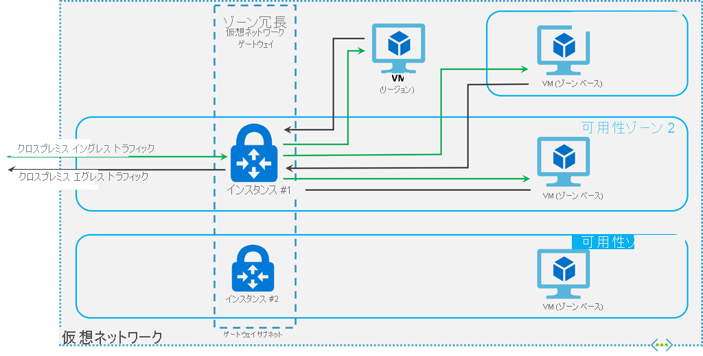

# ExpressRoute 用の仮想ネットワーク ゲートウェイについて
仮想ネットワーク ゲートウェイは、Azure 仮想ネットワークとオンプレミスの場所の間でネットワーク トラフィックの送信に使用されます。 仮想ネットワーク ゲートウェイは、ExpressRoute トラフィックまたは VPN トラフィックに使用できます。 この記事では、ExpressRoute の仮想ネットワーク ゲートウェイについて説明します。

## ゲートウェイの種類

仮想ネットワーク ゲートウェイを作成する場合、設定をいくつか指定します。 必須の設定の 1 つである '-GatewayType' は、ゲートウェイを ExpressRoute と VPN トラフィックのどちらに使用するかを指定します。 ゲートウェイには、次の 2 種類があります。 

* **Vpn** - パブリック インターネットでトラフィックを暗号化して送信するには、ゲートウェイの種類 "Vpn" を使用します。 これは、VPN ゲートウェイとも呼ばれます。 サイト間接続、ポイント対サイト接続、VNet 間接続のすべてで、VPN ゲートウェイが使用されます。

* **ExpressRoute** - プライベート接続でネットワーク トラフィックを送信するには、ゲートウェイの種類 'ExpressRoute' を使用します。 これは ExpressRoute ゲートウェイとも呼ばれ、ExpressRoute の構成時に使用するゲートウェイの種類です。

各仮想ネットワークに配置できる仮想ネットワーク ゲートウェイは、ゲートウェイの種類ごとに 1 つに限られています。 たとえば、-GatewayType が Vpn の仮想ネットワーク ゲートウェイと -GatewayType が ExpressRoute の仮想ネットワーク ゲートウェイをそれぞれ 1 つ配置できます。

## ゲートウェイの SKU
[!INCLUDE [expressroute-gwsku-include](../../includes/expressroute-gwsku-include.md)]

ゲートウェイをより強力なゲートウェイ SKU にアップグレードする場合、ほとんどの場合 "Resize-AzureRmVirtualNetworkGateway" PowerShell コマンドレットを使用できます。 これは、Standard および HighPerformance SKU へのアップグレードの場合でも機能します。 ただし、UltraPerformance SKU へのアップグレードでは、ゲートウェイを再作成する必要があります。

### ゲートウェイ SKU の推定パフォーマンス
次の表は、ゲートウェイの種類と、予測されるパフォーマンスを示したものです。 この表は、リソース マネージャーとクラシック デプロイ モデルの両方に適用されます。

[!INCLUDE [expressroute-table-aggthroughput](../../includes/expressroute-table-aggtput-include.md)]

> [!IMPORTANT]
> アプリケーションのパフォーマンスは複数の要因によって異なります。これらの要因には、エンド ツー エンドの待機時間、アプリケーションが起動するトラフィック フローの数などがあります。 テーブルの数値は、アプリケーションが理想的な環境で理論上達成できる上限を表しています。 
> 
>

### ゾーン冗長ゲートウェイ SKU (プレビュー)

Azure Availability Zones に、ExpressRoute ゲートウェイをデプロイすることもできます。 これにより、ゲートウェイは異なる Availability Zones に物理的かつ論理的に分離され、オンプレミス ネットワークの Azure への接続がゾーン レベルの障害から保護されます。

ゾーン冗長ゲートウェイでは、ExpressRoute ゲートウェイに特定の新しいゲートウェイ SKU が使用されます。 現在、新しい SKU は**パブリック プレビュー**でご利用いただけます。

* ErGw1AZ
* ErGw2AZ
* ErGw3AZ

新しいゲートウェイ SKU では、ニーズに最も適したその他のデプロイ オプションもサポートされます。 新しいゲートウェイ SKU を使用して仮想ネットワーク ゲートウェイを作成する場合、特定のゾーン内にゲートウェイをデプロイするオプションもあります。 これは、ゾーン ゲートウェイと呼ばれます。 ゾーン ゲートウェイをデプロイすると、すべてのゲートウェイ インスタンスが同じ可用性ゾーンにデプロイされます。 プレビューに登録するには、「[ゾーン冗長仮想ネットワーク ゲートウェイの作成](../../articles/vpn-gateway/create-zone-redundant-vnet-gateway.md)」をご覧ください。

## REST API および PowerShell コマンドレット
仮想ネットワーク ゲートウェイの構成に対して REST API および PowerShell コマンドレットを使用する場合のテクニカル リソースおよび特定構文の要件については、次のページを参照してください。

| **クラシック** | **Resource Manager** |
| --- | --- |
| [PowerShell](https://msdn.microsoft.com/library/mt270335.aspx) |[PowerShell](https://docs.microsoft.com/powershell/module/azurerm.network#networking) |
| [REST API](https://msdn.microsoft.com/library/jj154113.aspx) |[REST API](https://msdn.microsoft.com/library/mt163859.aspx) |

## 次の手順
使用可能な接続構成の詳細については、 [ExpressRoute の概要](expressroute-introduction.md) に関するページを参照してください。

ExpressRoute ゲートウェイの作成の詳細については、[ExpressRoute 用の仮想ネットワーク ゲートウェイの作成](expressroute-howto-add-gateway-resource-manager.md)に関するページを参照してください。
