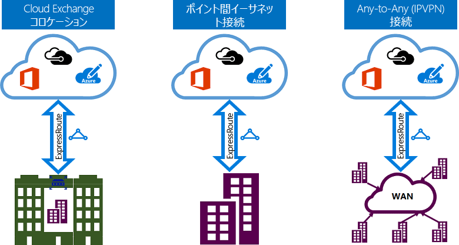

# ExpressRoute 接続モデル
オンプレミスのネットワークと Microsoft クラウドの間の接続は、[CloudExchange での同一場所配置](#CloudExchange)、[ポイント ツー ポイントのイーサネット接続](#Ethernet)、[任意の環境間 (IPVPN) 接続](#IPVPN)という 3 つの異なる方法で作成できます。 接続プロバイダーでは、1 つ以上の接続モデルを提供できます。 最適なモデルは接続プロバイダーに相談の上でお選びください。
  

## クラウドの Exchange で同一場所配置
クラウドの Exchange がある施設に同一場所配置している場合、併置プロバイダーのイーサネット交換経由で Microsoft クラウドに仮想交差接続を要請できます。 併置プロバイダーは、共有施設のインフラストラクチャと Microsoft クラウドの間に、レイヤー 2 交差接続と管理レイヤー 3 交差接続のいずれかを提供します。

## ポイント ツー ポイントのイーサネット接続
オンプレミス データセンター/オフィスと Microsoft クラウドをポイント ツー ポイントのイーサネット リンクで接続できます。 ポイント ツー ポイントのイーサネットのプロバイダーは、サイトと Microsoft クラウドの間にレイヤー 2 接続と管理レイヤー 3 接続のいずれかを提供できます。

## 任意の環境間 (IPVPN) ネットワーク
WAN と Microsoft クラウドを統合できます。 IPVPN プロバイダー (通常、MPLS VPN) は、ブランチ オフィスとデータセンターの間に任意の環境間の接続を提供できます。 Microsoft クラウドを WAN に相互接続し、ブランチ オフィスのように見せることができます。 通常、WAN プロバイダーは管理レイヤー 3 接続を提供します。 ExpressRoute の機能は上記の接続モデルのすべてに共通しています。 

## 次の手順
* ExpressRoute 接続とルーティング ドメインについて説明します。 「 [ExpressRoute 回線とルーティング ドメイン](expressroute-circuit-peerings.md)」を参照してください。
* ExpressRoute の機能について説明します。 「[ExpressRoute の技術概要](expressroute-introduction.md)」をご覧ください
* サービス プロバイダーを検索します。 「 [ExpressRoute パートナーとピアリングの場所](expressroute-locations.md)」を参照してください。
* すべての前提条件を満たしていることを確認します。 「 [Azure ExpressRoute の前提条件](expressroute-prerequisites.md)」を参照してください。
* [ルーティング](expressroute-routing.md)、[NAT](expressroute-nat.md)、[QoS](expressroute-qos.md) の要件をご覧ください。
* ExpressRoute 接続を構成します。
  * [ExpressRoute 回線の作成](expressroute-howto-circuit-portal-resource-manager.md)
  * [ルーティングの構成](expressroute-howto-routing-portal-resource-manager.md)
  * [ExpressRoute 回線への VNet のリンク](expressroute-howto-linkvnet-portal-resource-manager.md)