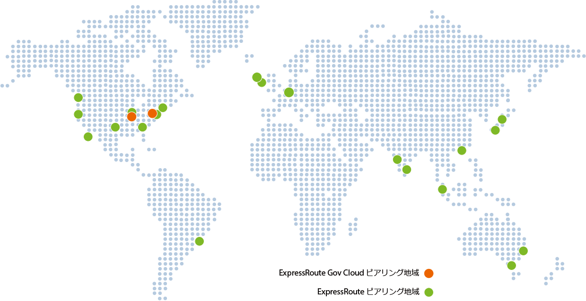

<properties
   pageTitle="ExpressRoute の場所"
   description="このページでは、サービスが提供されている場所と Azure リージョンに接続する方法の詳細について説明します。"
   services="expressroute"
   documentationCenter="na"
   authors="cherylmc"
   manager="adinah"
   editor="tysonn" />
<tags 
   ms.service="expressroute"
   ms.devlang="na"
   ms.topic="article"
   ms.tgt_pltfrm="na"
   ms.workload="infrastructure-services"
   ms.date="07/07/2015"
   ms.author="cherylmc" />

# ExpressRoute パートナーとピアリングの場所
このページの表では、ExpressRoute 接続プロバイダー (EXP と NSP)、ExpressRoute の地理的範囲、ExpressRoute でサポートされる Microsoft クラウド サービス、ExpressRoute システム インテグレーター (SI) に関する情報を提供します。

## ExpressRoute 接続プロバイダー
ExpressRoute は、すべての Azure のリージョンと場所でサポートされています。次のマップは、Azure のリージョンと ExpressRoute の場所を一覧しています。ExpressRoute の場所は、Microsoft がいくつかのサービス プロバイダーと接続している場所を示します。
 

地理的リージョン内の少なくとも 1 つの ExpressRoute の場所に接続している場合は、その地理的リージョン内のすべてのリージョンの Azure サービスにアクセスできます。次の表は、地理的リージョン内の ExpressRoute の場所に Azure リージョンのマップを提供します。

|**地理的リージョン**|**Azure リージョン**|**ExpressRoute の場所**|
|---|---|---|
|**米国**|米国内のすべてのリージョン - 米国東部、米国西部、米国東部 2、米国中部、米国中南部、米国中北部|アトランタ、シカゴ、ダラス、ロサンゼルス、ニューヨーク、シアトル、シリコン バレー、ワシントン DC|
|**南アメリカ**|ブラジル南部|サンパウロ|
|**ヨーロッパ**|北ヨーロッパ、西ヨーロッパ|アムステルダム、ロンドン|
|**アジア**|東アジア、東南アジア|香港、シンガポール|
|**日本**|西日本、東日本|東京|
|**オーストラリア**|オーストラリア東部、オーストラリア南東部|メルボルン、シドニー|
|**インド**|インド西部、インド中部、インド南部|チェンナイ、ムンバイ|

地理的リージョン間の接続はサポートされていません。接続プロバイダーを利用して、組織のネットワークを使って地理的リージョン間の接続を拡張できます。

## Exchange プロバイダー (EXP) の場所

| **サービス プロバイダー** |**Microsoft Azure** | **Office 365** | **場所** |
|-----------------------|--------------------|----------------|---------------|
| **[Aryaka Networks](http://www.aryaka.com/)** | サポートされています | サポートされていません | シリコン バレー、シンガポール、ワシントン DC |
| **[Colt Ethernet](http://www.colt.net/uk/en/news/colt-announces-dedicated-cloud-access-for-microsoft-azure-services-en.htm)** | サポートされています | サポートされていません | アムステルダム、ロンドン |
| **Comcast** | サポートされています | サポートされていません | シリコン バレー、ワシントン DC |
| **[Equinix](http://www.equinix.com/partners/microsoft-azure/)** | サポートされています | 近日対応予定 | アムステルダム、アトランタ、シカゴ、ダラス、香港、ロンドン、ロサンゼルス、メルボルン、ニューヨーク、サンパウロ、シアトル、シリコン バレー、シンガポール、シドニー、東京、ワシントン DC |
| **[InterCloud](https://www.intercloud.com/)** | サポートされています | サポートされていません | アムステルダム、ロンドン、シンガポール、ワシントン DC |
| **Internet Solutions - Cloud Connect** | サポートされています | サポートされていません | アムステルダム、ロンドン |
| **Interxion** | サポートされています | サポートされていません | アムステルダム |
| **[Level 3 Communications - Exchange](http://your.level3.com/LP=882?WT.tsrc=02192014LP882AzureVanityAzureText)** | サポートされています | サポートされていません | シカゴ、ダラス、ロンドン、シアトル、シリコン バレー、ワシントン DC |
| **NEXTDC** | サポートされています | サポートされていません | メルボルン、シドニー+ |
| **[TeleCity Group](http://www.telecitygroup.com/investor-centre/news_details.htm?locid=03100500400b00d&xml)** | サポートされています | 近日対応予定 | アムステルダム、ロンドン |
| **[Telstra Corporation](http://www.telstra.com.au/business-enterprise/network-services/networks/cloud-direct-connect/)** | サポートされています | サポートされていません | メルボルン+、シドニー |
| **[Zayo Group](http://www.zayo.com/)** | サポートされています | サポートされていません | ワシントン DC |

 **+** は近日対応予定を表します

接続を設定する手順については、[EXP 接続の構成](expressroute-configuring-exps.md)に関するページをご覧ください。

## ネットワーク サービス プロバイダー (NSP) の場所

| **サービス プロバイダー** |**Microsoft Azure** | **Office 365** | **場所** |
|-----------------------|--------------------|----------------|---------------|
| **[AT&T](https://www.synaptic.att.com/clouduser/html/productdetail/ATT_NetBond.htm)** | サポートされています | 近日対応予定 | アムステルダム+、ロンドン+、ダラス、シリコン バレー、ワシントン DC |
| **[British Telecom](http://www.globalservices.bt.com/uk/en/news/bt_to_provide_connectivity_to_microsoft_azure)** | サポートされています | 近日対応予定 | アムステルダム、ロンドン、シリコン バレー+、ワシントン DC |
|**China Telecom Global** | 近日対応予定 | サポートされていません | 香港+ |
| **[Colt IPVPN](http://www.colt.net/uk/en/news/colt-announces-dedicated-cloud-access-for-microsoft-azure-services-en.htm)** | サポートされています | サポートされていません | アムステルダム、ロンドン |
| **[Internet Initiative Japan Inc. - IIJ](http://www.iij.ad.jp/en/news/pressrelease/2013/pdf/Azure_E.pdf)** | サポートされています | サポートされていません | 東京 |
| **[Level 3 Communications - IPVPN](http://your.level3.com/LP=882?WT.tsrc=02192014LP882AzureVanityAzureText)** | サポートされています | サポートされていません | シカゴ、ダラス、ロンドン、シアトル、シリコン バレー、ワシントン DC |
| **NTT Communications** | 近日対応予定 | サポートされていません | 東京+ | 
| **[Orange](http://www.orange-business.com/)** | サポートされています | サポートされていません | アムステルダム、ロンドン、シリコン バレー、ワシントン DC |
| **PCCW Global Limited** | サポートされています | サポートされていません | 香港 |
| **[SingTel](http://info.singtel.com/about-us/news-releases/singtel-provide-secure-private-access-microsoft-azure-public-cloud)** | サポートされています | サポートされていません | シンガポール |
| **[Tata Communications](http://www.tatacommunications.com/lp/izo/azure/azure_index.html)** | サポートされています | 近日対応予定 | アムステルダム、チェンナイ+、香港、ロンドン、ムンバイ+、シンガポール |
| **[Telstra Corporation](http://www.telstra.com.au/business-enterprise/network-services/networks/cloud-direct-connect/)** | サポートされています | サポートされていません | メルボルン+、シドニー |
| **[Verizon](http://news.verizonenterprise.com/2014/04/secure-cloud-interconnect-solutions-enterprise/)** | サポートされています | サポートされていません | ロンドン、香港、シリコン バレー、ワシントン DC |

 **+** は近日対応予定を表します

接続を設定する手順については、[NSP 接続の構成](expressroute-configuring-nsps.md)に関するページをご覧ください。

## 一覧にないサービス プロバイダー経由の接続 

接続プロバイダーが上記のセクションの一覧にない場合でも、接続を作成できます。

- その接続プロバイダーが、EXP の場所に一覧されているいずれかの Exchange プロバイダーに接続されているかどうかを確認します。次のリンクから、Exchange プロバイダーが提供するサービスの詳細情報を収集できます。いくつかの接続プロバイダーは、既に EXP のイーサネットに接続されています。
	- [Equinix Cloud Exchange](http://www.equinix.com/services/interconnection-connectivity/cloud-exchange/) 
	- [TeleCity CloudIX](http://www.telecitygroup.com/colocation-services/cloud-ix.htm)
- その接続プロバイダーに、選択した Exchange の場所までネットワークを拡張してもらいます。
	- 単一障害点がないように、接続プロバイダーが可用性の高い方法で接続を拡張していることを確認します。
	- 接続プロバイダー (特に、イーサネット プロバイダー) は、高可用性を確保するために、イーサネット交換に 1 組の回線を調達する必要があります。 
- Azure に接続するには、Exchange プロバイダーを通じて ExpressRoute 回線を注文します。
	- 「[EXP 接続の構成](expressroute-configuring-exps.md)」の手順に従って接続を設定します。

|**接続プロバイダー**|**Exchange プロバイダー**|**ピアリングの場所**|
|---|---|---|
|**[XO Communications](http://www.xo.com/)**|Equinix|シリコン バレー|

## ExpressRoute システム インテグレーター
ネットワークの規模によっては、ニーズに合わせてプライベート接続を有効にするのは難しい場合があります。次の表のいずれかのシステム インテグレーターを使用すると、ExpressRoute の利用開始に役立ちます。

|**システム インテグレーター**|**大陸**|
|---|---|
|**[Nimbo](http://www.nimbo.com/)**|米国||
|**[Dotnet Solutions](http://www.dotnetsolutions.co.uk/)**|ヨーロッパ・中東・アフリカ|

## 次のステップ
- [ExpressRoute の前提条件](expressroute-prerequisites.md)を満たしていることをご確認ください。
- 詳細については、[FAQ](expressroute-faqs.md) をご覧ください。
- ExpressRoute 接続を構成する必要がある場合は、[EXP 接続の構成](expressroute-configuring-exps.md)または [NSP 接続の構成](expressroute-configuring-nsps.md)に関するページを参照してください。
- 同じ仮想ネットワークに対してサイト間 VPN 接続と ExpressRoute の両方を構成する必要がある場合は、「[Configure ExpressRoute and Site-to-Site VPN connections that coexist (共存する ExpressRoute とサイト間 VPN の接続の構成)](expressroute-coexist.md)」を参照してください。
 

<!---HONumber=July15_HO4-->