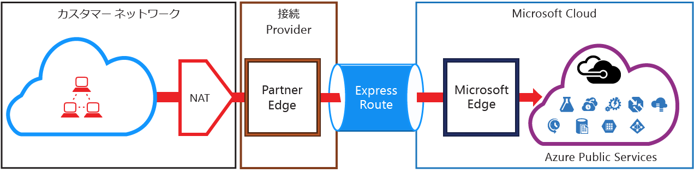
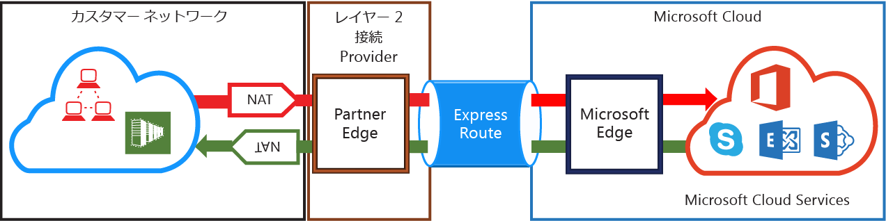

# ExpressRoute NAT の要件
ExpressRoute を使用して Microsoft クラウド サービスに接続するには、NAT をセットアップして管理する必要があります。 一部の接続プロバイダーでは、NAT のセットアップと管理が管理されたサービスとして提供されています。 このようなサービスが提供されているかどうか、接続プロバイダーに問い合わせてください。 このようなサービスが提供されていない場合は、次に示す要件に従う必要があります。 

[ExpressRoute の回線とルーティング ドメイン](expressroute-circuit-peerings.md) のページをお読みになり、さまざまなルーティング ドメインの概要をご確認ください。 Azure パブリックと Microsoft ピアリングのパブリック IP アドレス要件を満たすために、ネットワークと Microsoft の間に NAT をセットアップすることをお勧めします。 このセクションでは、セットアップする NAT インフラストラクチャに関して説明します。

## Azure パブリック ピアリングの NAT 要件
Azure パブリック ピアリング パスを利用すれば、パブリック IP アドレスで Azure にホストされているすべてのサービスに接続できます。 たとえば、 [ExpessRoute FAQ](expressroute-faqs.md) の一覧にあるサービスや Microsoft Azure で ISV によりホストされているサービスです。 パブリック ピアリングでの Microsoft Azure への接続は常にネットワークから Microsoft ネットワークに対して開始されます。 パブリック ピアリングで Microsoft Azure に向かうトラフィックは有効な IPv4 アドレスに SNAT 変換しないと、Microsoft ネットワークに入れません。 下の図は、上記の要件を満たすように NAT をセットアップするしくみを上のレベルで示しています。

 

### NAT IP プールとルート アドバタイズ
トラフィックが有効なパブリック IPv4 アドレスで Azure パブリック ピアリング パスに入っていることを確認する必要があります。 Microsoft はリージョンのルーティング インターネット レジストリ (RIR) またはインターネット ルーティング レジストリ (IRR) に対して IPv4 NAT アドレスの所有権を検証する必要があります。 ピアリングされている AS 番号と NAT に使用されている IP アドレスに基づいて確認されます。 ルーティング レジストリに関する情報については、 [ExpressRoute のルーティングの要件](expressroute-routing.md) のページを参照してください。

このピアリングでアドバタイズされる NAT IP プレフィックスの長さには制約がありません。 NAT プールを監視し、NAT セッションが不足していないことを確認する必要があります。

> [!IMPORTANT]
> Microsoft にアドバタイズされる NAT IP プールはインターネットにアドバタイズしないでください。 他の Microsoft サービスへの接続が切断されます。
> 
> 

## Microsoft ピアリングの NAT 要件
Microsoft ピアリング パスにより、Azure パブリック ピアリング パスでサポートされていない Microsoft クラウド サービスに接続できます。 そのようなサービスには、Exchange Online、SharePoint Online、Skype for Business、CRM Online のような Office 365 サービスがあります。 Microsoft は今後、Microsoft ピアリングで双方向の接続をサポートする予定です。 Microsoft クラウド サービスに向かうトラフィックは有効な IPv4 アドレスに SNAT 変換しないと、Microsoft ネットワークに入れません。 Microsoft クラウド サービスからご利用のネットワーク方向のトラフィックは SNAT 変換しないと、ネットワークに入れません。 下の図は、Microsoft ピアリングのために NAT をセットアップするしくみを上のレベルで示しています。

 

### ご利用のネットワークから Microsoft に送信されるトラフィック
* トラフィックが有効なパブリック IPv4 アドレスで Microsoft ピアリング パスに入っていることを確認する必要があります。 Microsoft はリージョンのルーティング インターネット レジストリ (RIR) またはインターネット ルーティング レジストリ (IRR) に対して IPv4 NAT アドレスの所有者を検証する必要があります。 ピアリングされている AS 番号と NAT に使用されている IP アドレスに基づいて確認されます。 ルーティング レジストリに関する情報については、 [ExpressRoute のルーティングの要件](expressroute-routing.md) のページを参照してください。
* Azure パブリック ピアリング セットアップと他の ExpressRoute 回線に使用する IP アドレスは BGP セッションで Microsoft にアドバタイズしないでください。 このピアリングでアドバタイズされる NAT IP プレフィックスの長さには制約がありません。
  
  > [!IMPORTANT]
  > Microsoft にアドバタイズされる NAT IP プールはインターネットにアドバタイズしないでください。 他の Microsoft サービスへの接続が切断されます。
  > 
  > 

### Microsoft からあなたのネットワークに送信されるトラフィック
* 一部のシナリオでは、あなたのネットワーク内でホストされているサービス エンドポイントへの接続を Microsoft が開始する必要があります。 そのようなシナリオの典型的な例は、Office 365 からあなたのネットワークでホストされている ADFS サービスに接続する場合です。 そのような場合は、ネットワークから Microsoft ピアリングに適切なプレフィックスをリークする必要があります。 
* Microsoft からあなたのネットワーク内にある IP アドレスに送信されるトラフィックを SNAT 変換する必要があります。 

## 次のステップ
* [ルーティング](expressroute-routing.md)と [QoS](expressroute-qos.md) の要件を参照してください。
* ワークフロー情報については、「 [ExpressRoute 回線のプロビジョニング ワークフローと回線の状態](expressroute-workflows.md)」を参照してください。
* ExpressRoute 接続を構成します。
  
  * [ExpressRoute 回線の作成](expressroute-howto-circuit-classic.md)
  * [ルーティングの構成](expressroute-howto-routing-classic.md)
  * [ExpressRoute 回線への VNet のリンク](expressroute-howto-linkvnet-classic.md)

<!--HONumber=Nov16_HO3-->

