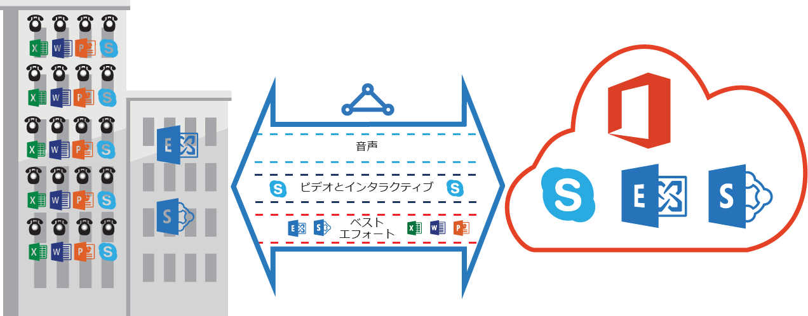

# ExpressRoute QoS の要件
Skype for Business には、特化した QoS 処理を必要とするさまざまなワークロードがあります。 ExpressRoute で音声サービスを使用する場合、以下の要件に従う必要があります。

> [!NOTE]
> QoS 要件は Microsoft ピアリングにのみ適用されます。 Azure パブリック ピアリングと Azure プライベート ピアリングで受信されたネットワーク トラフィックの DSCP 値は、0 にリセットされます。 
> 
> 

次の表は、Skype for Business で使用される DSCP マーキングを一覧にしたものです。 詳細については、「 [Skype for Business の QoS の管理](https://technet.microsoft.com/library/gg405409.aspx) 」を参照してください。

| **トラフィック クラス** | **処理 (DSCP マーキング)** | **Skype for Business ワークロード** |
| --- | --- | --- |
| **音声** |EF (46) |Skype / Lync 音声 |
| **対話** |AF41 (34) |ビデオ、VBSS |
| AF21 (18) |アプリ共有 | |
| **既定値** |AF11 (10) |ファイル転送 |
| CS0 (0) |その他 | |

* ワークロードを分類し、適切な DSCP 値をマークする必要があります。 ネットワークに DSCP マーキングを設定する方法については、 [ここ](https://technet.microsoft.com/library/gg405409.aspx) の指示に従ってください。
* ネットワーク内で複数の QoS キューを構成し、サポートする必要があります。 音声はスタンドアロン クラスにし、RFC 3246 で指定されている EF 処理を受信する必要があります。 
* キュー メカニズム、輻輳検出ポリシー、トラフィック クラス別の帯域幅割り当てを決定できます。 ただし、Skype for Business ワークロードの DSCP マーキングを予約する必要があります。 AF31 (26) など、上の一覧にない DSCP マーキングを使用している場合、パケットを Microsoft に送信する前にこの DSCP 値を 0 に書き換える必要があります。 Microsoft は上の表にあるように DSCP 値がマークされているパケットのみを送信します。 

## 次のステップ
* [ルーティング](expressroute-routing.md)と [NAT](expressroute-nat.md) の要件を参照してください。
* ExpressRoute 接続を構成するには、次のリンクを参照してください。
  
  * [ExpressRoute 回線の作成](expressroute-howto-circuit-classic.md)
  * [ルーティングの構成](expressroute-howto-routing-classic.md)
  * [ExpressRoute 回線への VNet のリンク](expressroute-howto-linkvnet-classic.md)

