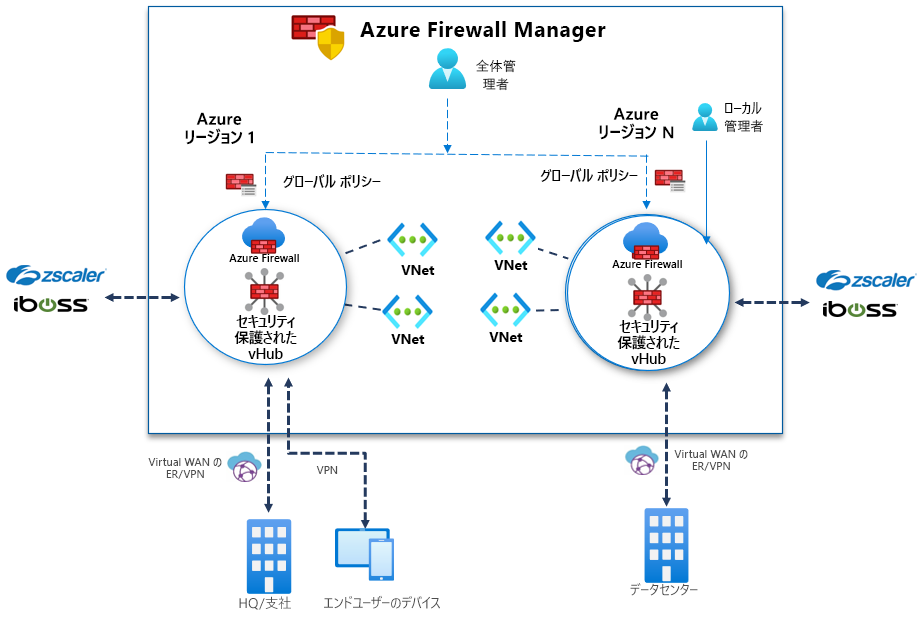

# Azure Firewall Manager プレビューとは

[!INCLUDE [Preview](../../includes/firewall-manager-preview-notice.md)]

Azure Firewall Manager プレビューは、クラウドベースのセキュリティ境界に対して、集約型セキュリティ ポリシーとルート管理を提供するセキュリティ管理サービスです。 ハブとスポークのアーキテクチャを簡単に作成できる Microsoft の管理対象リソースである [Azure Virtual WAN ハブ](../virtual-wan/virtual-wan-about.md#resources)と連携して動作します。 セキュリティとルーティングのポリシーがそのようなハブに関連付けられている場合は、 *[セキュリティ保護付き仮想ハブ](secured-virtual-hub.md)* と呼ばれます。 

## Azure Firewall Manager プレビューの機能

Azure Firewall Manager プレビューには、次の機能が用意されています。

### 一元的な Azure Firewall のデプロイと構成

異なる Azure リージョンとサブスクリプションにまたがる複数の Azure Firewall インスタンスを一元的にデプロイし、構成することができます。 

### 階層型ポリシー (グローバルおよびローカル)

Azure Firewall Manager プレビューを使用して、複数のセキュリティで保護された仮想ハブにまたがる Azure Firewall ポリシーを一元的に管理できます。 中央の IT チームは、グローバル ファイアウォール ポリシーを作成し、チームを越えて組織全体のファイアウォール ポリシーを適用することができます。 ローカルで作成されたファイアウォール ポリシーを使用すると、DevOps のセルフサービス モデルで機敏性を向上させることができます。

### セキュリティを強化するためのサードパーティのサービスとしてのセキュリティとの統合

Azure Firewall だけでなく、サードパーティのサービスとしてのセキュリティ (SECaaS) プロバイダーを統合して、VNet とブランチのインターネット接続に追加のネットワーク保護を提供することもできます。

- VNet からインターネット (V2I) へのトラフィックのフィルター処理

   - 任意のサードパーティ セキュリティ プロバイダーを使用して、送信仮想ネットワーク トラフィックをフィルター処理します。
   - Azure 上で実行されているクラウド ワークロードに対して、高度なユーザー対応のインターネット保護を利用します。

- ブランチからインターネット (B2I) へのトラフィックのフィルター

   Azure の接続とグローバル分散を利用して、ブランチからインターネットへのシナリオにサードパーティのフィルター処理を簡単に追加できます。

信頼されたセキュリティ プロバイダーの詳細については、[Azure Firewall Manager の信頼されたセキュリティ パートナー (プレビュー)](trusted-security-partners.md) に関するページを参照してください。

### 一元的なルート管理

スポーク仮想ネットワーク上でユーザー定義ルート (UDR) を手動で設定しなくても、フィルター処理とログ記録のためにセキュリティ保護付きハブにトラフィックをルーティングすることができます。 ブランチからインターネット (B2I) へのトラフィックのフィルター処理にはサードパーティ プロバイダーを使用し、ブランチから VNet (B2V)、VNet から VNet (V2V)、および VNet からインターネット (V2I) には Azure Firewall を同時に使用できます。 B2V または V2V のために Azure Firewall が必要ではない場合は、V2I トラフィックのフィルター処理にサードパーティ プロバイダーを使用することもできます。 

## 利用可能なリージョン

パブリック プレビューでは、次のリージョンがサポートされています。

- 西ヨーロッパ、北ヨーロッパ、フランス中部、フランス南部、英国南部、英国西部
- オーストラリア東部、オーストラリア中部、オーストラリア中部 2、オーストラリア南東部
- カナダ中部
- 米国東部、米国西部、米国東部 2、米国中南部、米国西部 2、米国中部、米国中北部、米国中西部

Azure Firewall ポリシーはこれらのリージョンでのみ作成できますが、複数のリージョンで使用できます。 たとえば、米国西部でポリシーを作成し、米国東部で使用することができます。 

## 既知の問題

Azure Firewall Manager プレビューには、次の既知の問題があります。

|問題  |説明  |対応策  |
|---------|---------|---------|
|手動で作成された中央の VNet がサポートされない|現時点で、Azure Firewall Manager は、仮想ハブで作成されたネットワークをサポートしています。 手動で作成したハブ VNet の使用はまだサポートされていません。|現時点では、仮想ハブで作成されたハブとスポークのネットワークで Azure Firewall Manager を使用してください。 現在調査中です。
|サードパーティのフィルター処理の制限事項|Azure Firewall B2V と V2V では、サードパーティ プロバイダーによる V2I トラフィックのフィルター処理はサポートされていません。|現在調査中です。|
|トラフィックの分割が現在サポートされていない|Office 365 と Azure パブリック PaaS トラフィックの分割は現在サポートされていません。 そのため、V2I または B2I にサードパーティ プロバイダーを選択すると、パートナー サービスを介してすべての Azure Public PaaS および Office 365 トラフィックも送信されます。|現在、ハブでのトラフィックの分割を調査中です。
|リージョンごとに 1 つのハブ|リージョンごとに複数のハブを使用することはできません|1 つのリージョンに複数の仮想 WAN を作成します。|
|基本ポリシーがローカル ポリシーと同じリージョンにある必要がある|基本ポリシーと同じリージョンにすべてのローカル ポリシーを作成します。 セキュリティ保護付きハブ上の 1 つのリージョンで作成されたポリシーを、別のリージョンから適用することもできます。|現在調査中です。|
|セキュリティ保護付き仮想ハブで、ハブ間の通信が機能しない|セキュリティ保護付き仮想ハブからセキュリティ保護付き仮想ハブへの通信はまだサポートされていません。|現在調査中です。|

## 次の手順

- [Azure Firewall Manager プレビューのデプロイの概要](deployment-overview.md)を確認します
- [セキュリティで保護された仮想ハブ](secured-virtual-hub.md)について学習します。