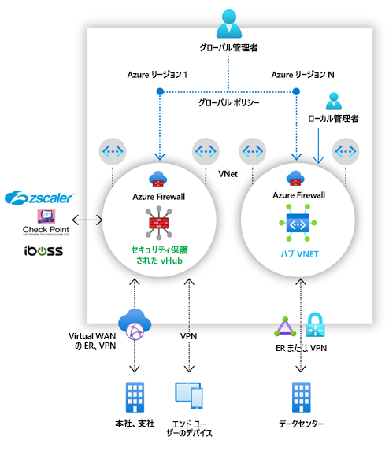

# Azure Firewall Manager とは

Azure Firewall Manager は、クラウドベースのセキュリティ境界に対して、集約型セキュリティ ポリシーとルート管理を提供するセキュリティ管理サービスです。 

Firewall Manager は、次の 2 種類のネットワーク アーキテクチャのセキュリティ管理機能を備えています。

- **セキュリティ保護付き仮想ハブ**

   [Azure Virtual WAN ハブ](../virtual-wan/virtual-wan-about.md#resources)は、ハブとスポークのアーキテクチャを簡単に作成できる Microsoft の管理対象リソースです。 セキュリティとルーティングのポリシーがそのようなハブに関連付けられている場合は、 *[セキュリティ保護付き仮想ハブ](secured-virtual-hub.md)* と呼ばれます。 
- **ハブ仮想ネットワーク**

   自分で作成して管理できる標準の Azure 仮想ネットワークです。 そのようなハブにセキュリティ ポリシーが関連付けられている場合は、"*ハブ仮想ネットワーク*" と呼ばれます。 現時点では、Azure Firewall ポリシーのみがサポートされています。 ワークロード サーバーが含まれるスポーク仮想ネットワークとサービスをピアリングすることができます。 どのスポークにもピアリングされていないスタンドアロンの仮想ネットワークでファイアウォールを管理することもできます。

"*セキュリティ保護付き仮想ハブ*" と "*ハブ仮想ネットワーク*" アーキテクチャの種類の詳しい比較については、「[Azure Firewall Manager のアーキテクチャ オプション](vhubs-and-vnets.md)」を参照してください。

## Azure Firewall Manager の機能

Azure Firewall Manager には、次の機能が用意されています。

### 一元的な Azure Firewall のデプロイと構成

異なる Azure リージョンとサブスクリプションにまたがる複数の Azure Firewall インスタンスを一元的にデプロイし、構成することができます。 

### 階層型ポリシー (グローバルおよびローカル)

Azure Firewall Manager を使用して、複数のセキュリティで保護された仮想ハブにまたがる Azure Firewall ポリシーを一元的に管理できます。 中央の IT チームは、グローバル ファイアウォール ポリシーを作成し、チームを越えて組織全体のファイアウォール ポリシーを適用することができます。 ローカルで作成されたファイアウォール ポリシーを使用すると、DevOps のセルフサービス モデルで機敏性を向上させることができます。

### セキュリティを強化するためのサードパーティのサービスとしてのセキュリティとの統合

Azure Firewall だけでなく、サードパーティのサービスとしてのセキュリティ (SECaaS) プロバイダーを統合して、VNet とブランチのインターネット接続に追加のネットワーク保護を提供することもできます。

この機能は、セキュリティ保護付き仮想ハブのデプロイでのみ利用できます。

- VNet からインターネット (V2I) へのトラフィックのフィルター処理

   - 任意のサードパーティ セキュリティ プロバイダーを使用して、送信仮想ネットワーク トラフィックをフィルター処理します。
   - Azure 上で実行されているクラウド ワークロードに対して、高度なユーザー対応のインターネット保護を利用します。

- ブランチからインターネット (B2I) へのトラフィックのフィルター

   Azure の接続とグローバル分散を利用して、ブランチからインターネットへのシナリオにサードパーティのフィルター処理を簡単に追加できます。

セキュリティ プロバイダーの詳細については、[Azure Firewall Manager のセキュリティ パートナー プロバイダー](trusted-security-partners.md)に関するページを参照してください。

### 一元的なルート管理

スポーク仮想ネットワーク上でユーザー定義ルート (UDR) を手動で設定しなくても、フィルター処理とログ記録のためにセキュリティ保護付きハブにトラフィックをルーティングすることができます。 

この機能は、セキュリティ保護付き仮想ハブのデプロイでのみ利用できます。

ブランチからインターネット (B2I) へのトラフィックのフィルター処理にはサードパーティ プロバイダーを使用し、ブランチから VNet (B2V)、VNet から VNet (V2V)、および VNet からインターネット (V2I) には Azure Firewall を同時に使用できます。 B2V または V2V のために Azure Firewall が必要ではない場合は、V2I トラフィックのフィルター処理にサードパーティ プロバイダーを使用することもできます。 

## 利用可能なリージョン

Azure Firewall ポリシーは、複数のリージョンで使用できます。 たとえば、米国西部でポリシーを作成し、米国東部で使用することができます。 

## 既知の問題

Azure Firewall Manager には、次の既知の問題があります。

|問題  |説明  |対応策  |
|---------|---------|---------|
|トラフィックの分割|Microsoft 365 と Azure パブリック PaaS トラフィックの分割は現在サポートされていません。 そのため、V2I または B2I にサードパーティ プロバイダーを選択すると、パートナー サービスを介してすべての Azure Public PaaS および Microsoft 365 トラフィックも送信されます。|ハブでのトラフィックの分割を調査中です。
|セキュリティ保護付き仮想ハブがリージョンごとに 1 つである|1 つのリージョンで複数のセキュリティ保護付き仮想ハブを使用することはできません。|1 つのリージョンに複数の仮想 WAN を作成します。|
|基本ポリシーがローカル ポリシーと同じリージョンにある必要がある|基本ポリシーと同じリージョンにすべてのローカル ポリシーを作成します。 セキュリティ保護付きハブ上の 1 つのリージョンで作成されたポリシーを、別のリージョンから適用することもできます。|調査中|
|セキュリティで保護された仮想ハブ デプロイでのハブ間トラフィックのフィルター処理|セキュリティ保護付き仮想ハブからセキュリティ保護付き仮想ハブへの通信のフィルター処理は、まだサポートされていません。 ただし、Azure Firewall によるプライベート トラフィックのフィルター処理が有効になっていない場合は、ハブからハブへの通信は引き続き機能します。|調査中|
|仮想ハブとは異なるリージョンにあるスポーク|仮想ハブとは異なるリージョンにあるスポークはサポートされていません。|調査中  リージョンごとにハブを作成し、ハブと同じリージョンの VNet をピアリングします。|
|プライベート トラフィック フィルターが有効になっている場合のブランチ間のトラフィック|プライベート トラフィック フィルターが有効になっている場合、ブランチ間のトラフィックはサポートされていません。 |調査中。  ブランチ間の接続が重要である場合は、プライベート トラフィックをセキュリティで保護しないでください。|
|同じ Virtual WAN を共有するすべてのセキュリティ保護付き仮想ハブは同じリソース グループに存在する必要がある|この動作は、今日の Virtual WAN ハブに合わせたものです。|複数の異なるリソース グループにセキュリティ保護付き仮想ハブを作成できるようにするには、複数の Virtual WAN を作成します。|
|一括 IP アドレス追加が失敗する|複数のパブリック IP アドレスを追加すると、セキュリティで保護されたハブ ファイアウォールがエラー状態になります。|より少ない増分のパブリック IP アドレスを追加します。 たとえば、一度に 10 個を追加します。|
|セキュリティ保護付き仮想ハブで DDoS Protection Standard がサポートされていない|DDoS Protection Standard は vWAN と統合されていません。|調査中|
|アクティビティ ログが完全にはサポートされていない|現在、ファイアウォール ポリシーでは、アクティビティ ログはサポートされていません。|調査中|
|Firewall ポリシーを使用するようにファイアウォールが移行されても、いくつかのファイアウォール設定が移行されません|Azure Firewall ポリシーに移行しても、可用性ゾーンと SNAT プライベート アドレスは移行されません。|調査中| 

## 次のステップ

- [Azure Firewall Manager のデプロイ概要](deployment-overview.md)を確認する
- [セキュリティで保護された仮想ハブ](secured-virtual-hub.md)について学習します。
