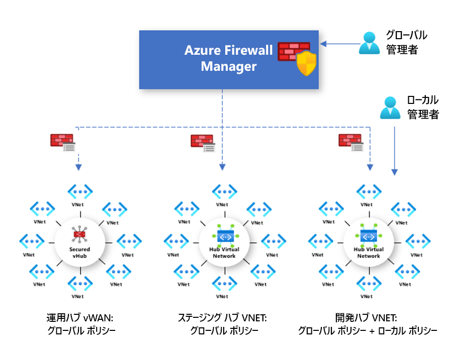

# Azure Firewall Manager プレビューのポリシーの概要

[!INCLUDE [Preview](../../includes/firewall-manager-preview-notice.md)]

ファイアウォール ポリシーは、NAT、ネットワーク、アプリケーションの各ルール コレクションのほか、脅威インテリジェンスの設定を含んだ Azure リソースです。 セキュリティ保護付き仮想ハブ内およびハブ仮想ネットワーク内の複数の Azure Firewall インスタンスにわたって使用できるグローバル リソースです。 ポリシーは、複数のリージョンおよび複数のサブスクリプションにわたって作用します。

## ポリシーの作成と関連付け

ポリシーは、Azure portal、REST API、テンプレート、Azure PowerShell、CLI など、さまざまな方法で作成、管理できます。

ポータルまたは Azure PowerShell を使用し、Azure Firewall から既存のルールを移行して、ポリシーを作成することもできます。 詳細については、[Azure Firewall 構成を Azure Firewall ポリシー (プレビュー) に移行する方法](migrate-to-policy.md)に関するページを参照してください。 

ポリシーは、1 つ以上の仮想ハブまたは VNet に関連付けることができます。 ファイアウォールは、リージョンにかかわらず、ご利用のアカウントに関連付けられた任意のサブスクリプションに置くことができます。

## 階層構造のポリシー

ポリシーはゼロから作成するか、既存のポリシーから継承することができます。 DevOps は継承を利用することで、規定されている組織の基本ポリシーの上にローカル ファイアウォール ポリシーを作成することができます。

空ではない親ポリシーを使って作成されたポリシーは、親ポリシーからすべてのルール コレクションを継承します。 親ポリシーから継承されたネットワーク ルール コレクションは、新しいポリシーの一部として定義されているネットワーク ルール コレクションより常に優先されます。 この同じロジックがアプリケーション ルール コレクションにも適用されます。 ただし、ネットワーク ルール コレクションは、継承に関係なく、常にアプリケーション ルール コレクションより先に処理されます。

親ポリシーからは、脅威インテリジェンス モードも継承されます。 この動作は、脅威インテリジェンス モードを別の値に設定することでオーバーライドすることはできますが、オフにすることはできません。 より厳密な値でオーバーライドすることのみできます。 たとえば、親ポリシーが **[警告のみ]** に設定されている場合、このローカル ポリシーを **[警告して拒否]** に構成することができます。

NAT ルール コレクションは、特定のファイアウォールに固有のものであるため継承されません。

継承では、親ポリシーに対するすべての変更が、対応する子のファイアウォール ポリシーに自動的に適用されます。

## 従来のルールとポリシー

Azure Firewall では、従来のルールとポリシーの両方がサポートされます。 ポリシーとルールを比較した表を次に示します。

|         |ポリシー  |ルール  |
|---------|---------|---------|
|Contains     |NAT、ネットワーク、アプリケーション ルール、脅威インテリジェンスの設定|NAT、ネットワーク、アプリケーション ルール |
|保護     |仮想ハブと仮想ネットワーク|仮想ネットワークのみ|
|ポータルでの操作     |Firewall Manager を使用した一元管理|スタンドアロンのファイアウォール エクスペリエンス|
|複数のファイアウォールのサポート     |ファイアウォール ポリシーは、複数のファイアウォールにまたがって使用できる個別のリソース|ルールのエクスポートとインポートを手動で行うか、サードパーティの管理ソリューションを使用 |
|価格     |ファイアウォールの関連付けに基づいて課金されます。 「[価格](#pricing)」を参照してください。|Free|
|サポートされるデプロイ メカニズム     |ポータル、REST API、テンプレート、Azure PowerShell、CLI|ポータル、REST API、テンプレート、PowerShell、CLI |
|リリースの状態     |パブリック プレビュー|一般公開|

## 価格

ポリシーは、ファイアウォールの関連付けに基づいて課金されます。 ファイアウォールの関連付けが 0 個または 1 個のポリシーは無料です。 ファイアウォールの関連付けが複数存在するポリシーは、固定レートで課金されます。 詳細については、「[Azure Firewall Manager の価格](https://azure.microsoft.com/pricing/details/firewall-manager/)」を参照してください。

## 次のステップ

Azure ファイアーウォールのデプロイ方法については、「[Tutorial: Azure portal を使用して Azure Firewall Manager Preview でクラウド ネットワークをセキュリティで保護する](secure-cloud-network.md)」を参照してください。
