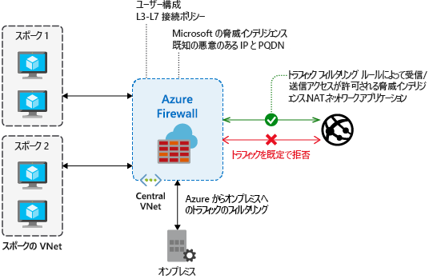

# Azure Firewall とは

Azure Firewall は、Azure Virtual Network リソースを保護するクラウドベースのマネージド ネットワーク セキュリティ サービスです。 組み込みの高可用性とクラウドの無制限のスケーラビリティを備えた、完全にステートフルなサービスとしてのファイアウォールです。

サブスクリプションと仮想ネットワークをまたいでアプリケーションとネットワークの接続ポリシーを一元的に作成、適用、記録できます。 Azure Firewall では、外部のファイアウォールが仮想ネットワークからのトラフィックを識別できるよう、仮想ネットワーク リソースに静的パブリック IP アドレスが使用されます。  サービスはログ記録と分析を行うために Azure Monitor と完全に統合されます。

Azure Firewall では次の機能が提供されます。

## 組み込みの高可用性

高可用性が組み込まれているため、追加のロード バランサーは必要なく、構成すべきものもありません。

## 可用性ゾーン

Azure Firewall は、可用性を高めるために、複数の Availability Zones にまたがるようにデプロイ時に構成できます。 Availability Zones を使用すると、可用性が高まり 99.99% のアップタイムが実現します。 詳細については、Azure Firewall の[サービス レベル アグリーメント (SLA)](https://azure.microsoft.com/support/legal/sla/azure-firewall/v1_0/) に関するページをご覧ください。 2 つ以上の Availability Zones を選択すると、稼働率 99.99% の SLA が提供されます。

サービス標準の 99.95% のSLA を使用して、近接性の理由から Azure Firewall を特定のゾーンに関連付けることもできます。

Availability Zones にデプロイされるファイアウォールについては追加のコストは発生しません。 ただし、Availability Zones に関連する受信および送信データ転送については追加のコストが発生します。 詳細については、「[帯域幅の料金詳細](https://azure.microsoft.com/pricing/details/bandwidth/)」をご覧ください。

Azure Firewall Availability Zones は、Availability Zones をサポートするリージョンで利用できます。 詳しくは、「[Azure の Availability Zones の概要](../availability-zones/az-overview.md#services-support-by-region)」をご覧ください。

> [!NOTE]
> Availability Zones は、デプロイ時にのみ構成できます。 既存のファイアウォールを構成して Availability Zones を含めることはできません。

Availability Zones の詳細については、「[Azure の Availability Zones の概要](../availability-zones/az-overview.md)」をご覧ください。

## クラウドによる無制限のスケーラビリティ

Azure Firewall では、必要に応じてスケールアップしてネットワーク トラフィック フローの変化に対応できるので、ピーク時のトラフィックを処理するために予算を立てる必要がありません。

## アプリケーションの FQDN のフィルタリング規則

ワイルド カードも含まれる完全修飾ドメイン名 (FQDN) の指定された一覧に、送信 HTTP/S トラフィックまたは Azure SQL トラフィック (プレビュー) を制限できます。 この機能に SSL 終了は必要ありません。

## ネットワーク トラフィックのフィルタリング規則

送信元と送信先の IP アドレス、ポート、プロトコルを基準として、"*許可*" または "*拒否*" のネットワーク フィルタリング規則を一元的に作成できます。 Azure Firewall は完全にステートフルであるため、各種の接続の正当なパケットを識別できます。 規則は、複数のサブスクリプションと仮想ネットワークにまたがって適用および記録されます。

## FQDN のタグ

FQDN のタグにより、ファイアウォール経由の既知の Azure サービスのネットワーク トラフィックを簡単に許可することができます。 たとえば、ファイアウォール経由の Windows Update のネットワーク トラフィックを許可したいとします。 アプリケーションの規則を作成して、Windows Update のタグを組み込みます。 これで、Windows Update からのネットワーク トラフィックをファイアウォール経由でフローできるようになります。

## サービス タグ

サービス タグは IP アドレス プレフィックスのグループを表し、セキュリティ規則の作成の複雑さを最小限に抑えるのに役立ちます。 独自のサービス タグを作成することも、タグ内に含まれる IP アドレスを指定することもできません。 サービス タグに含まれるアドレス プレフィックスの管理は Microsoft が行い、アドレスが変化するとサービス タグは自動的に更新されます。

## 脅威インテリジェンス

ファイアウォール用に脅威インテリジェンスベースのフィルター処理を有効にして、既知の悪意のある IP アドレスやドメインとの間のトラフィックの警告と拒否を行うことができます。 この IP アドレスとドメインのソースは、Microsoft の脅威インテリジェンス フィードです。

## 送信 SNAT サポート

仮想ネットワーク トラフィックの送信 IP アドレスはすべて Azure Firewall パブリック IP に変換されます (送信元ネットワーク アドレス変換)。 仮想ネットワークからインターネット上のリモートの送信先に向かうトラフィックを特定して許可できます。 宛先 IP が [IANA RFC 1918](https://tools.ietf.org/html/rfc1918) のプライベート IP 範囲である場合、Azure Firewall は SNAT を行いません。 組織でプライベート ネットワークに対してパブリック IP アドレス範囲を使用している場合、Azure Firewall は、SNAT を使用して、トラフィックのアドレスを AzureFirewallSubnet のいずれかのファイアウォール プライベート IP アドレスに変換します。

## 受信 DNAT のサポート

ファイアウォールのパブリック IP アドレスへの着信ネットワーク トラフィックは、変換され (宛先ネットワーク アドレス変換)、仮想ネットワークのプライベート IP アドレスでフィルター処理されます。

## 複数のパブリック IP アドレス

> [!IMPORTANT]
> Azure PowerShell、Azure CLI、REST、およびテンプレートで、複数のパブリック IP アドレスを持つ Azure Firewall を使用できます。 ポータルのユーザー インターフェイスは、段階的にリージョンに追加されており、ロールアウトが完了すればすべてのリージョンで利用できるようになります。

複数のパブリック IP アドレス (最大 100) をファイアウォールに関連付けることができます。

これにより、次のシナリオが実現します。

- **DNAT** - 複数の標準ポート インスタンスをバックエンド サーバーに変換できます。 たとえば、2 つのパブリック IP アドレスがある場合、両方の IP アドレス用の TCP ポート 3389 (RDP) を変換できます。
- **SNAT** -追加のポートを送信 SNAT 接続に対して使用でき、SNAT ポートが不足する可能性を低減できます。 現時点では、Azure Firewall は、接続に使用する送信元パブリック IP アドレスをランダムに選択します。 ネットワークにダウンストリーム フィルターがある場合、ファイアウォールに関連付けられているすべてのパブリック IP アドレスを許可する必要があります。

## Azure Monitor ログ記録

すべてのイベントは Azure Monitor と統合されます。そのため、ログをストレージ アカウントにアーカイブしたり、イベントをイベント ハブにストリーム配信したり、それらを Azure Monitor ログに送信したりできます。

## 既知の問題

Azure Firewall には、次の既知の問題があります。

|問題  |説明  |対応策  |
|---------|---------|---------|
TCP/UDP 以外のプロトコル (ICMP など) に関するネットワーク フィルタリング規則が、インターネットへのトラフィックで機能しない|TCP/UDP 以外のプロトコルに関するネットワーク フィルタリング規則は、パブリック IP アドレスへの SNAT で機能しません。 TCP/UDP 以外のプロトコルは、スポーク サブネットと VNet との間でサポートされます。|Azure Firewall では Standard Load Balancer が使用されます。[現在 Standard Load Balancer では、IP プロトコルの SNAT はサポートされていません](https://docs.microsoft.com/azure/load-balancer/load-balancer-standard-overview#limitations)。 Microsoft は、将来のリリースでこのシナリオに対応できるよう方法を模索しています。|
|PowerShell と CLI では ICMP がサポートされない|Azure PowerShell と CLI は、ネットワーク ルールの有効なプロトコルとして ICMP をサポートしていません。|それでも、ポータルと REST API を介して ICMP をプロトコルとして使用することが可能です。 近いうちに PowerShell と CLI に ICMP を追加するよう取り組んでいます。|
|FQDN タグで port:protocol を設定する必要がある|FQDN タグを使用するアプリケーション ルールには、port:protocol の定義が必要です。|port:protocol 値として、**https** を使用できます。 FQDN タグの使用時にこのフィールドを省略可能にするため、取り組みを進めています。|
|ファイアウォールを別のリソース グループまたはサブスクリプションへ移動することはサポートされていません|ファイアウォールを別のリソース グループまたはサブスクリプションへ移動することはサポートされていません。|この機能は今後サポートされる予定です。 ファイアウォールを別のリソース グループまたはサブスクリプションに移動するには、現在のインスタンスを削除して、新しいリソース グループまたはサブスクリプション内に再作成する必要があります。|
|ネットワークおよびアプリケーション ルールのポート範囲|上位のポートは管理および正常性プローブ用に予約されているため、ポートは 64,000 に制限されています。 |現在、この制限を緩和するように取り組んでいます。|
|脅威インテリジェンス アラートがマスクされることがある|アラートのみのモードに構成されている場合、送信フィルター処理用の宛先 80/443 のネットワーク ルールによって脅威インテリジェンス アラートがマスクされます。|アプリケーション ルールを使用して 80/443 の送信フィルター処理を作成します。 または、脅威インテリジェンス モードを **[Alert and Deny]\(アラートと拒否\)** に変更します。|
|Azure Firewall では名前解決に Azure DNS のみが使用される|Azure Firewall では、Azure DNS のみを使用して FQDN が解決されます。 カスタム DNS サーバーはサポートされていません。 他のサブネット上の DNS 解決への影響はありません。|現在、この制限を緩和するように取り組んでいます。|
|Azure Firewall SNAT/DNAT がプライベート IP 送信先で機能しない|Azure Firewall SNAT/DNAT のサポートは、インターネット エグレスまたはイングレスに制限されています。 現在、SNAT/DNAT はプライベート IP 送信先で機能しません。 たとえば、スポークからスポークです。|これは現在の制限です。|
|最初のパブリック IP の構成を削除できない|Azure Firewall の各パブリック IP アドレスは、"*IP 構成*" に割り当てられています。  最初の IP 構成はファイアウォールのデプロイ中に割り当てられ、通常、それにはファイアウォールのサブネットへの参照も含まれます (テンプレートのデプロイによって別に明示的に構成されていない場合)。 この IP 構成を削除するとファイアウォールの割り当てが解除されるため、削除できません。 ただし、ファイアウォールで使用できるパブリック IP アドレスが他に 1 つ以上ある場合は、この IP 構成に関連付けられているパブリック IP アドレスを変更または削除できます。|これは設計によるものです。|
|Availability Zones は、デプロイ時にのみ構成できます。|Availability Zones は、デプロイ時にのみ構成できます。 ファイアウォールがデプロイされた後、Availability Zones を構成することはできません。|これは設計によるものです。|
|受信接続での SNAT|DNAT に加えて、ファイアウォールのパブリック IP アドレスを使用した (受信) 接続は SNAT によっていずれかのファイアウォールのプライベート IP に変換されます。 対称的なルーティングを実現するために、現在このような要件が (アクティブ/アクティブ NVA に対しても) 適用されます。|HTTP/S の元の送信元を保持するには、[XFF](https://en.wikipedia.org/wiki/X-Forwarded-For) ヘッダーを使用することを検討します。 たとえば、ファイアウォールの直前に [Azure Front Door](../frontdoor/front-door-http-headers-protocol.md#front-door-service-to-backend) などのサービスを使用します。 Azure Front Door とチェーンの一部としてファイアウォールに WAF を追加することもできます。
|SQL の FQDN のフィルター処理がプロキシ モードでのみサポートされる (ポート 1433)|Azure SQL Database、Azure SQL Data Warehouse、Azure SQL Managed Instance の場合:  プレビュー期間中、SQL の FQDN のフィルター処理は、プロキシ モードでのみサポートされます (ポート 1433)。  Azure SQL IaaS の場合:  標準以外のポートを使っている場合は、アプリケーション ルールでそれらのポートを指定できます。|リダイレクト モードの SQL では (Azure 内から接続する場合の既定)、代わりに Azure Firewall ネットワーク ルールの一部として SQL サービス タグを使ってアクセスをフィルター処理できます。

## 次の手順

- [チュートリアル:Azure portal を使用して Azure Firewall をデプロイして構成する](tutorial-firewall-deploy-portal.md)
- [テンプレートを使用して Azure Firewall をデプロイする](deploy-template.md)
- [Azure Firewall のテスト環境を作成する](scripts/sample-create-firewall-test.md)
