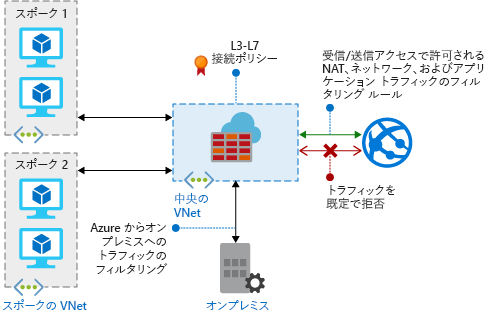

# Azure Firewall とは

Azure Firewall は、Azure Virtual Network リソースを保護するクラウドベースのマネージド ネットワーク セキュリティ サービスです。 これは、組み込みの高可用性とクラウドによる無制限のスケーラビリティを備えた、完全にステートフルなサービスとしてのファイアウォールです。 

サブスクリプションと仮想ネットワークをまたいでアプリケーションとネットワークの接続ポリシーを一元的に作成、適用、記録できます。 Azure Firewall では、外部のファイアウォールが仮想ネットワークからのトラフィックを識別できるよう、仮想ネットワーク リソースに静的パブリック IP アドレスが使用されます。  サービスはログ記録と分析を行うために Azure Monitor と完全に統合されます。

## 機能

Azure Firewall では次の機能が提供されます。

### 組み込みの高可用性
高可用性が組み込まれているため、ロード バランサーを追加する必要がなく、構成が必要なものはありません。

### クラウドによる無制限のスケーラビリティ 
Azure Firewall では、必要に応じてスケールアップしてネットワーク トラフィック フローの変化に対応できるので、ピーク時のトラフィックを処理するために予算を立てる必要がありません。

### アプリケーションの FQDN のフィルタリング規則

ワイルド カードが含まれた完全修飾ドメイン名 (FQDN) の指定した一覧に、送信 HTTP/S トラフィックを制限できます。 この機能に SSL 終了は必要ありません。

### ネットワーク トラフィックのフィルタリング規則

送信元と送信先の IP アドレス、ポート、プロトコルを基準として、"*許可*" または "*拒否*" のネットワーク フィルタリング規則を一元的に作成できます。 Azure Firewall は完全にステートフルであるため、各種の接続の正当なパケットを識別できます。 規則は、複数のサブスクリプションと仮想ネットワークにまたがって適用および記録されます。

### FQDN のタグ

FQDN のタグにより、ファイアウォール経由の既知の Azure サービスのネットワーク トラフィックを簡単に許可することができます。 たとえば、ファイアウォール経由の Windows Update のネットワーク トラフィックを許可したいとします。 アプリケーションの規則を作成して、Windows Update のタグを組み込みます。 これで、Windows Update からのネットワーク トラフィックをファイアウォール経由でフローできるようになります。

### 送信 SNAT サポート

仮想ネットワーク トラフィックの送信 IP アドレスはすべて Azure Firewall パブリック IP に変換されます (送信元ネットワーク アドレス変換)。 仮想ネットワークからインターネット上のリモートの送信先に向かうトラフィックを特定して許可できます。

### 受信 DNAT のサポート

ファイアウォールのパブリック IP アドレスへの着信ネットワーク トラフィックは、変換され (宛先ネットワーク アドレス変換)、仮想ネットワークのプライベート IP アドレスでフィルター処理されます。 

### Azure Monitor ログ記録

すべてのイベントは Azure Monitor と統合されます。そのため、ログをストレージ アカウントにアーカイブしたり、イベントをイベント ハブにストリーム配信したり、それらを Log Analytics に送信したりできます。

## 既知の問題

Azure Firewall には、次の既知の問題があります。

|問題  |説明  |対応策  |
|---------|---------|---------|
|Azure Security Center (ASC) Just-in-Time (JIT) 機能との競合|JIT を使用して仮想マシンへのアクセスが行われており、Azure Firewall に向かうユーザー定義ルートを備えたサブネットにその仮想マシンがある場合、ASC JIT は機能しません。 これは、非対称ルーティングの結果です。パケットは仮想マシン パブリック IP 経由で到着しますが (アクセスは JIT によって開かれた)、リターン パスはファイアウォール経由です。ファイアウォールでセッションが確立されていないため、パケットがファイアウォールによって破棄されます。|この問題を回避するには、ファイアウォールへのユーザー定義ルートがない別のサブネットに JIT 仮想マシンを配置します。|
|グローバル ピアリングを使用したハブとスポークがサポートされていない|ハブとスポークのモデルを使用しており、ある Azure リージョンにハブとファイアウォールがデプロイされており、スポークが別の Azure リージョンにある場合。 グローバル VNET ピアリング経由によるハブへの接続はサポートされていません。|これは設計によるものです。 詳細については、「[Azure サブスクリプションとサービスの制限、クォータ、制約](../azure-subscription-service-limits.md#azure-firewall-limits)」を参照してください。|
TCP/UDP 以外のプロトコル (ICMP など) に関するネットワーク フィルタリング規則が、インターネットへのトラフィックで機能しない|TCP/UDP 以外のプロトコルに関するネットワーク フィルタリング規則は、パブリック IP アドレスへの SNAT で機能しません。 TCP/UDP 以外のプロトコルは、スポーク サブネットと VNet との間でサポートされます。|Azure Firewall では Standard Load Balancer が使用されます。[現在 Standard Load Balancer では、IP プロトコルの SNAT はサポートされていません](https://docs.microsoft.com/azure/load-balancer/load-balancer-standard-overview#limitations)。 Microsoft は、将来のリリースでこのシナリオに対応できるよう方法を模索しています。|
|PowerShell と CLI では ICMP がサポートされない|Azure PowerShell と CLI は、ネットワーク ルールの有効なプロトコルとして ICMP をサポートしていません。|それでも、ポータルと REST API を介して、ICMP をプロトコルとして使用することが可能です。 近いうちに PowerShell と CLI に ICMP を追加するため、取り組みを進めています。|
|FQDN タグで port:protocol を設定する必要がある|FQDN タグを使用するアプリケーション ルールには、port:protocol の定義が必要です。|port:protocol 値として、**https** を使用できます。 FQDN タグが使用される場合にこのフィールドを省略可能にするため、取り組みを進めています。|
|ファイアウォールを別のリソース グループまたはサブスクリプションへ移動することはサポートされていません|ファイアウォールを別のリソース グループまたはサブスクリプションへ移動することはサポートされていません。|この機能は今後サポートされる予定です。 ファイアウォールを別のリソース グループまたはサブスクリプションに移動するには、現在のインスタンスを削除して、新しいリソース グループまたはサブスクリプション内に再作成する必要があります。|
|ネットワークおよびアプリケーション ルールのポート範囲|上位のポートは管理および正常性プローブ用に予約されているため、ポートは 64,000 に制限されています。 |現在、この制限を緩和するように取り組んでいます。|
|

## 次の手順

- [チュートリアル:Azure portal を使用して Azure Firewall をデプロイして構成する](tutorial-firewall-deploy-portal.md)
- [テンプレートを使用して Azure Firewall をデプロイする](deploy-template.md)
- [Azure Firewall のテスト環境を作成する](scripts/sample-create-firewall-test.md)

