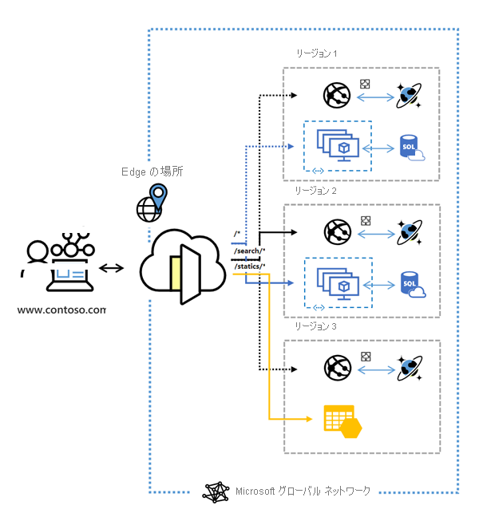

# Azure Front Door とは

> [!IMPORTANT]
> このドキュメントは、Azure Front Door を対象としています。 Azure Front Door Standard/Premium (プレビュー) については、 [こちら](standard-premium/overview.md)を参照してください。

Azure Front Door は、Microsoft グローバル エッジ ネットワークを使用して、セキュリティで保護された高速でスケーラビリティの高い Web アプリを作成するためのスケーラブルなグローバル エントリ ポイントです。 Front Door を使用すると、グローバルなコンシューマー アプリケーションやエンタープライズ アプリケーションを、Azure を介して世界中のユーザーに発信するコンテンツを備えた、堅牢で高パフォーマンスのパーソナライズされた最新のアプリケーションに変えることができます。

  

Front Door は、レイヤー 7 (HTTP/HTTPS 層) で動作し、スプリット TCP と Microsoft のグローバル ネットワークでエニーキャスト プロトコルを使用してグローバル接続を向上させます。 Front Door では、使用するルーティング方法に基づいて、最も高速で最も可用性が高いアプリケーション バックエンドにクライアント要求を確実にルーティングできます。 アプリケーション バックエンドは、Azure の内部または外部でホストされている、インターネットに公開されたサービスです。 Front Door には、さまざまなアプリケーション ニーズと自動フェールオーバーのシナリオに対応する、さまざまな[トラフィック ルーティング方法](front-door-routing-methods.md)と[バックエンドの正常性監視オプション](front-door-health-probes.md)が用意されています。 [Traffic Manager](../traffic-manager/traffic-manager-overview.md) と同様に、Front Door には、Azure リージョン全体の障害を含め、障害に対する回復性があります。

>[!NOTE]
> Azure では、ユーザーのシナリオのためにフル マネージドの負荷分散ソリューションのスイートが提供されます。 
> * DNS ベースのグローバルなルーティングを検討中であり、トランスポート層セキュリティ (TLS) プロトコル終端 ("SSL オフロード") の要件や、HTTP/HTTPS 要求ごとまたはアプリケーション層の処理の要件が **ない** 場合は、[Traffic Manager](../traffic-manager/traffic-manager-overview.md) を検討してください。 
> * アプリケーション レイヤーでリージョン内のサーバー間の負荷分散が必要な場合は、[Application Gateway](../application-gateway/overview.md) に関するページを参照してください。
> * ネットワーク層の負荷分散を行う場合は、[Load Balancer](../load-balancer/load-balancer-overview.md) を検討してください。 
> 
> 実際のエンド ツー エンドのシナリオでは、必要に応じてこれらのソリューションを組み合わせると役に立つことがあります。
> Azure の負荷分散オプションの比較については、「[Azure の負荷分散オプションの概要](/azure/architecture/guide/technology-choices/load-balancing-overview)」を参照してください。

## Azure Front Door を使用する理由

Front Door を使用して、動的 Web アプリと静的コンテンツを構築、運用、スケールアウトできます。 Front Door では、迅速なグローバル フェールオーバーによって、トップレベルのエンド ユーザー パフォーマンスと信頼性に最適化することで、Web トラフィックのグローバル ルーティングを定義、管理、監視できます。

Front Door に含まれる主な機能は次のとおりです。

* **[スプリット TCP](front-door-routing-architecture.md#splittcp)** ベースの **[エニーキャスト プロトコル](front-door-routing-architecture.md#anycast)** を使用したアプリケーションのパフォーマンスの高速化。

* インテリジェントな **[正常性プローブ](front-door-health-probes.md)** によるバックエンド リソースの監視。

*  要求の **[URL パス ベース](front-door-route-matching.md)** のルーティング。

* 効率的なアプリケーション インフラストラクチャを実現する、複数の Web サイトのホスティング。 

* Cookie ベースの **[セッション アフィニティ](front-door-routing-methods.md#affinity)** 。

* **[SSL オフロード](front-door-custom-domain-https.md)** と証明書管理。

* 独自の **[カスタム ドメイン](front-door-custom-domain.md)** の定義。 

* **[Web Application Firewall (WAF)](../web-application-firewall/overview.md)** が統合されたアプリケーション セキュリティ。

* **[URL リダイレクト](front-door-url-redirect.md)** による、HTTPS への HTTP トラフィックのリダイレクト｡

* **[URL 書き換え](front-door-url-rewrite.md)** によるカスタム転送パス。

* エンド ツー エンドの IPv6 接続と **[HTTP/2 プロトコル](front-door-http2.md)** のネイティブ サポート。

## 価格

料金情報については、[Front Door の価格](https://azure.microsoft.com/pricing/details/frontdoor/)に関するページを参照してください。 「[Azure Front Door の SLA](https://azure.microsoft.com/en-us/support/legal/sla/frontdoor/v1_0/)」を参照してください。

## 新機能

RSS フィードを購読し、[Azure の更新情報](https://azure.microsoft.com/updates/?category=networking&query=Azure%20Front%20Door)ページで、最新の Azure Front Door 機能の更新を確認します。

## 次のステップ

- [フロント ドアの作成](quickstart-create-front-door.md)方法について学習します。
- [Front Door のしくみ](front-door-routing-architecture.md)について学習します。
