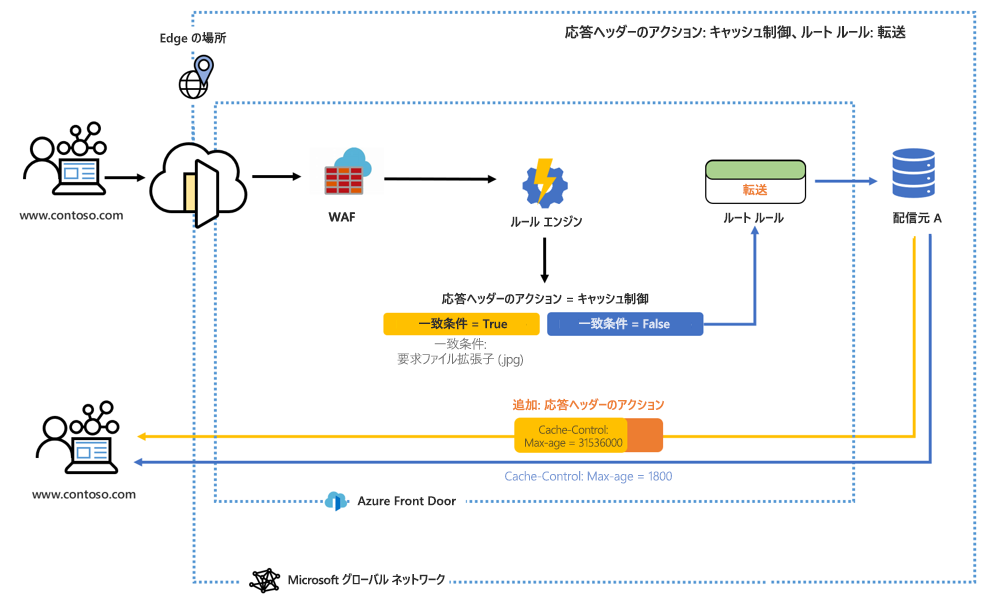
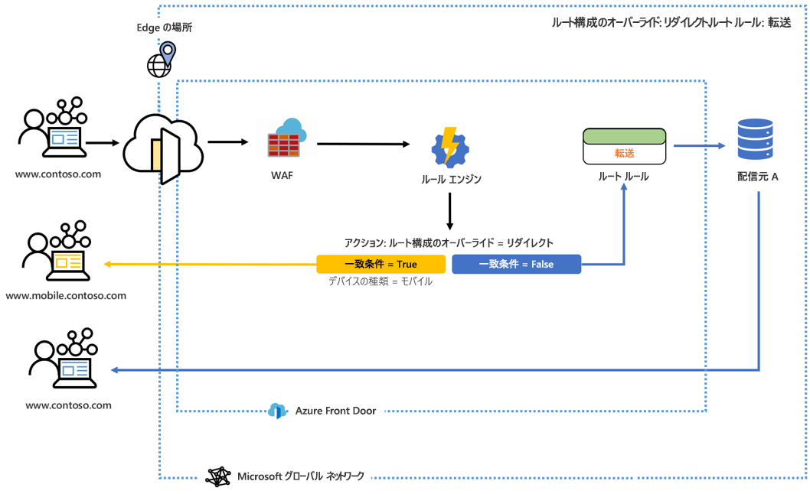

# Azure Front Door のルール エンジンとは 

ルール エンジンにより、HTTP 要求をエッジでどのように処理するかをカスタマイズし、Web アプリケーションの動作をより細かく制御することができます。 Azure Front Door のルール エンジンは、次のようないくつかの重要な機能で構成されます。

- ヘッダーベースのルーティング - 要求ヘッダー、Cookie、およびクエリ文字列の内容のパターンに基づいて要求をルーティングします。
- パラメーターベースのルーティング - 後置引数、クエリ文字列、Cookie、要求メソッドなどの一連の一致条件を利用して、HTTP 要求パラメーターに基づいて要求をルーティングします。 
- ルート構成のオーバーライド: 
    - リダイレクト機能を使用して 301/302/307/308 リダイレクトをクライアントに返し、新しいホスト名、パス、およびプロトコルにリダイレクトします。 
    - 転送機能を使用して、従来のリダイレクトを行わずに要求 URL パスを書き換え、構成されているバックエンド プール内の適切なバックエンドに要求を転送します。 
    - キャッシュ構成をカスタマイズし、一致条件に基づいてルートを転送からキャッシュに動的に変更します。 

> [!IMPORTANT]
> このパブリック プレビュー版はサービス レベル アグリーメントなしで提供されています。運用環境のワークロードに使用することは避けてください。 特定の機能はサポート対象ではなく、機能が制限されることがあるか、Azure の場所によっては利用できない場合があります。 詳しくは、「[Microsoft Azure プレビューの追加使用条件](https://azure.microsoft.com/support/legal/preview-supplemental-terms/)」をご覧ください。
>

## Architecture 

ルール エンジンは、エッジで要求を処理します。 ルール エンジンが構成されている場合、要求が Front Door エンドポイントに到達すると、最初に WAF が実行され、次にフロントエンドまたはドメインに関連付けられたルール エンジン構成が実行されます。 ルール エンジン構成が実行されることは、親のルーティング規則が既に一致していることを意味します。 ルール エンジン構成内の各ルールのアクションのすべてが実行されるかどうかは、そのルール内のすべての一致条件が満たされることが条件になります。 要求がルール エンジン構成内のどの条件にも一致しない場合は、既定のルーティング規則が実行されます。 

たとえば、次の構成のルール エンジンは、一致条件が満たされた場合にキャッシュ制御の max-age (最大有効期間) を変更する応答ヘッダーを追加するように構成されています。 

別の例として、このルール エンジンは、一致条件であるデバイスの種類が true の場合にサイトのモバイル バージョンにユーザーを送るように構成されています。 

どちらの例でも、一致条件が満たされない場合は、指定されたルート ルールが実行されます。 

## 用語 

AFD ルール エンジンでは、ルールのセットで構成される一連のルール エンジン構成を作成できます。 ここでは、ルール エンジンを構成する際に役立つ用語をいくつか紹介します。 

- "*ルール エンジン構成*": 単一のルート ルールに適用されるルールのセット。 各構成は 5 つのルールに制限されます。 最大 10 個の構成を作成できます。 
- "*ルール エンジン ルール*": 最大 10 個の一致条件と 5 個のアクションで構成されるルール。
- "*一致条件*": 受信要求を解析するために使用できる一致条件は多数あります。 1 つのルールに最大 10 個の一致条件を含めることができます。 一致条件は、**AND** 演算子で評価されます。 一致条件の完全な一覧については、[こちら](front-door-rules-engine-match-conditions.md)を参照してください。 
- *アクション*:アクションは、受信要求に対する処理を示します。現在使用できるアクションは、要求または応答ヘッダー アクション、転送、リダイレクト、および書き換えです。 1 つのルールに最大 5 つのアクションを含めることができます。ただし、1 つのルールに含めることができるルート構成オーバーライドは 1 つのみです。  アクションの完全な一覧については、[こちら](front-door-rules-engine-actions.md)を参照してください。

## 次のステップ

- 最初の[ルール エンジン構成](front-door-tutorial-rules-engine.md)を設定する方法について学習します。 
- [フロント ドアの作成](quickstart-create-front-door.md)方法について学習します。
- [Front Door のしくみ](front-door-routing-architecture.md)について学習します。
