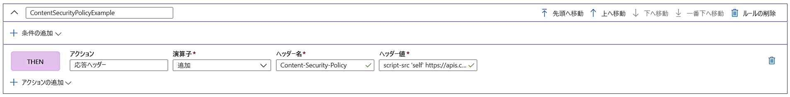

# チュートリアル:ルール エンジンを使用してセキュリティ ヘッダーを追加する

このチュートリアルでは、HTTP Strict-Transport-Security (HSTS)、X-XSS-Protection、Content-Security-Policy、X-Frame-Options など、ブラウザーベースの脆弱性を防ぐためにセキュリティ ヘッダーを実装する方法について説明します。 セキュリティベースの属性は、Cookie でも定義できます。

次の例は、ルール エンジン構成が関連付けられているルートに定義されているパスに一致するあらゆる受信要求に Content-Security-Policy ヘッダーを追加する方法を示しています。 ここでは、信頼できるサイト **https://apiphany.portal.azure-api.net** からのスクリプトにのみ、アプリケーション上での実行を許可します。

このチュートリアルでは、以下の内容を学習します。
> [!div class="checklist"]
> - ルール エンジン内で Content-Security-Policy を構成する。

## 前提条件

* このチュートリアルの手順を完了するには、最初に Front Door を作成する必要があります。 詳細については、「[クイック スタート: Front Door の作成](quickstart-create-front-door.md)」を参照してください。
* ルール エンジン機能を初めて使用する場合は、[ルール エンジンの設定方法](front-door-tutorial-rules-engine.md)に関するページをご確認ください。

## Azure portal で Content-Security-Policy ヘッダーを追加する

1. **[追加]** をクリックして新しいルールを追加します。 ルールに名前を付け、 **[アクションの追加]** 、 **[応答ヘッダー]** の順にクリックします。

1. [演算子] を **[追加]** に設定し、このルートへのすべての受信要求に応答としてこのヘッダーを追加します。

1. ヘッダー名として「**Content-Security-Policy**」を追加し、このヘッダーで受け入れる値を定義します。 このシナリオでは、 *"script-src 'self' https://apiphany.portal.azure-api.net"* を選択します。

   > [!NOTE]
   > ヘッダー値は 128 文字までに制限されています。

1. 構成に追加するルールをすべて追加したら、必ず優先ルートに移動し、ルール エンジン構成をルート ルールに関連付けてください。 この手順は、ルールを機能させるために必須です。 

> [!NOTE]
> このシナリオでは、ルールに[一致条件](front-door-rules-engine-match-conditions.md)を追加しませんでした。 ルート ルールに定義されているパスに一致する受信要求にはすべて、このルールが適用されます。 これらの要求の一部にのみ適用する場合、必ず特定の **一致条件** をこのルールに追加してください。

## リソースをクリーンアップする

ここまでの手順では、ルール エンジンを使用してセキュリティ ヘッダーを構成しました。 ルールが不要になった場合は、[ルールの削除] をクリックして削除することができます。

:::image type="content" source="./media/front-door-rules-engine/rules-engine-delete-rule.png" alt-text="[ルールの削除]":::

## 次の手順

Front Door の Web Application Firewall を構成する方法については、次のチュートリアルに進んでください。

> [!div class="nextstepaction"]
> [Web アプリケーション ファイアウォールと Front Door](front-door-waf.md)
