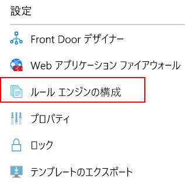
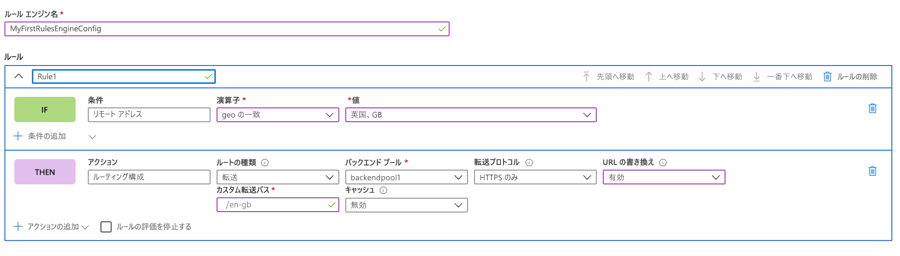
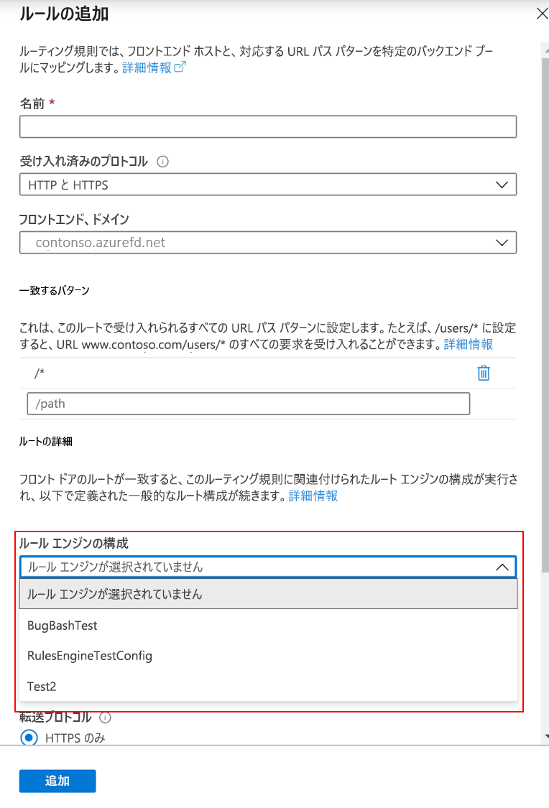

# <a name="configure-your-rules-engine"></a>ルール エンジンを構成する 

> [!IMPORTANT]
> このパブリック プレビュー版はサービス レベル アグリーメントなしで提供されています。運用環境のワークロードに使用することは避けてください。 特定の機能はサポート対象ではなく、機能が制限されることがあるか、Azure の場所によっては利用できない場合があります。 詳しくは、「[Microsoft Azure プレビューの追加使用条件](https://azure.microsoft.com/support/legal/preview-supplemental-terms/)」をご覧ください。
>

## <a name="configure-rules-engine-in-azure-portal"></a>Azure portal でルール エンジンを構成する 
1. ルール エンジン構成を作成する前に、[フロント ドアを作成](quickstart-create-front-door.md)します。

2. お使いのフロント ドア リソース内で、 **[設定]** に移動し、 **[Rule Engine configuration]\(ルール エンジン構成\)** を選択します。 **[追加]** をクリックし、構成に名前を付けて、最初のルール エンジン構成の作成を開始します。 



3. **[ルールの追加]** をクリックして、最初のルールを作成します。 次に、 **[条件の追加]** または **[アクションの追加]** をクリックして、ルールを定義できます。 
    
    *注:*
    - 条件またはアクションをルールから削除するには、特定の条件またはアクションの右側にあるごみ箱を使用します。
    - すべての受信トラフィックに適用されるルールを作成するには、条件を指定しないでください。 
    - 最初の一致条件が満たされたときにルールの評価を停止するには、 **[Stop evaluating rule]\(ルールの評価を停止する\)** をオンにします。 



4. [Move up]\(上に移動\)、[Move down]\(下に移動\)、および [Move to top]\(最上位に移動\) ボタンを使用して、構成内のルールの優先度を決定します。 優先度は昇順です。つまり、最初に表示されるルールが最も重要なルールです。 

5. 1 つまたは複数のルールを作成したら、 **[保存]** を押します。 このアクションにより、ルール エンジン構成が作成されます。 

6. 1 つまたは複数の構成を作成したら、ルール エンジン構成をルート ルールに関連付けます。 1 つの構成を複数のルート ルールに適用できますが、1 つのルート ルールに含めることができるルール エンジン構成は 1 つだけです。 関連付けを行うには、 **[Front Door デザイナー]**  >  **[Route rules]\(ルート ルール\)** にアクセスします。 ルール エンジン構成を追加するルート ルールを選択し、 **[ルートの詳細]**  >  **[Rules engine configuration]\(ルール エンジン構成\)** に移動して、関連付ける構成を選択します。 




## <a name="configure-rules-engine-in-azure-cli"></a>Azure CLI でルール エンジンを構成する 

1. [Azure CLI](https://docs.microsoft.com/cli/azure/install-azure-cli?view=azure-cli-latest) をまだインストールしていない場合はインストールします。 "front-door" 拡張機能を追加します:- az extension add --name front-door。 次に、ログインし、お使いのサブスクリプションに切り替えます: az account set --subscription <名前または ID>。 

2. 最初に、ルール エンジンを作成します。この例は、1 つのヘッダーベースのアクションと 1 つの一致条件を持つ 1 つのルールを示しています。 

```azurecli-interactive
az network front-door rules-engine rule create -f {front_door} -g {resource_group} --rules-engine-name {rules_engine} --name {rule1} --priority 1 --action-type RequestHeader --header-action Overwrite --header-name Rewrite --header-value True --match-variable RequestFilenameExtension --operator Contains --match-values jpg png --transforms Lowercase
```

2.  すべてのルールを一覧表示します。 

```azurecli-interactive
az network front-door rules-engine rule list -f {front_door} -g {rg} --name {rules_engine}
```

3.  転送ルートのオーバーライド アクションを追加します。 

```azurecli-interactive
az network front-door rules-engine rule action add -f {front_door} -g {rg} --rules-engine-name {rules_engine} --name {rule1} --action-type ForwardRouteOverride --backend-pool {backend_pool_name} --caching Disabled
```

4.  ルール内のすべてのアクションを一覧表示します。 

```azurecli-interactive
az network front-door rules-engine rule action list -f {front_door} -g {rg} -r {rules_engine} --name {rule1}
```

5. ルール エンジン構成をルーティング規則にリンクします。  

```azurecli-interactive
az network front-door routing-rule update -g {rg} -f {front_door} -n {routing_rule_name} --rules-engine {rules_engine}
```

6. ルール エンジンのリンクを解除します。 

```azurecli-interactive
az network front-door routing-rule update -g {rg} -f {front_door} -n {routing_rule_name} --remove rulesEngine # case sensitive word ‘rulesEngine’
```

詳細については、AFD ルール エンジン コマンドの完全な一覧を[こちら](https://docs.microsoft.com/cli/azure/ext/front-door/network/front-door/rules-engine?view=azure-cli-latest)で確認してください。   

## <a name="next-steps"></a>次のステップ

- [AFD ルール エンジン](front-door-rules-engine.md)の詳細を確認します。 
- [フロント ドアの作成](quickstart-create-front-door.md)方法について学習します。
- [Front Door のしくみ](front-door-routing-architecture.md)について学習します。
- AFD ルール エンジンの [CLI リファレンス](https://docs.microsoft.com/cli/azure/ext/front-door/network/front-door/rules-engine?view=azure-cli-latest)で詳細を確認します。 
- AFD ルール エンジンの [PowerShell リファレンス](https://docs.microsoft.com/powershell/module/az.frontdoor/?view=azps-3.8.0)で詳細を確認します。 
