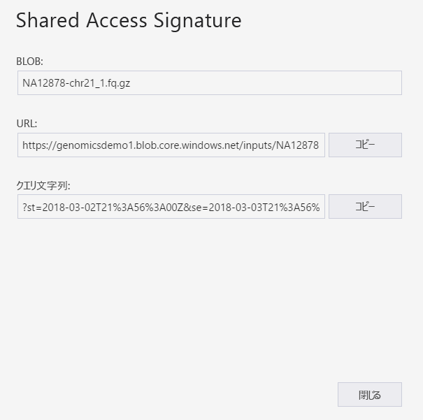
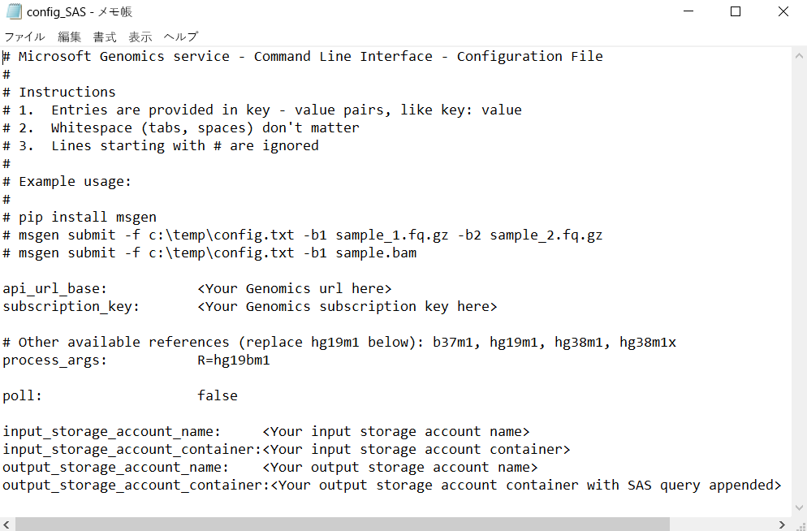

# <a name="submit-a-workflow-to-microsoft-genomics-using-a-sas-instead-of-a-storage-account-key"></a>ストレージ アカウント キーの代わりに SAS を使用してワークフローを Microsoft Genomics に送信する 

この記事では、ストレージ アカウント キーの代わりに [Shared Access Signature (SAS) ](https://docs.microsoft.com/azure/storage/common/storage-dotnet-shared-access-signature-part-1)を含む config.txt ファイルを使用して Microsoft Genomics サービスにワークフローを送信する方法について説明します。 この機能は、config.txt ファイルでストレージ アカウント キーを表示できる状態にすることにセキュリティ上の懸念がある場合に役立ちます。 

この記事では、`msgen` クライアントを既にインストールして実行していること、また、Azure Storage の使用方法をよく理解していることを前提とします。 提供されたサンプル データを使用してワークフローを正常に送信したら、この記事を読み進める準備は完了です。 

## <a name="what-is-a-sas"></a>SAS とは
[shared access signature (SAS)](https://docs.microsoft.com/azure/storage/common/storage-dotnet-shared-access-signature-part-1) を使用すると、ストレージ アカウント内のリソースへの委任アクセスが可能になります。 SAS を使用すると、アカウント キーを共有することなく、ストレージ アカウントのリソースへのアクセス権を付与できます。 これは、アプリケーションで Shared Access Signature を使用する際の重要な点になります。SAS は、アカウント キーを損なうことなく、ストレージ リソースを共有する安全な方法です。

Microsoft Genomics に送信する SAS は、入力ファイルと出力ファイルが格納されている BLOB またはコンテナーにのみアクセス権を委任する[サービス SAS](https://docs.microsoft.com/rest/api/storageservices/Constructing-a-Service-SAS) にする必要があります。 

サービスレベルの Shared Access Signature (SAS) トークンの URI は、SAS がアクセス権を委任するリソースの URI と、それに続く SAS トークンで構成されます。 SAS トークンは、SAS を認証するために必要なすべての情報を含むクエリ文字列です。リソース、アクセスに使用できるアクセス許可、署名が有効な期間、要求を送信できる送信元の IP アドレスまたはアドレス範囲、要求に使用できるプロトコル、その要求に関連付けられているアクセス ポリシー識別子 (省略可能)、および署名自体が含まれます。 

## <a name="sas-needed-for-submitting-a-workflow-to-the-microsoft-genomics-service"></a>ワークフローを Microsoft Genomics サービスに送信するために必要な SAS
Microsoft Genomics サービスに送信される各ワークフローには、入力ファイルごとに 1 つと出力コンテナーに 1 つという 2 つ以上の SAS トークンが必要です。

入力ファイルの SAS には、次のプロパティが必要です。
 - 範囲 (アカウント、コンテナー、BLOB): BLOB
 - 有効期限: 今から 48 時間後
 - アクセス許可: 読み取り

出力コンテナーの SAS には、次のプロパティが必要です。
 - 範囲 (アカウント、コンテナー、BLOB): コンテナー
 - 有効期限: 今から 48 時間後
 - アクセス許可: 読み取り、書き込み、削除


## <a name="create-a-sas-for-the-input-files-and-the-output-container"></a>入力ファイルと出力コンテナー用の SAS を作成する
SAS トークンを作成するには、Azure Storage Explorer を使用する方法とプログラムを使用する方法という 2 つの方法があります。  コードを作成する場合は、自力で SAS を構築するか、好みの言語で Azure Storage SDK を使用する方法があります。


### <a name="set-up-create-a-sas-using-azure-storage-explorer"></a>設定: Azure Storage Explorer を使用して SAS を作成する

[Azure Storage Explorer](https://azure.microsoft.com/features/storage-explorer/) は、Azure Storage に保存したリソースを管理するツールです。  Azure Storage Explorer の使用方法については、[こちら](https://docs.microsoft.com/azure/vs-azure-tools-storage-manage-with-storage-explorer)を参照してください。

入力ファイルの SAS は特定の入力ファイル (BLOB) に範囲を設定する必要があります。 SAS トークンを作成するには、[こちらの手順](https://docs.microsoft.com/azure/storage/blobs/storage-quickstart-blobs-storage-explorer)に従ってください。 SAS を作成すると、クエリ文字列を含む完全な URL とクエリ文字列が表示され、画面からコピーできるようになります。

 


### <a name="set-up-create-a-sas-programmatically"></a>設定: SAS をプログラムで作成する

Azure Storage SDK を使用して SAS を作成する場合は、[.NET](https://docs.microsoft.com/azure/storage/common/storage-dotnet-shared-access-signature-part-1)、[Python](https://docs.microsoft.com/azure/storage/blobs/storage-python-how-to-use-blob-storage)、[Node.js](https://docs.microsoft.com/azure/storage/blobs/storage-nodejs-how-to-use-blob-storage) など、複数の言語について説明されている既存のドキュメントを参照してください。 

SDK を使用せずに SAS を作成するには、SAS の認証に必要なすべての情報を含め、SAS クエリ文字列を直接構築することができます。 これらの[手順](https://docs.microsoft.com/rest/api/storageservices/constructing-a-service-sas)では、SAS クエリ文字列のコンポーネントとその構成方法について詳しく説明されています。 必要な SAS 署名は、これらの[手順](https://docs.microsoft.com/rest/api/storageservices/service-sas-examples)で説明されているように、BLOB/コンテナー認証情報を使用して HMAC を生成して作成されます。


## <a name="add-the-sas-to-the-configtxt-file"></a>SAS を config.txt ファイルに追加する
SAS クエリ文字列を使用して Microsoft Genomics サービスを介してワークフローを実行するには、config.txt ファイルを編集して config.txt ファイルからキーを削除します。 次に、図のように、(`?` で始まる) SAS クエリ文字列を出力コンテナー名に追加します。 



Microsoft Genomics Python クライアントを使用し、次のコマンドで、各入力 BLOB 名に対応する SAS クエリ文字列を付加してワークフローを送信します。

```python
msgen submit -f [full path to your config file] -b1 [name of your first paired end read file, SAS query string appended] -b2 [name of your second paired end read file, SAS query string appended]
```

### <a name="if-adding-the-input-file-names-to-the-configtxt-file"></a>入力ファイル名を config.txt ファイルに追加する場合
代わりに、次のように SAS クエリ トークンを付加して、対になった終了読み取りファイルの名前を config.txt ファイルに直接追加することができます。


この場合、Microsoft Genomics Python クライアントを使用して、`-b1` および `-b2` コマンドを省略し、次のコマンドでワークフローを送信します。

```python
msgen submit -f [full path to your config file] 
```

## <a name="next-steps"></a>次のステップ
この記事では、アカウント キーの代わりに SAS トークンを使用して、`msgen` Python クライアントを介して Microsoft Genomics サービスにワークフローを送信しました。 ワークフローの送信と Microsoft Genomics サービスで使用できるその他のコマンド関連の詳細情報については、[FAQ](frequently-asked-questions-genomics.md) に関するページを参照してください。 
