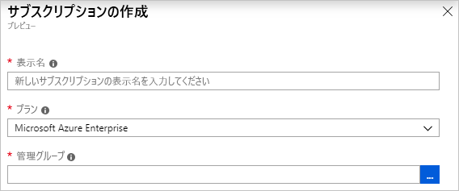
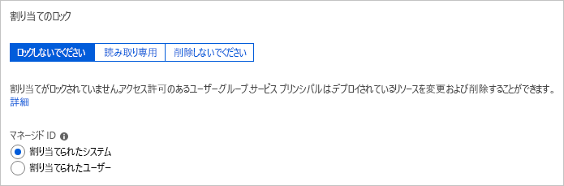

# <a name="quickstart-define-and-assign-a-blueprint-in-the-portal"></a>クイック スタート:ポータル内でブループリントを定義して割り当てる

ブループリントの作成方法と割り当て方法を学習すると、Azure Resource Manager テンプレート、ポリシー、セキュリティなどに基づいて、再利用可能かつ短時間でデプロイできる構成を開発するための共通パターンを定義することができます。 このチュートリアルでは、Azure Blueprints を使用して、ご自分の組織内のブループリントの作成、発行、および割り当てに関連する一般的ないくつかのタスクを実行する方法について説明します。 具体的なタスクは次のとおりです。

> [!div class="checklist"]
> - 新しいブループリントを作成し、サポートされているさまざまな成果物を追加する
> - まだ**下書き**の既存のブループリントを変更する
> - 割り当ての準備が完了しているブループリントに**発行済み**とマークを付ける
> - ブループリントを既存のサブスクリプションに割り当てる
> - 割り当てられたブループリントの状態と進行状況を確認する
> - サブスクリプションに割り当てられているブループリントを削除する

Azure サブスクリプションをお持ちでない場合は、開始する前に [無料アカウント](https://azure.microsoft.com/free) を作成してください。

## <a name="create-a-blueprint"></a>ブループリントを作成する

コンプライアンスの標準的なパターンを定義する最初のステップは、使用可能なリソースからブループリントを作成することです。 この例では、**MyBlueprint** という名前の新しいブループリントを作成して、サブスクリプションのロールとポリシーの割り当てを構成します。 その後、新しいリソース グループを追加し、Resource Manager テンプレートと、新しいリソース グループに対するロールの割り当てを作成します。

1. 左側のウィンドウにある **[すべてのサービス]** を選択します。 **[ブループリント]** を探して選択します。

1. 左側のページから **[ブループリントの定義]** を選択し、ページ上部にある **[+ ブループリントの作成]** ボタンを選択します。

   または、 **[開始]** ページから **[作成]** を選択して、ブループリントの作成に直接移動します。

   ![[ブループリントの定義] ページからブループリントを作成する](./media/create-blueprint-portal/create-blueprint-button.png)

1. **MyBlueprint** など、**ブルー プリント名**を指定します (最長 48 文字でアルファベットと数字を使用でき、スペースと特殊文字は使用できません)。 ここでは、 **[ブループリントの説明]** を空白のままにしておきます。

1. **[定義の場所]** ボックスで、右側にある省略記号を選択し、ブループリントを保存する[管理グループ](../management-groups/overview.md)またはサブスクリプションを選択して、 **[選択]** を選択します。

1. 情報が正しいことを確認します。 **[ブループリントの名前]** と **[定義の場所]** フィールドは後で変更することはできません。 次に、 **[次へ:成果物]** 、またはページの上部の **[成果物]** タブをクリックします。

1. サブスクリプション レベルでロールの割り当てを追加します。

   1. **[サブスクリプション]** の下にある **[+ 成果物の追加]** 行を選択します。 ブラウザーの右側に **[成果物の追加]** ウィンドウが開きます。

   1. **[成果物の種類]** として **[ロールの割り当て]** を選択します。

   1. **[役割]** で **[共同作成者]** を選択します。 **[ユーザー、アプリ、グループの追加]** ボックスと、動的パラメーターを示すチェック ボックスはそのままにします。

   1. **[追加]** を選択して、この成果物をブループリントに追加します。

   

   > [!NOTE]
   > ほとんどの成果物はパラメーターをサポートします。 ブループリントの作成時に値を割り当てられるパラメーターは、"*静的パラメーター*" です。 ブループリントの割り当て時に割り当てられるパラメーターは、"*動的パラメーター*" です。 詳細については、「[ブループリントのパラメーター](./concepts/parameters.md)」に関する記事をご覧ください。

1. サブスクリプション レベルでポリシーの割り当てを追加します。

   1. ロールの割り当て成果物の下の **[+ 成果物の追加]** 行を選択します。

   1. **[成果物の種類]** として **[ポリシーの割り当て]** を選択します。

   1. **[種類]** を **[組み込み]** に変更します。 **[検索]** に「**タグ**」と入力します。

   1. **[検索]** をクリックしてフィルター処理を実行します。 **[タグとその既定値のリソース グループへの追加]** を選択します。

   1. **[追加]** を選択して、この成果物をブループリントに追加します。

1. ポリシーの割り当ての **[タグとその既定値のリソース グループへの追加]** の行を選択します。

1. ブループリント定義の一部として成果物にパラメーターを指定するためのウィンドウが開き、このブループリントに基づいてすべての割り当てのパラメーター (静的パラメーター) を、割り当て時のパラメーター (動的パラメーター) の代わりに設定できます。 この例では、ブループリントの割り当て時には動的パラメーターを使用するため、既定値はそのままにしておいて **[キャンセル]** を選択します。

1. サブスクリプション レベルでリソース グループを追加します。

   1. **[サブスクリプション]** の下にある **[+ 成果物の追加]** 行を選択します。

   1. **[成果物の種類]** として **[リソース グループ]** を選択します。

   1. **[成果物の表示名]** 、 **[リソース グループ名]** 、 **[場所]** ボックスは空白のままにしておきますが、各パラメーターのプロパティのチェック ボックスはオンにしてそれらを動的パラメーターにします。

   1. **[追加]** を選択して、この成果物をブループリントに追加します。

1. リソース グループにテンプレートを追加します。

   1. **[ResourceGroup]** エントリの下にある **[+ 成果物の追加]** 行を選択します。

   1. **[成果物の種類]** に **[Azure Resource Manager テンプレート]** を選択し、 **[成果物の表示名]** を **StorageAccount** に設定し、 **[説明]** は空白のままにします。

   1. エディター ボックスの **[テンプレート]** タブで、次の Resource Manager テンプレートを貼り付けます。
      テンプレートを貼り付けた後、 **[パラメーター]** タブを選択し、テンプレート パラメーター **storageAccountType** と **location** が検出されたことを確認します。 各パラメーターは自動的に検出されて設定されていますが、動的パラメーターとして構成されています。

      > [!IMPORTANT]
      > テンプレートをインポートする場合は、ファイルが JSON のみであり、HTML が含まれていないことを確認します。 GitHub 上の URL をポイントしている場合、GitHub 上で表示するために HTML でラップされたものではなく、純粋な JSON ファイルを取得するために **RAW** を選択したことを確認します。 インポートしたテンプレートが純粋な JSON でない場合は、エラーが発生します。

      ```json
      {
          "$schema": "https://schema.management.azure.com/schemas/2015-01-01/deploymentTemplate.json#",
          "contentVersion": "1.0.0.0",
          "parameters": {
              "storageAccountType": {
                  "type": "string",
                  "defaultValue": "Standard_LRS",
                  "allowedValues": [
                      "Standard_LRS",
                      "Standard_GRS",
                      "Standard_ZRS",
                      "Premium_LRS"
                  ],
                  "metadata": {
                      "description": "Storage Account type"
                  }
              },
              "location": {
                  "type": "string",
                  "defaultValue": "[resourceGroup().location]",
                  "metadata": {
                      "description": "Location for all resources."
                  }
              }
          },
          "variables": {
              "storageAccountName": "[concat('store', uniquestring(resourceGroup().id))]"
          },
          "resources": [{
              "type": "Microsoft.Storage/storageAccounts",
              "name": "[variables('storageAccountName')]",
              "location": "[parameters('location')]",
              "apiVersion": "2018-07-01",
              "sku": {
                  "name": "[parameters('storageAccountType')]"
              },
              "kind": "StorageV2",
              "properties": {}
          }],
          "outputs": {
              "storageAccountName": {
                  "type": "string",
                  "value": "[variables('storageAccountName')]"
              }
          }
      }
      ```

   1. **storageAccountType** のチェック ボックスをオフにし、Resource Manager テンプレートの **allowedValues** の下に組み込んだ値のみがドロップダウン リストに含まれていることを確認します。 ボックスに再びチェックを付けて、動的パラメーターに戻します。

   1. **[追加]** を選択して、この成果物をブループリントに追加します。

   

1. 完成したブループリントは次のようになります。 各成果物の **[パラメーター]** 列に " **_x_ 個中 _y_ 個のパラメーターが入力されました**" と表示されていることを確認します。 動的パラメーターは、ブループリントのそれぞれの割り当て時に設定されます。

   

1. 計画したすべての成果物が追加されたら、ページの下部にある **[下書きの保存]** を選択します。

## <a name="edit-a-blueprint"></a>ブループリントを編集する

「[ブループリントを作成する](#create-a-blueprint)」では、説明を指定せず、ロールの割り当ても新しいリソース グループに追加しませんでした。 次の手順に従って両方を修正できます。

1. 左側のページから **[ブループリントの定義]** を選択します。

1. ブループリントの一覧で、以前に作成したものを右クリックし、 **[ブループリントの編集]** を選択します。

1. **[ブループリントの説明]** に、ブループリントとそれを構成する成果物に関する情報を入力します。 この場合、たとえば次のように入力します。「**このブループリントは、サブスクリプションにタグのポリシーとロールの割り当てを設定し、リソース グループを作成し、リソース テンプレートとロールの割り当てをそのリソース グループにデプロイします**」。

1. **[次へ :成果物]** 、またはページの上部の **[成果物]** タブをクリックします。

1. リソース グループにロールの割り当てを追加します。

   1. **[ResourceGroup]** エントリの直下にある **[+ 成果物の追加]** 行を選択します。

   1. **[成果物の種類]** として **[ロールの割り当て]** を選択します。

   1. **[ロール]** の下で **[所有者]** を選択し、 **[ユーザー、アプリ、グループの追加]** ボックスの下のチェック ボックスをオフにします。

   1. 追加するユーザー、アプリ、またはグループを検索して選択します。 この成果物では、このブルー プリントのすべての割り当てにおいて同じ設定の静的パラメーターが使用されます。

   e. **[追加]** を選択して、この成果物をブループリントに追加します。

   

1. 完成したブループリントは次のようになります。 新しく追加したロールの割り当てに "**1 個中 1 個のパラメーターが入力されました**" と表示されていることを確認します。 これは、静的パラメーターであることを意味します。

   

1. 更新されたので、 **[下書きの保存]** を選択します。

## <a name="publish-a-blueprint"></a>ブループリントを発行する

これで計画済みのすべての成果物がブループリントに追加されたので、発行することができます。
発行すると、ブループリントをサブスクリプションに割り当てることができるようになります。

1. 左側のページから **[ブループリントの定義]** を選択します。

1. ブループリントの一覧で、以前に作成したものを右クリックし、 **[ブループリントを発行する]** を選択します。

1. 開いたウィンドウで、**v1** などの **[バージョン]** (アルファベット、数字、およびハイフンで構成され、最大長が 20 文字) を指定します。 必要に応じて、 **[変更に関するメモ]** に「**最初の発行**」などのテキストを入力します。

1. ページの下部にある **[発行]** を選択します。

## <a name="assign-a-blueprint"></a>ブループリントを割り当てる

ブループリントが発行されたら、サブスクリプションに割り当てることができます。 作成したブループリントを、ご自分の管理グループ階層下のいずれかのサブスクリプションに割り当てます。 ブループリントは、サブスクリプションに保存された場合、そのサブスクリプションに対してのみ割り当てることができます。

1. 左側のページから **[ブループリントの定義]** を選択します。

1. ブループリントの一覧で、前に作成したものを右クリックし (または省略記号を選択し)、 **[ブループリントの割り当て]** を選択します。

1. **[ブループリントの割り当て]** ページにある **[サブスクリプション]** ドロップダウン リストから、このブループリントをデプロイするサブスクリプションを選択します。

   [Azure の課金](../../billing/index.md)に関するページで利用可能なサポートされるエンタープライズ オファリングがある場合、 **[サブスクリプション]** ボックスの下の **[新規作成]** リンクがアクティブになります。 次の手順に従います。

   1. 既存のサブスクリプションを選択する代わりに、 **[新規作成]** リンクを選択して新しいサブスクリプションを作成します。

   1. 新しいサブスクリプションの **[表示名]** を指定します。

   1. ドロップダウン リストから使用可能な **[オファー]** を選択します。

   1. 省略記号を使用して、サブスクリプションをその子にする[管理グループ](../management-groups/index.md)を選択します。

   1. ページの下部にある **[作成]** を選択します。

   

   > [!IMPORTANT]
   > **[作成]** を選択するとすぐに、新しいサブスクリプションが作成されます。

   > [!NOTE]
   > 選択した各サブスクリプションに対して割り当てが作成されます。 1 つのサブスクリプションの割り当てを後で変更できます。その際に、選択した他のサブスクリプションが強制的に変更されることはありません。

1. **[割り当て名]** で、この割り当ての一意名を指定します。

1. **[場所]** で、マネージド ID およびサブスクリプションのデプロイ オブジェクトを作成するリージョンを選択します。 Azure Blueprint は、この管理対象 ID を使用して、割り当てられたブループリント内にすべての成果物をデプロイします。 詳細については、[Azure リソースのマネージド ID の概要](../../active-directory/managed-identities-azure-resources/overview.md)に関するページをご覧ください。

1. **[ブループリント定義バージョン]** ドロップダウンは **v1** エントリの**発行済み**バージョンが選択されているままにしておきます (既定は最新の発行済みバージョンです)。

1. **[割り当てのロック]** は、 **[ロックしない]** の既定のままにします。 詳細については、[ブループリント リソースのロック](./concepts/resource-locking.md)に関するページを参照してください。

   

1. **[マネージド ID]** の下で、既定の **[システム割り当て済み]** をそのままにします。

1. サブスクリプション レベルのロールの割り当ての **[ユーザー グループまたはアプリケーション名] :共同作成者**では、ユーザー、アプリ、またはグループを検索します。

1. サブスクリプション レベルのポリシーの割り当てでは、 **[タグ名]** を **CostCenter** に、 **[タグ値]** を **ContosoIT** に設定します。

1. **[ResourceGroup]** には、 **[名前]** として **StorageAccount** を、 **[場所]** として **[米国東部 2]** をドロップダウン リストから指定します。

   > [!NOTE]
   > ブループリントの定義時にリソース グループに追加した各成果物については、その成果物は一緒にデプロイするリソース グループまたはオブジェクトと共にデプロイすることが予定されます。
   > 割り当てで定義されるパラメーターを取らないかまたはパラメーターがない成果物は、コンテキスト情報のみを目的として一覧に記載されます。

1. Azure Resource Manager テンプレート **StorageAccount** で、 **[storageAccountType]** パラメーターに **[Standard_GRS]** を選択します。

1. ページの下部の情報ボックスを読み、 **[割り当て]** を選択します。

## <a name="track-deployment-of-a-blueprint"></a>ブループリントのデプロイを追跡する

ブループリントが 1 つ以上のサブスクリプションに割り当てられると、次の 2 つの処理が行われます。

- ブループリントは各サブスクリプションの **[割り当てられたブループリント]** ページに追加されます。
- ブループリントによって定義されたすべての成果物をデプロイするプロセスが開始されます。

これでブループリントがサブスクリプションに割り当てられたので、デプロイの進行状況を確認します。

1. 左側のページから **[割り当てられたブループリント]** を選択します。

1. ブループリントの一覧で、以前に割り当てたものを右クリックして、 **[割り当ての詳細を表示する]** を選択します。

   ![[割り当てられたブループリント] ページの [割り当ての詳細を表示する]](./media/create-blueprint-portal/view-assignment-details.png)

1. **[ブループリント割り当て]** ページで、すべての成果物が正常にデプロイされたことと、デプロイ時にエラーが発生しなかったことを確認します。 エラーが発生した場合は、原因を特定する手順について、[ブループリントのトラブルシューティング](./troubleshoot/general.md)に関するページを参照してください。

## <a name="unassign-a-blueprint"></a>ブループリントを割り当て解除する

不要になったブループリントの割り当ては、サブスクリプションから削除してください。 ブループリントは、パターンやポリシー、設計が更新された、より新しいブループリントに置き換えられていることがあります。 ブループリントを削除しても、そのブループリントの一部として割り当てられている成果物は後に残されます。 ブループリントの割り当てを解除するには、次の手順に従います。

1. 左側のページから **[割り当てられたブループリント]** を選択します。

1. ブループリントの一覧で、割り当てを解除するブループリントを選択します。 次に、ページの上部にある **[ブループリントの割り当て解除]** ボタンを選択します。

1. 確認メッセージを読み、 **[OK]** を選択します。

## <a name="delete-a-blueprint"></a>ブループリントを削除する

1. 左側のページから **[ブループリントの定義]** を選択します。

1. 削除するブループリントを右クリックし、 **[ブループリントを削除する]** を選択します。 次に、確認のダイアログ ボックスで **[はい]** を選択します。

> [!NOTE]
> この方法でブループリントを削除すると、選択したブループリントの発行済みのバージョンもすべて削除されます。
> 1 つのバージョンを削除するには、ブループリントを開き、 **[公開済みバージョン]** タブを選択し、削除するバージョンを選択して、 **[このバージョンを削除する]** を選択します。 また、ブループリントは、そのブループリントの定義のブループリント割り当てをすべて削除するまで削除できません。

## <a name="next-steps"></a>次の手順

- [ブループリントのライフサイクル](./concepts/lifecycle.md)を参照する。
- [静的および動的パラメーター](./concepts/parameters.md)の使用方法を理解する。
- [ブループリントの優先順位](./concepts/sequencing-order.md)のカスタマイズを参照する。
- [ブループリントのリソース ロック](./concepts/resource-locking.md)の使用方法を調べる。
- [既存の割り当ての更新](./how-to/update-existing-assignments.md)方法を参照する。
- ブループリントの割り当て時の問題を[一般的なトラブルシューティング](./troubleshoot/general.md)で解決する。