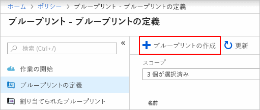
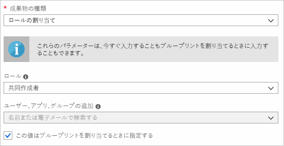
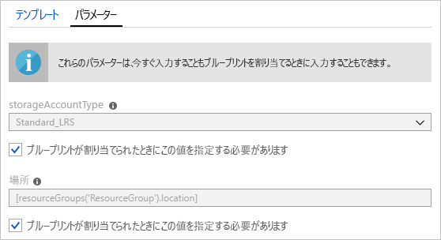
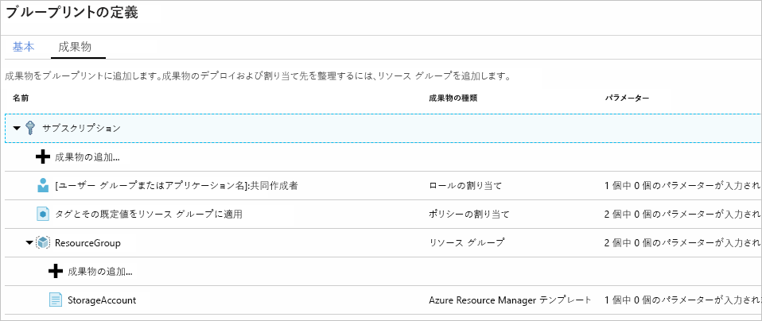
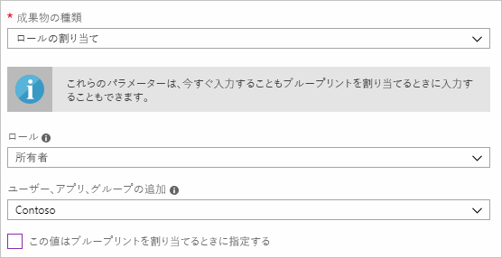
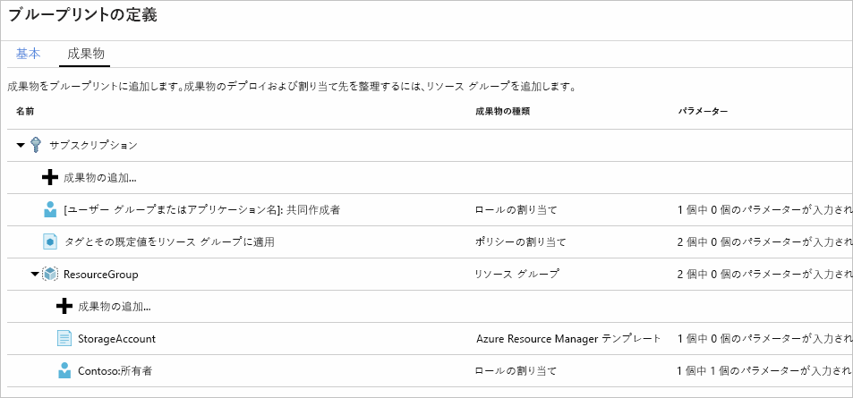
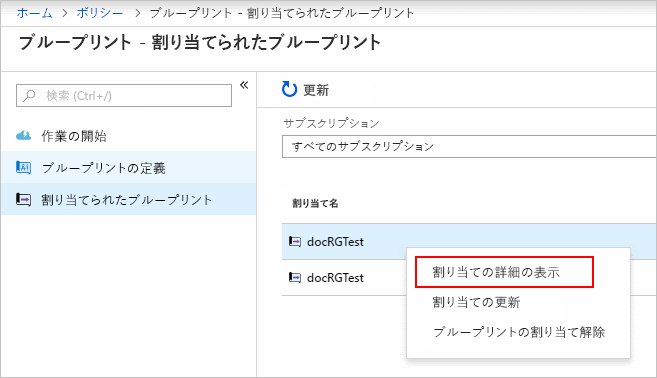

# <a name="define-and-assign-an-azure-blueprint-in-the-portal"></a>ポータルで Azure ブループリントを定義して割り当てる

ブループリントの作成方法と割り当て方法について説明します。Resource Manager テンプレート、ポリシー、セキュリティなどに基づいて、再利用可能かつ短時間でデプロイできる構成を開発するための共通パターンを、ブループリントを通じて定義することができます。 このチュートリアルでは、組織内のブループリントの作成、発行、および割り当てに関連する一般的ないくつかのタスクを実行するための、Azure Blueprint の使用方法について説明します。

> [!div class="checklist"]
> - 新しいブループリントを作成し、サポートされているさまざまな成果物を追加する
> - まだ**下書き**の既存のブループリントを変更する
> - 割り当ての準備が完了しているブループリントに**発行済み**とマークを付ける
> - ブループリントを既存のサブスクリプションに割り当てる
> - 割り当てられたブループリントの状態と進行状況を確認する
> - サブスクリプションに割り当てられているブループリントを削除する

Azure サブスクリプションをお持ちでない場合は、開始する前に [無料アカウント](https://azure.microsoft.com/free) を作成してください。

## <a name="create-a-blueprint"></a>ブループリントを作成する

コンプライアンスの標準的なパターンを定義する最初のステップは、使用可能なリソースからブループリントを作成することです。 この例では、'MyBlueprint' という名前の新しいブループリントを作成して、サブスクリプションのロールとポリシーの割り当てを構成し、新しいリソース グループを追加し、新しいリソース グループの Resource Manager テンプレートとロールの割り当てを作成します。

1. **[すべてのサービス]** をクリックし、左側のウィンドウで **[ポリシー]** を検索して選択します。 **[ポリシー]** ページで **[ブループリント]** をクリックします。

1. 左側のページから **[ブループリントの定義]** をクリックし、ページ上部にある **[+ ブループリントの作成]** ボタンをクリックします。

   - または、**[開始]** ページから **[作成]** をクリックして、ブループリントの作成に直接移動します。

   

1. 'MyBlueprint' などの**ブループリントの名前**をブループリントに指定します (文字と数字で構成し、最大 48 文字で、スペースと特殊文字は使用しない)。**[ブループリントの説明]** はこの時点では空白のままにしておきます。  **[定義の場所]** ボックスで、右側にある省略記号をクリックして、ブループリントを保存する[管理グループ](../management-groups/overview.md)を選択し、**[選択]** をクリックします。

   > [!NOTE]
   > ブループリントの定義は、管理グループにのみ保存できます。 最初の管理グループを作成するには、[次の手順](../management-groups/create.md)に従います。

1. 情報が正しいことを確認します (**[ブループリントの名前]** と **[定義場所]** フィールドは後で変更することはできません)。ページの下部にある **[次へ:成果物]** またはページの上部にある **[成果物]** タブをクリックします。

1. サブスクリプションでロールの割り当てを追加します。**[サブスクリプション]** の下の **[+ 成果物の追加]** 行を左クリックすると、ブラウザーの右側に [成果物の追加] ウィンドウが開きます。 _[成果物の種類]_ に [ロールの割り当て] を選択します。 _[ロール]_ から [共同作成者] を選択して、_[ユーザー、アプリまたはグループの追加]_ フィールドは**動的パラメーター**を示すチェックボックスをオンのままにします。 **[追加]** をクリックして、この成果物をブループリントに追加します。

   

   > [!NOTE]
   > ほとんどの_成果物_はパラメーターをサポートします。 ブループリントの作成時に値を割り当てられるパラメーターは、**静的パラメーター**です。 ブループリントの割り当て時に割り当てられるパラメーターは、**動的パラメーター**です。 詳細については、「[ブループリントのパラメーター](./concepts/parameters.md)」に関する記事をご覧ください。

1. サブスクリプションでポリシーの割り当てを追加します。**[サブスクリプション]** の直下にある **[+ 成果物の追加...]** 行を左クリックします。 _[成果物の種類]_ に [ポリシーの割り当て] を選択します。 _[種類]_ を '組み込み' に変更し、_[検索]_ に 'タグ' を入力します。 _[検索]_ をクリックしてフィルター処理を実行します。 [タグとその既定値をリソース グループに適用] をクリックして選択します。 **[追加]** をクリックして、この成果物をブループリントに追加します。

1. ポリシーの割り当ての [タグとその既定値をリソース グループに適用] の行をクリックします。 ブループリント定義の一部として成果物にパラメーターを指定するためのウィンドウが開き、このブループリントに基づいてすべての割り当てのパラメーター (**静的パラメーター**) を、割り当て時のパラメーター (**動的パラメーター**) の代わりに設定できます。 この例では、ブループリントの割り当て時には**動的パラメーター**を使用するため、既定値はそのままにしておいて **[キャンセル]** をクリックします。

1. サブスクリプションでリソース グループを追加します。**[サブスクリプション]** の下にある **[+ 成果物の追加...]** 行を左クリックします。 _[成果物の種類]_ に 'リソース グループ' を選択します。 _[リソース グループ名]_ と _[場所]_ フィールドは空白のままにしておきますが、各プロパティがそれらを**動的パラメーター**とするようにチェックボックスはオンになっていることを確認します。 **[追加]** をクリックして、この成果物をブループリントに追加します。

1. リソース グループにテンプレートを追加します。**[リソース グループ]** エントリの直下にある **[+ 成果物の追加...]** を左クリックします。 _[成果物の種類]_ に 'Azure Resource Manager テンプレート' を選択し、_[成果物の表示名]_ は 'StorageAccount' に設定し、_[説明]_ は空白のままにします。 エディター ボックスの **[テンプレート]** タブで、次の Resource Manager テンプレートを貼り付けます。 テンプレートを貼り付けた後、**[パラメーター]** タブをクリックして、テンプレート パラメーター **storageAccountType** と既定値 **Standard_LRS** が自動的に検出されて設定されており、**動的パラメーター**として構成されていることを確認します。 チェックボックスのチェックを外し、ドロップダウンで **allowedValues** の下に Resource Manager テンプレートで組み込んだ値のみが含まれていることを確認します。 ボックスに再びチェックを付けて、**動的パラメーター**に戻します。 **[追加]** をクリックして、この成果物をブループリントに追加します。

   > [!IMPORTANT]
   > テンプレートをインポートする場合は、ファイルが JSON のみであり、HTML が含まれていないことを確認します。 GitHub 上の URL をポイントしている場合、GitHub で表示するために HTML でラップされたものではなく、純粋な JSON ファイルを取得するために **RAW** をクリックしていることを確認します。 インポートしたテンプレートが純粋な JSON でない場合は、エラーが発生します。

   ```json
   {
       "$schema": "https://schema.management.azure.com/schemas/2015-01-01/deploymentTemplate.json#",
       "contentVersion": "1.0.0.0",
       "parameters": {
           "storageAccountType": {
               "type": "string",
               "defaultValue": "Standard_LRS",
               "allowedValues": [
                   "Standard_LRS",
                   "Standard_GRS",
                   "Standard_ZRS",
                   "Premium_LRS"
               ],
               "metadata": {
                   "description": "Storage Account type"
               }
           }
       },
       "variables": {
           "storageAccountName": "[concat(uniquestring(resourceGroup().id), 'standardsa')]"
       },
       "resources": [{
           "type": "Microsoft.Storage/storageAccounts",
           "name": "[variables('storageAccountName')]",
           "apiVersion": "2016-01-01",
           "location": "[resourceGroup().location]",
           "sku": {
               "name": "[parameters('storageAccountType')]"
           },
           "kind": "Storage",
           "properties": {}
       }],
       "outputs": {
           "storageAccountName": {
               "type": "string",
               "value": "[variables('storageAccountName')]"
           }
       }
   }
   ```

   

1. 完成したブループリントは次のようになります。 各成果物の _[パラメーター]_ 列に '_x_ / _y_ パラメーターが設定されました' があることを確認します。 **動的パラメーター**は、ブループリントのそれぞれの割り当て時に設定されます。

   

1. 計画したすべての成果物が追加されたら、ページの下部にある **[下書きの保存]** をクリックします。

## <a name="edit-a-blueprint"></a>ブループリントを編集する

「[ブループリントを作成する](#create-a-blueprint)」では、説明は指定されず、ロールの割り当ても新しいリソース グループに追加されませんでした。 どちらも、次の手順に従って解決できます。

1. 左側のページから **[ブループリントの定義]** を選択します。

1. ブループリントの一覧で、以前に作成したものを右クリックし、**[ブループリントの編集]** を選択します。

1. **[ブループリントの説明]** に、ブルー プリントとそれを構成する成果物に関する情報を入力します。  この場合、たとえば次のように入力します。「このブループリントは、サブスクリプションにタグのポリシーとロールの割り当てを設定し、リソース グループを作成し、リソース テンプレートとロールの割り当てをそのリソース グループにデプロイします」。

1. ページの下部の **[次へ:成果物]**、またはページの上部の **[成果物]** タブをクリックします。

1. リソース グループの下でロールの割り当てを追加します。**[リソース グループ]** エントリの直下にある **[+ 成果物の追加...]** 行を左クリックします。 _[成果物の種類]_ に [ロールの割り当て] を選択します。 _[ロール]_ に [所有者] を選択して、_[ユーザー、アプリまたはグループの追加]_ フィールドのチェック ボックスをオフにし、追加するユーザー、アプリまたはグループを検索して選択します。 この成果物では、このブルー プリントのすべての割り当てにおいて同じ設定の**静的パラメーター**が使用されます。 **[追加]** をクリックして、この成果物をブループリントに追加します。

   

1. 完成したブループリントは次のようになります。 新しく追加したロールの割り当てが、**[1 / 1 のパラメーターが設定されました]** と示している、つまり**静的パラメーター**であることを確認します。

   

1. 更新されたので、**[下書きの保存]** をクリックします。

## <a name="publish-a-blueprint"></a>ブループリントを発行する

これで計画済みのすべての成果物がブループリントに追加されたので、発行することができます。
発行すると、サブスクリプションに割り当てられて使用できるようになります。

1. 左側のページから **[ブループリントの定義]** を選択します。

1. ブループリントの一覧で、以前に作成したものを右クリックし、**[ブループリントの発行]** を選択します。

1. 開かれたダイアログ ボックスで、"v1" などの **[バージョン]** (文字、数字、およびハイフンで構成され、最大長が 20 文字) と、"最初の発行" などの **[変更ノート]** (省略可能) を入力します。

1. ページの下部にある **[発行]** をクリックします。

## <a name="assign-a-blueprint"></a>ブループリントを割り当てる

ブループリントが発行されたら、サブスクリプションに割り当てることができます。 作成したブループリントを管理グループ階層内のいずれかのサブスクリプションに割り当てます。

1. 左側のページから **[ブループリントの定義]** を選択します。

1. ブループリントの一覧で、以前作成したものを右クリックして (または省略記号ボタンを左クリックして)、**[ブループリントの割り当て]** を選択します。

1. **[ブループリントの割り当て]** ページで、このブループリントをデプロイするサブスクリプションを、**[サブスクリプション]** ドロップダウンから選択します。

   > [!NOTE]
   > 選択した各サブスクリプションに対して割り当てが作成され、選択したサブスクリプションの残りの部分に変更を強制することがなく、1 つのサブスクリプションの割り当てを後で変更できるようになります。

1. **[割り当て済みの名前]** に、この割り当ての一意の名前を指定します。

1. **[場所]** では、管理対象 ID を作成するリージョンを選択します。 Azure Blueprint は、この管理対象 ID を使用して、割り当てられたブループリント内にすべての成果物をデプロイします。 詳細については、[Azure リソースの管理対象 ID の概要](../../active-directory/managed-identities-azure-resources/overview.md)に関するページをご覧ください。

1. 'v1' エントリの **[発行済み]** バージョンの **[ブループリント定義バージョン]** ドロップダウンはそのままにしておきます (既定は最新の**発行済み**バージョンです)。

1. **[割り当てのロック]** は、**[ロックしない]** の既定のままにします。 詳細については、[ブループリント リソースのロック](./concepts/resource-locking.md)に関するページを参照してください。

1. サブスクリプション レベルのロールの割り当ての **[ユーザー グループまたはアプリケーション名] :共同作成者**では、ユーザー、アプリ、またはグループを検索します。

1. サブスクリプション レベルのポリシーの割り当てでは、**[タグ名]** を 'CostCenter' に、**[タグ値]** を 'ContosoIT' に設定します。

1. [リソース グループ] には、**[名前]** として 'StorageAccount' を、**[場所]** として 'East US 2' をドロップダウンリストから指定します。

   > [!NOTE]
   > ブループリントの定義時にリソース グループの下に追加された成果物ごとに、その成果物は一緒にデプロイするリソース グループまたはオブジェクトと共にデプロイされます。 割り当てで定義されるパラメーターを取らないかまたはパラメーターがない成果物は、コンテキスト情報のみを目的として一覧に記載されます。

1. Azure Resource Manager テンプレート 'StorageAccount' で、**storageAccountType** パラメーターに 'Standard_GRS' を選択します。

1. ページの下部の情報ボックスを読み、**[割り当て]** をクリックします。

## <a name="track-deployment-of-a-blueprint"></a>ブループリントのデプロイを追跡する

ブループリントが 1 つ以上のサブスクリプションに割り当てられると、次の 2 つの処理が行われます。

- ブループリントは割り当てられるサブスクリプションごとに **[割り当てられてたブループリント]** ページに追加されます。
- ブループリントによって定義されたすべての成果物をデプロイするプロセスが開始されます。

これでブループリントはサブスクリプションに割り当てられたので、デプロイの進行状況を確認します。

1. 左側のページから **[割り当てられたブループリント]** を選択します。

1. ブループリントの一覧で、以前に割り当てたものを右クリックして、**[割り当ての詳細を表示する]** を選択します。

   

1. **[デプロイの詳細]** ページで、すべての成果物が正常にデプロイされていることと、デプロイ時にエラーが発生していないことを確認します。 エラーが発生した場合は、原因を判別する手順について、[ブループリントのトラブルシューティング](./troubleshoot/general.md)に関するページを参照してください。

## <a name="unassign-a-blueprint"></a>ブループリントを割り当て解除する

不要になったブループリントの割り当ては、サブスクリプションから削除してください。 ブループリントは、パターンやポリシー、設計が更新された、より新しいブループリントに置き換えられていることがあります。 ブループリントを削除しても、そのブループリントの一部として割り当てられている成果物は後に残されます。 ブループリントの割り当てを解除するには、次の手順に従います。

1. 左側のページから **[割り当てられたブループリント]** を選択します。

1. ブループリントの一覧で、割り当てを解除するブループリントを選択して、ページの上部にある **[ブループリントの割り当てを解除]** ボタンをクリックします。

1. 確認メッセージを読み、**[OK]** をクリックします。

## <a name="delete-a-blueprint"></a>ブループリントを削除する

1. 左側のページから **[ブループリントの定義]** を選択します。

1. 削除するブループリントを右クリックし、**[ブループリントを削除する]** を選択し、次に確認ダイアログ ボックスで **[はい]** をクリックします。

> [!NOTE]
> このメソッドでブループリントを削除すると、選択したブループリントの**発行済みのバージョン**もすべて削除されます。 1 つのバージョンを削除するには、ブループリントを開き、**[発行済みのバージョン]** タブをクリックし、削除するバージョンを選択してクリックし、**[このバージョンを削除する]** をクリックします。 また、割り当てがあるブループリントは、そのすべてのブループリントの割り当てが削除されるまでは削除できません。

## <a name="next-steps"></a>次の手順

- [ブループリントのライフサイクル](./concepts/lifecycle.md)を参照する
- [静的および動的パラメーター](./concepts/parameters.md)の使用方法を理解する
- [ブループリントの優先順位](./concepts/sequencing-order.md)のカスタマイズを参照する
- [ブループリントのリソース ロック](./concepts/resource-locking.md)の使用方法を調べる
- [既存の割り当ての更新](./how-to/update-existing-assignments.md)方法を参照する
- ブループリントの割り当て時の問題を[一般的なトラブルシューティング](./troubleshoot/general.md)で解決する
