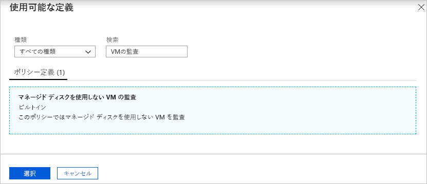
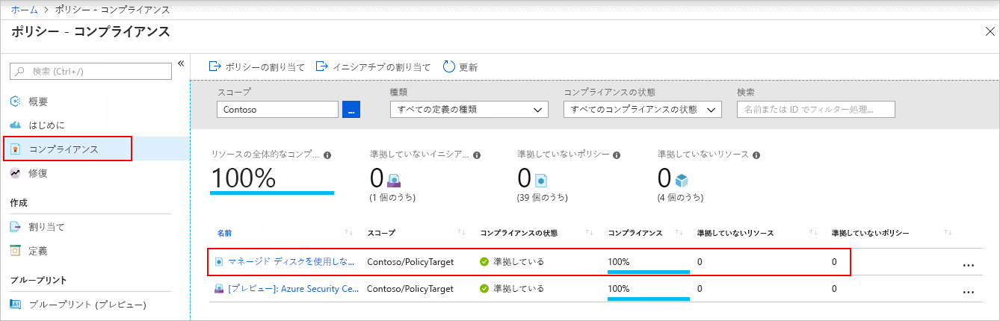
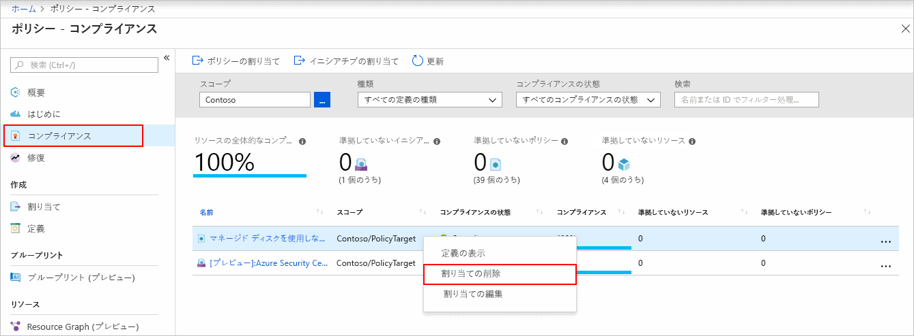

# クイック スタート:準拠していないリソースを識別するためのポリシー割り当てを作成する

Azure のコンプライアンスを理解する第一歩は、リソースの状態を特定することです。
このクイックスタートでは、ポリシーの割り当てを作成して、マネージド ディスクを使用していない仮想マシンを特定するプロセスについて順を追って説明します。

このプロセスを終了すると、マネージド ディスクを使用していない仮想マシンを適切に特定できるようになります。 これらはポリシーの割り当てに "_準拠していません_"。

## 前提条件

Azure サブスクリプションをお持ちでない場合は、開始する前に[無料](https://azure.microsoft.com/free/)アカウントを作成してください。

## ポリシー割り当てを作成する

このクイック スタートでは、ポリシーの割り当てを作成し、"_Managed Disks を使用していない VM の監査_" ポリシー定義を割り当てます。

1. Azure portal 上で **[すべてのサービス]** をクリックし、 **[ポリシー]** を検索して選択し、Azure Policy サービスを起動します。

   ![[すべてのサービス] で [ポリシー] を検索する](./media/assign-policy-portal/search-policy.png)

1. Azure Policy ページの左側にある **[割り当て]** を選択します。 割り当ては、特定のスコープ内で実行するように割り当てられたポリシーです。

   ![ポリシーの概要ページから [割り当て] ページを選択する](./media/assign-policy-portal/select-assignments.png)

1. **[ポリシー - 割り当て]** ページの上部で **[ポリシーの割り当て]** を選択します。

   ![[割り当て] ページでポリシー定義を割り当てる](./media/assign-policy-portal/select-assign-policy.png)

1. **[ポリシーの割り当て]** ページで、 **[スコープ]** を選択します。その際、省略記号をクリックし、管理グループまたはサブスクリプションを選択します。 任意でリソース グループを選択します。 スコープによって、ポリシー割り当てを強制するリソースまたはリソースのグループが決まります。 次に、 **[スコープ]** ページの下部にある **[選択]** をクリックします。

   この例では、**Contoso** サブスクリプションを使用しています。 お客様によってサブスクリプションは異なります。

1. リソースは**スコープ**に基づいて除外できます。 **除外**は**スコープ**のレベルよりも 1 つ下のレベルで開始されます。 **除外**は省略可能です。ここでは空のまま残してください。

1. **[ポリシー定義]** の省略記号を選択して、使用可能な定義の一覧を開きます。 Azure Policy に組み込まれているポリシー定義を使用できます。 次のようなさまざまな定義を利用できます。

   - タグとその値を強制
   - タグとその値を適用
   - SQL Server バージョン 12.0 が必要

   使用できる組み込みポリシーの部分的な一覧については、[Azure Policy サンプル](./samples/index.md)に関する記事をご覧ください。

1. ポリシー定義の一覧で、"_Audit VMs that do not use managed disks\(マネージド ディスクを使用しない VM の監査\)_ " 定義を見つけます。 そのポリシーをクリックし、 **[選択]** をクリックします。

   

1. **[割り当て名]** には選択したポリシー名が自動的に入力されますが、この名前は変更できます。 この例では、"_Audit VMs that do not use managed disks\(マネージド ディスクを使用しない VM の監査\)_ " をそのまま使用します。 必要に応じて、**説明**を追加することもできます。 説明では、このポリシーの割り当ての詳細を示します。
   **[割り当て担当者]** には、ログイン ユーザーに基づいて自動的にデータが入力されます。 このフィールドは任意です。カスタム値を入力できます。

1. **[マネージド ID を作成します]** のチェックは外しておいてください。 このボックスは、ポリシーまたはイニシアティブに [deployIfNotExists](./concepts/effects.md#deployifnotexists) 効果を含むポリシーが含まれるときにオンにする "_必要があります_"。 このクイック スタートに使用するポリシーにはそれが含まれないため、オフのままにします。 詳しくは、[マネージド ID](../../active-directory/managed-identities-azure-resources/overview.md) および[修復セキュリティのしくみ](./how-to/remediate-resources.md#how-remediation-security-works)に関するページをご覧ください。

1. **[割り当て]** をクリックします。

以上の手順で、準拠していないリソースを特定し、環境のコンプライアンスの状態を理解できるようになりました。

## 準拠していないリソースを特定する

ページの左側にある **[コンプライアンス]** を選択します。 次に、作成した "**Managed Disks を使用していない VM の監査**" ポリシー割り当てを見つけます。

この新しい割り当てに準拠していない既存のリソースがある場合、 **[準拠していないリソース]** の下に表示されます。

既存のリソースに対して条件が評価され、該当した場合、そのリソースはポリシーに準拠していないとしてマークされます。 次の表は、さまざまなポリシーの効果での条件の評価と、その結果であるコンプライアンスの状態を示しています。 Azure portal では評価ロジックは表示されませんが、コンプライアンスの状態の結果は表示されます。 コンプライアンスの状態の結果は、"対応" または "準拠していない" のいずれかです。

| **リソースの状態** | **効果** | **ポリシーの評価** | **コンプライアンスの状態** |
| --- | --- | --- | --- |
| Exists | Deny、Audit、Append\*、DeployIfNotExist\*、AuditIfNotExist\* | True | 非準拠 |
| Exists | Deny、Audit、Append\*、DeployIfNotExist\*、AuditIfNotExist\* | False | 対応 |
| 新規 | Audit、AuditIfNotExist\* | True | 非準拠 |
| 新規 | Audit、AuditIfNotExist\* | False | 対応 |

\* Append、DeployIfNotExist、AuditIfNotExist の各効果では、IF ステートメントが TRUE である必要があります。
また、非準拠となるには、既存の条件が FALSE である必要があります。 TRUE のとき、IF 条件は関連するリソースの既存の条件の評価をトリガーします。

## リソースのクリーンアップ

作成した割り当てを削除するには、次の手順のようにします。

1. Azure Policy ページの左側の **[コンプライアンス]** (または **[割り当て]** ) を選択し、作成した "**Audit VMs that do not use managed disks\(マネージド ディスクを使用しない VM の監査\)** " ポリシーの割り当てを見つけます。

1. "**マネージド ディスクを使用しない VM の監査**" ポリシー割り当てを右クリックし、 **[割り当ての削除]** を選択します。

   

## 次の手順

このクイック スタートでは、ポリシー定義をスコープに割り当て、コンプライアンス レポートを評価しました。
ポリシー定義では、スコープ内のすべてのリソースが準拠していることが検証されて、準拠していないリソースが識別されます。

新しいリソースが準拠していることを検証するためのポリシーの割り当てについて詳しく学習するには、次のチュートリアルに進んでください。

> [!div class="nextstepaction"]
> [ポリシーの作成と管理](./tutorials/create-and-manage.md)