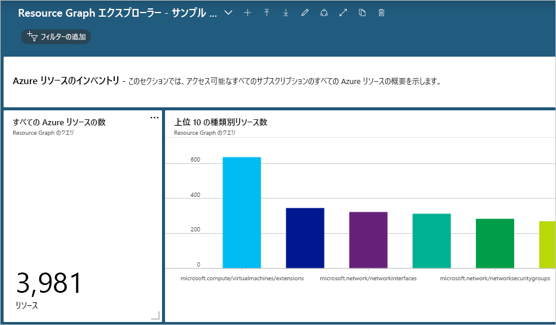

# <a name="quickstart-run-your-first-resource-graph-query-using-azure-resource-graph-explorer"></a>クイック スタート:Azure Resource Graph エクスプローラーを使用して初めての Resource Graph クエリを実行する

Azure Resource Graph の機能は、Azure portal で Azure Resource Graph エクスプローラーを通じて直接利用できます。 Resource Graph エクスプローラーでは、Azure Resource Manager の照会可能なリソースの種類やプロパティに関する参照可能な情報が提供されます。 また、Resource Graph エクスプローラーには、整然としたインターフェイスが備わっていて、複数のクエリを実行してその結果を評価するほか、いくつかのクエリの結果をグラフに変換して Azure ダッシュボードにピン留めすることもできます。

このクイックスタートの終了時には、Azure portal と Resource Graph エクスプローラーを使用して初めての Resource Graph クエリを実行し、その結果をダッシュボードにピン留めしたことになります。

## <a name="prerequisites"></a>前提条件

Azure サブスクリプションをお持ちでない場合は、開始する前に[無料](https://azure.microsoft.com/free/)アカウントを作成してください。

## <a name="run-your-first-resource-graph-query"></a>最初の Resource Graph クエリを実行する

[Azure portal](https://portal.azure.com) を開いて Resource Graph エクスプローラーを探して使用します。初めての Resource Graph クエリを実行するには次の手順に従ってください。

1. 左側のウィンドウにある **[すべてのサービス]** を選択します。 **[Resource Graph エクスプローラー]** を探して選択します。

1. ウィンドウの **[クエリ 1]** 部分に「`Resources | project name, type | limit 5`」というクエリを入力し、 **[クエリの実行]** を選択します。

   > [!NOTE]
   > このクエリ例では、`order by` などの並べ替え修飾子を指定していません。そのため、このクエリを複数回実行すると、要求ごとに、得られる一連のリソースが異なる可能性があります。

1. **[結果]** タブでクエリの応答を確認します。 **[メッセージ]** タブを選択すると、結果の件数やクエリの実行時間など、クエリの詳細が表示されます。 エラーがある場合は、このタブに表示されます。

1. このクエリを更新して `order by` に **Name** プロパティを指定します (`Resources | project name, type | limit 5 | order by name asc`)。 その後、 **[クエリの実行]** を選択します。

   > [!NOTE]
   > 最初のクエリと同様に、このクエリを複数回実行すると要求あたり異なる一連のリソースを中断する可能性があります。 クエリ コマンドの順序が重要です。 この例では、`limit` の後に `order by` がきます。 これによりクエリの結果をまず制限し、それからそれらを注文します。

1. このクエリを更新して、最初に `order by` に **Name** プロパティを指定してから `limit` に上位 5 件の結果を指定します (`Resources | project name, type | order by name asc | limit 5`)。 その後、 **[クエリの実行]** を選択します。

最終的なクエリを複数回実行したとき、環境内で何も変更がないと仮定すると、返される結果は一貫性があり、想定どおりになります。つまり、結果は **Name** プロパティで並べ替えられますが、上位 5 件に制限されます。

### <a name="schema-browser"></a>スキーマ ブラウザー

スキーマ ブラウザーは、Resource Graph エクスプローラーの左側のウィンドウに配置されています。 このリソース一覧には、Azure Resource Graph でサポートされており、なおかつ自分がアクセス可能なテナントに存在する Azure リソースの "_リソースの種類_" がすべて表示されます。 リソースの種類またはサブプロパティを展開すると子プロパティが表示されます。その子プロパティを使用して、Resource Graph クエリを作成できます。

リソースの種類を選択すると、クエリ ボックスに `where type =="<resource type>"` が配置されます。 いずれかの子プロパティを選択すると、クエリ ボックスに `where <propertyName> == "INSERT_VALUE_HERE"` が追加されます。
スキーマ ブラウザーは、クエリに使用するプロパティを見つけるための優れた手段です。 _INSERT\_VALUE\_HERE_ は実際の値に置き換え、条件や演算子、関数を使いながら、意図した結果が得られるようにクエリを調整してください。

## <a name="create-a-chart-from-the-resource-graph-query"></a>Resource Graph クエリからグラフを作成する

上で示した最後のクエリを実行した後、 **[グラフ]** タブを選択すると、"結果セットが円グラフの視覚化と互換性がありません" というメッセージが表示されます。 結果を一覧表示するクエリはグラフにすることができませんが、リソース数を返すクエリであれば、グラフにすることができます。 [「仮想マシンの数 (OS の種類別)」のサンプル クエリ](./samples/starter.md#count-virtual-machines-by-os-type)を使用して、Resource Graph クエリから視覚化を行ってみましょう。

1. ウィンドウの **[クエリ 1]** 部分に次のクエリを入力し、 **[クエリの実行]** を選択します。

   ```kusto
   Resources
   | where type =~ 'Microsoft.Compute/virtualMachines'
   | summarize count() by tostring(properties.storageProfile.osDisk.osType)
   ```

1. **[結果]** タブを選択し、このクエリの応答でカウントが示されていることを確認します。

1. **[グラフ]** タブを選択します。今度は、クエリが視覚化されます。 利用可能な視覚化オプションを試すために、 _[グラフの種類の選択]_ で、グラフの種類を "_棒グラフ_" または "_ドーナツ グラフ_" に変更します。

## <a name="pin-the-query-visualization-to-a-dashboard"></a>クエリの視覚化結果をダッシュボードにピン留めする

視覚化できる結果をクエリから得たら、その視覚化したデータをいずれかのダッシュボードにピン留めすることができます。 上記のクエリを実行した後、次の手順を実行します。

1. **[保存]** を選択し、"VMs by OS Type" という名前を付けます。 その後、右側のウィンドウの下部にある **[保存]** を選択します。

1. **[クエリの実行]** を選択して、保存したクエリを再実行します。

1. **[グラフ]** タブで、データの視覚化を選択します。 次に、 **[ダッシュボードにピン留めする]** を選択します。

1. 表示されたポータルの通知を選択するか、左側のウィンドウから **[ダッシュボード]** を選択します。

ダッシュボードでクエリが利用可能な状態になり、タイルには、クエリの名前と同じタイトルが使用されます。 ピン留めするときにクエリを保存しなかった場合、名前は "クエリ 1" になります。

クエリとその結果であるデータの視覚化は、ダッシュボードが読み込まれるたびに実行されて更新されるため、ご利用の Azure 環境に関するリアルタイムかつ動的な分析情報がワークフローに直接示されます。

> [!NOTE]
> リスト形式の結果を返すクエリもダッシュボードにピン留めできます。 この機能は、クエリのデータの視覚化に制限されません。

## <a name="import-example-resource-graph-explorer-dashboards"></a>サンプル Resource Graph エクスプローラー ダッシュボードをインポートする

Resource Graph クエリの例および Resource Graph エクスプローラーを使用して Azure portal のワークフローを強化する方法の例を提示するために、次のサンプル ダッシュボードを試してください。

- [Resource Graph エクスプローラー - サンプル ダッシュボード 1](https://github.com/Azure-Samples/Governance/blob/master/src/resource-graph/portal-dashboards/sample-1/resourcegraphexplorer-sample-1.json)

  [](./media/arge-sample1-large.png#lightbox)

- [Resource Graph エクスプローラー - サンプル ダッシュボード 2](https://github.com/Azure-Samples/Governance/blob/master/src/resource-graph/portal-dashboards/sample-2/resourcegraphexplorer-sample-2.json)

  [](./media/arge-sample2-large.png#lightbox)

> [!NOTE]
> 上の例に示したダッシュボードのスクリーンショットにあるカウントとグラフは、ご利用の Azure 環境によって異なります。

1. 評価したいサンプル ダッシュボードを選択してダウンロードします。

1. Azure portal で、左側のウィンドウから **[ダッシュボード]** を選択します。

1. **[アップロード]** を選択し、ダウンロードしたサンプル ダッシュボード ファイルを探して選択します。 その後、 **[開く]** を選択します。

インポートしたダッシュボードが自動的に表示されます。 この時点でダッシュボードは Azure portal に存在するため、必要に応じて調査したり変更を加えたりすることができます。また、サンプルから新しいダッシュボードを作成してチームと共有することもできます。 ダッシュボードの操作の詳細については、「[Azure portal でのダッシュボードの作成と共有](../../azure-portal/azure-portal-dashboards.md)」を参照してください。

## <a name="clean-up-resources"></a>リソースをクリーンアップする

ご利用の Azure portal 環境からサンプルの Resource Graph ダッシュボードを削除する場合は、次の手順で実行できます。

1. 左側のウィンドウから **[ダッシュボード]** を選択します。

1. ダッシュボードのドロップダウンから、削除するサンプルの Resource Graph ダッシュボードを選択します。

1. ダッシュボードの上部にあるダッシュボード メニューから **[削除]** を選択し、 **[OK]** を選択して確定します。

## <a name="next-steps"></a>次のステップ

このクイックスタートでは、Azure Resource Graph Explorer を使用して初めてのクエリを実行し、Resource Graph を使用したダッシュボードの例を見てきました。 Resource Graph 言語の詳細については、クエリ言語の詳細のページに進んでください。

> [!div class="nextstepaction"]
> [クエリ言語に関する詳細情報を入手します](./concepts/query-language.md)