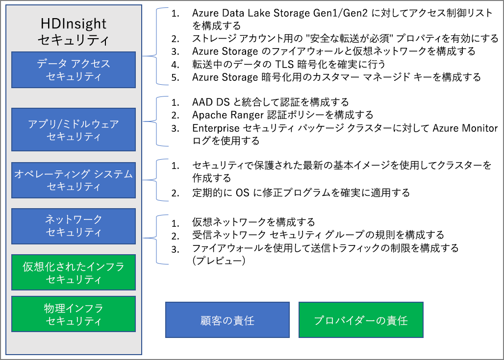

# Azure HDInsight のエンタープライズ セキュリティの概要

Azure HDInsight には、エンタープライズ セキュリティ ニーズに対応するためのさまざまな方法が用意されています。 これらのソリューションのほとんどは、既定ではアクティブ化されていません。 この柔軟性により、ユーザーにとって最も重要なセキュリティ機能を選択することができ、不要な機能に支払いを行う必要がありません。 これは、セットアップと環境で適切なソリューションが有効になっていることをユーザーが責任を持って確認する必要があるということでもあります。

この記事では、セキュリティ ソリューションを、境界セキュリティ、認証、承認、暗号化の 4 つの従来のセキュリティの柱に沿って分け、セキュリティ ソリューションについて説明します。

この記事では、**Azure HDInsight Enterprise セキュリティ パッケージ (ESP)** についても説明します。ESP は、Active Directory ベースの認証、マルチユーザーのサポート、ロールベースのアクセス制御を HDInsight のクラスターに提供します。

## エンタープライズ セキュリティの柱

エンタープライズ セキュリティを確認する 1 つの方法は、コントロールの種類に基づいて、セキュリティ ソリューションを 4 つの主要なグループに分けることです。 これらのグループはセキュリティの柱とも呼ばれ、境界セキュリティ、認証、承認、および暗号化があります。

### 境界セキュリティ

HDInsight の境界セキュリティは、[仮想ネットワーク](../hdinsight-plan-virtual-network-deployment.md)を使用して実現されます。 エンタープライズ管理者は、仮想ネットワーク (VNET) 内にクラスターを作成し、ネットワーク セキュリティ グループ (NSG) を使用して仮想ネットワークへのアクセスを制限できます。 HDInsight クラスターと通信できるのは、NSG の受信規則で許可されている IP アドレスだけです。 この構成では、境界セキュリティを提供します。

VNET にデプロイされるすべてのクラスターには、クラスター ゲートウェイへのプライベート HTTP アクセスのために、VNET 内のプライベート IP に解決されるプライベート エンドポイントもあります。

### Authentication

HDInsight の [Enterprise セキュリティ パッケージ](apache-domain-joined-architecture.md) は、Active Directory ベースの認証、マルチ ユーザー サポート、およびロールベースのアクセス制御を提供します。 Active Directory 統合は、[Azure Active Directory Domain Services](../../active-directory-domain-services/overview.md) を使用して実現されます。 これらの機能を使用して、マネージド Active Directory ドメインに参加している HDInsight クラスターを作成できます。 その後、認証してクラスターにサインインできる企業の従業員の一覧を構成できるようになります。

この設定により、企業の従業員は、ドメイン資格情報を使用してクラスター ノードにサインインできます。 また、ドメイン資格情報を使用して、クラスターと対話する他の承認済みエンドポイント (Apache Ambari Views、ODBC、JDBC、PowerShell、REST API など) で認証することもできます。 

### Authorization

ほとんどの企業では、すべての従業員がすべてのエンタープライズ リソースにはアクセスできないようにするベスト プラクティスに従っています。 同様に、管理者はクラスター リソースのロールベースのアクセス制御ポリシーを定義できます。 これは、ESP クラスターでのみ使用できます。

Hadoop 管理者は、Apache Ranger のプラグインを使用して、ロールベースのアクセス制御 (RBAC) を構成して Apache [Hive](apache-domain-joined-run-hive.md)、[HBase](apache-domain-joined-run-hbase.md) および [Kafka](apache-domain-joined-run-kafka.md) を保護できます。 RBAC ポリシーを構成すると、組織内のロールにアクセス許可を関連付けることができます。 この抽象化レイヤーを使用すると、より簡単に、ユーザーが作業の責任を果たすために必要なアクセス許可のみを持つようにできます。 また、Ranger により、従業員のデータ アクセスとアクセス制御ポリシーに加えられた変更を監査できます。

たとえば、管理者は [Apache Ranger](https://ranger.apache.org/) を構成して Hive のアクセス制御ポリシーを設定できます。 この機能により、行レベルおよび列レベルのフィルター処理 (データ マスキング) が実現され、権限のないユーザーから機密データがフィルター処理されます。

### 監査

リソースにおいて許可されていないアクセスや意図しないアクセスを追跡するには、クラスター リソース、およびデータへのアクセスをすべて監査する必要があります。 HDInsight クラスター リソースを許可されていないユーザーから保護し、データをセキュリティで保護することが重要です。

管理者は HDInsight クラスター リソースとデータへのすべてのアクセスを表示し、レポートを作成できます。 また、管理者は Apache Ranger のサポートされているエンドポイントで作成されたアクセス制御ポリシーのすべての変更を表示し、レポートを作成することもできます。 

Apache Ranger および Ambari 監査ログと ssh アクセス ログにアクセスするには、[Azure Monitor を有効](../hdinsight-hadoop-oms-log-analytics-tutorial.md)にし、関連する監査レコードを表示します。

### 暗号化

データの保護は、組織のセキュリティとコンプライアンス要件を満たすために重要です。 許可されていない従業員からデータへのアクセスを制限すると共に、暗号化する必要があります。

HDInsight クラスターのデータ ストア (Azure BLOB ストレージおよび Azure Data Lake Storage Gen1/Gen2) はどちらも、保存データの透過的なサーバー側[暗号化](../../storage/common/storage-service-encryption.md)をサポートしています。 セキュリティで保護された HDInsight クラスターは、この保存データのサーバー側暗号化の機能とシームレスに連携します。

## 共同責任モデル

次の図は、主要なシステム セキュリティ領域と、それぞれで使用できるセキュリティ ソリューションをまとめたものです。 また、顧客としての責任があるセキュリティ領域と、サービス プロバイダーとしての HDInsight の責任がある領域についても取り上げます。

次の表に、セキュリティ ソリューションの種類ごとにリソースへのリンクを示します。

| セキュリティ領域 | 使用可能なソリューション | 責任者 |
|---|---|---|
| データ アクセス セキュリティ | Azure Data Lake Storage Gen1 および Gen2 対象の[アクセス制御リスト ACL](../../storage/blobs/data-lake-storage-access-control.md) を構成する  | 顧客 |
|  | ストレージ アカウントで [[安全な転送が必須]](../../storage/common/storage-require-secure-transfer.md) プロパティを有効にします。 | 顧客 |
|  | [Azure Storage ファイアウォール](../../storage/common/storage-network-security.md)および仮想ネットワークを構成する | 顧客 |
|  | 転送中のデータに対して [TLS 暗号化](../../storage/common/storage-security-tls.md)が有効になっていることを確認する。 | 顧客 |
|  | Azure Storage 暗号化用に[顧客管理のキー](../../storage/common/storage-encryption-keys-portal.md)を構成する | 顧客 |
| アプリケーションとミドルウェアのセキュリティ | AAD-DS と統合して[認証を構成する](apache-domain-joined-configure-using-azure-adds.md) | 顧客 |
|  | [Apache Ranger 認証](apache-domain-joined-run-hive.md)ポリシーを構成する | 顧客 |
|  | [Azure Monitor ログ](../hdinsight-hadoop-oms-log-analytics-tutorial.md)を使用する | 顧客 |
| オペレーティング システムのセキュリティ | 最新の安全な基本イメージを使用してクラスターを作成する | 顧客 |
|  | [OS の修正プログラム](../hdinsight-os-patching.md)が定期的に適用されるようにする | 顧客 |
| ネットワークのセキュリティ | [仮想ネットワーク](../hdinsight-plan-virtual-network-deployment.md)を構成する |
|  | [ネットワーク セキュリティ グループ (NSG) の受信規則](../hdinsight-plan-virtual-network-deployment.md#networktraffic)を構成する | 顧客 |
|  | ファイアウォールを使用して[送信トラフィックの制限](../hdinsight-restrict-outbound-traffic.md)を構成する (プレビュー) | 顧客 |
| 仮想化インフラストラクチャ | 該当なし | HDInsight (クラウド プロバイダー) |
| 物理インフラのセキュリティ | 該当なし | HDInsight (クラウド プロバイダー) |

## 次の手順

* [ESP を使用する HDInsight クラスターを計画する](apache-domain-joined-architecture.md)
* [ESP を使用する HDInsight クラスターを構成する](apache-domain-joined-configure.md)
* [ESP を使用する HDInsight クラスターを管理する](apache-domain-joined-manage.md)
