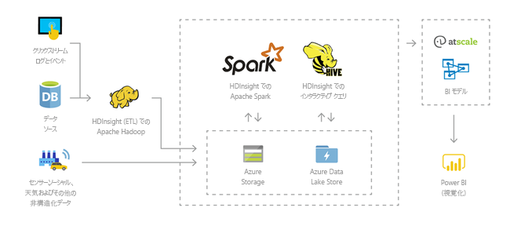
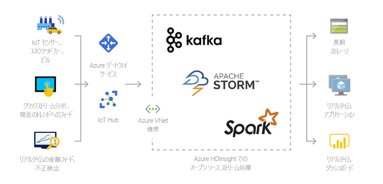
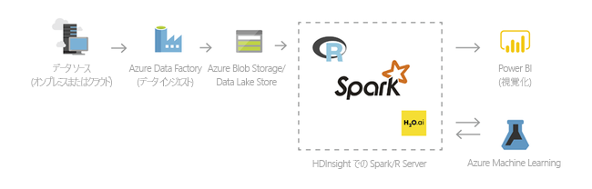
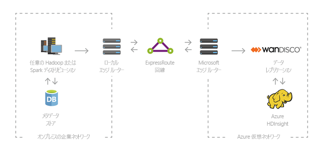

# Azure HDInsight および Hadoop テクノロジ スタックとは

この記事では、Azure HDInsight 上の Apache Hadoop の概要について説明します。 Azure HDInsight は、フル マネージドの、全範囲に対応した、オープンソースのエンタープライズ向け分析サービスです。 Hadoop、Spark、Hive、LLAP、Kafka、Storm、R など、オープン ソースのフレームワークを使用することができます。 

[!INCLUDE [hdinsight-price-change](../../../includes/hdinsight-enhancements.md)]

## HDInsight および Hadoop テクノロジ スタックとは

[Apache Hadoop](http://hadoop.apache.org/) は本来、クラスターでのビッグ データ セットの分散処理および分析のためのオープンソース フレームワークでした。 Hadoop テクノロジ スタックには、Apache Hive、HBase、Spark、Kafka、その他の多くの関連するソフトウェアおよびユーティリティが含まれます。

Azure HDInsight は、[Hortonworks Data Platform (HDP)](https://hortonworks.com/products/data-center/hdp/) の Hadoop コンポーネントのクラウド ディストリビューションです。 Azure HDInsight によって大量のデータを簡単かつ迅速に高いコスト効率で処理できるようになります。 Hadoop、Spark、Hive、LLAP、Kafka、Storm、R など、最もよく使用されているオープンソースのフレームワークを使用することができます。 これらのフレームワークにより、抽出/変換/読み込み (ETL)、データ ウェアハウス、機械学習、IoT など、幅広いシナリオに対応できます。

HDInsight で利用可能な Hadoop テクノロジ スタック コンポーネントを確認するには、[HDInsight で利用可能なコンポーネントとバージョン][component-versioning]に関する記事を参照してください。 HDInsight の Hadoop については、[HDInsight 向けの Azure の機能](https://azure.microsoft.com/services/hdinsight/)に関するページを参照してください。

## ビッグ データとは

収集されるビッグ データの量は膨れ上がっています。その勢いはしだいに増し、以前よりも形式も多様化しています。 ビッグ データの種類には、履歴データ (つまり、保存されたデータ) とリアルタイム データ (つまり、ソースからストリーミングされるデータ) があります。 ビッグ データの最も一般的な使用例については、「[HDInsight を使用するシナリオ](#scenarios-for-using-hdinsight)」をご覧ください。

## HDInsight 上の Hadoop を使用する理由

このセクションでは、Azure HDInsight の一連の機能を紹介します。

|機能  |説明  |
|---------|---------|
|クラウド ネイティブ     |     Azure HDInsight を使用すると、[Hadoop](apache-hadoop-linux-tutorial-get-started.md)、 [Spark](../spark/apache-spark-jupyter-spark-sql.md)、 [Interactive query (LLAP)](../interactive-query/apache-interactive-query-get-started.md)、 [Kafka](../kafka/apache-kafka-get-started.md)、 [Storm](../storm/apache-storm-tutorial-get-started-linux.md)、 [HBase](../hbase/apache-hbase-tutorial-get-started-linux.md)、 [ML サービス](../r-server/r-server-get-started.md)向けに最適化されたクラスターを Azure 上に作成することができます。 また、HDInsight は、あらゆる運用環境のワークロードについてエンド ツー エンドの SLA を提供します。  |
|低コストでスケーラブル     | ワークロードを[スケールアップまたはスケールダウン](../hdinsight-administer-use-portal-linux.md) することができます。  [クラスターをオンデマンドで作成](../hdinsight-hadoop-create-linux-clusters-adf.md) し、実際に使用する分にのみ支払うことでコストを削減できます。 データ パイプラインを作成して、必要なジョブを運用化することもできます。 コンピューティングとストレージが分離され、より高いパフォーマンスと柔軟性が実現されています。 |
|セキュリティとコンプライアンス    | HDInsight を使用すると、[Azure Virtual Network](../hdinsight-extend-hadoop-virtual-network.md)、[暗号化](../hdinsight-hadoop-create-linux-clusters-with-secure-transfer-storage.md)、[Azure Active Directory](../domain-joined/apache-domain-joined-introduction.md) との統合によって、企業のデータ資産を保護することができます。 また HDInsight は、業界や行政上の最も一般的な[コンプライアンス基準](https://azure.microsoft.com/overview/trusted-cloud)を満たしています。        |
|監視    | Azure HDInsight と [Azure Log Analytics](../hdinsight-hadoop-oms-log-analytics-tutorial.md) の統合によって、すべてのクラスターを監視できる一元化されたインターフェイスが得られます。        |
|グローバル対応 | HDInsight は、他のあらゆるビッグ データ分析サービスより多くの [リージョン](https://azure.microsoft.com/regions/services/) で提供されています。 Azure HDInsight は、Azure Government、Azure China、Azure Germany でも提供されており、独自の法令が施行されている地域における企業のニーズに応えます。 |  
|生産性     |  Azure HDInsight を使用すると、お好みの開発環境で Hadoop および Spark 向けの豊富な生産性ツールを利用できます。 これらの開発環境には、Scala、Python、R、Java、.NET に対応した [Visual Studio](apache-hadoop-visual-studio-tools-get-started.md)、[VS Code](../hdinsight-for-vscode.md)、[Eclipse](../spark/apache-spark-eclipse-tool-plugin.md)、および [IntelliJ](../spark/apache-spark-intellij-tool-plugin.md) が含まれます。 データ サイエンティストが、[Jupyter](../spark/apache-spark-jupyter-notebook-kernels.md) や [Zeppelin](../spark/apache-spark-zeppelin-notebook.md) など、広く使われている Notebook を使って共同作業を行うこともできます。    |
|機能拡張     |  [スクリプト アクション](../hdinsight-hadoop-customize-cluster-linux.md)を使ってコンポーネント (Hue、Presto など) をインストールしたり、[エッジ ノードを追加](../hdinsight-apps-use-edge-node.md)したり、[定評のある他のビッグ データ アプリケーションと連携](../hdinsight-apps-install-applications.md)したりすることで、HDInsight のクラスターを拡張することができます。 HDInsight は、特に普及率の高いビッグ データ ソリューションと[ワンクリック](https://azure.microsoft.com/services/hdinsight/partner-ecosystem/) デプロイでシームレスに連携します。|

## HDInsight を使用するシナリオ

Azure HDInsight は、ビッグ データ処理のさまざまなシナリオに対応します。 ビッグ データは履歴データ (既に収集されて保存されているデータ) である場合もあれば、リアルタイム データ (ソースから直接ストリーミングされるデータ) である場合もあります。 そのようなデータの処理に関するシナリオは、次のカテゴリに集約することができます。 

### バッチ処理 (ETL)

ETL (抽出、変換、読み込み) は、異種データ ソースから非構造化データまたは構造化データを抽出する処理です。 その後、構造化された形式に変換して、データ ストアに読み込みます。 変換後のデータは、データ サイエンスやデータ ウェアハウジングに使用することができます。

### データ ウェアハウス

HDInsight を使用して、あらゆる形式の構造化データや非構造化データに対話型クエリをペタバイト規模で実行することができます。 それらを BI ツールに接続するモデルを作成することもできます。 詳しくは、[こちらの顧客事例](https://customers.microsoft.com/story/milliman)をご覧ください。 

### モノのインターネット(IoT)

さまざまなデバイスからリアルタイムで受信したストリーミング データを HDInsight で処理することができます。 詳細については、[Azure マネージド ディスクを使用した HDInsight での Apache Kafka のパブリック プレビューを知らせる Azure のブログ記事を参照してください](https://azure.microsoft.com/blog/announcing-public-preview-of-apache-kafka-on-hdinsight-with-azure-managed-disks/)。

 

### データ サイエンス

データから重要な洞察を得るアプリケーションを HDInsight で作成することができます。 また、その基盤の上に Azure Machine Learning を使用して、ビジネスの将来の傾向を予測することもできます。 詳しくは、[こちらの顧客事例](https://customers.microsoft.com/story/pros)をご覧ください。

### ハイブリッド

HDInsight を使用して、既にあるオンプレミスのビッグ データ インフラストラクチャを Azure にまで拡張し、そのクラウドの高度な分析機能を活用することができます。

## HDInsight でのクラスターの種類
HDInsight には、特定のクラスターの種類のほか、コンポーネント、ユーティリティ、および言語を追加する機能などのクラスター カスタマイズ機能が含まれています。 HDInsight は、次のクラスターの種類を提供します。

* **[Apache Hadoop](https://wiki.apache.org/hadoop)**: HDFS、YARN によるリソース管理、およびシンプルな MapReduce プログラミング モデルを使用して、バッチ データを同時に処理および分析するフレームワーク。

* **[Apache Spark](http://spark.apache.org/)**: ビッグ データ分析アプリケーションのパフォーマンスを向上させるメモリ内処理をサポートする、オープンソースの並列処理フレームワークです。 [HDInsight での Apache Spark の概要](../spark/apache-spark-overview.md)に関する記事を参照してください。

* **[Apache HBase](http://hbase.apache.org/)**: Hadoop 上に構築された NoSQL データベースです。数十億行 x 数百万列に達する可能性のある大量の非構造化データや半構造化データへのランダム アクセスと厳密な整合性を実現します。 [HDInsight での HBase の概要](../hbase/apache-hbase-overview.md)に関する記事を参照してください。

* **[ML サービス](https://msdn.microsoft.com/microsoft-r/rserver)**: 並列分散 R プロセスをホストおよび管理するためのサーバーです。 データ サイエンティスト、統計学者、R プログラマーは、HDInsight でのスケーラブルで分散型の分析手法にオンデマンドでアクセスできるようになります。 [HDInsight の ML サービスの概要](../r-server/r-server-overview.md)に関するページを参照してください。

* **[Apache Storm](https://storm.incubator.apache.org/)**: 大量のデータ ストリームを高速処理するための分散型リアルタイム計算システムです。 Storm は、HDInsight で管理されるクラスターとして提供されます。 「 [HDInsight (Hadoop) での Storm と HBase を使ったセンサー データの分析](../storm/apache-storm-sensor-data-analysis.md)」を参照してください。

* **[Apache Interactive Query プレビュー (別名: Live Long and Process)](https://cwiki.apache.org/confluence/display/Hive/LLAP)**: 対話型で高速な Hive クエリを実現するメモリ内キャッシュです。 [HDInsight での対話型クエリの使用](../interactive-query/apache-interactive-query-get-started.md)に関する記事を参照してください。

* **[Apache Kafka](https://kafka.apache.org/)**: ストリーミング データ パイプラインおよびアプリケーションを構築するために使用されるオープンソースのプラットフォームです。 Kafka には、データ ストリームの発行とサブスクライブを可能にするメッセージ キュー機能も用意されています。 「[HDInsight での Apache Kafka の概要](../kafka/apache-kafka-introduction.md)」を参照してください。

## HDInsight のオープンソース コンポーネント

Azure HDInsight では、Hadoop、Spark、Hive、LLAP、Kafka、Storm、HBase、R をはじめとするオープンソースのフレームワークを使ってクラスターを作成できます。これらのクラスターには、[Ambari](https://github.com/apache/ambari/blob/trunk/ambari-server/docs/api/v1/index.md)、[Avro](http://avro.apache.org/docs/current/spec.html)、[Hive](http://hive.apache.org)、[HCatalog](https://cwiki.apache.org/confluence/display/Hive/HCatalog/)、[Mahout](https://mahout.apache.org/)、[MapReduce](http://wiki.apache.org/hadoop/MapReduce)、[YARN](http://hadoop.apache.org/docs/current/hadoop-yarn/hadoop-yarn-site/YARN.html)、[Phoenix](http://phoenix.apache.org/)、[Pig](http://pig.apache.org/)、[Sqoop](http://sqoop.apache.org/)、[Tez](http://tez.apache.org/)、[Oozie](http://oozie.apache.org/)、[ZooKeeper](http://zookeeper.apache.org/) など、各クラスターに備わっている他のオープンソース コンポーネントが最初から付属しています。  

## HDInsight のプログラミング言語
HDInsight クラスター (Spark、HBase、Kafka、Hadoopなど) は多数のプログラミング言語をサポートします。 既定でインストールされないプログラミング言語があります。 既定でインストールされないライブラリ、モジュール、またはパッケージは、[スクリプト アクションを使用してコンポーネントをインストール](../hdinsight-hadoop-script-actions-linux.md)します。

|プログラミング言語  |情報  |
|---------|---------|
|既定のプログラミング言語のサポート     | 既定では、HDInsight クラスターは以下をサポートします。<ul><li>Java</li><li>Python</li></ul> [スクリプト アクション](../hdinsight-hadoop-script-actions-linux.md)を使用して他の言語をインストールできます。       |
|Java 仮想マシン (JVM) 言語     | Java 以外の多くの言語を Java 仮想マシン (JVM) で実行できます。 ただし、これらの言語の一部を実行する場合は、クラスターへの追加コンポーネントのインストールが必要な場合があります。 次の JVM ベースの言語が HDInsight クラスターでサポートされます。 <ul><li>Clojure</li><li>Jython (Java 用の Python)</li><li>Scala</li></ul>     |
|Hadoop 固有言語     | HDInsight クラスターでは、Hadoop テクノロジ スタックに固有の次の言語をサポートしています。 <ul><li>Pig ジョブ用の Pig Latin</li><li>Hive ジョブ用の HiveQL と SparkSQL</li></ul>        |
 

## HDInsight のビジネス インテリジェンス
Power Query アドインまたは Microsoft Hive ODBC ドライバーを使用すれば、使い慣れたビジネス インテリジェンス (BI) ツールを HDInsight と連携して、データの取得、分析、レポート生成を行うことができます。

* [Azure HDInsight のデータ視覚化ツールを使用する Apache Spark BI](../spark/apache-spark-use-bi-tools.md)

* [Azure HDInsight の Microsoft Power BI で Hive データを視覚化する](apache-hadoop-connect-hive-power-bi.md)。 

* [Azure HDInsight の Power BI で対話型クエリの Hive データを視覚化する](../interactive-query/apache-hadoop-connect-hive-power-bi-directquery.md)

* [Power Query を使用した Excel から Hadoop への接続](apache-hadoop-connect-excel-power-query.md) (Windows が必要) 

* [Microsoft Hive ODBC Driver を使用した Excel から Hadoop への接続](apache-hadoop-connect-excel-hive-odbc-driver.md) (Windows が必要) 

* [HDInsight での SQL Server Analysis Services の使用](https://msdn.microsoft.com/library/dn749857.aspx)

* [HDInsight での SQL Server Reporting Services の使用](https://msdn.microsoft.com/library/dn749856.aspx)

## 次の手順

この記事では、Azure HDInsight とは何か、および Azure で Hadoop とその他のクラスターの種類を提供する方法を説明しました。 次の記事に進み、HDInsight で Apache Hadoop クラスターを作成する方法について学習してください。

> [!div class="nextstepaction"]
> [HDInsight で Hadoop クラスターを作成する](apache-hadoop-linux-create-cluster-get-started-portal.md)

[component-versioning]: ../hdinsight-component-versioning.md
[zookeeper]: http://zookeeper.apache.org/
