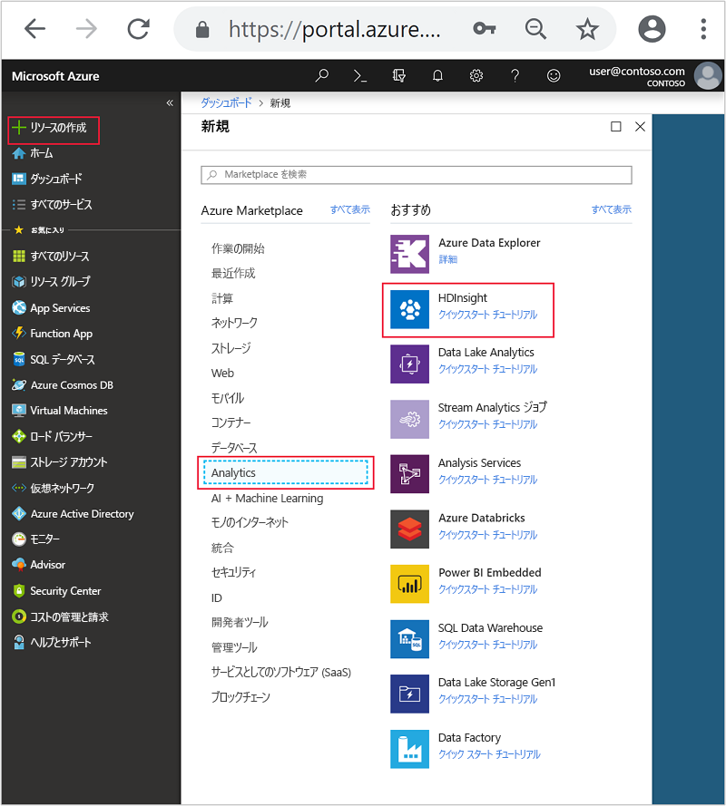
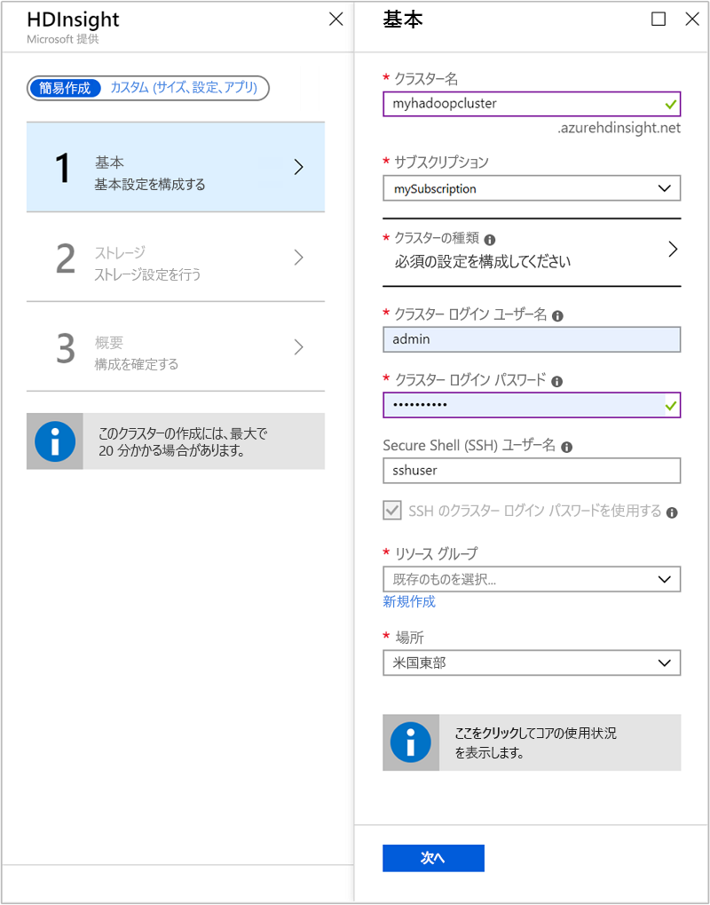
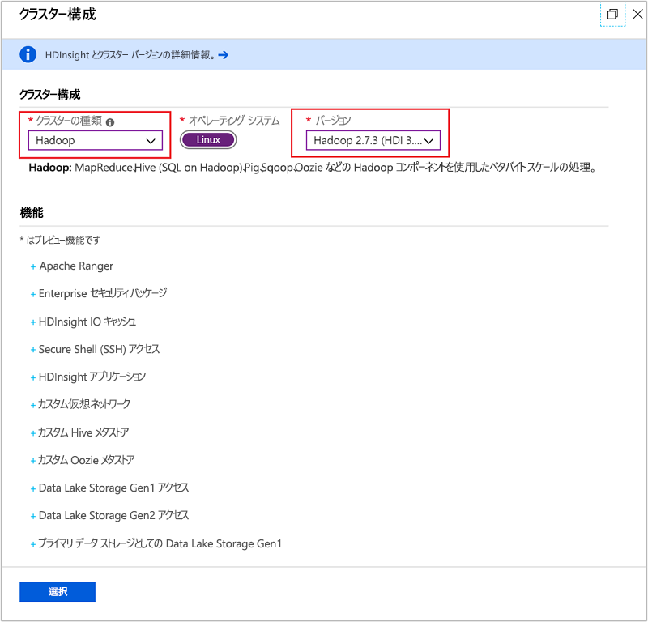
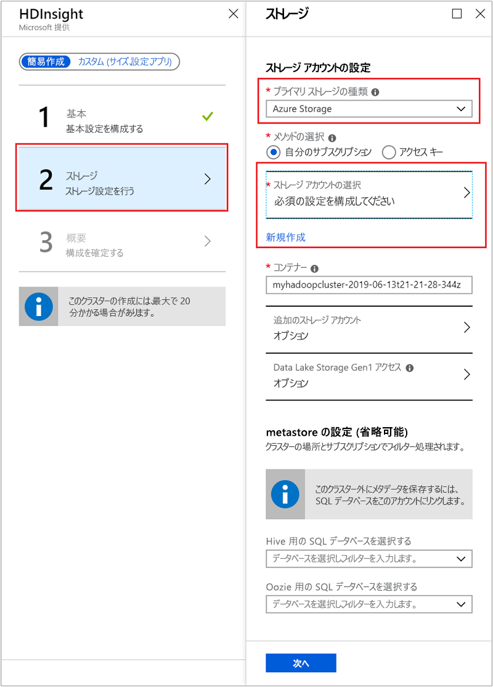
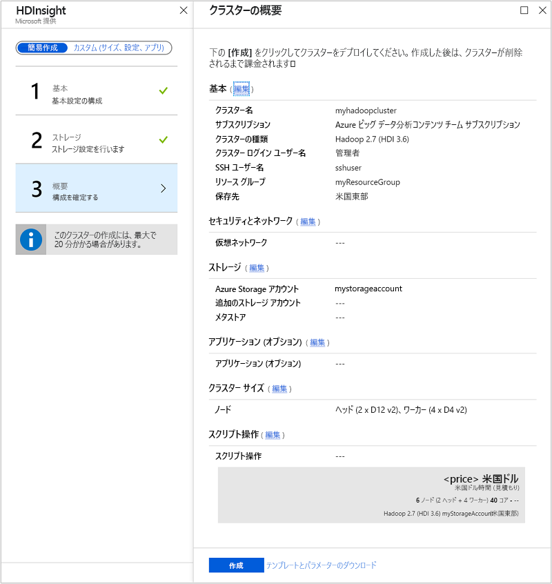
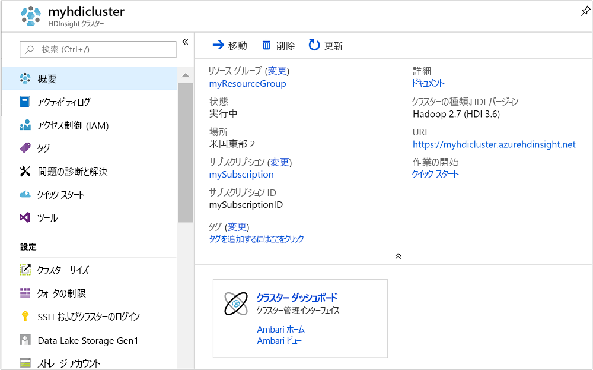

# <a name="quickstart-create-apache-hadoop-cluster-in-azure-hdinsight-using-azure-portal"></a>クイック スタート:Azure portal を使用して Azure HDInsight 内に Apache Hadoop クラスターを作成する

この記事では、Azure portal を使用して HDInsight で [Apache Hadoop](https://hadoop.apache.org/) クラスターを作成し、HDInsight で Apache Hive ジョブを実行する方法について説明します。 Hadoop ジョブのほとんどはバッチ ジョブです。 クラスターを作成し、いくつかのジョブを実行して、クラスターを削除します。 この記事では、3 つのすべてのタスクを実行します。

このクイック スタートでは、Azure Portal を使用して HDInsight Hadoop クラスターを作成します。 また、[Azure Resource Manager テンプレート](apache-hadoop-linux-tutorial-get-started.md)を使用して、クラスターを作成することもできます。

現在、HDInsight には [7 種類のクラスター](./apache-hadoop-introduction.md#cluster-types-in-hdinsight)が用意されています。 クラスターの種類はそれぞれ異なるコンポーネント セットをサポートしていますが、 Hive は全種類のクラスターでサポートされています。 HDInsight でサポートされているコンポーネントの一覧については、[Azure HDInsight で提供される Hadoop クラスター バージョンの新機能](../hdinsight-component-versioning.md)に関するページを参照してください。  

Azure サブスクリプションをお持ちでない場合は、開始する前に[無料アカウントを作成](https://azure.microsoft.com/free/)してください。

## <a name="create-an-apache-hadoop-cluster"></a>Apache Hadoop クラスターを作成する

このセクションでは、Azure Portal を使用して HDInsight で Hadoop クラスターを作成します。

1. [Azure Portal](https://portal.azure.com) にサインインします。

1. Azure portal から、 **[リソースの作成]**  >  **[Analytics]**  >  **[HDInsight]** に移動します。

    

1. **[HDInsight]**  >  **[簡易作成]**  >  **[基本]** で、次の値を入力または選択します。

    |プロパティ  |説明  |
    |---------|---------|
    |クラスター名   | Hadoop クラスターの名前を入力します。 HDInsight のすべてのクラスターでは同じ DNS 名前空間が共有されるため、この名前は一意である必要があります。 この名前は、文字、数字、ハイフンを含む最大 59 文字で構成できます。 名前の先頭と末尾の文字をハイフンにすることはできません。 |
    |Subscription    |  Azure サブスクリプションを選択します。 |
    |クラスターの種類     | ここでは、スキップします。 この手順説明の次の手順で入力します。|
    |クラスター ログイン ユーザー名とパスワード    | 既定のログイン名は **admin** です。パスワードは 10 文字以上で、数字、大文字、小文字、英数字以外の文字 (' " ` を除く\) が少なくとも 1 つずつ含まれる必要があります。 "Pass@word1" などのよく使われるパスワードを**指定していない**ことを確認してください。|
    |Secure Shell (SSH) ユーザー名 | 既定のユーザー名は **sshuser** です。  SSH ユーザー名に別の名前を指定できます。 |
    |SSH にクラスター ログイン パスワードを使用する| クラスター ログイン ユーザーに指定したのと同じパスワードを SSH ユーザーに使用する場合は、このチェック ボックスをオンにします。|
    |Resource group     | リソース グループを作成するか、既存のリソース グループを選択します。  リソース グループとは、Azure コンポーネントのコンテナーです。  この場合、リソース グループには、HDInsight クラスターおよび依存する Azure ストレージ アカウントが含まれています。 |
    |Location    | クラスターを作成する Azure の場所を選択します。  パフォーマンスを向上させるため、お近くの場所を選択してください。 |

    

1. **[クラスターの種類]** を選択して **[クラスターの構成]** ページを開き、次の値を指定します。

    |プロパティ  |説明  |
    |---------|---------|
    |クラスターの種類     | **[Hadoop]** を選択します |
    |Version     | **[Hadoop 2.7.3 (HDI 3.6)]** を選択します。|

    

    **[選択]** を選択し、 **[次へ]** を選択してストレージ設定に進みます。

1. **[ストレージ]** タブから次の値を指定します。

    |プロパティ  |説明  |
    |---------|---------|
    |プライマリ ストレージの種類    | この記事では、Azure Storage を選択して、Azure Storage Blob を既定のストレージ アカウントとして使用します。 Azure Data Lake Storage を既定のストレージとして使用することもできます。 |
    |メソッドの選択     |  この記事では、 **[個人用サブスクリプション]** を選択して、Azure サブスクリプションのストレージ アカウントを使用します。 他のサブスクリプションのストレージ アカウントを使用するには、 **[アクセス キー]** を選択し、そのアカウントのアクセス キーを指定します。 |
    |ストレージ アカウントの選択   | **[ストレージ アカウントの選択]** を選択して既存のストレージ アカウントを選択するか、 **[新規作成]** を選択します。 新しいアカウントの作成時には、名前の長さは 3 から 24 文字とし、数字と小文字のみを使用できます。|

    他の値はすべて既定値のままにして、 **[次へ]** を選択して概要ページに進みます。

    

1. **[概要]** タブで、前の手順で選択した値を確認します。

    

1. **作成** を選択します。 クラスターの作成には約 20 分かかります。

1. クラスターが作成されると、Azure Portal にクラスターの概要ページが表示されます。

        

    各クラスターには、[Azure ストレージ アカウント](../hdinsight-hadoop-use-blob-storage.md)または [Azure Data Lake アカウント](../hdinsight-hadoop-use-data-lake-store.md)との依存関係があります。 このアカウントを、既定のストレージ アカウントと呼びます。 HDInsight クラスターとその既定のストレージ アカウントは、同じ Azure リージョンに配置されている必要があります。 クラスターを削除しても、ストレージ アカウントは削除されません。

    > [!NOTE]  
    > その他のクラスター作成方法や、このクイック スタートで使用されているプロパティについては、[HDInsight クラスターの作成](../hdinsight-hadoop-provision-linux-clusters.md)に関するページを参照してください。

## <a name="run-apache-hive-queries"></a>Apache Hive クエリの実行

[Apache Hive](hdinsight-use-hive.md) は、HDInsight で使用される最も一般的なコンポーネントです。 HDInsight で Hive ジョブを実行する方法は多数存在します。 このクイックスタートでは、ポータルから Ambari Hive ビューを使用します。 Hive ジョブを送信する他の方法については、「 [HDInsight で Hadoop と共に Hive と HiveQL を使用して Apache log4j サンプル ファイルを分析する](hdinsight-use-hive.md)」を参照してください。

1. Ambari を開くには、前のスクリーンショットから、 **[クラスター ダッシュボード]** を選択します。  `https://ClusterName.azurehdinsight.net` を参照することもできます。この `ClusterName` は前のセクションで作成したクラスターです。

    

2. クラスターの作成時に指定した Hadoop ユーザー名とパスワードを入力します。 既定のユーザー名は **admin**です。

3. 次のスクリーンショットのように **[ハイブ ビュー]** を開きます。

    

4. **[QUERY]\(クエリ\)** タブで、次の HiveQL ステートメントをワークシートに貼り付けます。

    ```sql
    SHOW TABLES;
    ```

    

5. **[Execute (実行)]** を選択します。 **[QUERY]\(クエリ\)** タブの下に **[RESULTS]\(結果\)** タブが表示され、ジョブについての情報が表示されます。 

    クエリが完了すると、 **[QUERY]\(クエリ\)** タブに操作の結果が表示されます。 **hivesampletable**という名前のテーブルが 1 つ表示されます。 このサンプルの Hive テーブルにはすべての HDInsight クラスターが付属します。

    

6. 手順 4. と手順 5 を繰り返し、次のクエリを実行します。

    ```sql
    SELECT * FROM hivesampletable;
    ```

7. クエリの結果を保存することもできます。 右側のメニュー ボタンを選択し、結果を CSV ファイルとしてダウンロードするか、クラスターに関連付けられているストレージ アカウントに保存するかを指定します。

    

Hive ジョブが完了したら、[結果を Azure SQL データベースまたは SQL Server データベースにエクスポート](apache-hadoop-use-sqoop-mac-linux.md)できます。[Excel を利用して結果を視覚化](apache-hadoop-connect-excel-power-query.md)することもできます。 HDInsight で Hive を使用する方法の詳細については、[HDInsight で Apache Hadoop と共に Apache Hive と HiveQL を使用して Apache log4j サンプル ファイルを分析する](hdinsight-use-hive.md)方法に関するページを参照してください。

## <a name="clean-up-resources"></a>リソースのクリーンアップ

このクイックスタートを完了したら、必要に応じてクラスターを削除できます。 HDInsight を使用すると、データは Azure Storage に格納されるため、クラスターは、使用されていない場合に安全に削除できます。 また、HDInsight クラスターは、使用していない場合でも課金されます。 クラスターの料金は Storage の料金の何倍にもなるため、クラスターを使用しない場合は削除するのが経済的にも合理的です。

> [!NOTE]  
> *すぐに*次の記事に進み、HDInsight で Hadoop を使用して ETL 操作を実行する方法を学習する場合は、クラスターを実行したままにしておいてかまいません。 これは、そのチュートリアルでは Hadoop クラスターを再度作成する必要があるからです。 ただし、すぐに次の記事に進まない場合は、クラスターを今すぐ削除する必要があります。

### <a name="to-delete-the-cluster-andor-the-default-storage-account"></a>クラスターと既定のストレージ アカウントを削除するには

1. ブラウザーの Azure Portal を開いているタブに戻ります。 [クラスターの概要] ページが表示されているはずです。 クラスターのみを削除し、既定のストレージ アカウントを保持する場合は、 **[削除]** を選択します。

    

2. クラスターと既定のストレージ アカウントを削除する場合は、(上のスクリーンショットで強調表示されている) リソース グループ名を選択して、リソース グループのページを開きます。

3. **[リソース グループの削除]** を選択して、クラスターと既定のストレージ アカウントが含まれたリソース グループを削除します。 リソース グループを削除するとストレージ アカウントも削除されます。 ストレージ アカウントを残しておく場合は、クラスターのみを削除してください。

## <a name="next-steps"></a>次の手順

このクイックスタートでは、Resource Manager テンプレートを利用して Linux ベースの HDInsight クラスターを作成する方法と基本的な Hive クエリを実行する方法について学習しました。 次の記事では、HDInsight で Hadoop を使用して抽出、変換、読み込み (ETL) 操作を実行する方法を学習します。

> [!div class="nextstepaction"]
>[HDInsight で対話型クエリを使用してデータの抽出、変換、読み込みを行う](../interactive-query/interactive-query-tutorial-analyze-flight-data.md)
