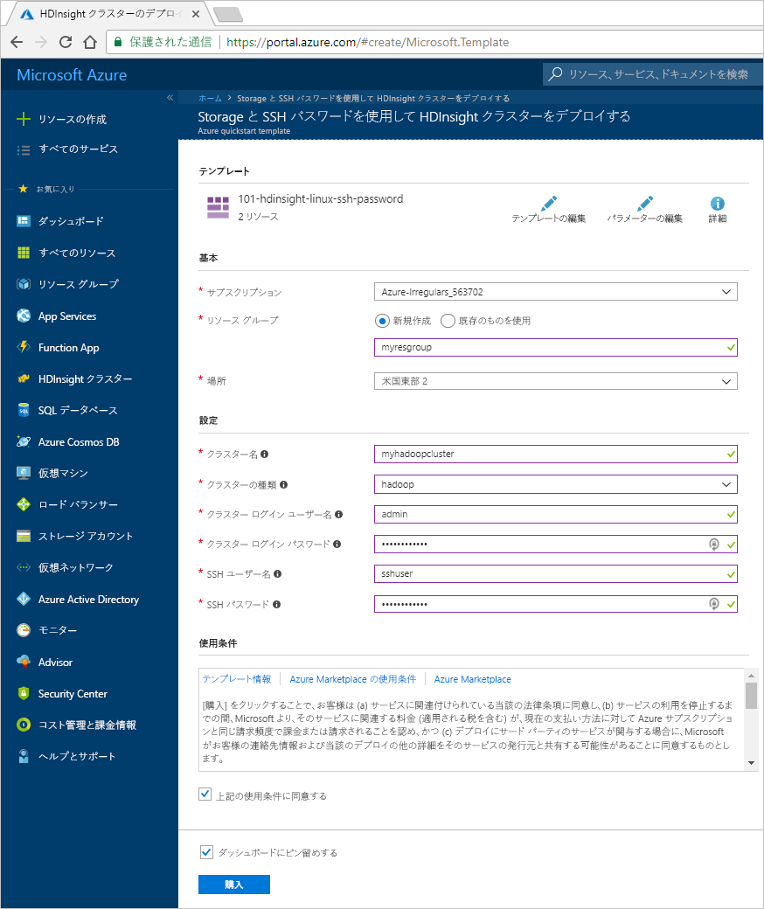
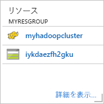
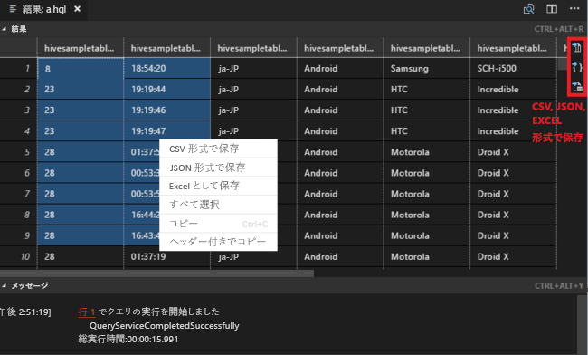
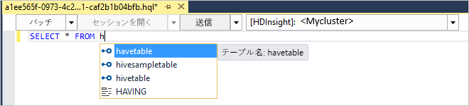
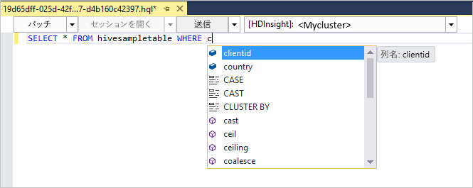
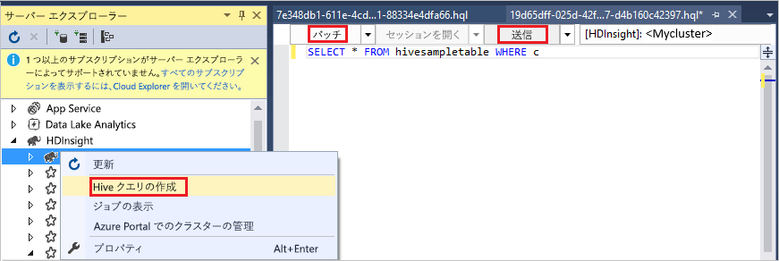
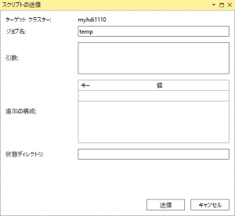
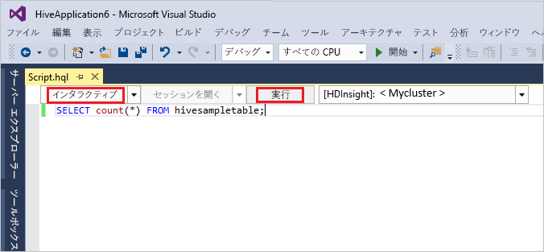
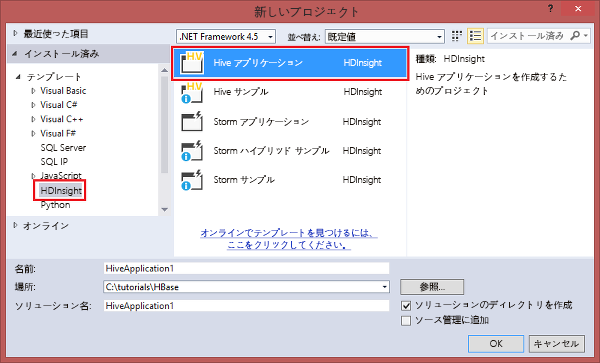

# <a name="quickstart-get-started-with-hadoop-and-hive-in-azure-hdinsight-using-resource-manager-template"></a>クイック スタート: Resource Manager テンプレートを使用して Azure HDInsight で Hadoop と Hive を使用する

この記事では、Resource Manager テンプレートを使用して HDInsight で [Hadoop](http://hadoop.apache.org/) クラスターを作成し、HDInsight で Hive ジョブを実行する方法について説明します。 Hadoop ジョブのほとんどはバッチ ジョブです。 クラスターを作成し、いくつかのジョブを実行して、クラスターを削除します。 この記事では、3 つのすべてのタスクを実行します。

このクイックスタートでは、Resource Manager テンプレートを使用して HDInsight Hadoop クラスターを作成します。 [Azure Portal](apache-hadoop-linux-create-cluster-get-started-portal.md) を使用してクラスターを作成することもできます。

現在、HDInsight には [7 種類のクラスター](./apache-hadoop-introduction.md#cluster-types-in-hdinsight)が用意されています。 クラスターの種類はそれぞれ異なるコンポーネント セットをサポートしていますが、 Hive は全種類のクラスターでサポートされています。 HDInsight でサポートされているコンポーネントの一覧については、「[HDInsight で提供される Hadoop クラスター バージョンの新機能](../hdinsight-component-versioning.md)」を参照してください。  

Azure サブスクリプションをお持ちでない場合は、開始する前に[無料アカウントを作成](https://azure.microsoft.com/free/)してください。

<a name="create-cluster"></a>
## <a name="create-a-hadoop-cluster"></a>Hadoop クラスターの作成

このセクションでは、Azure Resource Manager テンプレートを利用して、HDInsight で Hadoop クラスターを作成します。 この記事に従うために、Resource Manager テンプレートの使用経験は必要ありません。 

1. 以下の **[Deploy to Azure] (Azure へのデプロイ)** ボタンをクリックして Azure にサインインし、Azure Portal で Resource Manager テンプレートを開きます。 
   
    <a href="https://portal.azure.com/#create/Microsoft.Template/uri/https%3A%2F%2Fraw.githubusercontent.com%2FAzure%2Fazure-quickstart-templates%2Fmaster%2F101-hdinsight-linux-ssh-password%2Fazuredeploy.json" target="_blank"></a>

2. 次のスクリーンショットで提案されているように値を入力するか、選択します。

    > [!NOTE]
    > 指定する値は一意である必要があり、名前付けガイドラインに従う必要があります。 テンプレートでは、検証チェックは実行されません。 指定した値が既に使用されている場合、またはガイドラインに従ってない場合、テンプレートを送信した後にエラーが発生します。       
    > 
    >
    
    

    次の値を入力または選択します。
    
    |プロパティ  |説明  |
    |---------|---------|
    |**サブスクリプション**     |  Azure サブスクリプションを選択します。 |
    |**[リソース グループ]**     | リソース グループを作成するか、既存のリソース グループを選択します。  リソース グループとは、Azure コンポーネントのコンテナーです。  この場合、リソース グループには、HDInsight クラスターおよび依存する Azure ストレージ アカウントが含まれています。 |
    |**場所**     | クラスターを作成する Azure の場所を選択します。  パフォーマンスを向上させるため、お近くの場所を選択してください。 |
    |**クラスターの種類**     | **[hadoop]** を選択します。 |
    |**クラスター名**     | Hadoop クラスターの名前を入力します。 HDInsight のすべてのクラスターでは同じ DNS 名前空間が共有されるため、この名前は一意である必要があります。 この名前は、文字、数字、ハイフンを含む最大 59 文字で構成できます。 名前の先頭と末尾の文字をハイフンにすることはできません。 |
    |**クラスター ログイン名とパスワード**     | 既定のログイン名は **admin** です。パスワードは 10 文字以上で、数字、大文字、小文字、英数字以外の文字 (' " ` を除く\) が少なくとも 1 つずつ含まれる必要があります。 "Pass@word1" などのよく使われるパスワードを**指定していない**ことを確認してください。|
    |**SSH ユーザー名とパスワード**     | 既定のユーザー名は **sshuser** です。  SSH ユーザー名は、変更が可能です。  SSH ユーザーのパスワードには、クラスターのログイン パスワードと同じ要件が適用されます。|
       
    一部のプロパティは、テンプレートにハードコーディングされています。  これらの値はテンプレートから構成することができます。 これらのプロパティの詳細については、[HDInsight での Hadoop クラスターの作成](../hdinsight-hadoop-provision-linux-clusters.md)に関するページを参照してください。

3. **[上記の使用条件に同意する]**、**[ダッシュボードにピン留めする]** の順に選択し、**[購入]** を選択します。 ポータルのダッシュボードに、**[デプロイを送信しています]** という新しいタイルが表示されます。 クラスターの作成には約 20 分かかります。

    

4. クラスターが作成されると、タイルのキャプションが、指定したリソース グループ名に変更されます。 タイルには、リソース グループ内で作成された HDInsight クラスターも一覧表示されます。 
   
    
    
5. タイルには、クラスターに関連付けられている既定のストレージも一覧表示されます。 各クラスターには、[Azure ストレージ アカウント](../hdinsight-hadoop-use-blob-storage.md)または [Azure Data Lake アカウント](../hdinsight-hadoop-use-data-lake-store.md)との依存関係があります。 このアカウントを、既定のストレージ アカウントと呼びます。 HDInsight クラスターとその既定のストレージ アカウントは、同じ Azure リージョンに配置されている必要があります。 クラスターを削除しても、ストレージ アカウントは削除されません。
    

> [!NOTE]
> その他のクラスター作成方法と、このチュートリアルで使うプロパティの詳細については、[HDInsight クラスターの作成](../hdinsight-hadoop-provision-linux-clusters.md)に関するページを参照してください。       
> 
>

## <a name="use-vscode-to-run-hive-queries"></a>VS Code を使用して Hive クエリを実行する

VS Code で HDInsight Tools を入手する方法については、「[Azure HDInsight Tool for Visual Studio Code の使用](../hdinsight-for-vscode.md)」をご覧ください。

### <a name="submit-interactive-hive-queries"></a>Submit interactive Hive queries

HDInsight Tools for VS Code を使用すると、対話型 Hive クエリを HDInsight 対話型クエリ クラスターに送信できます。

1. 新しい作業フォルダーと新しい Hive スクリプト ファイルを作成します (まだない場合)。

2. Azure アカウントに接続し、既定のクラスターを構成します (まだ構成していない場合)。

3. 次のコードをコピーし、Hive ファイルに貼り付けて保存します。

    ```hiveql
    SELECT * FROM hivesampletable;
    ```
4. スクリプト エディターを右クリックし、**[HDInsight: Hive Interactive]** を選択してクエリを送信します。 また、このツールでは、コンテキスト メニューを使用して、スクリプト ファイル全体ではなく、コードのブロックを送信することもできます。 その後すぐに、クエリの結果が新しいタブに表示されます。

   

    - **[結果]** パネル: 結果全体を CSV、JSON、または Excel ファイルとしてローカル パスに保存したり、複数の行だけを選択したりできます。

    - **[メッセージ]** パネル: **行**の番号を選択すると、実行中のスクリプトの最初の行にジャンプします。

対話型クエリは、[Hive バッチ ジョブ](#submit-hive-batch-scripts)よりもはるかに短時間で実行されます。

### <a name="submit-hive-batch-scripts"></a>Hive バッチ スクリプトの送信

1. 新しい作業フォルダーと新しい Hive スクリプト ファイルを作成します (まだない場合)。

2. Azure アカウントに接続し、既定のクラスターを構成します (まだ構成していない場合)。

3. 次のコードをコピーし、Hive ファイルに貼り付けて保存します。

    ```hiveql
    SELECT * FROM hivesampletable;
    ```
4. スクリプト エディターを右クリックし、**[HDInsight: Hive Batch]** を選択して Hive ジョブを送信します。 

5. 送信先のクラスターを選択します。  

    Hive ジョブを送信したら、送信成功に関する情報とジョブ ID が、**[出力]** パネルに表示されます。 また、Hive ジョブによって **Web ブラウザー**が開かれ、ジョブのリアルタイムのログと状態が表示されます。

   

[対話型 Hive クエリ](#submit-interactive-hive-queries)は、バッチ ジョブよりもはるかに短時間で送信されます。

## <a name="use-visualstudio-to-run-hive-queries"></a>Visual Studio を使用して Hive クエリを実行する

Visual Studio で HDInsight Tools を入手する方法については、「[Data Lake Tools for Visual Studio の使用](./apache-hadoop-visual-studio-tools-get-started.md)」をご覧ください。

### <a name="run-hive-queries"></a>Hive クエリの実行

Hive クエリを作成して実行するためのオプションは 2 つあります。

* アドホック クエリを作成する
* Hive アプリケーションを作成する

アドホック クエリを作成して実行するには:

1. **サーバー エクスプローラー**で、**[Azure]** > **[HDInsight クラスター]** を選択します。

2. クエリを実行するクラスターを右クリックし、**[Hive クエリの作成]** を選択します。  

3. Hive クエリを入力します。 

    Hive エディターは IntelliSense をサポートしています。 Data Lake Tools for Visual Studio では、Hive スクリプトの編集時にリモート メタデータの読み込みをサポートします。 たとえば、**SELECT * FROM** と入力すると、IntelliSense によって提案されるテーブル名が一覧表示されます。 テーブル名を指定すると、Intellisense によって列名が一覧表示されます。 このツールは、Hive の DML ステートメント、サブクエリ、および組み込みの UDF の大半をサポートします。
   
    
   
    
   
   > [!NOTE]
   > IntelliSense は、HDInsight のツール バーで選択されているクラスターのメタデータのみを推奨します。
   > 
   
4. **[送信]** または **[Submit (Advanced)]\(送信 (詳細設定)\)** を選択します。 
   
    

   [Submit (Advanced)]\(送信 (詳細設定)\) オプションを選択した場合は、スクリプトの **[ジョブ名]**、**[引数]**、**[追加の構成]**、**[状態ディレクトリ]** を構成します。

    

   Interactive Hive クエリを実行する

   * 下向き矢印をクリックして、**[対話型]** を選択します。 
   
   * **[実行]** をクリックします。

   

Hive ソリューションを作成して実行するには:

1. **[ファイル]** メニューから **[新規]**、**[プロジェクト]** の順に選択します。
2. 左側のウィンドウで、**[HDInsight]** を選択します。 中央のウィンドウで、**[Hive アプリケーション]** を選択します。 プロパティを入力し、**[OK]** を選択します。
   
    
3. **ソリューション エクスプローラー**で、**Script.hql** をダブルクリックしてスクリプトを開きます。
4. Hive クエリを入力して送信します。 (上記の手順 3 と 4 を参照)  


## <a name="run-hive-queries"></a>Hive クエリの実行

[Apache Hive](hdinsight-use-hive.md) は、HDInsight で使用される最も一般的なコンポーネントです。 HDInsight で Hive ジョブを実行する方法は多数存在します。 このチュートリアルでは、ポータルから Ambari Hive ビューを使用します。 Hive ジョブを送信する他の方法については、「 [HDInsight で Hadoop と共に Hive と HiveQL を使用して Apache log4j サンプル ファイルを分析する](hdinsight-use-hive.md)」を参照してください。

1. Ambari を開くには、前のスクリーンショットから、**[クラスター ダッシュボード]** を選択します。  ブラウザーで **https://&lt;クラスター名>.azurehdinsight.net** に移動することもできます。&lt;クラスター名> は、前のセクションで作成したクラスターです。

    

2. クラスターの作成時に指定した Hadoop ユーザー名とパスワードを入力します。 既定のユーザー名は **admin**です。

3. 次のスクリーンショットのように **[ハイブ ビュー]** を開きます。
   
    

4. **[QUERY]\(クエリ\)** タブで、次の HiveQL ステートメントをワークシートに貼り付けます。
   
        SHOW TABLES;

    
   
   > [!NOTE]
   > Hive では、セミコロンが必要です。       
   > 
   > 

5. **[Execute (実行)]** を選択します。 **[QUERY]\(クエリ\)** タブの下に **[RESULTS]\(結果\)** タブが表示され、ジョブについての情報が表示されます。 
   
    クエリが完了すると、**[QUERY]\(クエリ\)** タブに操作の結果が表示されます。 **hivesampletable**という名前のテーブルが 1 つ表示されます。 このサンプルの Hive テーブルにはすべての HDInsight クラスターが付属します。
   
    

6. 手順 4. と手順 5 を繰り返し、次のクエリを実行します。
   
        SELECT * FROM hivesampletable;
   
7. クエリの結果を保存することもできます。 右側のメニュー ボタンを選択し、結果を CSV ファイルとしてダウンロードするか、クラスターに関連付けられているストレージ アカウントに保存するかを指定します。

    

Hive ジョブが完了したら、[結果を Azure SQL データベースまたは SQL Server データベースにエクスポート](apache-hadoop-use-sqoop-mac-linux.md)できます。[Excel を利用して結果を視覚化](apache-hadoop-connect-excel-power-query.md)することもできます。 HDInsight で Hive を使用する方法の詳細については、「[HDInsight で Hadoop と共に Hive と HiveQL を使用して Apache log4j サンプル ファイルを分析する](hdinsight-use-hive.md)」をご覧ください。

## <a name="troubleshoot"></a>トラブルシューティング

HDInsight クラスターの作成で問題が発生した場合は、「[アクセス制御の要件](../hdinsight-administer-use-portal-linux.md#create-clusters)」を参照してください。

## <a name="clean-up-resources"></a>リソースのクリーンアップ
記事を完了したら、必要に応じてクラスターを削除できます。 HDInsight を使用すると、データは Azure Storage に格納されるため、クラスターは、使用されていない場合に安全に削除できます。 また、HDInsight クラスターは、使用していない場合でも課金されます。 クラスターの料金は Storage の料金の何倍にもなるため、クラスターを使用しない場合は削除するのが経済的にも合理的です。 

> [!NOTE]
> *すぐに*次のチュートリアルに進み、HDInsight で Hadoop を使用して ETL 操作を実行する方法を学習する場合は、クラスターを実行したままにしておいてかまいません。 そのチュートリアルでは Hadoop クラスターを再度作成する必要があるからです。 ただし、すぐに次のチュートリアルに進まない場合は、クラスターを今すぐ削除する必要があります。
> 
> 

**クラスターと既定のストレージ アカウントを削除するには、次の手順に従います。**

1. ブラウザーの Azure Portal を開いているタブに戻ります。 [クラスターの概要] ページが表示されているはずです。 クラスターのみを削除し、既定のストレージ アカウントを保持する場合は、**[削除]** を選択します。

    

2. クラスターと既定のストレージ アカウントを削除する場合は、(上のスクリーンショットで強調表示されている) リソース グループ名を選択して、リソース グループのページを開きます。

3. **[リソース グループの削除]** を選択して、クラスターと既定のストレージ アカウントが含まれたリソース グループを削除します。 リソース グループを削除するとストレージ アカウントも削除されます。 ストレージ アカウントを残しておく場合は、クラスターのみを削除してください。

## <a name="next-steps"></a>次の手順
この記事では、Resource Manager テンプレートを利用して Linux ベースの HDInsight クラスターを作成する方法と基本的な Hive クエリを実行する方法について説明しました。 次の記事では、HDInsight で Hadoop を使用して抽出、変換、読み込み (ETL) 操作を実行する方法を学習します。

> [!div class="nextstepaction"]
>[HDInsight での Apache Hive を使用したデータの抽出、変換、読み込み](../hdinsight-analyze-flight-delay-data-linux.md)

実際のデータを使用する準備が整っていて、HDInsight のデータの格納方法や HDInsight にデータを取り込む方法を確認する場合は、以下の記事を参照してください。

* HDInsight で Azure Storage を使用する方法の詳細については、[HDInsight での Azure Storage の使用](../hdinsight-hadoop-use-blob-storage.md)に関するページを参照してください。
* Data Lake Storage で HDInsight クラスターを作成する方法について詳しくは、「[クイック スタート: HDInsight のクラスターを設定する](../../storage/data-lake-storage/quickstart-create-connect-hdi-cluster.md)」をご覧ください。
* データを HDInsight にアップロードする方法については、[データを HDInsight にアップロードする方法](../hdinsight-upload-data.md)に関する記事を参照してください。

HDInsight でデータを分析する方法の詳細については、次の記事を参照してください。

* Visual Studio から Hive クエリを実行する方法など、HDInsight で Hive を使用する方法の詳細については、[HDInsight での Hive の使用](hdinsight-use-hive.md)に関する記事を参照してください。
* データの変換に使用される言語 Pig の詳細については、[HDInsight での Pig の使用](hdinsight-use-pig.md)に関する記事を参照してください。
* Hadoop 上のデータを処理するプログラムを作成する方法の 1 つである MapReduce の詳細については、[HDInsight での MapReduce の使用](hdinsight-use-mapreduce.md)に関する記事を参照してください。
* HDInsight Tools for Visual Studio を使用して HDInsight 上のデータを分析する方法については、 [HDInsight Hadoop Tools for Visual Studio の使用開始](apache-hadoop-visual-studio-tools-get-started.md)に関するページを参照してください。
* HDInsight Tools for VS Code を使用して HDInsight 上のデータを分析する方法については、「[Azure HDInsight Tool for Visual Studio Code の使用](../hdinsight-for-vscode.md)」をご覧ください。


HDInsight クラスターの作成または管理の詳細については、以下の記事を参照してください。

* Linux ベースの HDInsight クラスターを管理する方法については、「 [Ambari を使用した HDInsight クラスターの管理](../hdinsight-hadoop-manage-ambari.md)」を参照してください。
* HDInsight クラスターの作成時に選択できるオプションの詳細については、「 [HDInsight での Linux ベースの Hadoop クラスターの作成](../hdinsight-hadoop-provision-linux-clusters.md)」を参照してください。


[1]: ../HDInsight/apache-hadoop-visual-studio-tools-get-started.md

[hdinsight-provision]: hdinsight-provision-linux-clusters.md
[hdinsight-upload-data]: hdinsight-upload-data.md
[hdinsight-use-hive]: hdinsight-use-hive.md
[hdinsight-use-pig]: hdinsight-use-pig.md


