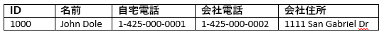
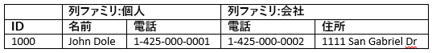

# <a name="quickstart-query-apache-hbase-in-azure-hdinsight-with-hbase-shell"></a>クイック スタート:HBase を使用して Azure HDInsight で Apache HBase を実行する

このクイックスタートでは、Apache HBase シェルを使用して HBase テーブルを作成し、データを挿入し、テーブルのクエリを実行する方法について説明します。

Azure サブスクリプションをお持ちでない場合は、開始する前に [無料アカウント](https://azure.microsoft.com/free/?WT.mc_id=A261C142F) を作成してください。

## <a name="prerequisites"></a>前提条件

* Apache HBase クラスター。 HDInsight クラスターの作成については、[クラスターの作成](../hadoop/apache-hadoop-linux-tutorial-get-started.md#create-cluster)に関するセクションを参照してください。  **HBase** のクラスターの種類を選択するようにしてください。

* SSH クライアント 詳細については、[SSH を使用して HDInsight (Apache Hadoop) に接続する方法](../hdinsight-hadoop-linux-use-ssh-unix.md)に関するページを参照してください。

## <a name="create-a-table-and-manipulate-data"></a>テーブルを作成してデータを操作する

多くの場合、データは次のような表形式で表示されます。



HBase ([クラウド BigTable](https://cloud.google.com/bigtable/) の実装) では、同じデータが次のように表示されます。



SSH を使用して HBase クラスターに接続し、Apache HBase シェルを使用して HBase テーブルの作成、データの挿入、データのクエリを行うことができます。

1. `ssh` コマンドを使用して HBase クラスターに接続します。 次のコマンドを編集して `CLUSTERNAME` をクラスターの名前に置き換えてから、そのコマンドを入力します。

    ```cmd
    ssh sshuser@CLUSTERNAME-ssh.azurehdinsight.net
    ```

2. `hbase shell` コマンドを使用して、HBase 対話型シェルを起動します。 SSH 接続で次のコマンドを入力します。

    ```bash
    hbase shell
    ```

3. `create` コマンドを使用して、2 つの列ファミリを持つ HBase テーブルを作成します。 次のコマンドを入力します。

    ```hbase
    create 'Contacts', 'Personal', 'Office'
    ```

4. `list` コマンドを使用して、HBase 内のすべてのテーブルを一覧表示します。 次のコマンドを入力します。

    ```hbase
    list
    ```

5. `put` コマンドを使用して、特定のテーブルの指定行の指定列に値を挿入します。 次のコマンドを入力します。

    ```hbase
    put 'Contacts', '1000', 'Personal:Name', 'John Dole'
    put 'Contacts', '1000', 'Personal:Phone', '1-425-000-0001'
    put 'Contacts', '1000', 'Office:Phone', '1-425-000-0002'
    put 'Contacts', '1000', 'Office:Address', '1111 San Gabriel Dr.'
    ```

6. `scan` コマンドを使用して、`Contacts` テーブルのデータをスキャンして返します。 次のコマンドを入力します。

    ```hbase
    scan 'Contacts'
    ```

7. `get` コマンドを使用して、行のコンテンツを取り込みます。 次のコマンドを入力します。

    ```hbase
    get 'Contacts', '1000'
    ```

    1 行しかないので、`scan` コマンドを使用したときと同じような結果が表示されます。

8. `delete` コマンドを使用して、テーブル内のセル値を削除します。 次のコマンドを入力します。

    ```hbase
    delete 'Contacts', '1000', 'Office:Address'
    ```

9. `disable` コマンドを使用して、テーブルを無効にします。 次のコマンドを入力します。

    ```hbase
    disable 'Contacts'
    ```

10. `drop` コマンドを使用して、HBase からテーブルを削除します。 次のコマンドを入力します。

    ```hbase
    drop 'Contacts'
    ```

11. `exit` コマンドを使用して、HBase 対話型シェルを停止します。 次のコマンドを入力します。

    ```hbase
    exit
    ```

HBase テーブル スキーマの詳細については、[Apache HBase スキーマの設計の概要](http://0b4af6cdc2f0c5998459-c0245c5c937c5dedcca3f1764ecc9b2f.r43.cf2.rackcdn.com/9353-login1210_khurana.pdf)に関するページを参照してください。 HBase コマンドの詳細については、「[Apache HBase のリファレンス ガイド](https://hbase.apache.org/book.html#quickstart)」を参照してください。

## <a name="clean-up-resources"></a>リソースのクリーンアップ

このクイックスタートを完了したら、必要に応じてクラスターを削除できます。 HDInsight を使用すると、データは Azure Storage に格納されるため、クラスターは、使用されていない場合に安全に削除できます。 また、HDInsight クラスターは、使用していない場合でも課金されます。 クラスターの料金は Storage の料金の何倍にもなるため、クラスターを使用しない場合は削除するのが経済的にも合理的です。

クラスターを削除するには、「[ブラウザー、PowerShell、または Azure CLI を使用して HDInsight クラスターを削除する](../hdinsight-delete-cluster.md)」を参照してください。

## <a name="next-steps"></a>次の手順

このクイックスタートでは、Apache HBase シェルを使用して HBase テーブルを作成し、データを挿入し、テーブルのクエリを実行する方法について説明しました。 HBase に格納されたデータの詳細について、次の記事で、Apache Spark を使用してクエリを実行する方法を紹介します。

> [!div class="nextstepaction"]
> [Apache Spark を使用した Apache HBase データの読み取り/書き込み](../hdinsight-using-spark-query-hbase.md)