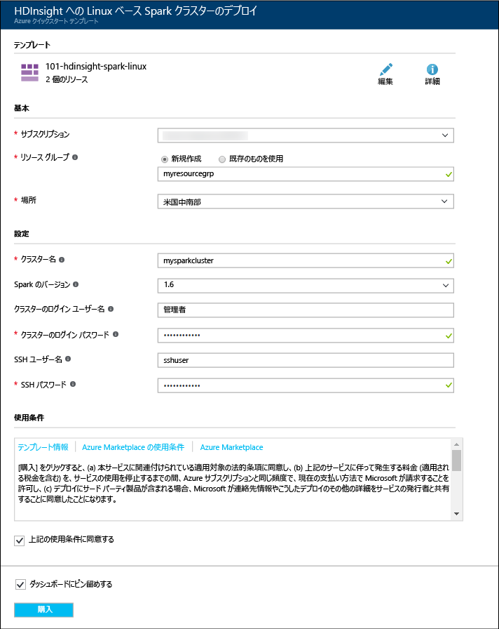

# 作業開始: HDInsight で Apache Spark クラスターを作成し、対話型の Spark SQL クエリを実行する

HDInsight で [Apache Spark](hdinsight-apache-spark-overview.md) クラスターを作成し、[Jupyter](https://jupyter.org) Notebook を使用して対話型の Spark SQL クエリを実行する方法について説明します。

   

## 前提条件

* **Azure サブスクリプション**。 このチュートリアルを開始する前に、Azure サブスクリプションが必要です。 「[無料の Azure アカウントを今すぐ作成しましょう](https://azure.microsoft.com/free)」をご覧ください。

## HDInsight Spark クラスターの作成

このセクションでは、[Azure Resource Manager テンプレート](https://azure.microsoft.com/resources/templates/101-hdinsight-spark-linux/)を使用して HDInsight Spark クラスターを作成します。 その他のクラスター作成方法については、「 [HDInsight での Linux ベースの Hadoop クラスターの作成](hdinsight-hadoop-provision-linux-clusters.md)」を参照してください。

1. 次の画像をクリックして Azure ポータルでテンプレートを開きます。         

    

2. 次の値を入力します。

    

    * **サブスクリプション**: このクラスター向けに Azure サブスクリプションを選択します。
    * **リソース グループ**: リソース グループを作成するか、既存のリソース グループを選択します。 リソース グループは、プロジェクトの Azure リソースを管理するために使用されます。
    * **場所**: リソース グループの場所を選択します。  この場所は、既定のクラスター ストレージと HDInsight クラスター向けにも使用されます。
    * **ClusterName**: 作成する Hadoop クラスターの名前を入力します。
    * **Spark のバージョン**: クラスターにインストールする Spark バージョンを選択します。
    * **クラスターのログイン名とパスワード**: 既定のログイン名は admin です。
    * **SSH のユーザー名とパスワード**。

   これらの値を書き留めておいてください。  この情報は後で必要になります。

3. **[上記の使用条件に同意する]**、**[ダッシュボードにピン留めする]** の順に選択し、**[購入]** をクリックします。 "Submitting deployment for Template deployment" という新しいタイルが表示されます。 クラスターの作成には約 20 分かかります。

> [!NOTE]
> この記事では、[クラスター ストレージとして Azure Storage BLOB](hdinsight-hadoop-use-blob-storage.md) を使用する Spark クラスターを作成します。 既定のストレージとして Azure Storage BLOB を使用し、さらに追加のストレージとして [Azure Data Lake Store](../data-lake-store/data-lake-store-overview.md) を使用する Spark クラスターを作成することもできます。 手順については、 [Data Lake Store を使用した HDInsight クラスターの作成](../data-lake-store/data-lake-store-hdinsight-hadoop-use-portal.md)に関するページを参照してください。
>
>

## 対話型の Spark SQL クエリの実行

このセクションでは、Jupyter Notebook を使用して、先ほど作成した Spark クラスターに対して対話型の Spark SQL クエリを実行します。 HDInsight の Spark クラスターには、Jupyter Notebook で使用できる 3 つのカーネルが用意されています。 次のとおりです。

* **PySpark** (Python で記述されたアプリケーション用)
* **PySpark3** (Python3 で記述されたアプリケーション用)
* **Spark** (Scala で記述されたアプリケーション用)

この記事では、対話型の Spark SQL クエリを実行する Notebook で **PySpark** カーネルを使用します。 これらのカーネルの詳細については、[HDInsight での Apache Spark クラスターと Jupyter Notebook カーネルの使用](hdinsight-apache-spark-jupyter-notebook-kernels.md)に関する記事を参照してください。 PySpark カーネルを使用した場合の主な利点のいくつかを次に示します。

* Spark と Hive のコンテキストが自動的に設定されます。
* セル マジック (`%%sql` など) を使用すると、コード スニペットを付けずに対話型の SQL または Hive クエリが直接実行されます。
* 対話型のクエリの出力は、自動的に視覚化されます。

### PySpark カーネルを使用した Jupyter Notebook の作成

1. [Azure Portal](https://portal.azure.com/)を開きます。

2. クラスターをダッシュボードにピン留めしている場合は、ダッシュボードから目的のクラスターのタイルをクリックしてクラスター ブレードを起動します。

    クラスターをダッシュボードにピン留めしていない場合は、左側のウィンドウで **[HDInsight クラスター]** をクリックし、作成したクラスターをクリックします。

3. **クイック リンク**で **[クラスター ダッシュボード]** をクリックし、**[Jupyter Notebook]** をクリックします。 入力を求められたら、クラスターの管理者資格情報を入力します。

   

   > [!NOTE]
   > ブラウザーで次の URL を開くことで、クラスターの Jupyter Notebook にアクセスすることもできます。 **CLUSTERNAME** をクラスターの名前に置き換えます。
   >
   > `https://CLUSTERNAME.azurehdinsight.net/jupyter`
   >
   >
3. Notebook を作成します。 **[新規]** をクリックし、**[PySpark]** をクリックします。

   

   Untitled(Untitled.pynb) という名前の新しい Notebook が作成されて開かれます。

4. 上部の Notebook 名をクリックし、目的のわかりやすい名前を入力します。

    

5. 次のコードを空のセルに貼り付け、**Shift + Enter** キーを押してコードを実行します。 このコードにより、このシナリオに必要な種類がインポートされます。

        from pyspark.sql.types import *

    PySpark カーネルを使用して Notebook を作成したため、コンテキストを明示的に作成する必要はありません。 最初のコード セルを実行すると、Spark コンテキストと Hive コンテキストが自動的に作成されます。

    

    Jupyter で対話型のクエリを実行するたびに、Web ブラウザー ウィンドウのタイトルに **[(ビジー)]** ステータスと Notebook のタイトルが表示されます。 また、右上隅にある **PySpark** というテキストの横に塗りつぶされた円も表示されます。 ジョブが完了すると、白抜きの円に変化します。

6. 次のコードを実行してサンプル データセットを一時テーブル (**hvac**) として登録します。

        # Load the data
        hvacText = sc.textFile("wasbs:///HdiSamples/HdiSamples/SensorSampleData/hvac/HVAC.csv")

        # Create the schema
        hvacSchema = StructType([StructField("date", StringType(), False),StructField("time", StringType(), False),StructField("targettemp", IntegerType(), False),StructField("actualtemp", IntegerType(), False),StructField("buildingID", StringType(), False)])

        # Parse the data in hvacText
        hvac = hvacText.map(lambda s: s.split(",")).filter(lambda s: s[0] != "Date").map(lambda s:(str(s[0]), str(s[1]), int(s[2]), int(s[3]), str(s[6]) ))

        # Create a data frame
        hvacdf = sqlContext.createDataFrame(hvac,hvacSchema)

        # Register the data frame as a table to run queries against
        hvacdf.registerTempTable("hvac")

    HDInsight の Spark クラスターにはサンプル データ ファイル **hvac.csv** が付属しています。このファイルは **\HdiSamples\HdiSamples\SensorSampleData\hvac** にあります。

7. そのデータに対して対話型のクエリを実行するには、次のコードを使用します。

        %%sql
        SELECT buildingID, (targettemp - actualtemp) AS temp_diff, date FROM hvac WHERE date = \"6/1/13\"

   PySpark カーネルを使用しているため、`%%sql` マジックを使用して、作成した一時テーブル **hvac** に対して対話型の SQL クエリを直接実行できます。 `%%sql` マジックの詳細と、PySpark カーネルで使用できるその他のマジックの詳細については、[Spark HDInsight クラスターと Jupyter Notebook で使用可能なカーネル](hdinsight-apache-spark-jupyter-notebook-kernels.md#parameters-supported-with-the-sql-magic)に関する記事を参照してください。

   次の表形式の出力が既定で表示されます。

     

    他の視覚化でも結果を表示できます。 たとえば、ある出力の領域グラフは次のようになります。

    

9. アプリケーションの実行後は、Notebook をシャットダウンしてクラスター リソースを解放します。 そのためには、Notebook の **[ファイル]** メニューの **[Close and Halt]** (閉じて停止) をクリックします。

## クラスターを削除する
[!INCLUDE [delete-cluster-warning](../../includes/hdinsight-delete-cluster-warning.md)]

## アクセス制御のトラブルシューティング

HDInsight クラスターの作成で問題が発生した場合は、[アクセス制御の要件](hdinsight-administer-use-portal-linux.md#create-clusters)に関するページを参照してください。

## 関連項目
* [概要: Azure HDInsight での Apache Spark](hdinsight-apache-spark-overview.md)

### シナリオ
* [Spark と BI: HDInsight と BI ツールで Spark を使用した対話型データ分析の実行](hdinsight-apache-spark-use-bi-tools.md)
* [Spark と Machine Learning: HDInsight で Spark を使用して HVAC データを基に建物の温度を分析する](hdinsight-apache-spark-ipython-notebook-machine-learning.md)
* [Spark と Machine Learning: HDInsight で Spark を使用して食品の検査結果を予測する](hdinsight-apache-spark-machine-learning-mllib-ipython.md)
* [Spark ストリーミング: リアルタイム ストリーミング アプリケーションを作成するための HDInsight での Spark の使用](hdinsight-apache-spark-eventhub-streaming.md)
* [Website log analysis using Spark in HDInsight (HDInsight での Spark を使用した Web サイト ログ分析)](hdinsight-apache-spark-custom-library-website-log-analysis.md)
* [HDInsight での Spark を使用した Application Insight テレメトリ データ分析](hdinsight-spark-analyze-application-insight-logs.md)

### アプリケーションの作成と実行
* [Scala を使用してスタンドアロン アプリケーションを作成する](hdinsight-apache-spark-create-standalone-application.md)
* [Livy を使用して Spark クラスターでジョブをリモートで実行する](hdinsight-apache-spark-livy-rest-interface.md)

### ツールと拡張機能
* [IntelliJ IDEA 用の HDInsight Tools プラグインを使用して Spark Scala アプリケーションを作成し、送信する](hdinsight-apache-spark-intellij-tool-plugin.md)
* [IntelliJ IDEA 用の HDInsight Tools プラグインを使用して Spark アプリケーションをリモートでデバッグする](hdinsight-apache-spark-intellij-tool-plugin-debug-jobs-remotely.md)
* [HDInsight の Spark クラスターで Zeppelin Notebook を使用する](hdinsight-apache-spark-zeppelin-notebook.md)
* [HDInsight 用の Spark クラスターの Jupyter Notebook で使用可能なカーネル](hdinsight-apache-spark-jupyter-notebook-kernels.md)
* [Jupyter Notebook で外部のパッケージを使用する](hdinsight-apache-spark-jupyter-notebook-use-external-packages.md)
* [Jupyter をコンピューターにインストールして HDInsight Spark クラスターに接続する](hdinsight-apache-spark-jupyter-notebook-install-locally.md)

### リソースの管理
* [Azure HDInsight での Apache Spark クラスターのリソースの管理](hdinsight-apache-spark-resource-manager.md)
* [HDInsight の Apache Spark クラスターで実行されるジョブの追跡とデバッグ](hdinsight-apache-spark-job-debugging.md)

[hdinsight-versions]: hdinsight-component-versioning.md
[hdinsight-upload-data]: hdinsight-upload-data.md
[hdinsight-storage]: hdinsight-hadoop-use-blob-storage.md

[azure-purchase-options]: http://azure.microsoft.com/pricing/purchase-options/
[azure-member-offers]: http://azure.microsoft.com/pricing/member-offers/
[azure-free-trial]: http://azure.microsoft.com/pricing/free-trial/
[azure-create-storageaccount]: storage-create-storage-account.md

