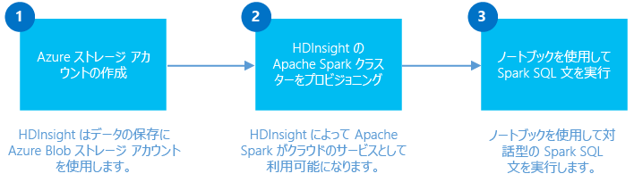

<properties
	pageTitle="HDInsight Linux での Spark クラスターの作成と、Jupyter から Spark SQL を使用した対話型の分析 | Microsoft Azure"
	description="HDInsight に Apache Spark クラスターをすばやく作成し、Jupyter Notebook から Spark SQL を使用して対話型クエリを実行する手順を説明します。"
	services="hdinsight"
	documentationCenter=""
	authors="nitinme"
	manager="jhubbard"
	editor="cgronlun"
	tags="azure-portal"/>

<tags
	ms.service="hdinsight"
	ms.workload="big-data"
	ms.tgt_pltfrm="na"
	ms.devlang="na"
	ms.topic="get-started-article"
	ms.date="10/05/2016"
	ms.author="nitinme"/>

# 概要: HDInsight Linux の Apache Spark クラスターの作成と Spark SQL を使用した対話型クエリの実行

HDInsight で Apache Spark クラスターを作成し、Spark クラスターで [Jupyter](https://jupyter.org) Notebook を使用して Spark SQL の対話型クエリを実行する方法について説明します。

   

[AZURE.INCLUDE [delete-cluster-warning](../../includes/hdinsight-delete-cluster-warning.md)]

## 前提条件

- **Azure サブスクリプション**。このチュートリアルを開始する前に、Azure サブスクリプションが必要です。[Azure 無料試用版の取得](https://azure.microsoft.com/documentation/videos/get-azure-free-trial-for-testing-hadoop-in-hdinsight/)に関するページを参照してください。

- **Secure Shell (SSH) クライアント**: Linux、Unix、OS X システムには、`ssh` コマンドで SSH クライアントを提供していました。Windows システムの場合は [PuTTY](http://www.chiark.greenend.org.uk/~sgtatham/putty/download.html) をお勧めします。
    
- **Secure Shell (SSH) キー** (省略可能): クラスターへの接続に使用する SSH アカウントは、パスワードまたはパブリック キーを使用してセキュリティで保護できます。パスワードを使用すると、すぐに始められます。すばやくクラスターを作成し、テスト ジョブをいくつか実行する場合に、このオプションを使用してください。キーのほうが安全ですが、追加の設定が必要です。運用環境のクラスターを作成するとき、この手法を利用することがあります。この記事では、パスワード手法を使用します。HDInsight で SSH キーを作成して使用する手順については、次の記事を参照してください。

	-  Linux コンピューターの場合 - [Linux、Unix、OS X から HDInsight 上の Linux ベースの Hadoop で SSH を使用する](hdinsight-hadoop-linux-use-ssh-unix.md)
    
	-  Windows コンピューターの場合 - [HDInsight の Linux ベースの Hadoop で Windows から SSH を使用する](hdinsight-hadoop-linux-use-ssh-windows.md)

>[AZURE.NOTE] この記事では、Azure Resource Manager テンプレートを基に、[クラスター ストレージとして Azure Storage BLOB](hdinsight-hadoop-use-blob-storage.md) を使用する Spark クラスターを作成します。既定のストレージとして Azure Storage BLOB を使用し、さらに追加のストレージとして [Azure Data Lake Store](../data-lake-store/data-lake-store-overview.md) を使用する Spark クラスターを作成することもできます。手順については、[Data Lake Store を使用した HDInsight クラスターの作成](../data-lake-store/data-lake-store-hdinsight-hadoop-use-portal.md)に関するページを参照してください。

### アクセス制御の要件

[AZURE.INCLUDE [access-control](../../includes/hdinsight-access-control-requirements.md)]

## Spark クラスターを作成する

このセクションでは、Azure Resource Manager テンプレートを使用して HDInsight バージョン 3.4 クラスター (Spark バージョン 1.6.1) を作成します。HDInsight バージョンとその SLA については、「[HDInsight コンポーネントのバージョン](hdinsight-component-versioning.md)」をご覧ください。その他のクラスター作成方法については、「[HDInsight での Linux ベースの Hadoop クラスターの作成](hdinsight-hadoop-provision-linux-clusters.md)」を参照してください。

1. 次の画像をクリックして Azure Portal でテンプレートを開きます。

    
    
    テンプレートは、次のパブリック BLOB コンテナー内にあります。*https://hditutorialdata.blob.core.windows.net/armtemplates/create-linux-based-spark-cluster-in-hdinsight.json*
   
2. [パラメーター] ブレードで、次の各項目を入力します。

    - **ClusterName**: 作成する Hadoop クラスターの名前を入力します。
    - **クラスターのログイン名とパスワード**: 既定のログイン名は admin です。
    - **SSH のユーザー名とパスワード**。
    
    これらの値を書き留めておいてください。この情報は後で必要になります。

    > [AZURE.NOTE] SSH はコマンドラインで HDInsight クラスターにリモート アクセスするために使用されます。ここで使用するユーザー名とパスワードは、SSH でクラスターに接続するときに使用されます。また、SSH ユーザー名は一意にする必要があります。この名前により、すべての HDInsight クラスター ノードでユーザー アカウントが作成されます。次はクラスターのサービスのために予約されている名前の一部であり、SSH ユーザー名として使用できません。
    >
    > root、hdiuser、storm、hbase、ubuntu、zookeeper、hdfs、yarn、mapred、hbase、hive、oozie、falcon、sqoop、admin、tez、hcat、hdinsight-zookeeper

	> HDInsight での SSH の使用方法の詳細については、次の記事を参照してください。

	> * [Linux、Unix、OS X から HDInsight 上の Linux ベースの Hadoop で SSH キーを使用する](hdinsight-hadoop-linux-use-ssh-unix.md)
	> * [HDInsight の Linux ベースの Hadoop で Windows から SSH を使用する](hdinsight-hadoop-linux-use-ssh-windows.md)

    
3\. **[OK]** をクリックしてパラメーターを保存します。

4\. **[カスタム デプロイ]** ブレードで **[リソース グループ]** ボックスをクリックし、**[新規]** をクリックして新しいリソース グループを作成します。リソース グループとは、クラスター、依存するストレージ アカウント、その他のリンクされたリソースをグループ化しているコンテナーです。

5\. **[法律条項]** をクリックし、**[作成]** をクリックします。

6\. **[作成]** をクリックします。"Submitting deployment for Template deployment" という新しいタイルが表示されます。クラスターと SQL Database の作成には約 20 分かかります。

## Jupyter Notebook を使用して Spark SQL クエリを実行する

このセクションでは、Jupyter Notebook を使用して、Spark クラスターに対して Spark SQL クエリを実行します。HDInsight の Spark クラスターには、Jupyter Notebook で使用できる 2 つのカーネルが用意されています。次のとおりです。

* **PySpark** (Python で記述されたアプリケーション用)
* **Spark** (Scala で記述されたアプリケーション用)

この記事では、PySpark カーネルを使用します。[Spark HDInsight クラスターと Jupyter Notebook で使用可能なカーネル](hdinsight-apache-spark-jupyter-notebook-kernels.md#why-should-i-use-the-new-kernels)に関する記事で、PySpark カーネルを使用する利点に関する詳細を確認できますが、主な利点のいくつかをここで紹介します。

* Spark と Hive のコンテキストを設定する必要はありません。これらは自動的に設定されます。
* セル マジック (`%%sql` など) を使用して、コード スニペットを付けずに SQL または Hive クエリを直接実行できます。
* SQL または Hive クエリの出力は、自動的に視覚化されます。

### PySpark カーネルを使用した Jupyter Notebook の作成 

1. [Azure ポータル](https://portal.azure.com/)のスタート画面で Spark クラスターのタイルをクリックします (スタート画面にピン留めしている場合)。**[すべて参照]** > **[HDInsight クラスター]** でクラスターに移動することもできます。

2. Spark クラスター ブレードから **[クラスター ダッシュボード]** をクリックし、**[Jupyter Notebook]** をクリックします。入力を求められたら、クラスターの管理者資格情報を入力します。

	> [AZURE.NOTE] ブラウザーで次の URL を開き、クラスターの Jupyter Notebook にアクセスすることもできます。__CLUSTERNAME__ をクラスターの名前に置き換えます。
	>
	> `https://CLUSTERNAME.azurehdinsight.net/jupyter`

2. 新しい Notebook を作成します。**[新規]** をクリックし、**[PySpark]** をクリックします。

	

3. Untitled.pynb という名前の新しい Notebook が作成されて開かれます。上部の Notebook 名をクリックし、わかりやすい名前を入力します。

	

4. PySpark カーネルを使用して Notebook を作成したため、コンテキストを明示的に作成する必要はありません。最初のコード セルを実行すると、Spark および Hive コンテキストが自動的に作成されます。このシナリオに必要な種類をインポートすることから始めることができます。このためには、次のコード スニペットをセルに貼り付けて、**Shift + Enter** キーを押します。

		from pyspark.sql.types import *
		
	Jupyter でジョブを実行するたびに、Web ブラウザー ウィンドウのタイトルに **[(ビジー)]** ステータスと Notebook のタイトルが表示されます。また、右上隅にある **PySpark** というテキストの横に塗りつぶされた円も表示されます。ジョブが完了すると、白抜きの円に変化します。

	 

4. サンプル データを一時テーブルに読み込みます。HDInsight の Spark クラスターを作成すると、サンプル データ ファイル **hvac.csv** が関連するストレージ アカウントの **\\HdiSamples\\HdiSamples\\SensorSampleData\\hvac** にコピーされます。

	次のコード サンプルを空のセルに貼り付けて、**Shift + Enter** キーを押します。このコード サンプルは、**hvac** という一時テーブルにデータを登録します。

		# Load the data
		hvacText = sc.textFile("wasbs:///HdiSamples/HdiSamples/SensorSampleData/hvac/HVAC.csv")
		
		# Create the schema
		hvacSchema = StructType([StructField("date", StringType(), False),StructField("time", StringType(), False),StructField("targettemp", IntegerType(), False),StructField("actualtemp", IntegerType(), False),StructField("buildingID", StringType(), False)])
		
		# Parse the data in hvacText
		hvac = hvacText.map(lambda s: s.split(",")).filter(lambda s: s[0] != "Date").map(lambda s:(str(s[0]), str(s[1]), int(s[2]), int(s[3]), str(s[6]) ))
		
		# Create a data frame
		hvacdf = sqlContext.createDataFrame(hvac,hvacSchema)
		
		# Register the data fram as a table to run queries against
		hvacdf.registerTempTable("hvac")

5. PySpark カーネルを使用しているため、`%%sql` マジックを使用して作成した一時テーブル **hvac** で SQL クエリを直接実行できます。`%%sql` マジックの詳細と、PySpark カーネルで使用できるその他のマジックの詳細については、[Spark HDInsight クラスターと Jupyter Notebook で使用可能なカーネル](hdinsight-apache-spark-jupyter-notebook-kernels.md#why-should-i-use-the-new-kernels)に関する記事を参照してください。
		
		%%sql
		SELECT buildingID, (targettemp - actualtemp) AS temp_diff, date FROM hvac WHERE date = "6/1/13"

5. ジョブが正常に完了すると、既定で次の出力が表示されます。

 	

	他の視覚化でも結果を表示できます。たとえば、ある出力の領域グラフは次のようになります。

	

6. アプリケーションの実行が完了したら、Notebook をシャットダウンしてリソースを解放する必要があります。そのためには、Notebook の **[ファイル]** メニューの **[閉じて停止]** をクリックします。これにより、Notebook がシャットダウンされ、閉じられます。

##クラスターを削除する

[AZURE.INCLUDE [delete-cluster-warning](../../includes/hdinsight-delete-cluster-warning.md)]

## 関連項目

* [概要: Azure HDInsight での Apache Spark](hdinsight-apache-spark-overview.md)

### シナリオ

* [Spark と BI: HDInsight と BI ツールで Spark を使用した対話型データ分析の実行](hdinsight-apache-spark-use-bi-tools.md)

* [Spark と Machine Learning: HDInsight で Spark を使用して HVAC データを基に建物の温度を分析する](hdinsight-apache-spark-ipython-notebook-machine-learning.md)

* [Spark と Machine Learning: HDInsight で Spark を使用して食品の検査結果を予測する](hdinsight-apache-spark-machine-learning-mllib-ipython.md)

* [Spark ストリーミング: リアルタイム ストリーミング アプリケーションを作成するための HDInsight での Spark の使用](hdinsight-apache-spark-eventhub-streaming.md)

* [Website log analysis using Spark in HDInsight (HDInsight での Spark を使用した Web サイト ログ分析)](hdinsight-apache-spark-custom-library-website-log-analysis.md)

* [HDInsight での Spark を使用した Application Insight テレメトリ データ分析](hdinsight-spark-analyze-application-insight-logs.md)

### アプリケーションの作成と実行

* [Scala を使用してスタンドアロン アプリケーションを作成する](hdinsight-apache-spark-create-standalone-application.md)

* [Livy を使用して Spark クラスターでジョブをリモートで実行する](hdinsight-apache-spark-livy-rest-interface.md)

### ツールと拡張機能

* [Use HDInsight Tools Plugin for IntelliJ IDEA to create and submit Spark Scala applicatons (Linux)](hdinsight-apache-spark-intellij-tool-plugin.md)

* [IntelliJ IDEA 用の HDInsight Tools プラグインを使用して Spark アプリケーションをリモートでデバッグする](hdinsight-apache-spark-intellij-tool-plugin-debug-jobs-remotely.md)

* [HDInsight の Spark クラスターで Zeppelin Notebook を使用する](hdinsight-apache-spark-use-zeppelin-notebook.md)

* [HDInsight 用の Spark クラスターの Jupyter Notebook で使用可能なカーネル](hdinsight-apache-spark-jupyter-notebook-kernels.md)

* [Jupyter Notebook で外部のパッケージを使用する](hdinsight-apache-spark-jupyter-notebook-use-external-packages.md)

* [Jupyter をコンピューターにインストールして HDInsight Spark クラスターに接続する](hdinsight-apache-spark-jupyter-notebook-install-locally.md)

### リソースの管理

* [Azure HDInsight での Apache Spark クラスターのリソースの管理](hdinsight-apache-spark-resource-manager.md)

* [HDInsight の Apache Spark クラスターで実行されるジョブの追跡とデバッグ](hdinsight-apache-spark-job-debugging.md)

[hdinsight-versions]: hdinsight-component-versioning.md
[hdinsight-upload-data]: hdinsight-upload-data.md
[hdinsight-storage]: hdinsight-hadoop-use-blob-storage.md

[azure-purchase-options]: http://azure.microsoft.com/pricing/purchase-options/
[azure-member-offers]: http://azure.microsoft.com/pricing/member-offers/
[azure-free-trial]: http://azure.microsoft.com/pricing/free-trial/
[azure-management-portal]: https://manage.windowsazure.com/
[azure-create-storageaccount]: storage-create-storage-account.md

<!---HONumber=AcomDC_1005_2016-->