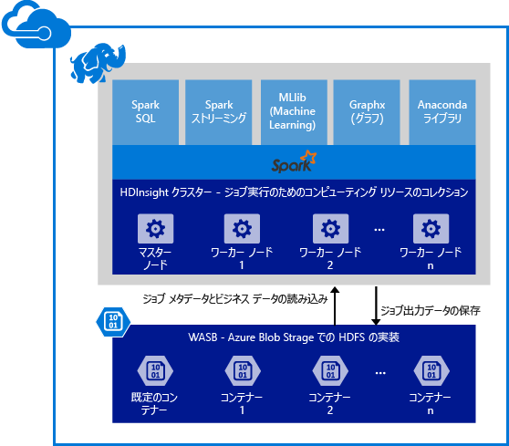

# 概要: HDInsight での Apache Spark

<a href="http://spark.apache.org/" target="_blank">Apache Spark</a> はビッグ データ分析アプリケーションのパフォーマンスを向上するメモリ内の処理をサポートする、オープン ソースの並列処理のフレームワークです。 Spark 処理エンジンは、速度、使いやすさ、高度な分析用に作成されています。 Spark のメモリ内の計算能力により、機械学習とグラフ計算における反復的なアルゴリズムに対して、Spark は適切な選択肢となります。 また、Spark は Azure Storage (WASB) と互換性があるので、Azure に格納されている既存データを Spark で簡単に処理できます。

HDInsight で Spark クラスターを作成するときは、Spark をインストールおよび構成して Azure コンピューティング リソースを作成します。 HDInsight で Spark クラスターを作成するのにかかる時間はわずか約&10; 分です。 処理対象のデータは、Azure Storage に格納されます。 [HDInsight での Azure Storage の使用][hdinsight-storage]に関するページを参照してください。

**Azure HDInsight での Apache Spark の概要** [HDInsight での Spark クラスターの作成と Jupyter を使用したサンプル アプリケーションの実行](hdinsight-apache-spark-jupyter-spark-sql.md)に関するクイック スタートを参照してください。

> [!NOTE]
> 現在のリリースでの既知の問題と制限事項の一覧については、[Azure HDInsight における Apache Spark の既知の問題](hdinsight-apache-spark-known-issues.md)に関するページを参照してください。
> 
> 

## Azure HDInsight で Spark を使用する理由
Azure HDInsight は、完全に管理された Spark サービスを提供します。 HDInsight で Spark を使用する利点は次のとおりです。

| 機能 | Description |
| --- | --- |
| クラスターの作成のしやすさ |Microsoft Azure 管理ポータル、Azure PowerShell、または HDInsight .NET SDK を使用すると、HDInsight に新しい Spark クラスターを数分で作成できます。 「 [HDInsight での Spark クラスターの概要](hdinsight-apache-spark-jupyter-spark-sql.md) |
| 使いやすさ |HDInsight クラスターの Spark には、Jupyter の Notebook が事前に構成されています。 対話型のデータ処理とビジュアル化にこれらを使用できます。 Jupyter Notebook の URL は https://CLUSTERNAME.azurehdinsight.net/jupyter です。 **CLUSTERNAME** を、使用する Spark HDInsight クラスターの名前に置き換えます。 |
| REST API |HDInsight の Spark には、ジョブの送信と実行中のジョブの監視をリモートで実行する REST-API ベースの Spark ジョブ サーバーである [Livy](https://github.com/cloudera/hue/tree/master/apps/spark/java#welcome-to-livy-the-rest-spark-server)が含まれています。 |
| Azure Data Lake Store のサポート |HDInsight の Spark は、プライマリ ストレージだけでなく、追加のストレージとして Azure Data Lake Store を使用するように構成できます (HDInsight 3.5 クラスターの場合のみ)。 Data Lake Store の詳細については、「 [Azure Data Lake Store の概要](../data-lake-store/data-lake-store-overview.md)」を参照してください。 |
| Azure サービスとの統合 |HDInsight の Spark には、Azure Event Hubs へのコネクタが付属しています。 Spark の一部として既に使用できる [Kafka](http://kafka.apache.org/)に加えて、Event Hubs を使用してストリーミング アプリケーションを作成できます。 |
| R Server のサポート |HDInsight Spark クラスターで R Server をセットアップして、Spark クラスターによって決められた速度で分散 R 計算を実行できます。 詳細については、 [HDInsight の R Server の使用開始](hdinsight-hadoop-r-server-get-started.md)に関するページを参照してください。 |
| IntelliJ IDEA との統合 |IntelliJ 用の HDInsight プラグインを使用し、アプリケーションを作成して HDInsight Spark クラスターに送信できます。 詳細については、「 [Use HDInsight Tools Plugin for IntelliJ IDEA to create Spark applications for HDInsight Spark Linux cluster (IntelliJ IDEA 用の HDInsight Tools プラグインを使用して HDInsight Spark Linux クラスター向けの Spark アプリケーションを作成する)](hdinsight-apache-spark-intellij-tool-plugin.md)」を参照してください。 |
| 同時クエリ |HDInsight の Spark は同時クエリをサポートします。 これにより、1 人のユーザーからの複数のクエリまたは複数のユーザーおよびアプリケーションからの複数のクエリが、同じクラスター リソースを共有できます。 |
| SSD へのキャッシュ |データのキャッシュ先を、メモリまたはクラスター ノードに取り付けられている SSD から選択できます。 メモリへのキャッシュは、クエリのパフォーマンスは最高ですが、コストがかかります。SSD へのキャッシュは、メモリ内のデータセット全体を収めるのに必要なサイズのクラスターを作成する必要なしにクエリのパフォーマンスを向上できる優れたオプションです。 |
| BI ツールとの統合 |HDInsight の Spark には、データ分析用の [Power BI](http://www.powerbi.com/) や [Tableau](http://www.tableau.com/products/desktop) などの BI ツールへのコネクタが用意されています。 |
| 読み込み済みの Anaconda ライブラリ |HDInsight の Spark クラスターには、Anaconda ライブラリが事前にインストールされています。 [Anaconda](http://docs.continuum.io/anaconda/) は、機械学習、データ分析、視覚化などのための 200 個近いライブラリを提供します。 |
| 拡張性 |作成中にクラスター内のノード数を指定できますが、ワークロードに一致するようにクラスターを拡大、縮小できます。 すべての HDInsight クラスターでは、クラスター内のノード数を変更できます。 また、すべてのデータは Azure Storage に格納されるため、Spark クラスターはデータの損失なしで削除できます。 |
| 常時サポート |HDInsight の Spark では、エンタープライズ レベルの 24 時間無休体制のサポートと、アップタイム 99.9% の SLA が提供されます。 |

## HDInsight での Spark の使用例
HDInsight の Apache Spark では、次のような主要なシナリオが可能です。

### 対話型のデータ分析と BI
[チュートリアルを見る](hdinsight-apache-spark-use-bi-tools.md)

HDInsight の Apache Spark では、データは Azure BLOB に格納されます。 ビジネス エキスパートや重要な意思決定者は、そのデータを分析してレポートを作成し、分析されたデータから Microsoft Power BI を使用して対話型レポートを作成できます。 アナリストは Azure Storage の非構造化または半構造化されたデータから開始し、Notebook を使用してデータ用のスキーマを定義し、Microsoft Power BI を使用してデータ モデルを作成できます。 また、HDInsight の Spark は Tableau、Qlikview、SAP Lumira などのサードパーティ製 BI ツールをサポートするので、データ アナリスト、ビジネス エキスパート、重要な意思決定者にとって理想的なプラットフォームです。

### 反復的な Machine Learning 
[チュートリアルを見る: HVAC データを使用して建物の温度を予測する](hdinsight-apache-spark-ipython-notebook-machine-learning.md)

[チュートリアルを見る: 食品検査の結果を予測する](hdinsight-apache-spark-machine-learning-mllib-ipython.md)

Apache Spark には、Spark を基にして作成された機械学習ライブラリである [MLlib](http://spark.apache.org/mllib/)が付属しています。 さらに、HDInsight の Spark には、機械学習用のさまざまなパッケージを含む Python ディストリビューションである Anaconda も含まれています。 これと Jupyter Notebook の組み込みサポートを組み合わせることで、Machine Learning アプリケーションを作成するための最高の環境が提供されます。  

### ストリーミングおよびリアルタイムのデータ分析
[チュートリアルを見る](hdinsight-apache-spark-eventhub-streaming.md)

リアルタイムのデータ分析は、到着したデータの処理によるデータ洞察の時間短縮から、真のストリーミング ソリューションの構築まで、広範囲のシナリオに使用されます。 HDInsight の Spark では、リアルタイム分析ソリューションを構築するためのリッチなサポートが提供されます。 Spark には既に Kafka、Flume、Twitter、ZeroMQ、TCP ソケットなどの多数のソースからデータを取り込むためのコネクタがありますが、HDInsight の Spark では Azure Event Hubs からデータを取り込むためのファーストクラスのサポートが追加されます。 Event Hubs は、Azure で最も広く使用されているキュー サービスです。 すぐに使用できる Event Hubs のサポートにより、HDInsight の Spark はリアルタイム分析パイプラインを構築するための理想的なプラットフォームです。

## Spark クラスターに含まれるコンポーネント
HDInsight の Spark には、クラスターで使用できる次のコンポーネントが既定で含まれています。

* [Spark Core](https://spark.apache.org/docs/1.5.1/)。 Spark Core、Spark SQL、Spark ストリーミング API、GraphX、MLlib が含まれます。
* [Anaconda](http://docs.continuum.io/anaconda/)
* [Livy](https://github.com/cloudera/hue/tree/master/apps/spark/java#welcome-to-livy-the-rest-spark-server)
* [Jupyter Notebook](https://jupyter.org)

HDInsight の Spark では、Microsoft Power BI や Tableau などの BI ツールから HDInsight の Spark クラスターに接続するための [ODBC ドライバー](http://go.microsoft.com/fwlink/?LinkId=616229) も提供されます。

## どこから始めるか
HDInsight Linux での Spark クラスターの作成から始めてください。 「 [クイック スタート: HDInsight Linux での Spark クラスターの作成と Jupyter を使用したサンプル アプリケーションの実行](hdinsight-apache-spark-jupyter-spark-sql.md)」をご覧ください。 

## 次のステップ
### シナリオ
* [Spark と BI: HDInsight と BI ツールで Spark を使用した対話型データ分析の実行](hdinsight-apache-spark-use-bi-tools.md)
* [Spark と Machine Learning: HDInsight で Spark を使用して HVAC データを基に建物の温度を分析する](hdinsight-apache-spark-ipython-notebook-machine-learning.md)
* [Spark と Machine Learning: HDInsight で Spark を使用して食品の検査結果を予測する](hdinsight-apache-spark-machine-learning-mllib-ipython.md)
* [Spark ストリーミング: リアルタイム ストリーミング アプリケーションを作成するための HDInsight での Spark の使用](hdinsight-apache-spark-eventhub-streaming.md)
* [Website log analysis using Spark in HDInsight (HDInsight での Spark を使用した Web サイト ログ分析)](hdinsight-apache-spark-custom-library-website-log-analysis.md)

### アプリケーションの作成と実行
* [Scala を使用してスタンドアロン アプリケーションを作成する](hdinsight-apache-spark-create-standalone-application.md)
* [Livy を使用して Spark クラスターでジョブをリモートで実行する](hdinsight-apache-spark-livy-rest-interface.md)

### ツールと拡張機能
* [Use HDInsight Tools Plugin for IntelliJ IDEA to create and submit Spark Scala applicatons (Linux)](hdinsight-apache-spark-intellij-tool-plugin.md)
* [IntelliJ IDEA 用の HDInsight Tools プラグインを使用して Spark アプリケーションをリモートでデバッグする](hdinsight-apache-spark-intellij-tool-plugin-debug-jobs-remotely.md)
* [HDInsight の Spark クラスターで Zeppelin Notebook を使用する](hdinsight-apache-spark-use-zeppelin-notebook.md)
* [HDInsight 用の Spark クラスターの Jupyter Notebook で使用可能なカーネル](hdinsight-apache-spark-jupyter-notebook-kernels.md)
* [Jupyter Notebook で外部のパッケージを使用する](hdinsight-apache-spark-jupyter-notebook-use-external-packages.md)
* [Jupyter をコンピューターにインストールして HDInsight Spark クラスターに接続する](hdinsight-apache-spark-jupyter-notebook-install-locally.md)

### リソースの管理
* [Azure HDInsight での Apache Spark クラスターのリソースの管理](hdinsight-apache-spark-resource-manager.md)
* [HDInsight の Apache Spark クラスターで実行されるジョブの追跡とデバッグ](hdinsight-apache-spark-job-debugging.md)

[hdinsight-storage]: hdinsight-hadoop-use-blob-storage.md

