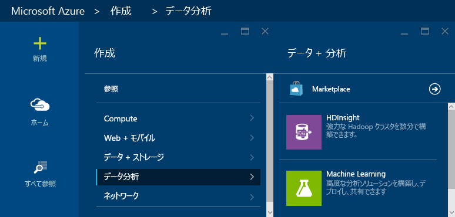
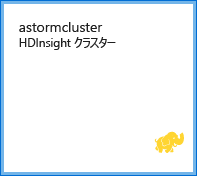
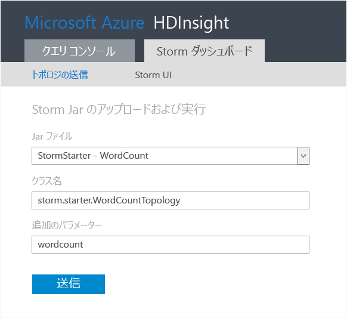
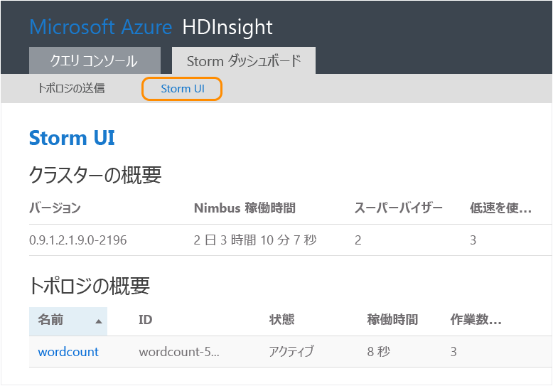
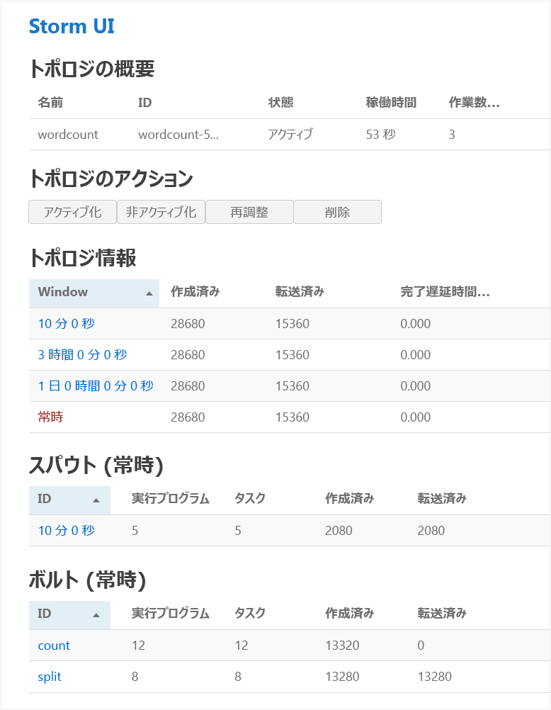
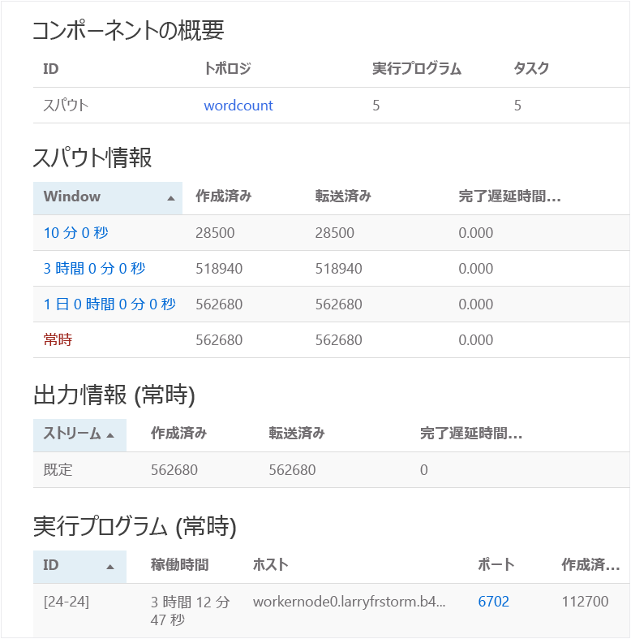

<properties
	pageTitle="Apache Storm チュートリアル: Storm 入門 |Microsoft Azure"
	description="HDInsight での Apache Storm および Storm Starter サンプルを使用したビッグ データ分析の概要Storm を使用してデータをリアルタイムに処理する方法について説明します。"
	keywords="Apache Storm, Apache Storm チュートリアル, ビッグ データの分析, Storm Starter"
	services="hdinsight"
	documentationCenter=""
	authors="Blackmist"
	manager="jhubbard"
	editor="cgronlun"
	tags="azure-portal"/>

<tags
   ms.service="hdinsight"
   ms.devlang="java"
   ms.topic="article"
   ms.tgt_pltfrm="na"
   ms.workload="big-data"
   ms.date="09/07/2016"
   ms.author="larryfr"/>

# Apache Storm チュートリアル: Storm Starter サンプルを使用した HDInsight でのビッグ データ分析の概要

Apache Storm は、データ ストリームの処理を目的とし、スケーラビリティとフォールト トレランスに優れた、分散型のリアルタイム計算システムです。Microsoft Azure HDInsight の Storm を使用して、Storm でリアルタイムで ビッグ データ分析を実行するクラウドベースの Storm クラスターを作成できます。

> [AZURE.NOTE] この記事の手順では、Windows ベースの HDInsight クラスターを作成します。HDInsight クラスターで Linux ベースの Storm を作成する手順については、「[Apache Storm チュートリアル: Storm Starter サンプルを使用した HDInsight でのビッグ データ分析の概要](hdinsight-apache-storm-tutorial-get-started-linux.md)」をご覧ください。

## 開始する前に

[AZURE.INCLUDE [delete-cluster-warning](../../includes/hdinsight-delete-cluster-warning.md)]

Apache Storm チュートリアルを正常に完了するには、次の条件を満たす必要があります。

- **Azure サブスクリプション**。[Azure 無料試用版の取得](https://azure.microsoft.com/documentation/videos/get-azure-free-trial-for-testing-hadoop-in-hdinsight/)に関するページを参照してください。

## Storm クラスターを作成する

HDInsight の Storm では、ログ ファイルとクラスターに送信されるトポロジを格納する Azure Blob Storage を使用します。次の手順を使用して、クラスターに使用する Azure ストレージ アカウントを作成します。

1. [Azure ポータル][preview-portal]にサインインします。

2. **[新規]**、__[データ分析]__、__[HDInsight]__ の順にクリックします。

	

3. __クラスター名__を入力します。クラスターを使用できる場合は、__クラスター名__の横に緑色のチェック マークが表示されます。

4. 複数のサブスクリプションがある場合は、__[サブスクリプション]__ エントリを選択し、クラスターで使用する Azure サブスクリプションを選択します。

5.  __[クラスターの種類の選択]__ を使用して __Storm__ クラスターを選択します。__[オペレーティング システム]__ で [Windows] を選択します。__[Cluster Tier]__ (クラスター階層) に [STANDARD] \(標準) を選択します。最後に、選択ボタンを使用してこれらの設定を保存します。

	

5. __[リソース グループ]__ では、ドロップダウン リストを使用して既存のリソース グループの一覧を表示し、クラスターを作成するグループを選択できます。または、__[新規]__ をクリックし、新しいリソース グループの名前を入力します。新しいグループ名を使用できる場合は、緑のチェック マークが表示されます。

6. __[資格情報]__ を選択し、__[クラスターのログイン ユーザー名]__ と __[クラスターのログイン パスワード]__ を入力します。最後に、__[選択]__ をクリックして資格情報を設定します。このドキュメントではリモート デスクトップは使用しないため、無効にしておくことができます。

	![[クラスターの資格情報] ブレード](./media/hdinsight-apache-storm-tutorial-get-started/clustercredentials.png)

6. __[データ ソース]__ では、エントリを選択して既存のデータ ソースを選択するか、新しいデータ ソースを作成できます。

	![[データ ソース] ブレード](./media/hdinsight-apache-storm-tutorial-get-started/datasource.png)

	現在、HDInsight クラスターのデータ ソースとして Azure ストレージ アカウントを選択できます。次の説明を参照して、__[データ ソース]__ ブレードのエントリを理解してください。

	- __[選択方法]__: サブスクリプションのストレージ アカウントを参照可能にする場合は、__[すべてのサブスクリプションから]__ を設定します。既存のストレージ アカウントの __[ストレージ名]__ と __[アクセス キー]__ を入力する場合は、__[アクセス キー]__ を設定します。

	- __新規作成__: これを使用して、新しいストレージ アカウントを作成します。表示されたフィールドに、ストレージ アカウントの名前を入力します。名前を使用できる場合は、緑色のチェック マークが表示されます。

	- __既定のコンテナーの選択__。これを使用して、クラスターで使用する既定のコンテナーの名前を入力します。任意の名前を入力できますが、特定のクラスターで使用されていることを簡単に認識できるように、クラスターと同じ名前を使用することをお勧めします。

	- __[場所]__: ストレージ アカウントが存在するリージョン、またはストレージ アカウントの作成先のリージョン。

		> [AZURE.IMPORTANT] 既定のデータ ソースの場所を選択すると、HDInsight クラスターの場所も設定されます。クラスターと既定のデータ ソースは、同じリージョンに存在する必要があります。

	- __[選択]__: これを使用してデータ ソースの構成を保存します。

7. __[ノード価格レベル]__ を選択して、このクラスターのために作成されるノードに関する情報を表示します。既定では、worker ノードの数は __4__ に設定されています。これを __1__ に設定します。このチュートリアルではこの数で十分であり、クラスターのコストが削減されます。クラスターの推定コストがブレードの下部に表示されます。

	![[ノード価格レベル] ブレード](./media/hdinsight-apache-storm-tutorial-get-started/nodepricingtiers.png)

	__[選択]__ をクリックして、__[ノード価格レベル]__ 情報を保存します。

8. __[オプションの構成]__ を選択します。このブレードでは、クラスターのバージョンを選択し、その他のオプションの設定 (__Virtual Network__ への参加など) を構成できます。

	![[オプションの構成] ブレード](./media/hdinsight-apache-storm-tutorial-get-started/optionalconfiguration.png)

9. __[スタート画面にピン留めする]__ が選択されていることを確認し、__[作成]__ をクリックします。これでクラスターが作成され、Azure ポータルのスタート画面にクラスター用のタイルが追加されます。アイコンはクラスターがプロビジョニング中であることを示し、プロビジョニングが完了すると、[HDInsight] アイコンを表示するように変化します。

	| プロビジョニング中 | プロビジョニング完了 |
	| ------------------ | --------------------- |
	|  |  |

	> [AZURE.NOTE] クラスターが作成されるまで、通常は約 15 分かかります。プロビジョニング プロセスを確認するには、スタート画面のタイルまたはページの左側の __[通知]__ エントリを使用します。

## HDInsight での Storm Starter サンプルの実行

この Apache Storm チュートリアルでは、GitHub で Storm Starter サンプルを使用したビッグ データ分析の概要について説明します。

HDInsight クラスターの各 Storm には、クラスターで Storm トポロジをアップロードし実行するために使用する Storm ダッシュボードが付属しています。各クラスターには、Storm ダッシュボードから直接実行できるトポロジのサンプルも付属しています。

### ダッシュボードへの接続

ダッシュボードは、**clustername** がクラスターの名前である **https://&lt;clustername>.azurehdinsight.net//** にあります。スタート画面でクラスターを選択し、ブレードの上部にある __[ダッシュボード]__ リンクを選択することで、ダッシュボードへのリンクを見つけることもできます。

> [AZURE.NOTE] ダッシュボードに接続すると、ユーザー名とパスワードを入力するように求められます。これはクラスターの作成時に使用した管理者の名前 (**admin**) とパスワードです。

Storm ダッシュボードが読み込まれると、**[トポロジの送信]** フォームが表示されます。

**[トポロジの送信]** フォームを使用して、Storm トポロジが含まれている .jar ファイルをアップロードし、実行できます。また、これにはクラスターに付属しているいくつかの基本的なサンプルも含まれています。

### GitHub の Storm Starter プロジェクトからワードカウント サンプルを実行する

クラスターに付属しているサンプルには、ワードカウント トポロジのいくつかのバリエーションが含まれます。これらのサンプルには、センテンスをランダムに出力する**スパウト**と各センテンスを個別の単語に分割し、各単語が発生した回数をカウントする**ボルト**が含まれています。これらのサンプルは、Apache Storm の一部である [Storm Starter サンプル](https://github.com/apache/storm/tree/master/examples/storm-starter)で提供されています。

次の手順に従って、Storm Starter サンプルを実行します。

1. **[Jar ファイル]** ドロップダウンから **[StormStarter - WordCount]** を選択します。これで、このサンプル用のパラメーターが **[クラス名]** フィールドと **[追加のパラメーター]** フィールドに入力されます。

	

	* **クラス名** - トポロジを送信する .jar ファイル内のクラス。
	* **追加パラメーター** - トポロジに必要なすべてのパラメーター。この例では、フィールドに、送信したトポロジのわかりやすい名前を指定しています。

2. **[Submit]** をクリックします。しばらくすると、**[結果]** フィールドにジョブの送信に使用したコマンドとコマンドの結果が表示されます。**[エラー]** フィールドには、トポロジの送信時に発生したエラーが表示されます。

	

	> [AZURE.NOTE] 結果はトポロジが完了したことを示しません - **Storm トポロジがいったん開始されると、停止するまで実行されます。** ワードカウント トポロジは、ランダムなセンテンスを生成し、停止されるまで各単語の出現回数を計算します。

### トポロジの監視

Storm UI を使用してトポロジを監視できます。

1. Storm ダッシュボードの上部で、**[Storm UI]** を選択します。クラスターの情報と実行中のすべてのトポロジに関する概要情報が表示されます。

	

	上記のページで、トポロジがアクティブな状態だった時間、使用されているワーカー、エグゼキュータ、タスクの数を確認できます。

	> [AZURE.NOTE] **[名前]** 列には、前に **[追加パラメーター]** フィールドで指定した名前が含まれています。

4. **[Topology summary]** で、**[名前]** 列の **[wordcount]** エントリを選択します。これにより、トポロジの詳細が表示されます。

	

	このページには、次の情報が表示されます。

	* **トポロジの統計** - 時間枠で整理された、トポロジのパフォーマンスに関する基本的な情報。

		> [AZURE.NOTE] 特定の時間枠を選択すると、ページの他のセクションに表示される情報の時間枠に変更されます。

	* **スパウト** - 各スパウトによって返された最後のエラーを含む、スパウト関する基本的な情報。

	* **ボルト** - ボルトに関する基本的な情報。

	* **トポロジの構成** - トポロジの構成に関する詳細情報。

	このページには、トポロジで実行できるアクションも表示されます。

	* **アクティブ化** - アクティブ化が解除されたトポロジの処理を再開します。

	* **アクティブ化の解除** - 実行中のトポロジを一時停止します

	* **再調整** - トポロジの並列処理を調整します。クラスターのノード数を変更した場合は、実行中のトポロジを再調整する必要があります。この操作で、クラスター内のノード数の増減に合わせて、トポロジの並列処理を調整できます。詳細については、「[Understanding the parallelism of a Storm topology (Storm トポロジの並列処理)](http://storm.apache.org/documentation/Understanding-the-parallelism-of-a-Storm-topology.html)」を参照してください。

	* **強制終了** - 指定したタイムアウト後に Storm トポロジを停止します。

5. このページで、**[スパウト]** または **[ボルト]** セクションからエントリを選択します。選択したコンポーネントに関する情報が表示されます。

	

	このページには次の情報が表示されます。

	* **スパウト / ボルトの統計** - 時間枠で整理された、コンポーネントのパフォーマンスに関する基本的な情報。

		> [AZURE.NOTE] 特定の時間枠を選択すると、ページの他のセクションに表示される情報の時間枠に変更されます。

	* **入力の統計** (ボルトのみ) - ボルトによって使用されるデータを生成するコンポーネントに関する情報。

	* **出力の統計** - このボルトによって出力されるデータに関する情報。

	* **エグゼキュータ** - このコンポーネントのインスタンスに関する情報。

	* **エラー** - このコンポーネントで生成されたエラー。

5. スパウトかボルトに関する詳細を表示した状態で、**[エグゼキュータ]** セクションの **[ポート]** 列でエントリを選択 し、コンポーネントの特定のインスタンスの詳細を表示します。

		2015-01-27 14:18:02 b.s.d.task [INFO] Emitting: split default ["with"]
		2015-01-27 14:18:02 b.s.d.task [INFO] Emitting: split default ["nature"]
		2015-01-27 14:18:02 b.s.d.executor [INFO] Processing received message source: split:21, stream: default, id: {}, [snow]
		2015-01-27 14:18:02 b.s.d.task [INFO] Emitting: count default [snow, 747293]
		2015-01-27 14:18:02 b.s.d.executor [INFO] Processing received message source: split:21, stream: default, id: {}, [white]
		2015-01-27 14:18:02 b.s.d.task [INFO] Emitting: count default [white, 747293]
		2015-01-27 14:18:02 b.s.d.executor [INFO] Processing received message source: split:21, stream: default, id: {}, [seven]
		2015-01-27 14:18:02 b.s.d.task [INFO] Emitting: count default [seven, 1493957]

	このデータから、**seven** という単語が 1,493,957 回発生したことがわかります。これは、このトポロジが開始されてから発生した回数です。

### トポロジを停止する

ワードカウント トポロジの **[トポロジの概要]** ページに戻り、**[トポロジのアクション]** セクションで **[強制終了]** を選択します。メッセージが表示されたら、トポロジを停止するまでの待機秒数として「10」を入力します。タイムアウト期間後は、ダッシュボードの **[Storm UI]** セクションにアクセスしても、トポロジは表示されません。

##クラスターを削除する

[AZURE.INCLUDE [delete-cluster-warning](../../includes/hdinsight-delete-cluster-warning.md)]

## 概要

この Apache Storm チュートリアルでは、Storm Starter を使用して、HDInsight クラスターで Storm を作成する方法と、Storm ダッシュボードを使用して Storm トポロジをデプロイ、監視、管理する方法について説明しました。

## 次のステップ

* **HDInsight Tools for Visual Studio** - HDInsight ツールでは、前述の Storm ダッシュボードのように、Visual Studio を使用して Storm トポロジを送信、監視、管理できます。また HDInsight ツールは、C# Storm のトポロジを作成する機能を提供しており、クラスター上にデプロイし、実行できるトポロジ サンプルを含んでいます。

	詳細については、「[HDInsight Tools for Visual Studio を使用して Hive クエリを実行する](hdinsight-hadoop-visual-studio-tools-get-started.md)」を参照してください。

* **サンプル ファイル** - HDInsight Storm クラスターでは、**%STORM\_HOME%\\contrib** ディレクトリにいくつかの例が用意されています。次の例がそれぞれ含まれます。

	* ソース コード - storm-starter-0.9.1.2.1.5.0-2057-sources.jar など

	* Java ドキュメント - storm-starter-0.9.1.2.1.5.0-2057-javadoc.jar など

	* 例 - storm-starter-0.9.1.2.1.5.0-2057-jar-with-dependencies.jar など

	'jar' コマンドを使用して、ソース コードまたは Java ドキュメントを抽出します。たとえば、'jar -xvf storm-starter-0.9.1.2.1.5.0.2057-javadoc.jar' のように指定します。

	> [AZURE.NOTE] Java ドキュメントは Web ページで構成されます。抽出後、ブラウザーを使用して **index.html** ファイルを表示します。

	これらのサンプルにアクセスするには、HDInsight クラスターの Storm のリモート デスクトップを有効にし、**%STORM\_HOME%\\contrib** からファイルをコピーする必要があります。

* 次のドキュメントには、HDInsight の Storm と使用できるその他のサンプルの一覧が含まれています。

	* [HDInsight 上の Storm に関するトポロジ例](hdinsight-storm-example-topology.md)

[apachestorm]: https://storm.incubator.apache.org
[stormdocs]: http://storm.incubator.apache.org/documentation/Documentation.html
[stormstarter]: https://github.com/apache/storm/tree/master/examples/storm-starter
[stormjavadocs]: https://storm.incubator.apache.org/apidocs/
[azureportal]: https://manage.windowsazure.com/
[hdinsight-provision]: hdinsight-provision-clusters.md
[preview-portal]: https://portal.azure.com/

<!---HONumber=AcomDC_0914_2016-->