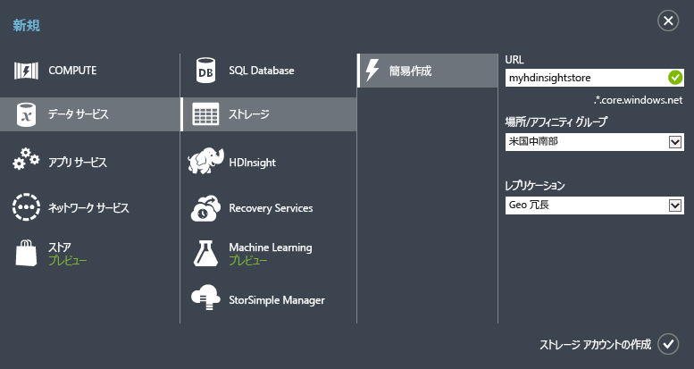

<properties
	pageTitle="Apache Storm チュートリアル: Storm 入門 |Microsoft Azure"
	description="HDInsight での Apache Storm および Storm Starter サンプルを使用したビッグ データ分析の概要Storm を使用してデータをリアルタイムに処理する方法について説明します。"
	keywords="apache storm,apache storm tutorial,big data analytics,storm starter"
	services="hdinsight"
	documentationCenter=""
	authors="Blackmist"
	manager="paulettm"
	editor="cgronlun"/>

<tags
   ms.service="hdinsight"
   ms.devlang="java"
   ms.topic="get-started-article"
   ms.tgt_pltfrm="na"
   ms.workload="big-data"
   ms.date="07/06/2015"
   ms.author="larryfr"/>

# Apache Storm チュートリアル: Storm Starter サンプルを使用した HDInsight でのビッグ データ分析の概要

Apache Storm は、データ ストリームの処理を目的とした、拡張性の高い、フォールト トレランスに優れた、分散型のリアルタイム計算システムです。Azure HDInsight の Storm を使用して、Storm でリアルタイムで ビッグデータ分析を実行するクラウドベースの Storm クラスターを作成できます。

## 開始する前に

Apache Storm チュートリアルを正常に完了するには、次の条件を満たす必要があります。

- **Azure サブスクリプション**。[Azure 無料試用版の取得](http://azure.microsoft.com/documentation/videos/get-azure-free-trial-for-testing-hadoop-in-hdinsight/)に関するページを参照してください。

## Azure のストレージ アカウントの作成

HDInsight の Storm では、ログ ファイルとクラスターに送信されるトポロジを格納する Azure Blob ストレージを使用します。次の手順を使用して、クラスターに使用する Azure ストレージ アカウントを作成します。

1. [Azure ポータル](http://manage.windowsazure.com/)にサインインします。

2. 左下隅にある **[新規]** をクリックし、**[データ サービス]**、**[ストレージ]**、**[簡易作成]** の順にクリックします。

	

3. **[URL]**、**[場所]**、**[レプリケーション]** に値を入力し、**[ストレージ アカウントの作成]** をクリックします。HDInsight のストレージを作成する場合は、アフィニティ グループを選択しません。新しいストレージ アカウントがストレージ一覧に表示されます。

	>[AZURE.NOTE]このチュートリアルで使用したような、HDInsight クラスターをプロビジョニングする簡易作成オプションでは、クラスターをプロビジョニングする際に場所をたずねるメッセージが表示されません。クラスターは、既定でストレージ アカウントと同じデータ センターに配置されます。そのため、ストレージ アカウントは、クラスターでサポートされる場所 (**東アジア**、**東南アジア**、**北ヨーロッパ**、**西ヨーロッパ**、**米国東部**、**米国西部**、**米国中北部**、**米国中南部**) に作成してください。

4. 新しいストレージ アカウントの **[状態]** 列が **[オンライン]** になるまで待ちます。

ストレージ アカウント作成の詳細については、「[Azure ストレージ アカウントについて](../storage/storage-create-storage-account.md)」を参照してください。

##Azure ポータルでの Storm クラスターのプロビジョニング

HDInsight クラスターをプロビジョニングすると、Apache Storm と関連アプリケーションを含む Azure コンピューティング リソースがプロビジョニングされます。また、Azure ポータル、HDInsight 用 Azure PowerShell コマンドレット、HDInsight .NET SDK を使用して、他のバージョン用の Hadoop クラスターを作成することもできます。手順については、「[Provision HDInsight clusters using custom options (カスタム オプションを使用した HDInsight クラスターのプロビジョニング)][hdinsight-provision]」を参照してください。異なる HDInsight バージョンとそのサービス レベル アグリーメント (SLA) については、「[HDInsight で提供される Hadoop クラスター バージョンの新機能](hdinsight-component-versioning.md)」をご覧ください。

[AZURE.INCLUDE [provisioningnote](../../includes/hdinsight-provisioning.md)]

1. [Azure ポータル][azureportal]にサインインします。

2. 左側にある **[HDInsight]** をクリックし、ページの左下隅にある **[+ 新規]** をクリックします。

3. 2 番目の列にある HDInsight アイコンをクリックし、**[STORM]** を選択します。

	

4. 一意のクラスター名を入力し、管理者アカウントの一意のパスワードを入力します。**[ストレージ アカウント]** では、前に作成したストレージ アカウントを選択します。

	**[クラスター サイズ]** では、 このクラスターで使用する **1 つのデータ ノード**のサイズを選択します。これにより、クラスターにするコストを最小限に抑えることができます。運用環境で使用する場合は、より大きなクラスターを作成します。

	> [AZURE.NOTE]クラスターの管理者アカウントの名前は **admin** です。入力するパスワードは、このアカウントのパスワードです。Storm トポロジの送信、管理など、クラスターで操作を実行するにはこの情報が必要になります。

5. 最後に、**[HDINSIGHT クラスターの作成]** の横にあるチェックマークを選択し、クラスターを作成します。

> [AZURE.NOTE]クラスターのプロビジョニングは、クラスターの作成、ソフトウェアの構成、サンプル データとトポロジのインストールに通常約 15 分かかります。

##HDInsight での Storm Starter サンプルの実行

この Apache Storm チュートリアルでは、GitHub で Storm Starter サンプルを使用したビッグ データ分析の概要について説明します。

HDInsight クラスターの各 Storm には、クラスターで Storm トポロジをアップロードし実行するために使用する Storm ダッシュボードが付属しています。各クラスターには、Storm ダッシュボードから直接実行できるトポロジのサンプルも付属しています。

###ダッシュボードへの接続

ダッシュボードは、**clustername** がクラスターの名前である **https://&lt;clustername>.azurehdinsight.net//** にあります。また、クラスターの Azure ポータル ページの下部には、ダッシュボードへのリンクがあります。

> [AZURE.NOTE]ダッシュボードに接続すると、ユーザー名とパスワードを入力するように求められます。これはクラスターの作成時に使用した管理者の名前 (**admin**) とパスワードです。

Storm ダッシュボードが読み込まれると、**[トポロジの送信]** フォームが表示されます。

**[トポロジの送信]** フォームを使用して、Storm トポロジが含まれている .jar ファイルをアップロードし、実行できます。また、これにはクラスターに付属しているいくつかの基本的なサンプルも含まれています。

###GitHub の Storm Starter プロジェクトからワードカウント サンプルを実行する

クラスターに付属しているサンプルには、ワードカウント トポロジのいくつかのバリエーションが含まれます。これらのサンプルには、センテンスをランダムに出力する**スパウト**と各センテンスを個別の単語に分割し、各単語が発生した回数をカウントする**ボルト**が含まれています。これらのサンプルは、Apache Storm の一部である [Storm Starter サンプル](https://github.com/apache/storm/tree/master/examples/storm-starter)で提供されています。

次の手順に従って、Storm Starter サンプルを実行します。

1. **[Jar ファイル]** ドロップダウンから **[StormStarter - WordCount]** を選択します。これで、このサンプル用のパラメーターが **[クラス名]** と **[追加のパラメーター]** フィールドに入力されます。

	

	* **クラス名** - トポロジを送信する .jar ファイル内のクラス。
	* **追加パラメーター** - トポロジに必要なすべてのパラメーター。この例では、フィールドに、送信したトポロジのわかりやすい名前を指定しています。

2. **[送信]** ボタンをクリックします。しばらくすると、 **[結果]** フィールドにジョブの送信に使用したコマンドとコマンドの結果が表示されます。**[エラー]** フィールドには、トポロジの送信で発生したエラーが表示されます。

	

	> [AZURE.NOTE]結果はトポロジが完了したことを示しません - **Storm トポロジがいったん開始されると、停止するまで実行されます。** ワードカウント トポロジは、ランダムなセンテンスを生成し、停止されるまで各単語の出現回数を計算します。

###トポロジの監視

Storm UI を使用してトポロジを監視できます。

1. Storm ダッシュボードの上部で、**[Storm UI]** を選択します。クラスターの情報と実行中のすべてのトポロジに関する概要情報が表示されます。

	

	上記のページで、トポロジがアクティブな状態だった時間、使用されているワーカー、エグゼキュータ、タスクの数を確認できます。

	> [AZURE.NOTE]**[名前]** 列には、前に **[追加パラメーター]** フィールドで指定した名前が含まれています。

4. **[Topology summary]** で、**[名前]** 列の **[wordcount]** エントリを選択します。これにより、トポロジの詳細が表示されます。

	

	このページには、次の情報が表示されます。

	* **トポロジの統計** - 時間枠で整理された、トポロジのパフォーマンスに関する基本的な情報。

		> [AZURE.NOTE]特定の時間枠を選択すると、ページの他のセクションに表示される情報の時間枠に変更されます。

	* **スパウト** - 各スパウトによって返された最後のエラーを含む、スパウト関する基本的な情報。

	* **ボルト** - ボルトに関する基本的な情報。

	* **トポロジの構成** - トポロジの構成に関する詳細情報。

	このページには、トポロジで実行できるアクションも表示されます。

	* **アクティブ化** - アクティブ化が解除されたトポロジの処理を再開します。

	* **アクティブ化の解除** - 実行中のトポロジを一時停止します

	* **再調整** - トポロジの並列処理を調整します。クラスターのノード数を変更した場合は、実行中のトポロジを再調整する必要があります。この操作で、クラスター内のノード数の増減に合わせて、トポロジの並列処理を調整できます。詳細については、「[Understanding the parallelism of a Storm topology (Storm トポロジの並列処理)](http://storm.apache.org/documentation/Understanding-the-parallelism-of-a-Storm-topology.html)」を参照してください。

	* **強制終了** - 指定したタイムアウト後に Storm トポロジを停止します。

5. このページで、**[スパウト]** または **[ボルト]** セクションからエントリを選択します。選択したコンポーネントに関する情報が表示されます。

	

	このページには次の情報が表示されます。

	* **スパウト / ボルトの統計** - 時間枠で整理された、コンポーネントのパフォーマンスに関する基本的な情報。

		> [AZURE.NOTE]特定の時間枠を選択すると、ページの他のセクションに表示される情報の時間枠に変更されます。

	* **入力の統計** (ボルトのみ) - ボルトによって使用されるデータを生成するコンポーネントに関する情報。

	* **出力の統計** - このボルトによって出力されるデータに関する情報。

	* **エグゼキュータ** - このコンポーネントのインスタンスに関する情報。

	* **エラー** - このコンポーネントで生成されたエラー。

5. スパウトかボルトに関する詳細を表示した状態で、**[エグゼキュータ]** セクションの **[ポート]** 列でエントリを選択 し、コンポーネントの特定のインスタンスの詳細を表示します。

		2015-01-27 14:18:02 b.s.d.task [INFO] Emitting: split default ["with"]
		2015-01-27 14:18:02 b.s.d.task [INFO] Emitting: split default ["nature"]
		2015-01-27 14:18:02 b.s.d.executor [INFO] Processing received message source: split:21, stream: default, id: {}, [snow]
		2015-01-27 14:18:02 b.s.d.task [INFO] Emitting: count default [snow, 747293]
		2015-01-27 14:18:02 b.s.d.executor [INFO] Processing received message source: split:21, stream: default, id: {}, [white]
		2015-01-27 14:18:02 b.s.d.task [INFO] Emitting: count default [white, 747293]
		2015-01-27 14:18:02 b.s.d.executor [INFO] Processing received message source: split:21, stream: default, id: {}, [seven]
		2015-01-27 14:18:02 b.s.d.task [INFO] Emitting: count default [seven, 1493957]

	このデータでは、**seven** という単語が 1493957 回発生したことを確認できます。これは、このトポロジが開始されてから発生した回数です。

###トポロジを停止する

ワードカウント トポロジの **[トポロジの概要]** ページに戻り、**[トポロジのアクション]** セクションで **[強制終了]** を選択します。メッセージが表示されたら、トポロジを停止するまでの待機秒数として「10」を入力します。タイムアウト期間後は、ダッシュボードの **[Storm UI]** セクションにアクセスしても、トポロジは表示されません。

##概要

この Apache Storm チュートリアルでは、Storm Starter を使用して、HDInsight クラスターで Storm を作成する方法と、Storm ダッシュボードを使用して Storm トポロジを展開、監視、管理する方法について説明しました。

##次のステップ

* **HDInsight Tools for Visual Studio** - HDInsight ツールでは、前述の Storm ダッシュボードのように、Visual Studio を使用して Storm トポロジを送信、監視、管理できます。また HDInsight ツールは、C# Storm のトポロジを作成する機能を提供しており、クラスター上に展開し、実行できるトポロジ サンプルを含んでいます。

	詳細については、「[HDInsight Tools for Visual Studio を使用して Hive クエリを実行する](hdinsight-hadoop-visual-studio-tools-get-started.md)」を参照してください。

* **サンプル ファイル** - HDInsight Storm クラスターでは、**%STORM_HOME%\\contrib** ディレクトリにいくつかの例が用意されています。次の例がそれぞれ含まれます。

	* ソース コード - storm-starter-0.9.1.2.1.5.0-2057-sources.jar など

	* Java ドキュメント - storm-starter-0.9.1.2.1.5.0-2057-javadoc.jar など

	* 例 - storm-starter-0.9.1.2.1.5.0-2057-jar-with-dependencies.jar など

	'jar' コマンドを使用して、ソース コードまたは Java ドキュメントを抽出します。たとえば、'jar -xvf storm-starter-0.9.1.2.1.5.0.2057-javadoc.jar' のように指定します。

	> [AZURE.NOTE]Java ドキュメントは Web ページで構成されます。抽出後、ブラウザーを使用して **index.html** ファイルを表示します。

	これらのサンプルにアクセスするには、HDInsight クラスターの Storm のリモート デスクトップを有効にし、**%STORM_HOME%\\contrib** からファイルをコピーする必要があります。

* 次のドキュメントには、HDInsight の Storm と使用できるその他のサンプルの一覧が含まれています。

	* [HDInsight 上の Storm に関するトポロジ例](hdinsight-storm-example-topology.md)

[apachestorm]: https://storm.incubator.apache.org
[stormdocs]: http://storm.incubator.apache.org/documentation/Documentation.html
[stormstarter]: https://github.com/apache/storm/tree/master/examples/storm-starter
[stormjavadocs]: https://storm.incubator.apache.org/apidocs/
[azureportal]: https://manage.windowsazure.com/
[hdinsight-provision]: hdinsight-provision-clusters.md

<!---HONumber=July15_HO2-->