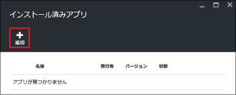

<properties
   	pageTitle="HDInsight への Hadoop アプリケーションのインストール | Microsoft Azure"
   	description="HDInsight アプリケーションに HDInsight アプリケーションをインストールする方法について説明します。"
   	services="hdinsight"
   	documentationCenter=""
   	authors="mumian"
   	manager="jhubbard"
   	editor="cgronlun"
	tags="azure-portal"/>

<tags
   	ms.service="hdinsight"
   	ms.devlang="na"
   	ms.topic="hero-article"
   	ms.tgt_pltfrm="na"
   	ms.workload="big-data"
   	ms.date="09/14/2016"
   	ms.author="jgao"/>

# HDInsight アプリケーションのインストール

HDInsight アプリケーションは、ユーザーが Linux ベースの HDInsight クラスターにインストールすることのできるアプリケーションです。マイクロソフトや独立系ソフトウェア ベンダー (ISV) によって作成されるほか、ユーザーが独自に作成することもできます。この記事では、発行済みアプリケーションのインストール方法について説明します。独自のアプリケーションのインストール方法については、「[カスタム HDInsight アプリケーションのインストール](hdinsight-apps-install-custom-applications.md)」を参照してください。

現在、発行済みのアプリケーションが 1 つあります。

- **Datameer**: [Datameer](http://www.datameer.com/documentation/display/DAS50/Home?ls=Partners&lsd=Microsoft&c=Partners&cd=Microsoft) を利用すると、アナリストはビッグ データ上の結果を対話形式で検索、分析、視覚化できるようになります。追加のデータ ソースを簡単に取り込んで新たな関係性を発見し、必要な答えをすぐに得られます。

>[AZURE.NOTE] Datameer は現在、Azure HDInsight バージョン 3.2 クラスターでのみサポートされています。

この記事で説明する手順では、Azure Portal を使用します。また、ポータルから Azure Resource Manager テンプレートをエクスポートしたり、ベンダーから Resource Manager テンプレートのコピーを入手したりして、Azure PowerShell と Azure CLI を使ってテンプレートをデプロイできます。[Resource Manager テンプレートを使用した HDInsight での Linux ベースの Hadoop クラスターの作成](hdinsight-hadoop-create-linux-clusters-arm-templates.md)に関するページを参照してください。

## 前提条件

既存の HDInsight クラスターに HDInsight アプリケーションをインストールする場合は、対象となる HDInsight クラスターが必要です。新たに作成する場合は、「[クラスターの作成](hdinsight-hadoop-linux-tutorial-get-started.md#create-cluster)」を参照してください。HDInsight クラスターを作成するときに HDInsight アプリケーションをインストールすることもできます。

## 既存のクラスターへのアプリケーションのインストール

次の手順では、既存の HDInsight クラスターに HDInsight アプリケーションをインストールする方法について説明します。

**HDInsight アプリケーションをインストールするには**

1. [Azure ポータル](https://portal.azure.com)にサインインします。
2. 左側のメニューの **[HDInsight クラスター]** をクリックします。表示されない場合は、**[参照]** をクリックし、**[HDInsight クラスター]** をクリックしてください。
3. HDInsight クラスターをクリックします。HDInsight クラスターがない場合は、最初に作成する必要があります。「[クラスターの作成](hdinsight-hadoop-linux-tutorial-get-started.md#create-cluster)」を参照してください。
4. **[設定]** ブレードで **[全般]** カテゴリの **[アプリケーション]** をクリックします。**[インストール済みアプリ]** ブレードには、インストール済みのアプリケーションがすべて一覧表示されます。

    

5. ブレードのメニューで **[追加]** をクリックします。

    

	既存の HDInsight アプリケーションの一覧が表示されます。

	

6. いずれかのアプリケーションをクリックし、法律条項に同意した後、**[選択]** をクリックします。

インストールの状態はポータル通知で確認できます (ポータル上部のベル アイコンをクリック)。アプリケーションのインストール後、[インストール済みアプリ] ブレードにアプリケーションが表示されます。

## クラスター作成時のアプリケーションのインストール

クラスターの作成時に HDInsight アプリケーションをインストールすることもできます。このプロセスでは、クラスターが作成されて実行状態になった後に HDInsight アプリケーションがインストールされます。次の手順では、クラスターの作成時に HDInsight アプリケーションをインストールする方法について説明します。

**HDInsight アプリケーションをインストールするには**

1. [Azure ポータル](https://portal.azure.com)にサインインします。
2. **[新規]**、**[データ + 分析]**、**[HDInsight]** の順にクリックします。
3. **クラスター名**を入力します。この名前はグローバルに一意である必要があります。
4. **[サブスクリプション]** をクリックして、このクラスターに使用する Azure サブスクリプションを選択します。
5. **[クラスターの種類の選択]** をクリックし、以下を選択します。

    - **[クラスターの種類]**: どれを選択すべきかわからない場合は、**[Hadoop]** を選択します。これが最も一般的なクラスターの種類です。
    - **[オペレーティング システム]**: **[Linux]** を選択します。
    - **[バージョン]**: どれを選択すべきかわからない場合は、既定のバージョンを使用します。詳細については、「[HDInsight クラスターのバージョン](hdinsight-component-versioning.md)」をご覧ください。
    - **[クラスター レベル]**: Azure HDInsight では、Standard レベルと Premium レベルの 2 つのカテゴリでビッグ データのクラウド サービスを提供します。詳細については、「[クラスター レベル](hdinsight-hadoop-provision-linux-clusters.md#cluster-tiers)」をご覧ください。
6. **[アプリケーション]** をクリックし、発行済みアプリケーションのいずれかをクリックした後、**[選択]** をクリックします。
6. **[資格情報]** をクリックし、管理ユーザーのパスワードを入力します。さらに、SSH ユーザーを認証するために使用される **[SSH ユーザー名]** と、**[パスワード]** または **[公開キー]** のどちらかを入力する必要があります。公開キーを使用することをお勧めします。下部にある **[選択]** をクリックして資格情報の構成を保存します。
8. **[データ ソース]** をクリックし、既存のストレージ アカウントのいずれかを選択するか、クラスターの既定のストレージ アカウントとして使用する新しいストレージ アカウントを作成します。
9. **[リソース グループ]** をクリックして既存のリソース グループを選択するか、**[新規]** をクリックして新しいリソース グループを作成します。

10. **[新しい HDInsight クラスター]** ブレードで、**[スタート画面にピン留めする]** が選択されていることを確認し、**[作成]** をクリックします。

## インストール済み HDInsight アプリとプロパティの一覧表示

ポータルには、クラスターのインストール済み HDInsight アプリケーションのほか、インストール済みの各アプリケーションのプロパティが一覧で表示されます。

**HDInsight アプリケーションを一覧表示し、プロパティを表示するには**

1. [Azure ポータル](https://portal.azure.com)にサインインします。
2. 左側のメニューの **[HDInsight クラスター]** をクリックします。表示されない場合は、**[参照]** をクリックし、**[HDInsight クラスター]** をクリックしてください。
3. HDInsight クラスターをクリックします。
4. **[設定]** ブレードで **[全般]** カテゴリの **[アプリケーション]** をクリックします。[インストール済みアプリ] ブレードには、インストール済みのアプリケーションがすべて一覧表示されます。

	

5. インストール済みのアプリケーションのいずれかをクリックし、プロパティを表示します。[プロパティ] ブレードには次の項目が一覧表示されます。

    - [アプリケーション名]: アプリケーションの名前。
    - [状態]: アプリケーションの状態。
    - [Web ページ]: エッジ ノードにデプロイした Web アプリケーションの URL (存在する場合)。資格情報は、クラスター向けに構成した HTTP ユーザーの資格情報と同じです。
    - [HTTP エンドポイント]: 資格情報は、クラスター向けに構成した HTTP ユーザーの資格情報と同じです。
    - [SSH エンドポイント]: [SSH](hdinsight-hadoop-linux-use-ssh-unix.md) を使用してエッジ ノードに接続できます。SSH 資格情報は、クラスター向けに構成した SSH ユーザーの資格情報と同じです。

6. アプリケーションを削除するには、アプリケーションを右クリックし、コンテキスト メニューの **[削除]** をクリックします。

## エッジ ノードへの接続

HTTP と SSH を使用してエッジ ノードに接続できます。エンドポイント情報は[ポータル](#list-installed-hdinsight-apps-and-properties)から確認できます。SSH の使用の詳細については、「[Linux、Unix、または OS X から HDInsight 上の Linux ベースの Hadoop で SSH キーを使用する](hdinsight-hadoop-linux-use-ssh-unix.md)」をご覧ください。

HTTP エンドポイント資格情報は、HDInsight クラスター向けに構成した HTTP ユーザーの資格情報です。また、SSH エンドポイント資格情報は、HDInsight クラスター向けに構成した SSH 資格情報です。

## トラブルシューティング

「[インストールのトラブルシューティング](hdinsight-apps-install-custom-applications.md#troubleshoot-the-installation)」を参照してください。

## 次のステップ

- [カスタム HDInsight アプリケーションをインストールする](hdinsight-apps-install-custom-applications.md): 未発行の HDInsight アプリケーションを HDInsight にデプロイする方法について確認します。
- [HDInsight アプリケーションを発行する](hdinsight-apps-publish-applications.md): カスタム HDInsight アプリケーションを Azure Marketplace に発行する方法について確認します。
- [MSDN: HDInsight アプリケーションをインストールする](https://msdn.microsoft.com/library/mt706515.aspx): HDInsight アプリケーションを定義する方法について確認します。
- [スクリプト アクションを使用して Linux ベースの HDInsight クラスターをカスタマイズする](hdinsight-hadoop-customize-cluster-linux.md): スクリプト アクションを使用してアプリケーションを追加インストールする方法を確認します。
- [Resource Manager テンプレートを使用して HDInsight で Linux ベースの Hadoop クラスターを作成する](hdinsight-hadoop-create-linux-clusters-arm-templates.md): Resource Manager テンプレートを呼び出して HDInsight クラスターを作成する方法を確認します。
- [HDInsight で空のエッジ ノードを使用する](hdinsight-apps-use-edge-node.md): HDInsight クラスター、テスト HDInsight アプリケーション、およびホスティング HDInsight アプリケーションにアクセスするために空のエッジ ノードを使用する方法を確認します。

<!---HONumber=AcomDC_0914_2016-->