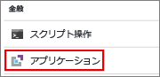
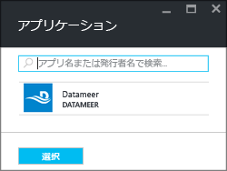
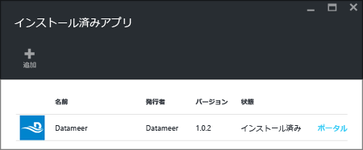

# Azure HDInsight にサードパーティ製 Apache Hadoop アプリケーションをインストールする

Azure HDInsight にサードパーティ製 [Apache Hadoop](https://hadoop.apache.org/) アプリケーションをインストールする方法について説明します。 独自のアプリケーションのインストール手順については、[カスタム HDInsight アプリケーションのインストール](hdinsight-apps-install-custom-applications.md)のページを参照してください。

HDInsight アプリケーションは、ユーザーが HDInsight クラスターにインストールできるアプリケーションです。 マイクロソフトや独立系ソフトウェア ベンダー (ISV) によって作成されるほか、ユーザーが独自に作成することもできます。  

以下に、公開されているアプリケーションの一覧を示します。

* **AtScale Intelligence Platform**: HDInsight クラスターをスケールアウト OLAP サーバーに変えます。 このアプリケーションを使用すると、Excel、PowerBI、Tableau Software、QlikView などの BI ツールを使用して、数十億行のデータのクエリを対話的に実行できます。
* **Cask CDAP for HDInsight**: ビッグ データ用に初めて一元管理された統合プラットフォームを提供します。ビッグ データにより、データ アプリケーションや Data Lake の作成にかかる時間が 80% 短縮されます。 このアプリケーションは、標準の HBase 3.4 クラスターのみをサポートします。
* **DATAIKU DDS on HDInsight**: このアプリケーションを使用して、データの専門家は、生データをインパクトのある景気予測に変換する特異性の高いサービスのプロトタイプ作成、ビルド、デプロイを行うことができます。
* **Datameer**: 分析用のデータを準備、調査、および管理して、複雑なマルチソース データのビジネスに即応できる貴重な情報への転換を加速することにより、エンタープライズ クラスのより迅速で、より高度な洞察を可能にするセルフサービスのスケーラブル プラットフォームです。
* **H2O Artificial Intelligence for HDInsight (ベータ版)**: H2O Sparkling Water では、次の分散アルゴリズムがサポートされます。GLM、Naïve Bayes、Distributed Random Forest、Gradient Boosting Machine、Deep Neural Networks、Deep learning、K-means、PCA、Generalized Low Rank Models、Anomaly Detection、および Autoencoders。
* Apache Kylin を搭載した **Kyligence Enterprise** では、ビジネス ユーザーとデータ アナリストのための大規模なデータセットに関する分析情報が手軽に得られます。 最先端の機械学習テクノロジとインテリジェントなデータ モデリング機能により、ビッグ データ分析の生産性が大幅に向上します。 
* **Paxata セルフサービス データ準備**
* **Spark Job Server for KNIME Spark Executor**: Spark Job Server for KNIME Spark Executor は、KNIME Analytics Platform を HDInsight クラスターに接続するために使用されます。
* **Starburst Presto**: Presto は、高速でスケーラブルな分散 SQL クエリ エンジンです。 ストレージと計算を分離するように設計された Presto は、Azure Data Lake Storage、Azure Blob Storage、SQL および NoSQL データベース、その他のデータ ソース内のデータのクエリを実行するために最適です。
* **Streamsets Data Collector for HDnsight**: フル機能を備えた統合開発環境 (IDE) を備えており、これを使用すると、ストリーム データとバッチ データを調和させる任意の環境間の取り込みパイプラインを設計、テスト、デプロイ、管理したり、ストリーム内のさまざまな変換を含めたりできます。どの処理でも、カスタム コードを記述する必要はありません。 
* **Striim** (発音は "ストリーム"): エンド ツー エンドのストリーミング データ統合およびインテリジェンス プラットフォームであり、異種のデータ ストリームの連続した取り込み、処理、および分析を可能にします。
* **[Trifacta](https://www.trifacta.com/)**: データ エンジニアやアナリストは、画期的なユーザー エクスペリエンス、ワークフロー、およびアーキテクチャを提供する機械学習を活用することによって、今日の多様なデータをより効率的に調査および準備できます。
* **Unifi Data Platform**: ビジネス ユーザーが増分収益を向上させ、コストや運用の複雑さを削減するというデータの課題に取り組めるように設計された、シームレスに統合されたセルフサービス データ ツールのスイートです。 
* **WANdisco Fusion HDI App**: データの場所を問わず、データが変更された際のデータへの継続的な一貫した接続を可能にします。 このアプリケーションにより、いつでもどこでもダウンタイムや中断なしでデータにアクセスできるようになります。
* **Waterline**: AI を使用してデータをカタログ化、整理、および管理することにより、自動的にデータにビジネス用語のタグを付けます。 Waterline のビジネス リテラシー カタログは、セルフサービスの分析、コンプライアンスとガバナンス、および IT 管理イニシアチブのための重要な成功コンポーネントです。

この記事で説明する手順では、Azure Portal を使用します。 また、ポータルから Azure Resource Manager テンプレートをエクスポートしたり、ベンダーから Resource Manager テンプレートのコピーを入手したりして、Azure PowerShell と Azure クラシック CLI を使ってテンプレートをデプロイすることもできます。  「[Apache Resource Manager テンプレートを使用して HDInsight に Hadoop クラスターを作成する](hdinsight-hadoop-create-linux-clusters-arm-templates.md)」をご覧ください。

## 前提条件
既存の HDInsight クラスターに HDInsight アプリケーションをインストールする場合は、対象となる HDInsight クラスターが必要です。 新たに作成する場合は、「 [クラスターの作成](hadoop/apache-hadoop-linux-tutorial-get-started.md#create-cluster)」を参照してください。 HDInsight クラスターを作成するときに HDInsight アプリケーションをインストールすることもできます。

## 既存のクラスターへのアプリケーションのインストール
次の手順では、既存の HDInsight クラスターに HDInsight アプリケーションをインストールする方法について説明します。

**HDInsight アプリケーションをインストールする**

1. [Azure Portal](https://portal.azure.com) にサインインします。
2. 左側のメニューの **HDInsight クラスター** をクリックします。
3. HDInsight クラスターをクリックします。  HDInsight クラスターがない場合は、最初に作成する必要があります。  「 [クラスターの作成](hadoop/apache-hadoop-linux-tutorial-get-started.md#create-cluster)」を参照してください。
4. **構成** カテゴリにある **アプリケーション** をクリックします。 インストールされているアプリケーションの一覧が表示されます。 アプリケーションが見つからない場合は、このバージョンの HDInsight クラスターに対応するアプリケーションがないことを意味します。
   
    
5. メニューで **[追加]** をクリックします。 既存の HDInsight アプリケーションの一覧が表示されます。
   
    
6. いずれかの使用可能なアプリケーションをクリックし、指示に従って法律条項を受け入れます。

インストールの状態はポータル通知で確認できます (ポータル上部のベル アイコンをクリック)。 アプリケーションのインストール後、[インストール済みアプリ] 一覧にアプリケーションが表示されます。

## クラスター作成時のアプリケーションのインストール
クラスターの作成時に HDInsight アプリケーションをインストールすることもできます。 このプロセスでは、クラスターが作成されて実行状態になった後に HDInsight アプリケーションがインストールされます。 クラスターの作成時に Azure Portal を使用してアプリケーションをインストールするには、既定の [簡易作成] オプションの代わりに [カスタム] オプションを使用します。

## インストール済み HDInsight アプリとプロパティの一覧表示
ポータルには、クラスターのインストール済み HDInsight アプリケーションのほか、インストール済みの各アプリケーションのプロパティが一覧で表示されます。

**HDInsight アプリケーションを一覧表示し、プロパティを表示する**

1. [Azure Portal](https://portal.azure.com) にサインインします。
2. 左側のメニューの **HDInsight クラスター** をクリックします。 
3. HDInsight クラスターをクリックします。
4. **[設定]** から、**[構成]** カテゴリの下の **[アプリケーション]** をクリックします。 インストール済みアプリが右側に一覧表示されます。 
   
    
5. インストール済みのアプリケーションのいずれかをクリックし、プロパティを表示します。 プロパティには次の項目が一覧表示されます。
   
   * アプリケーション名: アプリケーションの名前。
   * 状態: アプリケーションの状態。 
   * Web ページ:エッジ ノードにデプロイした Web アプリケーションの URL。 資格情報は、クラスター向けに構成した HTTP ユーザーの資格情報と同じです。
   * HTTP エンドポイント:資格情報は、クラスター向けに構成した HTTP ユーザーの資格情報と同じです。 
   * SSH エンドポイント:SSH を使用してエッジ ノードに接続できます。 SSH 資格情報は、クラスター向けに構成した SSH ユーザーの資格情報と同じです。 詳細については、[HDInsight での SSH の使用](hdinsight-hadoop-linux-use-ssh-unix.md)に関するページを参照してください。
6. アプリケーションを削除するには、アプリケーションを右クリックし、コンテキスト メニューの **[削除]** をクリックします。

## エッジ ノードへの接続
HTTP と SSH を使用してエッジ ノードに接続できます。 エンドポイント情報は [ポータル](#list-installed-hdinsight-apps-and-properties)から確認できます。 詳細については、[HDInsight での SSH の使用](hdinsight-hadoop-linux-use-ssh-unix.md)に関するページを参照してください。

HTTP エンドポイント資格情報は、HDInsight クラスター向けに構成した HTTP ユーザーの資格情報です。また、SSH エンドポイント資格情報は、HDInsight クラスター向けに構成した SSH 資格情報です。

## トラブルシューティング
「 [インストールのトラブルシューティング](hdinsight-apps-install-custom-applications.md#troubleshoot-the-installation)」を参照してください。

## 次の手順
* [カスタム HDInsight アプリケーションをインストールする](hdinsight-apps-install-custom-applications.md): 未発行の HDInsight アプリケーションを HDInsight にデプロイする方法について確認します。
* [HDInsight アプリケーションを発行する](hdinsight-apps-publish-applications.md):カスタム HDInsight アプリケーションを Azure Marketplace に発行する方法について確認します。
* [MSDN:HDInsight アプリケーションをインストールする](https://msdn.microsoft.com/library/mt706515.aspx):HDInsight アプリケーションを定義する方法を確認します。
* [スクリプト アクションを使用して Linux ベースの HDInsight クラスターをカスタマイズする](hdinsight-hadoop-customize-cluster-linux.md): スクリプト アクションを使用してアプリケーションを追加インストールする方法を確認します。
* [Resource Manager テンプレートを使用して HDInsight で Linux ベースの Apache Hadoop クラスターを作成する](hdinsight-hadoop-create-linux-clusters-arm-templates.md): Resource Manager テンプレートを呼び出して HDInsight クラスターを作成する方法を確認します。
* [HDInsight で空のエッジ ノードを使用する](hdinsight-apps-use-edge-node.md): HDInsight クラスター、テスト HDInsight アプリケーション、およびホスティング HDInsight アプリケーションにアクセスするために空のエッジ ノードを使用する方法を確認します。

