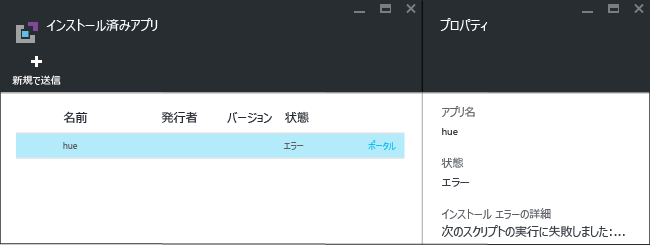
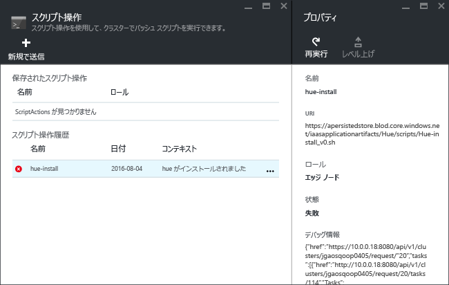

# Azure HDInsight にカスタム Apache Hadoop アプリケーションをインストールする

この記事では、まだ Azure portal に発行されていない [Apache Hadoop](https://hadoop.apache.org/) アプリケーションを Azure HDInsight にインストールする方法について説明します。 この記事でインストールするアプリケーションは [Hue](https://gethue.com/) です。

HDInsight アプリケーションは、ユーザーが Linux ベースの HDInsight クラスターにインストールすることのできるアプリケーションです。  マイクロソフトや独立系ソフトウェア ベンダー (ISV) によって作成されるほか、ユーザーが独自に作成することもできます。  

その他の関連記事:

* [HDInsight アプリケーションのインストール](hdinsight-apps-install-applications.md)に関する記事:HDInsight アプリケーションをクラスターにインストールする方法について確認します。
* [HDInsight アプリケーションの発行](hdinsight-apps-publish-applications.md)に関する記事:カスタム HDInsight アプリケーションを Azure Marketplace に発行する方法について確認します。
* [MSDN:HDInsight アプリケーションをインストールする](https://msdn.microsoft.com/library/mt706515.aspx):HDInsight アプリケーションを定義する方法を確認します。

## 前提条件
既存の HDInsight クラスターに HDInsight アプリケーションをインストールする場合は、対象となる HDInsight クラスターが必要です。 新たに作成する場合は、「 [クラスターの作成](hadoop/apache-hadoop-linux-tutorial-get-started.md#create-cluster)」を参照してください。 HDInsight クラスターを作成するときに HDInsight アプリケーションをインストールすることもできます。

## HDInsight アプリケーションをインストールする
HDInsight アプリケーションは、クラスターを作成するときにインストールするか、または既存の HDInsight クラスターにインストールすることができます。 Azure Resource Manager テンプレートの定義については、MSDN の「[Install an HDInsight application (HDInsight アプリケーションのインストール)](https://msdn.microsoft.com/library/mt706515.aspx)」を参照してください。

このアプリケーション (Hue) をデプロイするために必要なファイルは次のとおりです。

* [azuredeploy.json](https://github.com/hdinsight/Iaas-Applications/blob/master/Hue/azuredeploy.json):HDInsight アプリケーションをインストールするための Resource Manager テンプレート。 MSDN の「[Install an HDInsight application (HDInsight アプリケーションのインストール)](https://msdn.microsoft.com/library/mt706515.aspx)」で、独自の Resource Manager テンプレートの開発について参照してください。
* [hue-install_v0.sh](https://github.com/hdinsight/Iaas-Applications/blob/master/Hue/scripts/Hue-install_v0.sh):エッジ ノードを構成するために Resource Manager テンプレートによって呼び出されるスクリプト アクション。
* [hue-binaries.tgz](https://hdiconfigactions.blob.core.windows.net/linuxhueconfigactionv01/hue-binaries-14-04.tgz):hui-install_v0.sh から呼び出される hue のバイナリ ファイル。
* [hue-binaries-14-04.tgz](https://hdiconfigactions.blob.core.windows.net/linuxhueconfigactionv01/hue-binaries-14-04.tgz):hui-install_v0.sh から呼び出される hue のバイナリ ファイル。
* [webwasb-tomcat.tar.gz](https://hdiconfigactions.blob.core.windows.net/linuxhueconfigactionv01/webwasb-tomcat.tar.gz):hui-install_v0.sh から呼び出されるサンプル Web アプリケーション (Tomcat)。

**既存の HDInsight クラスターに Hue をインストールするには**

1. 次の画像をクリックして Azure にサインインし、Azure Portal で Resource Manager テンプレートを開きます。

    

    このボタンをクリックすると、Azure ポータルの Resource Manager テンプレートが開きます。  Resource Manager テンプレートは、[https://github.com/hdinsight/Iaas-Applications/tree/master/Hue](https://github.com/hdinsight/Iaas-Applications/tree/master/Hue) にあります。  この Resource Manager テンプレートの作成方法については、MSDN の「[Install an HDInsight application (HDInsight アプリケーションのインストール)](https://msdn.microsoft.com/library/mt706515.aspx)」を参照してください。
2. **[パラメーター]** ブレードで、次の各項目を入力します。

   * **ClusterName**:アプリケーションのインストール先となるクラスターの名前を入力します。 このクラスターは既に存在していることが必要です。
3. **[OK]** をクリックしてパラメーターを保存します。
4. **[カスタム デプロイ]** ブレードで「**リソース グループ**」と入力します。  リソース グループとは、クラスターや依存するストレージ アカウントなどのリソースをひとまとめにしたコンテナーです。 クラスターと同じリソース グループを使用する必要があります。
5. **[法律条項]** をクリックし、 **[作成]** をクリックします。
6. **[ダッシュボードにピン留めする]** チェック ボックスがオンになっていることを確認して、 **[作成]** をクリックします。 インストールのステータスは、ポータル ダッシュボードにピン留めされたタイルまたはポータルの通知 (ポータル上部のベル アイコンをクリック) で確認できます。  アプリケーションのインストールには 10 分程度かかります。

**クラスターの作成時に Hue をインストールするには**

1. 次の画像をクリックして Azure にサインインし、Azure Portal で Resource Manager テンプレートを開きます。

    

    このボタンをクリックすると、Azure ポータルの Resource Manager テンプレートが開きます。  Resource Manager テンプレートは、[https://hditutorialdata.blob.core.windows.net/hdinsightapps/create-linux-based-hadoop-cluster-in-hdinsight.json](https://hditutorialdata.blob.core.windows.net/hdinsightapps/create-linux-based-hadoop-cluster-in-hdinsight.json) にあります。  この Resource Manager テンプレートの作成方法については、MSDN の「[Install an HDInsight application (HDInsight アプリケーションのインストール)](https://msdn.microsoft.com/library/mt706515.aspx)」を参照してください。
2. 手順に従ってクラスターを作成し、Hue をインストールします。 HDInsight クラスターの作成の詳細については、「 [HDInsight での Linux ベースの Hadoop クラスターの作成](hdinsight-hadoop-provision-linux-clusters.md)」を参照してください。

Azure portal のほか、[Azure PowerShell](hdinsight-hadoop-create-linux-clusters-arm-templates.md#deploy-using-powershell) や [Azure クラシック CLI](hdinsight-hadoop-create-linux-clusters-arm-templates.md#deploy-using-azure-cli) を使用して Resource Manager テンプレートを呼び出すこともできます。

## インストールを検証する
Azure ポータルでアプリケーションのステータスを確認し、アプリケーションが正しくインストールされていることを確認できます。 さらに、すべての HTTP エンドポイントが正しく設定されていること、また Web ページが存在する場合は正しく表示されることを確認することもできます。

**Hue ポータルを開くには**

1. [Azure Portal](https://portal.azure.com) にサインインします。
2. 左側のメニューの **[HDInsight クラスター]** をクリックします。  表示されない場合は、 **[参照]** をクリックし、 **[HDInsight クラスター]** をクリックしてください。
3. アプリケーションをインストールしたクラスターをクリックします。
4. **[設定]** ブレードで **[全般]** カテゴリの **[アプリケーション]** をクリックします。 **[インストール済みアプリ]** ブレードの一覧に **hue** が表示されます。
5. 一覧の **[hue]** をクリックしてプロパティを一覧表示します。  
6. Web ページ リンクをクリックして Web サイトを検証します。具体的には、ブラウザーで HTTP エンドポイントを開いて Hue の Web UI が正しく表示されることを確認し、SSH 使用して SSH エンドポイントを開きます。 詳細については、[HDInsight での SSH の使用](hdinsight-hadoop-linux-use-ssh-unix.md)に関するページを参照してください。

## インストールのトラブルシューティング
アプリケーションのインストールの状態は、ポータル通知で確認できます (ポータル上部のベル アイコンをクリック)。

アプリケーションのインストールが失敗した場合は、エラー メッセージとデバッグ情報を次の 3 つの場所で確認できます。

* HDInsight アプリケーション: 一般的なエラー情報です。

    ポータルでクラスターを開き、[設定] ブレードで [アプリケーション] をクリックします。

    
* HDInsight のスクリプト アクション:HDInsight アプリケーションのエラー メッセージがスクリプト アクションのエラーを示している場合、その詳細がスクリプト アクション ウィンドウに表示されます。

    [設定] ブレードで、[スクリプト アクション] をクリックします。 スクリプト アクションの履歴に、エラー メッセージが表示されます。

    
* Ambari Web UI:インストール スクリプトがエラーの原因であった場合は、Ambari Web UI を使用して、インストール スクリプトの完全なログを確認します。

    詳細については、「 [トラブルシューティング](hdinsight-hadoop-customize-cluster-linux.md#troubleshooting)」を参照してください。

## HDInsight アプリケーションの削除
HDInsight アプリケーションを削除する方法は複数あります。

### ポータルの使用
**ポータルを使用してアプリケーションを削除するには**

1. [Azure Portal](https://portal.azure.com) にサインインします。
2. 左側のメニューの **[HDInsight クラスター]** をクリックします。  表示されない場合は、 **[参照]** をクリックし、 **[HDInsight クラスター]** をクリックしてください。
3. アプリケーションをインストールしたクラスターをクリックします。
4. **[設定]** ブレードで **[全般]** カテゴリの **[アプリケーション]** をクリックします。 インストールされているアプリケーションの一覧が表示されます。 この記事では、 **[インストール済みアプリ]** ブレードの一覧に **hue** が表示されます。
5. 削除するアプリケーションを右クリックし、 **[削除]** をクリックします。
6. **[はい]** をクリックして確定します。

ポータルからは、クラスターを削除したり、アプリケーションが含まれているリソース グループを削除したりすることもできます。

### Azure PowerShell の使用
Azure PowerShell を使用して、クラスターを削除したり、リソース グループを削除したりできます。 [Azure PowerShell を使用したクラスターの削除](hdinsight-administer-use-powershell.md#delete-clusters)に関するセクションを参照してください。

### Azure CLI の使用
Azure CLI を使用して、クラスターを削除したり、リソース グループを削除したりできます。 [Azure CLI を使用したクラスターの削除](hdinsight-administer-use-command-line.md#delete-clusters)に関するセクションを参照してください。

## 次の手順
* [MSDN:Install an HDInsight application (HDInsight アプリケーションのインストール)](https://msdn.microsoft.com/library/mt706515.aspx): HDInsight アプリケーションをデプロイするための Resource Manager テンプレートの作成方法について確認します。
* [HDInsight アプリケーションのインストール](hdinsight-apps-install-applications.md)に関する記事:HDInsight アプリケーションをクラスターにインストールする方法について確認します。
* [HDInsight アプリケーションの発行](hdinsight-apps-publish-applications.md)に関する記事:カスタム HDInsight アプリケーションを Azure Marketplace に発行する方法を確認します。
* [スクリプト アクションを使用して Linux ベースの HDInsight クラスターをカスタマイズする](hdinsight-hadoop-customize-cluster-linux.md): スクリプト アクションを使用してアプリケーションを追加インストールする方法を確認します。
* [Resource Manager テンプレートを使用して HDInsight で Linux ベースの Apache Hadoop クラスターを作成する](hdinsight-hadoop-create-linux-clusters-arm-templates.md): Resource Manager テンプレートを呼び出して HDInsight クラスターを作成する方法を確認します。
* [HDInsight で空のエッジ ノードを使用する](hdinsight-apps-use-edge-node.md): HDInsight クラスター、テスト HDInsight アプリケーション、およびホスティング HDInsight アプリケーションにアクセスするために空のエッジ ノードを使用する方法を確認します。
