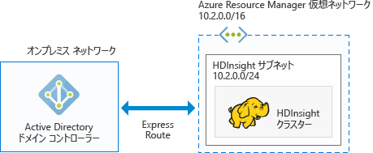

# HDInsight で Azure のドメイン参加済み Hadoop クラスターを計画する

従来の Hadoop は単一ユーザーのクラスターです。 これは、ビッグ データ ワークロードを構築する小規模なアプリケーション チームを抱えているほとんどの企業に適しています。 Hadoop が人気を得るにつれて、多くの企業は、クラスターを IT チームが管理し、複数のアプリケーション チームが共有するモデルへ移行しつつあります。 そのため、マルチユーザー クラスターは、HDInsight で最も需要の高い機能の&1; つです。

HDInsight は、独自のマルチユーザー認証および承認を構築する代わりに、最も人気のある ID プロバイダー、Active Directory (AD) を利用します。 Active Directory の強力なセキュリティ グループ機能を使用すると、HDInsight でマルチユーザー承認を管理できます。 HDInsight を Active Directory と統合することで、Active Directory ユーザーは、Active Directory の資格情報を使用してクラスターと通信できます。 HDInsight は Active Directory ユーザーをローカルの Hadoop ユーザーにマップするため、HDInsight で実行されているすべてのサービス (Ambari、Hive サーバー、Ranger、Spark Thrift サーバーなど) は認証済みユーザーに対してシームレスに動作します。

## HDInsight を Active Directory と統合する

HDInsight を Active Directory と統合すると、HDInsight クラスター ノードは、Active Directory ドメインに参加することになります。 HDInsight は、クラスターで実行されている Hadoop サービスにサービス プリンシパルを作成し、Active Directory で指定された組織単位 (OU) 内に配置します。 また、ドメインに参加しているノードの IP アドレスについて、Active Directory ドメインに逆引き DNS マッピングも作成します。

この設定を実現するために、利用できるアーキテクチャは複数あります。 自身により適しているアーキテクチャを決定する必要があります。

**1.Azure IAAS で実行されている AD と統合された HDInsight**

これは、HDInsight を Active Directory と統合するための最も簡単なアーキテクチャです。 Active Directory ドメイン コントローラーは、Azure 内の&1; つ (または複数) の仮想マシン (VM) で動作します。 通常、これらの VM は仮想ネットワーク内に存在します。 HDInsight クラスター用に仮想ネットワークをもう&1; つ設定します。 HDInsight に Active Directory を認識させるには、[VNet 間のピアリング](../virtual-network/virtual-networks-create-vnetpeering-arm-portal.md)を使用してこれらの仮想ネットワークをピアリングする必要があります。

> [!NOTE]
> このアーキテクチャでは、HDInsight クラスターで Azure Data Lake Store を使用できません。
 

Active Directory の前提条件は次のとおりです。

* [組織単位](../active-directory-domain-services/active-directory-ds-admin-guide-create-ou.md)を作成する必要があります。その中には、HDInsight クラスターの VM と、クラスターによって使用されるサービス プリンシパルを配置します。
* Active Directory と通信するために [LDAPS](../active-directory-domain-services/active-directory-ds-admin-guide-configure-secure-ldap.md) を設定する必要があります。 LDAPS をセットアップするために使用する証明書は、(自己署名証明書ではなく) 実際の証明書にする必要があります。
* HDInsight サブネットの IP アドレス範囲 (たとえば、上の図では 10.2.0.0/24) について、ドメインに逆引き DNS ゾーンを作成する必要があります。
* サービス アカウントまたはユーザー アカウントが必要です。このアカウントは、HDInsight クラスターを作成するために発行されました。 このアカウントには、次のアクセス許可が必要です。

    - サービス プリンシパル オブジェクトとコンピューター オブジェクトを組織単位内に作成するためのアクセス許可。
    - 逆引き DNS プロキシ規則を作成するためのアクセス許可。
    - マシンを Active Directory ドメインに参加させるためのアクセス許可。

**2.クラウド専用の Azure AD と統合された HDInsight**

クラウド専用の Azure Active Directory (Azure AD) では、HDInsight を Azure Active Directory と統合できるようにドメイン コントローラーを構成する必要があります。 これは、[Azure Active Directory Domain Services](../active-directory-domain-services/active-directory-ds-overview.md) (Azure AD DS) を使用して実現されます。 Azure AD DS により、クラウド内にドメイン コントローラー マシンが作成され、そのマシン用の IP アドレスが提供されます。 高可用性を確保するために&2; つのドメイン コントローラーが作成されます。

現時点で、Azure AD DS はクラシック VNet のみに存在します。 これにアクセスできるのは、従来の Azure Portal を使用した場合のみです。 HDInsight VNet は Azure Portal に存在します。これは、VNet 間のピアリングを使用してクラシック VNet とピアリングする必要があります。

> [!NOTE]
> クラシック VNet と Azure Resource Manager VNet 間でピアリングするには、両方の VNet が同じリージョンに存在することと、両方の VNet が同じ Azure サブスクリプションに属していることが必要になります。

Active Directory の前提条件は次のとおりです。

* [組織単位](../active-directory-domain-services/active-directory-ds-admin-guide-create-ou.md)を作成する必要があります。その中には、HDInsight クラスターの VM と、クラスターによって使用されるサービス プリンシパルを配置します。 
* AD DS の構成時に [LDAPS](../active-directory-domain-services/active-directory-ds-admin-guide-configure-secure-ldap.md) を設定する必要があります。 LDAPS をセットアップするために使用する証明書は、(自己署名証明書ではなく) 実際の証明書にする必要があります。
* HDInsight サブネットの IP アドレス範囲 (たとえば、上の図では 10.2.0.0/24) について、ドメインに逆引き DNS ゾーンを作成する必要があります。 
* [パスワード ハッシュ](../active-directory-domain-services/active-directory-ds-getting-started-password-sync.md)は、Azure AD から AD DS に同期する必要があります。
* サービス アカウントまたはユーザー アカウントが必要です。このアカウントは、HDInsight クラスターの作成に使用されます。 このアカウントには、次のアクセス許可が必要です。

    - サービス プリンシパル オブジェクトとコンピューター オブジェクトを組織単位内に作成するためのアクセス許可。
    - 逆引き DNS プロキシ規則を作成するためのアクセス許可。
    - マシンを Active Directory ドメインに参加させるためのアクセス許可。

**3.VPN 経由でオンプレミスの AD と統合された HDInsight**

このアーキテクチャは、アーキテクチャ #1 に似ています。 唯一の違いは、Active Directory がオンプレミスであり、HDInsight の Active Directory に対する認識が [Azure からオンプレミス ネットワークへの VPN 接続](../expressroute/expressroute-introduction.md)経由であることです。

> [!NOTE]
> このアーキテクチャでは、HDInsight クラスターで Azure Data Lake Store を使用できません。

Active Directory の前提条件は次のとおりです。

* [組織単位](../active-directory-domain-services/active-directory-ds-admin-guide-create-ou.md)を作成する必要があります。その中には、HDInsight クラスターの VM と、クラスターによって使用されるサービス プリンシパルを配置します。
* Active Directory と通信するために [LDAPS](../active-directory-domain-services/active-directory-ds-admin-guide-configure-secure-ldap.md) を設定する必要があります。 LDAPS をセットアップするために使用する証明書は、(自己署名証明書ではなく) 実際の証明書にする必要があります。
* HDInsight サブネットの IP アドレス範囲 (たとえば、上の図では 10.2.0.0/24) について、ドメインに逆引き DNS ゾーンを作成する必要があります。
* サービス アカウントまたはユーザー アカウントが必要です。このアカウントは、HDInsight クラスターの作成に使用されます。 このアカウントには、次のアクセス許可が必要です。

    - サービス プリンシパル オブジェクトとコンピューター オブジェクトを組織単位内に作成するためのアクセス許可。
    - 逆引き DNS プロキシ規則を作成するためのアクセス許可。
    - マシンを Active Directory ドメインに参加させるためのアクセス許可。

**4.Azure AD と同期されたオンプレミスの AD と統合された HDInsight**

このアーキテクチャは、アーキテクチャ #2 に似ています。 唯一の違いは、オンプレミスの Active Directory が Azure Active Directory と同期されることです。 HDInsight を Azure Active Directory と統合できるように、クラウド内のドメイン コントローラーを構成する必要があります。 これは、[Azure Active Directory Domain Services](../active-directory-domain-services/active-directory-ds-overview.md) (AD DS) を使用して実現されます。 AD DS により、クラウド内にドメイン コントローラー マシンが作成され、そのマシン用の IP アドレスが提供されます。 高可用性を確保するために&2; つのドメイン コントローラーが作成されます。

現時点で、Azure AD DS はクラシック VNet のみに存在します。 これにアクセスできるのは、従来の Azure Portal を使用した場合のみです。 HDInsight VNet は Azure Portal に存在します。これは、VNet 間のピアリングを使用してクラシック VNet とピアリングする必要があります。

> [!NOTE]
> クラシック VNet と Azure Resource Manager VNet 間でピアリングするには、両方の VNet が同じリージョンに存在することと、両方の VNet が同じ Azure サブスクリプションに属していることが必要になります。

Active Directory の前提条件は次のとおりです。

* [組織単位](../active-directory-domain-services/active-directory-ds-admin-guide-create-ou.md)を作成する必要があります。その中には、HDInsight クラスターの VM と、クラスターによって使用されるサービス プリンシパルを配置します。 
* AD DS の構成時に [LDAPS](../active-directory-domain-services/active-directory-ds-admin-guide-configure-secure-ldap.md) を設定する必要があります。 LDAPS をセットアップするために使用する証明書は、(自己署名証明書ではなく) 実際の証明書にする必要があります。
* HDInsight サブネットの IP アドレス範囲 (たとえば、上の図では 10.2.0.0/24) について、ドメインに逆引き DNS ゾーンを作成する必要があります。 
* [パスワード ハッシュ](../active-directory-domain-services/active-directory-ds-getting-started-password-sync.md)は、Azure AD から AD DS に同期する必要があります。
* サービス アカウントまたはユーザー アカウントが必要です。このアカウントは、HDInsight クラスターの作成に使用されます。 このアカウントには、次のアクセス許可が必要です。

    - サービス プリンシパル オブジェクトとコンピューター オブジェクトを組織単位内に作成するためのアクセス許可。
    - 逆引き DNS プロキシ規則を作成するためのアクセス許可。
    - マシンを Active Directory ドメインに参加させるためのアクセス許可。

**5.既定以外の Azure AD と統合された HDInsight (テストと開発のみに推奨)**

このアーキテクチャは、アーキテクチャ #2 に似ています。 ほとんどの企業では、Active Directory に対する管理アクセスは、特定の個人のみに限定されています。 したがって、概念実証を行う場合やドメイン参加済みクラスターの作成を試してみる場合は、管理者が Active Directory で前提条件を構成するまで待つ代わりに、サブスクリプションに新しい Azure Active Directory を作成すると役立つことがあります。 これは自分で作成した Azure AD であるため、この Azure AD に対して AD DS を構成するための完全なアクセス許可を持つことになります。

AD DS により、クラウド内にドメイン コントローラー マシンが作成され、そのマシン用の IP アドレスが提供されます。 高可用性を確保するために&2; つのドメイン コントローラーが作成されます。

AD DS は、現在、クラシック VNet のみに存在します。そのため、クラシック ポータルへのアクセスが必要になるほか、AD DS を構成するためにクラシック VNet を作成する必要があります。 HDInsight VNet は Azure Portal に存在します。これは、VNet 間のピアリングを使用してクラシック VNet とピアリングする必要があります。

> [!NOTE]
> クラシック VNet と Azure Resource Manager VNet 間でピアリングするには、両方の VNet が同じリージョンに存在することと、両方の VNet が同じ Azure サブスクリプションに属していることが必要になります。

Active Directory の前提条件は次のとおりです。

* [組織単位](../active-directory-domain-services/active-directory-ds-admin-guide-create-ou.md)を作成する必要があります。その中には、HDInsight クラスターの VM と、クラスターによって使用されるサービス プリンシパルを配置します。 
* AD DS の構成時に [LDAPS](../active-directory-domain-services/active-directory-ds-admin-guide-configure-secure-ldap.md) を設定する必要があります。 LDAPS を構成するために[自己署名証明書](../active-directory-domain-services/active-directory-ds-admin-guide-configure-secure-ldap.md)を作成できます。 ただし、自己署名証明書を使用するには、<a href="mailto:hdipreview@microsoft.com">hdipreview@microsoft.com</a> に例外を要求する必要があります。
* HDInsight サブネットの IP アドレス範囲 (たとえば、上の図では 10.2.0.0/24) について、ドメインに逆引き DNS ゾーンを作成する必要があります。 
* [パスワード ハッシュ](../active-directory-domain-services/active-directory-ds-getting-started-password-sync.md)は、Azure AD から AD DS に同期する必要があります。
* サービス アカウントまたはユーザー アカウントが必要です。このアカウントは、HDInsight クラスターの作成に使用されます。 このアカウントには、次のアクセス許可が必要です。

    - サービス プリンシパル オブジェクトとコンピューター オブジェクトを組織単位内に作成するためのアクセス許可。
    - 逆引き DNS プロキシ規則を作成するためのアクセス許可。
    - マシンを Active Directory ドメインに参加させるためのアクセス許可。

## 次のステップ
* ドメイン参加済み HDInsight クラスターの構成については、[ドメイン参加済み HDInsight クラスターの構成](hdinsight-domain-joined-configure.md)に関する記事をご覧ください。
* ドメイン参加済み HDInsight クラスターの管理については、[ドメイン参加済み HDInsight クラスターの管理](hdinsight-domain-joined-manage.md)に関する記事をご覧ください。
* Hive ポリシーの構成と Hive クエリの実行については、[ドメイン参加済み HDInsight クラスターの Hive ポリシーの構成](hdinsight-domain-joined-run-hive.md)に関する記事をご覧ください。
* ドメイン参加済み HDInsight クラスターで SSH を使用して Hive クエリを実行する方法については、「[Linux、Unix、または OS X から HDInsight 上の Linux ベースの Hadoop で SSH キーを使用する](hdinsight-hadoop-linux-use-ssh-unix.md)」を参照してください。

<!--HONumber=Feb17_HO1-->

