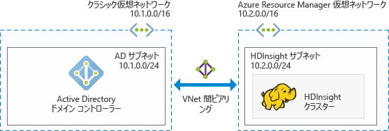

# HDInsight で Azure のドメイン参加済み Hadoop クラスターを計画する

従来の Hadoop は単一ユーザーのクラスターです。 これは、大規模なデータ ワークロードを構築する小規模なアプリケーション チームを抱えているほとんどの企業に適しています。 Hadoop が人気を得るにつれて、多くの企業では、IT チームが管理するクラスターを複数のアプリケーション チームが共有するモデルに移行しつつあります。 このため、マルチユーザーのクラスターに関わる機能は、Azure HDInsight で最も需要が高い機能となっています。

HDInsight は、独自のマルチユーザー認証と承認を構築する代わりに、最も人気のある ID プロバイダー、Active Directory (AD) を利用します。 AD の強力なセキュリティ機能を使用して、HDInsight でマルチユーザー承認を管理できます。 HDInsight と AD を統合することで、AD の資格情報を使ってクラスターと通信できます。 HDInsight は AD ユーザーをローカルの Hadoop ユーザーにマップするため、HDInsight で実行されているすべてのサービス (Ambari、Hive サーバー、Ranger、Spark Thrift サーバーなど) は認証済みユーザーに対してシームレスに動作します。

## HDInsight を Active Directory と統合する

HDInsight を Active Directory と統合すると、HDInsight クラスター ノードは、AD ドメインに参加することになります。 HDInsight は、クラスターで実行されている Hadoop サービスのサービス プリンシパルを作成し、ドメインで指定された組織単位 (OU) 内に配置します。 また、HDInsight はドメインに参加しているノードの IP アドレスについて、ドメインに逆引き DNS マッピングも作成します。

Active Directory には 2 つのデプロイ オプションがあります。
* **[Azure Active Directory Domain Services](../active-directory-domain-services/active-directory-ds-overview.md):** このサービスでは、Windows Server Active Directory と完全に互換性のある管理対象の Active Directory ドメインが提供されます。 Microsoft は、AD ドメインの管理、修正プログラムの適用、および監視を行います。 ドメイン コントローラーの管理について心配することなく、クラスターをデプロイすることができます。 ユーザー、グループおよびパスワードは、ユーザーが会社の資格情報を使ってクラスターにサインインできるように、Azure Active Directory から同期されます。

* **Azure IaaS VM の Windows Server Active Directory ドメイン:** このオプションでは、Azure IaaS VM で独自の Windows Server Active Directory ドメインをデプロイおよび管理します。 

この設定は、複数のアーキテクチャを使用して実現できます。 以下のアーキテクチャから好きなものを選んでください。

### Azure AD Domain Services の管理対象 AD ドメインと統合された HDInsight
[Azure Active Directory Domain Services](../active-directory-domain-services/active-directory-ds-overview.md) (Azure AD DS) の管理対象ドメインをデプロイできます。 Azure AD DS では、Microsoft によって管理、更新、監視される Azure で管理対象 AD ドメインが提供されます。 高可用性を確保するために 2 つのドメイン コントローラーが作成され、DNS サービスを含みます。 HDInsight クラスターをこの管理対象ドメインと統合できます。 このデプロイ オプションでは、ドメイン コントローラーの管理、修正プログラムの適用、更新、および監視について心配する必要がありません。

Azure AD Domain Services と統合するための前提条件:

* [Azure AD Domain Services の管理対象ドメインをプロビジョニングします](../active-directory-domain-services/active-directory-ds-getting-started.md)。
* [組織単位](../active-directory-domain-services/active-directory-ds-admin-guide-create-ou.md)を作成し、その中には、HDInsight クラスターの VM と、クラスターによって使用されるサービス プリンシパルを配置します。
* Azure AD DS の構成時に [LDAPS](../active-directory-domain-services/active-directory-ds-admin-guide-configure-secure-ldap.md) を設定します。 LDAPS を設定するために使用する証明書は、(自己署名証明書ではなく) 公的証明機関によって発行される必要があります。
* HDInsight サブネットの IP アドレス範囲 (たとえば、上の図では 10.2.0.0/24) について、管理対象ドメインに逆引き DNS ゾーンを作成します。
* Azure AD から Azure AD DS の管理対象ドメインへの [NTLM と Kerberos 認証に必要なパスワード ハッシュ同期](../active-directory-domain-services/active-directory-ds-getting-started-password-sync.md)を設定します。
* サービス アカウントかユーザー アカウントが必要です。 このアカウントを使用して HDInsight クラスターを作成します。 このアカウントには、次のアクセス許可が必要です。

    - サービス プリンシパル オブジェクトとマシン オブジェクトを組織単位内に作成するためのアクセス許可。
    - 逆引き DNS プロキシ規則を作成するためのアクセス許可。
    - マシンを Azure AD ドメインに参加させるためのアクセス許可。

### Azure IaaS で実行されている Windows Server AD と統合された HDInsight

Azure で 1 つ (または複数) の仮想マシン (VM) に Windows Server Active Directory Domain Services ロールをデプロイして、ドメイン コントローラーにレベルを上げることができます。 これらのドメイン コントローラー VM は、リソース マネージャー デプロイ モデルを使用して、HDInsight クラスターと同じ仮想ネットワークにデプロイできます。 ドメイン コントローラーが別の仮想ネットワークにデプロイされる場合は、[VNet 間ピアリング](../virtual-network/virtual-network-create-peering.md)を使用して、これらの仮想ネットワークを対にする必要があります。 

[詳細 - Azure VM での Windows Server Active Directory のデプロイ](../active-directory/virtual-networks-windows-server-active-directory-virtual-machines.md)

> [!NOTE]
> このアーキテクチャでは、HDInsight クラスターで Azure Data Lake Store を使用できません。

Azure VM の Windows Server Active Directory と統合するための前提条件:

* [組織単位](../active-directory-domain-services/active-directory-ds-admin-guide-create-ou.md)を作成する必要があります。その中には、HDInsight クラスターの VM と、クラスターによって使用されるサービス プリンシパルを配置します。
* AD と通信するために、[ライトウェイト ディレクトリ アクセス プロトコル](../active-directory-domain-services/active-directory-ds-admin-guide-configure-secure-ldap.md) (LDAP) を設定する必要があります。 LDAPS を設定するために使用する証明書は、(自己署名証明書ではなく) 実際の証明書にする必要があります。
* HDInsight サブネットの IP アドレス範囲 (たとえば、上の図では 10.2.0.0/24) について、ドメインに逆引き DNS ゾーンを作成する必要があります。
* サービス アカウントかユーザー アカウントが必要です。 このアカウントを使用して HDInsight クラスターを作成します。 このアカウントには、次のアクセス許可が必要です。

    - サービス プリンシパル オブジェクトとマシン オブジェクトを組織単位内に作成するためのアクセス許可。
    - 逆引き DNS プロキシ規則を作成するためのアクセス許可。
    - マシンを Active Directory ドメインに参加させるためのアクセス許可。

## 次のステップ
* ドメイン参加済み HDInsight クラスターを構成するには、[ドメイン参加済み HDInsight クラスターの構成](hdinsight-domain-joined-configure.md)に関する記事をご覧ください。
* ドメイン参加済み HDInsight クラスターを管理するには、[ドメイン参加済み HDInsight クラスターの管理](hdinsight-domain-joined-manage.md)に関する記事をご覧ください。
* Hive ポリシーを構成して Hive クエリを実行するには、[ドメイン参加済み HDInsight クラスターでの Hive ポリシーの構成](hdinsight-domain-joined-run-hive.md)に関する記事をご覧ください。
* SSH を使用してドメイン参加済み HDInsight クラスターで Hive クエリを実行する方法については、[HDInsight で SSH キーを使用する](hdinsight-hadoop-linux-use-ssh-unix.md)に関するページを参照してください。

