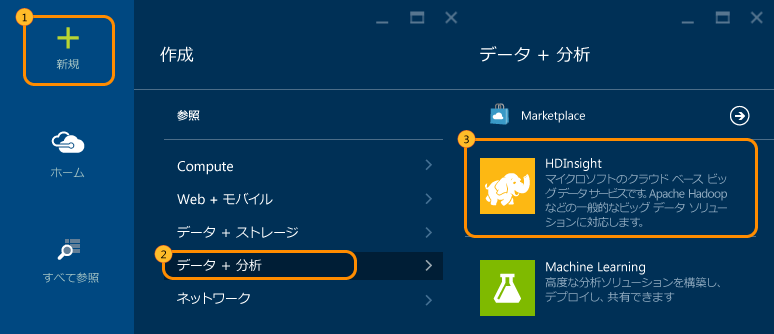
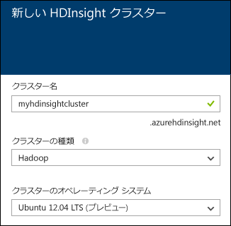
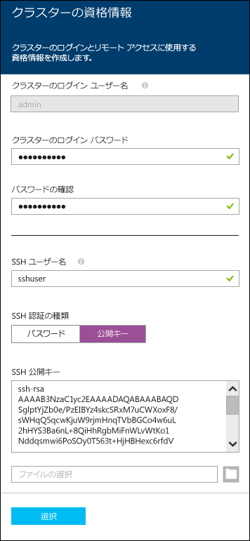

<properties
   	pageTitle="Linux のチュートリアル: Hadoop と Hive の使用 | Microsoft Azure"
   	description="HDInsight で Hadoop を使用するには、この Linux チュートリアルに従います。Linux のクラスターをプロビジョニングする方法、および Hive でデータを照会する方法について説明します。"
   	services="hdinsight"
   	documentationCenter=""
   	authors="nitinme"
   	manager="paulettm"
   	editor="cgronlun"
	tags="azure-portal"/>

<tags
   	ms.service="hdinsight"
   	ms.devlang="na"
   	ms.topic="hero-article"
   	ms.tgt_pltfrm="na"
   	ms.workload="big-data"
   	ms.date="01/21/2016"
   	ms.author="nitinme"/>

# Hadoop チュートリアル: Linux 上の HDInsight で Hive と Hadoop を使用する

> [AZURE.SELECTOR]
- [Windows](hdinsight-hadoop-tutorial-get-started-windows.md)
- [Linux](hdinsight-hadoop-linux-tutorial-get-started.md)

このドキュメントでは、Linux ベースの Hadoop クラスターを作成する方法、Ambari Web UI を開く方法、Ambari Hive ビューを使用して Hive クエリを実行する方法を紹介することで、Linux 上の Azure HDInsight の基本な使用方法について説明します。

> [AZURE.NOTE] Hadoop とビッグ データを初めて扱う場合は、[Apache Hadoop](http://go.microsoft.com/fwlink/?LinkId=510084)、[MapReduce](http://go.microsoft.com/fwlink/?LinkId=510086)、[Hadoop Distributed File System (HDFS)](http://go.microsoft.com/fwlink/?LinkId=510087)、[Hive](http://go.microsoft.com/fwlink/?LinkId=510085) に関するトピックを参照してください。HDInsight によって Azure でどのように Hadoop を利用できるかについては、「[Introduction to Hadoop in HDInsight (HDInsight の Hadoop 入門)](hdinsight-hadoop-introduction.md)」を参照してください。

## 前提条件

Linux でこの Hadoop チュートリアルを開始する前に、以下の条件を満たしている必要があります。

- **Azure サブスクリプション**: [Azure 無料試用版の取得](https://azure.microsoft.com/documentation/videos/get-azure-free-trial-for-testing-hadoop-in-hdinsight/)に関するページをご覧ください。

## Linux での HDInsight クラスターのプロビジョニング

クラスターをプロビジョニングするときに、Hadoop サービスとリソースを含む Azure コンピューティング リソースを作成します。このセクションでは、Hadoop バージョン 2.2 を含む HDInsight バージョン 3.2 クラスターをプロビジョニングします。HDInsight バージョンとその SLA については、「[HDInsight コンポーネントのバージョン](hdinsight-component-versioning.md)」をご覧ください。HDInsight クラスターの詳細な作成方法については、[カスタム オプションを使用した HDInsight クラスターのプロビジョニング][hdinsight-provision]のページを参照してください。

>[AZURE.NOTE]  Windows Server オペレーティング システムを実行する Hadoop クラスターを作成することもできます。手順については、「[Windows で HDInsight を使用する](hdinsight-hadoop-tutorial-get-started-windows.md)」を参照してください。

新しいクラスターを作成するには、次の手順に従います。

1. [Azure ポータル](https://ms.portal.azure.com/)にサインインします。
2. **[新規]**、**[データ分析]**、**[HDInsight]** の順にクリックします。

    

3. **[クラスター名]** を入力し、**[クラスターの種類]** で **[Hadoop]** を選択し、**[クラスターのオペレーティング システム]** ボックスの一覧から **[Ubuntu]** を選択します。クラスターを使用できる場合は、クラスター名の横に緑色のチェック マークが表示されます。

	

4. 複数のサブスクリプションがある場合は、**[サブスクリプション]** エントリをクリックし、クラスターで使用する Azure サブスクリプションを選択します。

5. **[リソース グループ]** をクリックして既存のリソース グループの一覧を表示し、その中にクラスターを作成するグループを選択します。または、**[新規作成]** をクリックし、新しいリソース グループの名前を入力します。新しいグループ名を使用できる場合は、緑のチェック マークが表示されます。

	> [AZURE.NOTE] このエントリには、既存のリソース グループを使用できる場合は、そのうちの 1 つが既定値として設定されます。

6. **[資格情報]** をクリックし、管理ユーザーのパスワードを入力します。**[SSH ユーザー名]** も入力する必要があります。**[SSH 認証の種類]** については、**[パスワード]** をクリックし、SSH ユーザーのパスワードを指定します。下部にある **[選択]** をクリックして資格情報の構成を保存します。

	

    > [AZURE.NOTE] SSH はコマンドラインで HDInsight クラスターにリモート アクセスするために使用されます。ここで使用するユーザー名とパスワードは、SSH でクラスターに接続するときに使用されます。

	HDInsight での SSH の使用方法の詳細については、次のいずれかのドキュメントをご覧ください。

	* [Linux、Unix、OS X から HDInsight 上の Linux ベースの Hadoop で SSH キーを使用する](hdinsight-hadoop-linux-use-ssh-unix.md)
	* [HDInsight の Linux ベースの Hadoop で Windows から SSH を使用する](hdinsight-hadoop-linux-use-ssh-windows.md)

7. **[データ ソース]** をクリックし、クラスターの既存のデータ ソースを選択するか、新しいデータ ソースを作成します。HDInsight で Hadoop クラスターをプロビジョニングするときに、Azure ストレージ アカウントを指定します。Hadoop 分散ファイルシステム (HDFS) と同様、このアカウントの特定の Blob Storage コンテナーが、既定のファイル システムとして設定されます。既定では、HDInsight クラスターは、指定されたストレージ アカウントと同じデータ センターにプロビジョニングされます。詳細については、「[HDInsight での Azure Blob Storage の使用](hdinsight-use-blob-storage.md)」をご覧ください。

	![[データ ソース] ブレード](./media/hdinsight-hadoop-linux-tutorial-get-started/HDI.CreateCluster.4.png "データ ソース構成の指定")

	現在、HDInsight クラスターのデータ ソースとして Azure ストレージ アカウントを選択できます。次の説明を参照して、**[データ ソース]** ブレードのエントリを理解してください。

	- **選択方法**: すべてのサブスクリプションのストレージ アカウントを参照できるようにする場合は、**[すべてのサブスクリプションから]** を設定します。既存のストレージ アカウントの **[ストレージ名]** と **[アクセス キー]** を入力する場合は、**[アクセス キー]** を設定します。

	- **ストレージ アカウントの選択/新規作成**: クラスターに関連付ける既存のストレージ アカウントを参照して選択する場合は **[ストレージ アカウントの選択]** をクリックします。新しいストレージ アカウントを作成する場合は **[新規作成]** をクリックします。表示されたフィールドに、ストレージ アカウントの名前を入力します。名前を使用できる場合は、緑色のチェック マークが表示されます。

	- **[既定のコンテナーの選択]**: これを使用して、クラスターで使用する既定のコンテナーの名前を入力します。任意の名前を入力できますが、コンテナーが特定のクラスターで使用されていることを簡単に認識できるように、クラスターと同じ名前を使用することをお勧めします。

	- **場所**: ストレージ アカウントが存在するリージョン、またはその中にストレージ アカウントが作成されるリージョン。

		> [AZURE.IMPORTANT] 既定のデータ ソースの場所を選択すると、HDInsight クラスターの場所も設定されます。クラスターと既定のデータ ソースは、同じリージョンに存在する必要があります。

	**[選択]** をクリックしてデータ ソースの構成を保存します。

8. **[ノード価格レベル]** をクリックして、このクラスターのために作成されるノードに関する情報を表示します。クラスターで必要なワーカー ノードの数を設定します。クラスターの推定コストがブレード内に表示されます。

	![[ノード価格レベル] ブレード](./media/hdinsight-hadoop-linux-tutorial-get-started/HDI.CreateCluster.5.png "クラスター ノード数の指定")
    
    > [AZURE.IMPORTANT] クラスター作成または作成後の拡大で 32 以上の worker ノードを予定している場合、コア数が 8 個以上で RAM が 14GB 以上のサイズのヘッド ノードを選択する必要があります。
    >
    > ノードのサイズと関連コストに関する詳細については、「[HDInsight の価格](https://azure.microsoft.com/pricing/details/hdinsight/)」を参照してください。

	**[選択]** をクリックして、ノードの価格構成を保存します。

9. **[新しい HDInsight クラスター]** ブレードで、**[スタート画面にピン留めする]** が選択されていることを確認し、**[作成]** をクリックします。これでクラスターが作成され、Azure ポータルのスタート画面にクラスター用のタイルが追加されます。アイコンはクラスターがプロビジョニング中であることを示し、プロビジョニングが完了すると、[HDInsight] アイコンを表示するように変化します。

プロビジョニング中|プロビジョニング完了
------------------|---------------------
	|

> [AZURE.NOTE] クラスターが作成されるまで、通常は約 15 分かかります。プロビジョニング プロセスをチェックするには、スタート画面のタイルまたはページの左側の **[通知]** エントリを使用します。

プロビジョニングが完了したら、スタート画面でクラスター用のタイルをクリックして、クラスター ブレードを起動します。

##Hive ビューへの接続

Ambari のビューでは、1 つの Web ページを介して複数のユーティリティを提供しています。以降のセクションでは、Hive ビューを使用して、HDInsight クラスターに対して Hive クエリを実行します。

> [AZURE.NOTE] Ambari は、Linux ベースの HDInsight クラスターに付属する管理および監視ユーティリティです。Ambari には多数の機能がありますが、このドキュメントではそれらについて説明しません。詳細については、「[Ambari Web UI を使用した HDInsight クラスターの管理](hdinsight-hadoop-manage-ambari.md)」を参照してください。

Azure ポータルから Ambari ビューを表示するには、HDInsight クラスターを選択し、__[クイック リンク]__ セクションの __[Ambari ビュー]__ を選択します。

また、Ambari に直接移動することもできます。そのためには、Web ブラウザーで https://CLUSTERNAME.azurehdinsight.net (ここで、__CLUSTERNAME__ は HDInsight クラスターの名前) に移動し、ページ メニューの (ページの左側の __[Admin]__ リンク ボタンの横にある) 四角形のセットを選択して使用可能なビューの一覧を表示します。__[Hive view]__ を選択します。

> [AZURE.NOTE] Ambari にアクセスすると、サイトに対する認証が求められます。クラスターを作成するときに使用した管理者アカウント名 (既定値は `admin`) とパスワードを入力します。

次のようなページが表示されます。

##Hive クエリを実行する

クラスターに含まれるデータに対して Hive クエリを実行するには、Hive ビューで次の手順に従います。

1. ページの __[Query Editor]__ セクションで、次の HiveQL ステートメントをワークシートに貼り付けます。

		DROP TABLE log4jLogs;
		CREATE EXTERNAL TABLE log4jLogs(t1 string, t2 string, t3 string, t4 string, t5 string, t6 string, t7 string)
		ROW FORMAT DELIMITED FIELDS TERMINATED BY ' '
		STORED AS TEXTFILE LOCATION 'wasb:///example/data/';
		SELECT t4 AS sev, COUNT(*) AS cnt FROM log4jLogs WHERE t4 = '[ERROR]' GROUP BY t4;

	これらのステートメントは次のアクションを実行します。

	- **DROP TABLE** - テーブルが既存の場合にテーブルとデータ ファイルを削除します。
	- **CREATE EXTERNAL TABLE** - Hive に新しく ”外部” テーブルを作成します。外部テーブルは、Hive にテーブル定義のみを格納し、データは、元の場所に残します。
	- **ROW FORMAT** - Hive にデータの形式を示します。ここでは、各ログのフィールドは、スペースで区切られています。
	- **STORED AS TEXTFILE LOCATION** - Hive に、データの格納先 (example/data ディレクトリ) と、データはテキストとして格納されていることを示します。
	- **SELECT** - t4 列の値が [ERROR] であるすべての行の数を指定します。

	>[AZURE.NOTE] 基盤となるデータを外部ソースによって更新する (データの自動アップロード処理など) 場合や別の MapReduce 操作によって更新する場合に、Hive クエリで最新のデータを使用する場合は、外部テーブルを使用する必要があります。外部テーブルを削除しても、データは削除*されません*。テーブル定義のみが削除されます。

2. クエリ エディターの下部にある __[Execute]__ ボタンを使用してクエリを開始します。ボタンの色がオレンジ色に変わり、テキストが __[Stop execution]__ に変わります。クエリ エディターの下に __[Query Process Results]__ セクションが表示され、ジョブに関する情報が表示されます。

    > [AZURE.IMPORTANT] ブラウザーによっては、ログまたは結果の情報が正しく更新されない場合があります。ジョブを実行したときに、ジョブの実行が続いているにもかかわらずログが更新されたり結果が返されたりしない場合は、Mozilla FireFox または Google Chrome を代わりに使用してください。
    
3. クエリが完了すると、__[Query Process Results]__ セクションに操作の結果が表示されます。__[Stop execution]__ ボタンも緑色の __[Execute]__ ボタンに戻ります。__[Results]__ タブには次の情報が表示されます。

        sev       cnt
        [ERROR]   3

    __[Logs]__ タブを使用すると、ジョブによって作成されたログ情報を表示できます。このログ情報は、クエリに問題が発生した場合のトラブルシューティングに使用できます。
    
    > [AZURE.TIP] __[Query Process Results]__ セクションの左上にある __[Save results]__ ボックスに注意してください。これを使用すると、結果をダウンロードすることも、CSV ファイルとして HDInsight のストレージに保存することもできます。

3. このクエリの最初の 4 行を選択し、__[Execute]__ を選択します。ジョブが完了したときに結果は生成されません。これは、クエリの一部が選択されているときに __[Execute]__ ボタンを使用すると、選択したステートメントのみが実行されるためです。この場合は、テーブルの行を取得する最後のステートメントが選択範囲に含まれていませんでした。その行のみを選択して __[Execute]__ を使用すると、予想どおりの結果が表示されます。

3. __クエリ エディター__の下部にある __[New Worksheet]__ ボタンを使用して新しいワークシートを作成します。新しいワークシートに、次の HiveQL ステートメントを入力します。

		CREATE TABLE IF NOT EXISTS errorLogs (t1 string, t2 string, t3 string, t4 string, t5 string, t6 string, t7 string) STORED AS ORC;
		INSERT OVERWRITE TABLE errorLogs SELECT t1, t2, t3, t4, t5, t6, t7 FROM log4jLogs WHERE t4 = '[ERROR]';

	これらのステートメントは次のアクションを実行します。

	- **CREATE TABLE IF NOT EXISTS** - 既存のテーブルがない場合、テーブルを作成します。**EXTERNAL** キーワードが使用されていないため、これは内部テーブルであり、Hive のデータ保管先に格納され、完全に Hive によって管理されます。外部テーブルとは異なり、内部テーブルを削除すると、基盤となるデータも削除されます。
	- **STORED AS ORC** - Optimized Row Columnar (ORC) 形式でデータを格納します。この形式は、Hive にデータを格納するための、非常に効率的で適切な形式です。
	- **INSERT OVERWRITE ...SELECT** - [ERROR] を含む **log4jLogs** テーブルの列を選択し、**errorLogs** テーブルにデータを挿入します。
    
    __[Execute]__ ボタンを使用してこのクエリを実行します。このクエリで返される行はないため、__[Results]__ タブには情報が表示されませんが、状態は __[SUCCEEDED]__ と表示されます。
    
4. クエリ エディターの右側には、一連のアイコンが表示されます。チェーンのようなアイコンを選択します。

    
    
    これは、クエリの __[Visual Explain]__ ビューです。このビューは、複雑なクエリのフローを理解する際に役立ちます。クエリ エディターの __[Explain]__ ボタンを使用して、このビューに対応するテキストを表示できます。
    
    
    
    その他のアイコンは次のとおりです。
    
    * **設定**: ギア アイコンでは、設定 `hive.execution.engine` や Tez パラメーターなどの Hive
    * **Tez**: クエリを実行するために Tez が使う有向非巡回グラフ (DAG)過去に実行したクエリの DAG を表示する場合は、__[Tez View]__ を使用します。
    * **通知**: 「クエリは送信されました」 などや、クエリの実行時にエラーが発生した場合に通知が表示されます。

5. __[SQL]__ アイコンを選択してクエリ エディターに戻り、新しいワークシートを作成して次のクエリを入力します。

        SELECT * from errorLogs;
    
    エディターの下部にある __[Save as]__ ボタンを使用します。このクエリに __Errorlogs__ という名前を付け、__[OK]__ を選択します。ワークシートの名前が __Errorlogs__ に変わります。
    
    保存済みのクエリは、ページの上部にある __[Saved Queries]__ タブにも表示されます。このタブを選択すると、__Errorlogs__ が表示されていることがわかります。その名前を選択すると、クエリ エディターにクエリが表示されます。

4. __Errorlogs__ クエリを実行します。結果は次のようになります。

        errorlogs.t1 	errorlogs.t2 	errorlogs.t3 	errorlogs.t4 	errorlogs.t5 	errorlogs.t6 	errorlogs.t7
        2012-02-03 	18:35:34 	SampleClass0 	[ERROR] 	incorrect 	id 	
        2012-02-03 	18:55:54 	SampleClass1 	[ERROR] 	incorrect 	id 	
        2012-02-03 	19:25:27 	SampleClass4 	[ERROR] 	incorrect 	id

## 次のステップ

このドキュメントでは、Azure ポータルを使用して Linux ベースの HDInsight クラスターを作成する方法、SSH を使用してクラスターに接続する方法、基本的な Hive クエリを実行する方法について説明しました。

HDInsight でデータを分析する方法の詳細については、次を参照してください。

- Visual Studio から Hive クエリを実行する方法など、HDInsight で Hive を使用する方法の詳細については、「[HDInsight での Hive の使用][hdinsight-use-hive]」を参照してください。

- データの変換に使用される言語 Pig の詳細については、「[HDInsight での Pig の使用][hdinsight-use-pig]」を参照してください。

- Hadoop 上のデータを処理するプログラムを作成する方法の 1 つである MapReduce の詳細については、「[HDInsight での MapReduce の使用][hdinsight-use-mapreduce]」を参照してください。

- HDInsight Tools for Visual Studio を使用して HDInsight 上のデータを分析する方法については、[HDInsight Hadoop Tools for Visual Studio の使用開始](hdinsight-hadoop-visual-studio-tools-get-started.md)に関するページを参照してください。

実際のデータを使用する準備が整っていて、HDInsight のデータの格納方法や HDInsight にデータを取り込む方法を確認する場合は、以下を参照してください。

- HDInsight で Azure Blob Storage を使用する方法の詳細については、[HDInsight での Azure Blob Storage の使用](hdinsight-use-blob-storage.md)に関するページを参照してください。

- データを HDInsight にアップロードする方法については、「[データを HDInsight にアップロードする方法][hdinsight-upload-data]」を参照してください。

HDInsight クラスターの作成または管理の詳細については、以下を参照してください。

- Linux ベースの HDInsight クラスターを管理する方法については、「[Ambari を使用した HDInsight クラスターの管理](hdinsight-hadoop-manage-ambari.md)」を参照してください。

- HDInsight クラスターの作成時に選択できるオプションの詳細については、「[カスタム オプションを使用した Linux での HDInsight のプロビジョニング](hdinsight-hadoop-provision-linux-clusters.md)」を参照してください。

- Linux と Hadoop を使い慣れていて、HDInsight 上の Hadoop に関する詳細情報を確認するには、「[Linux での HDInsight の使用](hdinsight-hadoop-linux-information.md)」を参照してください。次のような情報が掲載されています。

	* クラスターでホストされる URL (Ambari や WebHCat など)
	* Hadoop ファイルの場所とローカル ファイル システムの例
	* 既定のデータ ストアとして、HDFS ではなく Azure Storage (WASB) を使用する

[1]: ../HDInsight/hdinsight-hadoop-visual-studio-tools-get-started.md

[hdinsight-provision]: hdinsight-provision-clusters.md
[hdinsight-admin-powershell]: hdinsight-administer-use-powershell.md
[hdinsight-upload-data]: hdinsight-upload-data.md
[hdinsight-use-mapreduce]: hdinsight-use-mapreduce.md
[hdinsight-use-hive]: hdinsight-use-hive.md
[hdinsight-use-pig]: hdinsight-use-pig.md

[powershell-download]: http://go.microsoft.com/fwlink/p/?linkid=320376&clcid=0x409
[powershell-install-configure]: ../install-configure-powershell.md
[powershell-open]: ../install-configure-powershell.md#Install

[img-hdi-dashboard]: ./media/hdinsight-hadoop-tutorial-get-started-windows/HDI.dashboard.png
[img-hdi-dashboard-query-select]: ./media/hdinsight-hadoop-tutorial-get-started-windows/HDI.dashboard.query.select.png
[img-hdi-dashboard-query-select-result]: ./media/hdinsight-hadoop-tutorial-get-started-windows/HDI.dashboard.query.select.result.png
[img-hdi-dashboard-query-select-result-output]: ./media/hdinsight-hadoop-tutorial-get-started-windows/HDI.dashboard.query.select.result.output.png
[img-hdi-dashboard-query-browse-output]: ./media/hdinsight-hadoop-tutorial-get-started-windows/HDI.dashboard.query.browse.output.png
[image-hdi-clusterstatus]: ./media/hdinsight-hadoop-tutorial-get-started-windows/HDI.ClusterStatus.png
[image-hdi-gettingstarted-powerquery-importdata]: ./media/hdinsight-hadoop-tutorial-get-started-windows/HDI.GettingStarted.PowerQuery.ImportData.png
[image-hdi-gettingstarted-powerquery-importdata2]: ./media/hdinsight-hadoop-tutorial-get-started-windows/HDI.GettingStarted.PowerQuery.ImportData2.png

<!---HONumber=AcomDC_0128_2016-->