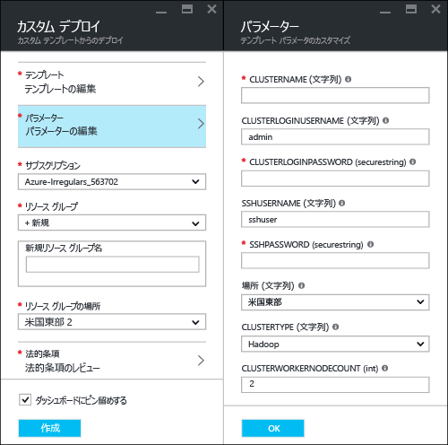
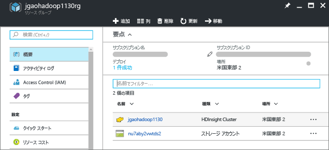
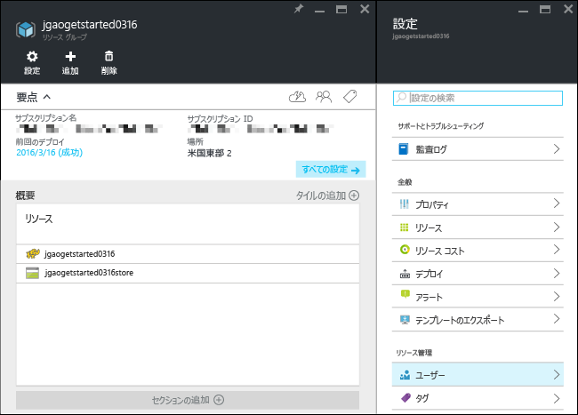
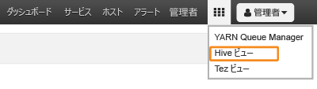

# Hadoop チュートリアル: HDInsight で Hadoop を使用する

この記事では、[Hadoop](http://hadoop.apache.org/) クラスターを HDInsight で作成する方法と、HDInsight で Hive ジョブを実行する方法について説明します。 [Apache Hive](https://hive.apache.org/) は Hadoop エコシステムで最もよく使用されているコンポーネントです。 現在、HDInsight には 6 つのクラスターの種類があります。[Hadoop](hdinsight-hadoop-introduction.md)、[Spark](hdinsight-apache-spark-overview.md)、[HBase](hdinsight-hbase-overview.md)、[Storm](hdinsight-storm-overview.md)、[Interactive Hive (プレビュー)](hdinsight-hadoop-use-interactive-hive.md)、[R Server](hdinsight-hadoop-r-server-overview.md) です。  クラスターの種類はそれぞれ異なるコンポーネント セットをサポートしていますが、 Hive は 6 つのクラスターの種類すべてでサポートされています。 HDInsight でサポートされているコンポーネントの一覧については、「[HDInsight で提供される Hadoop クラスター バージョンの新機能](hdinsight-component-versioning.md)」を参照してください。  

[!INCLUDE [delete-cluster-warning](../../includes/hdinsight-delete-cluster-warning.md)]
## 前提条件
このチュートリアルを読み始める前に、次の項目を用意する必要があります。

* **Azure サブスクリプション**: 1 か月間の無料試用版アカウントを [azure.microsoft.com/free](https://azure.microsoft.com/free)で作成できます。

### アクセス制御の要件
[!INCLUDE [access-control](../../includes/hdinsight-access-control-requirements.md)]

## クラスターの作成

Hadoop ジョブのほとんどはバッチ ジョブです。 クラスターを作成し、いくつかのジョブを実行して、クラスターを削除します。 このセクションでは、[Azure Resource Manager テンプレート](../azure-resource-manager/resource-group-template-deploy.md)を利用して、HDInsight で Hadoop クラスターを作成します。 Resource Manager テンプレートは完全にカスタマイズ可能です。そのため、HDInsight のような Azure リソースの作成が簡単になります。 このチュートリアルを利用するにあたり、Resource Manager テンプレートの使用経験は必要ありません。 その他のクラスター作成方法と、このチュートリアルで使うプロパティの詳細については、[HDInsight クラスターの作成](hdinsight-hadoop-provision-linux-clusters.md)に関するページを参照してください。 ページの上部にあるセレクターを使用すると、クラスター作成オプションを選択できます。

このチュートリアルで使用する Resource Manager テンプレートは、[Github](https://azure.microsoft.com/resources/templates/101-hdinsight-linux-ssh-password/) にあります。 

1. 次の画像をクリックして Azure にサインインし、Azure Portal で Resource Manager テンプレートを開きます。 
   
    
2. 次の値を入力または選択します。
   
    をクリックします。
   
    * **[サブスクリプション]**: Azure サブスクリプションを選択します。
    * **[リソース グループ]**: 新しいリソース グループを作成するか、既存のリソース グループを選択します。  リソース グループとは、Azure コンポーネントのコンテナーです。  この場合、リソース グループには、HDInsight クラスターおよび依存する Azure ストレージ アカウントが含まれています。 
    * **[場所]**: クラスターを作成する Azure の場所を選択します。  パフォーマンスを向上させるため、お近くの場所を選択してください。 
    * **クラスターの種類**: このチュートリアルでは、**hadoop** を選択します。
    * **[クラスター名]**: Hadoop クラスターの名前を入力します。
    * **クラスターのログイン名とパスワード**: 既定のログイン名は **admin** です。
    * **SSH ユーザー名とパスワード**: 既定のユーザー名は **sshuser** です。  この名前は変更できます。 
     
    一部のプロパティは、テンプレートにハードコーディングされています。  これらの値はテンプレートから構成することができます。

    * **[場所]**: クラスターおよび依存するストレージ アカウントの場所として、リソース グループと同じ場所が使用されます。
    * **クラスターのバージョン**: 3.5
    * **OS の種類**: Linux
    * **worker ノードの数**: 2

     各クラスターには Azure ストレージ アカウントとの依存関係があります。 このアカウントを通常、既定のストレージ アカウントと呼びます。 HDInsight クラスターとその既定のストレージ アカウントは、同じ Azure リージョンに配置されている必要があります。 クラスターを削除しても、ストレージ アカウントは削除されません。 
     
     これらのプロパティの詳細については、[HDInsight での Hadoop クラスターの作成](hdinsight-hadoop-provision-linux-clusters.md)に関するページを参照してください。

3. **[上記の使用条件に同意する]**、**[ダッシュボードにピン留めする]** の順に選択し、**[購入]** をクリックします。 ポータルのダッシュボードに、"**テンプレートのデプロイのデプロイ中**" という新しいタイルが表示されます。 クラスターの作成には約 20 分かかります。 クラスターが作成されると、タイルのキャプションが、指定したリソース グループ名に変更されます。 さらに、ポータルの新しいブレードで、リソース グループが自動的に表示されます。 クラスターと既定のストレージの両方を一覧で確認できます。
   
    をクリックします。

4. クラスター名をクリックして、新しいブレードでクラスターを開きます。

   

## Hive クエリの実行
[Apache Hive](hdinsight-use-hive.md) は、HDInsight で使用される最も一般的なコンポーネントです。 HDInsight で Hive ジョブを実行する方法は多数存在します。 このチュートリアルでは、ポータルから Ambari Hive ビューを使用して Hive ジョブをいくつか実行します。 Hive ジョブを送信する他の方法については、「 [HDInsight で Hadoop と共に Hive と HiveQL を使用して Apache log4j サンプル ファイルを分析する](hdinsight-use-hive.md)」を参照してください。

1. 前のスクリーンショットの状態で、**[クラスター ダッシュボード]** をクリックし、**[HDInsight クラスター ダッシュボード]** をクリックします。  ブラウザーで **https://&lt;クラスター名>.azurehdinsight.net** に移動することもできます。&lt;クラスター名> は、Ambari を開くために前のセクションで作成したクラスターです。
2. Hadoop ユーザー名と前のセクションで指定したパスワードを入力します。 既定のユーザー名は **admin**です。
3. 次のスクリーンショットのように **[ハイブ ビュー]** を開きます。
   
    で作成できます。
4. ページの **[Query Editor]** セクションで、次の HiveQL ステートメントをワークシートに貼り付けます。
   
        SHOW TABLES;
   
   > [!NOTE]
   > Hive では、セミコロンが必要です。       
   > 
   > 
5. **[実行]**をクリックします。 クエリ エディターの下に **[Query Process Results]** セクションが表示され、ジョブに関する情報が表示されます。 
   
    クエリが完了すると、**[Query Process Results (クエリ処理結果)]** セクションに操作の結果が表示されます。 **hivesampletable**という名前のテーブルが 1 つ表示されます。 このサンプルの Hive テーブルにはすべての HDInsight クラスターが付属します。
   
    に関するページを参照してください。
6. 手順 4. と手順 5 を繰り返し、次のクエリを実行します。
   
        SELECT * FROM hivesampletable;
   
   > [!TIP]
   > **[Query Process Results]** セクションの左上にある **[Save results]** ボックスに注意してください。これを使用すると、結果をダウンロードすることも、CSV ファイルとして HDInsight のストレージに保存することもできます。
   > 
   > 
7. **[履歴]** をクリックして、ジョブの一覧を取得します。

Hive ジョブが完了したら、[結果を Azure SQL データベースまたは SQL Server データベースにエクスポート](hdinsight-use-sqoop-mac-linux.md)できます。[Excel を利用して結果を視覚化](hdinsight-connect-excel-power-query.md)することもできます。 HDInsight で Hive を使用する方法の詳細については、「[HDInsight で Hadoop と共に Hive と HiveQL を使用して Apache log4j サンプル ファイルを分析する](hdinsight-use-hive.md)」をご覧ください。

## このチュートリアルの仕上げ
チュートリアルを完了したら、必要に応じてクラスターを削除できます。 HDInsight を使用すると、データは Azure Storage に格納されるため、クラスターは、使用されていない場合に安全に削除できます。 また、HDInsight クラスターは、使用していない場合でも課金されます。 クラスターの料金は Storage の料金の何倍にもなるため、クラスターを使用しない場合は削除するのが経済的にも合理的です。 

> [!NOTE]
> [Azure Data Factory](hdinsight-hadoop-create-linux-clusters-adf.md) を使用すると、HDInsight クラスターをオンデマンドで作成し、クラスターが自動的に削除されるように TimeToLive 設定を構成できます。 
> 
> 

**クラスターと既定のストレージ アカウントを削除するには、次の手順に従います。**

1. [Azure ポータル](https://portal.azure.com)にサインインします。
2. ポータルのダッシュボードで、クラスターの作成時に使用したリソース グループ名が表示されているタイルをクリックします。
3. クラスターと既定のストレージ アカウントが含まれたリソース グループを削除する場合は、クラスター ブレードで **[削除]** をクリックします。クラスターを削除する場合は、**[リソース]** タイルでクラスター名をクリックしてから、クラスター ブレードで **[削除]** をクリックします。 リソース グループを削除すると、ストレージ アカウントも削除されるので、注意してください。 ストレージ アカウントを残しておく場合は、クラスターのみを削除してください。

## 次のステップ
このチュートリアルでは、Resource Manager テンプレートを利用し、Linux ベースの HDInsight クラスターを作成する方法と基本的な Hive クエリを実行する方法について説明しました。

HDInsight でデータを分析する方法の詳細については、次を参照してください。

* Visual Studio から Hive クエリを実行する方法など、HDInsight で Hive を使用する方法の詳細については、[HDInsight での Hive の使用][hdinsight-use-hive]に関する記事を参照してください。
* データの変換に使用される言語 Pig の詳細については、[HDInsight での Pig の使用][hdinsight-use-pig]に関する記事を参照してください。
* Hadoop 上のデータを処理するプログラムを作成する方法の 1 つである MapReduce の詳細については、[HDInsight での MapReduce の使用][hdinsight-use-mapreduce]に関する記事を参照してください。
* HDInsight Tools for Visual Studio を使用して HDInsight 上のデータを分析する方法については、 [HDInsight Hadoop Tools for Visual Studio の使用開始](hdinsight-hadoop-visual-studio-tools-get-started.md)に関するページを参照してください。

実際のデータを使用する準備が整っていて、HDInsight のデータの格納方法や HDInsight にデータを取り込む方法を確認する場合は、以下を参照してください。

* HDInsight で Azure Storage を使用する方法の詳細については、[HDInsight での Azure Storage の使用](hdinsight-hadoop-use-blob-storage.md)に関するページを参照してください。
* データを HDInsight にアップロードする方法については、[データを HDInsight にアップロードする方法][hdinsight-upload-data]に関する記事を参照してください。

HDInsight クラスターの作成または管理の詳細については、以下を参照してください。

* Linux ベースの HDInsight クラスターを管理する方法については、「 [Ambari を使用した HDInsight クラスターの管理](hdinsight-hadoop-manage-ambari.md)」を参照してください。
* HDInsight クラスターの作成時に選択できるオプションの詳細については、「 [HDInsight での Linux ベースの Hadoop クラスターの作成](hdinsight-hadoop-provision-linux-clusters.md)」を参照してください。
* Linux と Hadoop を使い慣れていて、HDInsight 上の Hadoop に関する詳細情報を確認するには、「 [Linux での HDInsight の使用](hdinsight-hadoop-linux-information.md)」を参照してください。 次のような情報が掲載されています。
  
  * クラスターでホストされる URL (Ambari や WebHCat など)
  * Hadoop ファイルの場所とローカル ファイル システムの例
  * 既定のデータ ストアとして、HDFS ではなく Azure Storage (WASB) を使用する

[1]: ../HDInsight/hdinsight-hadoop-visual-studio-tools-get-started.md

[hdinsight-provision]: hdinsight-provision-linux-clusters.md
[hdinsight-upload-data]: hdinsight-upload-data.md
[hdinsight-use-mapreduce]: hdinsight-use-mapreduce.md
[hdinsight-use-hive]: hdinsight-use-hive.md
[hdinsight-use-pig]: hdinsight-use-pig.md

