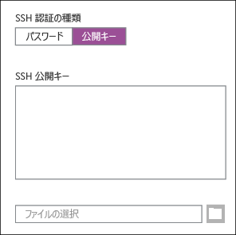

<properties
   pageTitle="Linux、Unix、または OS X と Linux ベースの Hadoop の間で SSH キーを使用する | Microsoft Azure"
   description="Secure Shell (SSH) を使用して Linux ベースの HDInsight にアクセスできます。このドキュメントでは、Linux、Unix、または OS X の各クライアントから HDInsight で SSH を使用する方法について説明します。"
   services="hdinsight"
   documentationCenter=""
   authors="Blackmist"
   manager="paulettm"
   editor="cgronlun"/>

<tags
   ms.service="hdinsight"
   ms.devlang="na"
   ms.topic="article"
   ms.tgt_pltfrm="na"
   ms.workload="big-data"
   ms.date="07/06/2015"
   ms.author="larryfr"/>

#Linux、Unix、OS X から HDInsight 上の Linux ベースの Hadoop で SSH キーを使用する (プレビュー)

> [AZURE.SELECTOR]
- [Windows](hdinsight-hadoop-linux-use-ssh-windows.md)
- [Linux, Unix, OS X](hdinsight-hadoop-linux-use-ssh-unix.md)

Linux ベースの Azure HDInsight クラスターには、パスワードまたは SSH キーを使用した Secure Shell (SSH) アクセスのオプションが用意されています。このドキュメントでは、Linux、Unix、または OS X の各クライアントから HDInsight で SSH を使用する方法について説明します。

> [AZURE.NOTE]この記事で説明する手順は、Linux、Unix、または OS X の各クライアントを使用していることを前提とします。`ssh` と `ssh-keygen` を提供するパッケージ (Windows の Git など) をインストール済みの場合は、これらの手順を Windows ベースのクライアントで実行できますが、「[Windows から Linux ベースの HDInsight (Hadoop) で SSH を使用する](hdinsight-hadoop-linux-use-ssh-windows.md)」に記載されている手順に従って Windows ベースのクライアントを設定することをお勧めします。

##前提条件

* Linux、Unix、OS X の各クライアント用の **ssh-keygen** と **ssh**。通常、このユーティリティはオペレーティング システムに付属しています。また、パッケージ管理システムから入手することもできます。

* HTML5 をサポートする最新の Web ブラウザー

または

* [Mac、Linux、Windows 用の Azure CLI](../xplat-cli.md)

##SSH とは

SSH は、リモート サーバーにログインしたり、リモート サーバーでコマンドをリモート実行したりするためのユーティリティです。Linux ベースの HDInsight では、SSH によりクラスター ヘッド ノードへの暗号化された接続が確立され、コマンドの入力に使用するコマンド ラインが提供されます。コマンドは、直接サーバーで実行されます。

##SSH キーの作成 (オプション)

Linux ベースの HDInsight クラスターを作成するとき、SSH キーを使用したサーバーへの認証にパスワードまたは SSH キーを使用することを選択できます。証明書ベースであるため、SSH キーの方がより安全です。クラスターで SSH キーを使用する場合は、次の手順を実行します。

1. ターミナル セッションを開き、次のコマンドを使用して、既存の SSH キーがあるかどうかを確認します。

		ls -al ~/.ssh

	ディレクトリ一覧で、次のファイルを探します。これらは SSH 公開キーの共通名です。

	* d_dsa.pub
	* id_ecdsa.pub
	* id_ed25519.pub
	* id_rsa.pub

2. 既存のファイルを使用しない場合や、既存の SSH キーがない場合は、次のコマンドを使用して新しいファイルを生成します。

		ssh-keygen -t rsa

	次の情報の入力を求められます。

	* ファイルの場所 - 既定値は ~/.ssh/id\\_rsa です。
	* パスフレーズ - 1 回入力した後に再入力を求められます。

		> [AZURE.NOTE]キーにセキュリティで保護されたパスフレーズを使用することを強くお勧めします。ただし、パスフレーズを忘れた場合、それを回復する方法はありません。

	コマンドが完了すると、秘密キー (**id\\_rsa** など) と公開キー (**id\\_rsa.pub** など) の 2 つの新しいファイルが作成されます。

##Linux ベースの HDInsight クラスターの作成

Linux ベースの HDInsight クラスターを作成するときには、以前に作成した公開キーを指定する必要があります。Linux、Unix、または OS X の各クライアントからは、2 つの方法で HDInsight クラスターを作成できます。

* **Azure 管理ポータル** - Web ベースのポータルを使用してクラスターを作成します。

* **Mac、Linux、Windows 用の Azure CLI** - コマンドラインでコマンドを使用してクラスターを作成します。

これらの方法では、それぞれパスワードまたは公開キーが必要です。Linux ベースの HDInsight クラスターを作成する方法の詳細については、[HDInsight での Hadoop Linux クラスターのプロビジョニング](hdinsight-hadoop-provision-linux-clusters.md)に関するページを参照してください。

###Azure ポータル

このポータルを使用して Linux ベースの HDInsight クラスターを作成する場合は、**SSH ユーザー名**を入力して、**パスワード**と **SSH 公開キー**のどちらを入力するかを選択する必要があります。**SSH 公開キー**を選択した場合は、(拡張子が **.pub** のファイルに含まれている) 公開キーを次のフォームに貼り付ける必要があります。



> [AZURE.NOTE]このキー ファイルは単なるテキスト ファイルです。内容は次のようになります。```
ssh-rsa AAAAB3NzaC1yc2EAAAADAQABAAABAQCelfkjrpYHYiks4TM+r1LVsTYQ4jAXXGeOAF9Vv/KGz90pgMk3VRJk4PEUSELfXKxP3NtsVwLVPN1l09utI/tKHQ6WL3qy89WVVVLiwzL7tfJ2B08Gmcw8mC/YoieT/YG+4I4oAgPEmim+6/F9S0lU2I2CuFBX9JzauX8n1Y9kWzTARST+ERx2hysyA5ObLv97Xe4C2CQvGE01LGAXkw2ffP9vI+emUM+VeYrf0q3w/b1o/COKbFVZ2IpEcJ8G2SLlNsHWXofWhOKQRi64TMxT7LLoohD61q2aWNKdaE4oQdiuo8TGnt4zWLEPjzjIYIEIZGk00HiQD+KCB5pxoVtp user@system
> ```

これで、入力したパスワードまたは公開キーを使用して、指定されたユーザーのログインが作成されます。

###Mac、Linux、Windows の Azure コマンド ライン インターフェイス

[Mac、Linux、Windows の Azure CLI](../xplat.md) では、`azure hdinsight cluster create` コマンドを使用して新しいクラスターを作成できます。

このコマンドの使用方法の詳細については、「[カスタム オプションを使用した HDInsight での Hadoop Linux クラスターのプロビジョニング](hdinsight-hadoop-provision-linux-clusters.md)」を参照してください。

##Linux ベースの HDInsight クラスターへの接続

ターミナル セッションから、SSH コマンドを使用して、アドレスとユーザー名を入力し、クラスター ヘッド ノードに接続します。

* **SSH アドレス** - クラスター名に続けて「**-ssh.azurehdinsight.net**」と入力します (**mycluster-ssh.azurehdinsight.net** など)。

* **ユーザー名** - クラスターの作成時に指定した SSH ユーザー名。

次の例では、ユーザー **me** として、**mycluster** というクラスターに接続します。

	ssh me@mycluster-ssh.azurehdinsight.net

ユーザー アカウントにパスワードを使用した場合は、そのパスワードの入力を求められます。

パスフレーズで保護された SSH キーを使用した場合は、そのパスフレーズの入力を求められます。パスフレーズを入力しない場合、SSH はローカルの秘密キーのいずれかをクライアントで使用して自動的に認証を試行します。

> [AZURE.NOTE]SSH が適切な秘密キーを使用して自動的に認証を行わない場合は、**-i** パラメーターを使用して、秘密キーのパスを指定します。次の例は、`~/.ssh/id_rsa` から秘密キーを読み込みます。
>
> `ssh -i ~/.ssh/id_rsa me@mycluster-ssh.azurehdinsight.net`

###ワーカー ノードへの接続

ワーカー ノードは、Azure データセンターの外部からは直接アクセスできませんが、SSH を使用してクラスター ヘッド ノードからアクセスできます。

ユーザー アカウントの認証に SSH キーを使用する場合は、クライアントで次の手順を完了する必要があります。

1. テキスト エディターを使用して `~/.ssh/config` を開きます。このファイルが存在しない場合は、ターミナルで `touch ~/.ssh/config` と入力して作成できます。

2. このファイルに次のコードを追加します。*CLUSTERNAME* を、使用する HDInsight クラスターの名前に置き換えます。

        Host CLUSTERNAME-ssh.azurehdinsight.net
          ForwardAgent yes

    これは、HDInsight クラスターに SSH エージェント転送を構成します。

3. 端末から次のコマンドを使用して、SSH エージェント転送をテストします。

        echo "$SSH_AUTH_SOCK"

    次のような情報が返されます。

        /tmp/ssh-rfSUL1ldCldQ/agent.1792

    何も返されない場合は、**ssh-agent** が実行していないことを示します。**ssh-agent** のインストールと構成に関する具体的な手順については、オペレーティング システムのマニュアルまたは「[Using ssh-agent with ssh (ssh での ssh-agent の使用)](http://mah.everybody.org/docs/ssh)」を参照してください。

4. **ssh-agent** が実行していることを確認したら、次のコマンドを使用して SSH 秘密キーをエージェントに追加します。

        ssh-add ~/.ssh/id_rsa

    秘密キーを別のファイルに格納している場合は、`~/.ssh/id_rsa` をそのファイルのパスに置き換えます。

次の手順を使用して、クラスターのワーカー ノードに接続します。

> [AZURE.IMPORTANT]アカウントの認証に SSH キーを使用する場合は、前の手順を完了してからエージェント転送が動作していることを確認する必要があります。

1. 前述のように、SSH を使用して HDInsight クラスターに接続します。

2. 接続したら、次のコマンドを使用してクラスター内のノードの一覧を取得します。*ADMINPASSWORD* をクラスターの管理者アカウントのパスワードに置き換えます。*CLUSTERNAME* をクラスターの名前に置き換えます。

        curl --user admin:ADMINPASSWORD https://CLUSTERNAME.azurehdinsight.net/api/v1/hosts

    クラスター内のノードの `host_name` などの情報が JSON 形式で返されます。これには、各ノードの完全修飾ドメイン名 (FQDN) が含まれています。次は、**curl** コマンドによって返された `host_name` エントリの例です。

        "host_name" : "workernode0.workernode-0-e2f35e63355b4f15a31c460b6d4e1230.j1.internal.cloudapp.net"

3. 接続するワーカー ノードの一覧を取得したら、SSH セッションからサーバーに次のコマンドを使用して、ワーカー ノードへの接続を開きます。

        ssh USERNAME@FQDN

    *USERNAME* を SSH ユーザー名、*FQDN* をワーカー ノードの FQDN に置き換えます (例: `workernode0.workernode-0-e2f35e63355b4f15a31c460b6d4e1230.j1.internal.cloudapp.net`)。

    > [AZURE.NOTE]SSH セッションの認証にパスワードを使用する場合は、もう一度パスワードを入力するように求めるメッセージ表示されます。SSH キーを使用する場合は、何も表示されずに接続が完了します。

4. セッションが確立されると、ターミナルのプロンプトが `username@headnode` から `username@workernode` に変わり、ワーカー ノードに接続したことを示します。この時点で実行するすべてのコマンドは、ワーカー ノードで実行されます。

4. ワーカー ノードでの操作が終了したら、`exit` コマンドを使用してワーカー ノードのセッションを閉じます。これにより、`username@headnode` プロンプトが表示されます。

##複数のアカウントの追加

1. 新しいユーザー アカウントの公開キーと秘密キーを、[SSH キーの作成](#create-an-ssh-key-optional)セクションの説明に従って作成します。

	> [AZURE.NOTE]秘密キーは、クラスターに接続するためにユーザーが使用するクライアントで生成するか、または生成後にそのクライアントに安全に転送する必要があります。

1. クラスターへの SSH セッションから、次のコマンドを使用して新しいユーザーを追加します。

		sudo adduser --disabled-password <username>

	これにより、新しいユーザー アカウントが作成されますが、パスワード認証は無効になります。

2. 次のコマンドを使用して、キーを格納するディレクトリとファイルを作成します。

		sudo mkdir -p /home/<username>/.ssh
		sudo touch /home/<username>/.ssh/authorized_keys
		sudo nano /home/<username>/.ssh/authorized_keys

3. ナノ エディターが開いたら、新しいユーザー アカウントのパブリック キーの内容をコピーして貼り付けます。最後に、**Ctrl + X** キーを使用してファイルを保存し、エディターを終了します。

	

4. 次のコマンドを使用して、新しいユーザー アカウントに対する .ssh フォルダーの所有権をとコンテンツを変更します。

		sudo chown -hR <username>:<username> /home/<username>/.ssh

5. これで、新しいユーザー アカウントおよびプライベート キーを使用してサーバーへの認証を行えるようになります。

##<a id="tunnel"></a>SSH トンネリング

SSH を使用して、Web 要求などのローカルの要求を HDInsight クラスターにトンネリングすることもできます。ここでは、最初から HDInsight クラスター ヘッド ノード上にあったかのように、要求が要求済みリソースにルーティングされます。

これは、クラスター内でヘッドまたはワーカー ノードの内部ドメイン名を使用する HDInsight クラスターで Web ベースのサービスにアクセスするときに最も役立ちます。たとえば、Ambari Web ベースの一部のセクションで、**headnode0.mycluster.d1.internal.cloudapp.net** などの内部ドメイン名を使用する場合です。これらの名前は、クラスター外部で解決できませんが、SSH を介してトンネリングされた要求はクラスター内から発信され、正常に解決します。

SSH トンネルを作成し、ブラウザーでこれを使用してクラスターに接続するように構成するには、次の手順を実行します。

1. 次のコマンドを使用して、クラスターのヘッド ノードへの SSH トンネルを作成できます。

		ssh -C2qTnNf -D 9876 username@clustername-ssh.azurehdinsight.net

	これで、ローカル ポート 9876 へのトラフィックを SSH 経由でクラスターにルーティングする接続が作成されます。オプションは次のとおりです。

	* **D 8080** - トンネル経由でトラフィックをルーティングするローカル ポートです。

	* **C** - すべてのデータを圧縮します (Web トラフィックの大部分はテキストであるため)。

	* **2** - SSH プロトコル バージョンを強制的に 2 のみに指定します。

	* **q** - Quiet モードです。

	* **T** - pseudo-tty の割り当てを無効にします (ポートの転送だけを行うため)。

	* **n** - STDIN を読み取らないようにします (ポートの転送だけを行うため)。

	* **N** - リモート コマンドを実行しません (ポートの転送だけを行うため)。

	* **f** - バックグラウンドで実行します。

	SSH キーを使用してクラスターを構成した場合は、SSH 秘密キーのパスを `-i` パラメーターで指定する必要があることがあります。

	コマンドが完了すると、ローカル コンピューター上でポート 9876 に送信されるトラフィックは、クラスターのヘッド ノードに Secure Sockets Layer (SSL) 経由でルーティングされ、そのヘッド ノードで生成されたかのように見えます。

2. Firefox などのクライアント プログラムで **SOCKS v5** プロキシとして **localhost:9876** を使用するように構成します。Firefox の設定は次のようになります。

	

	> [AZURE.NOTE]**[リモート DNS]** を選択するとドメイン ネーム システム (DNS) 要求は HDInsight クラスターを使用して解決されます。選択しないと、DNS はローカルに解決されます。

	Firefox でプロキシ設定を有効または無効にして、[http://www.whatismyip.com/](http://www.whatismyip.com/) などのサイトにアクセスして、トラフィックがトンネルを経由しているかどうか確認できます。設定が有効の場合、IP アドレスは Microsoft Azure データセンター内のコンピューターの IP アドレスになります。

###ブラウザー拡張

ブラウザーをトンネル ワークを使用するように構成する場合、通常、一部のトラフィックをトンネルを経由で送信しないように設定する必要があることがあります。[FoxyProxy](http://getfoxyproxy.org/) などのブラウザー拡張機能では、URL 要求に対するパターン マッチングがサポートされるため (FoxyProxy Standard または Plus のみ)、特定の URL の要求のみがトンネル経由で送信されます。

FoxyProxy Standard をインストール済みの場合は、次の手順を使用して、HDInsight の トラフィックだけをトンネル経由で転送するように構成します。

1. ブラウザーで FoxyProxy 拡張を開きます。Firefox などで、アドレス フィールドの横にある FoxyProxy アイコンを選択します。

	

2. **[新しいプロキシの追加]**、**[全般]** タブの順に選択し、**HDInsightProxy** のプロキシ名を入力します。

	

3. **[プロキシの詳細]** タブを選択し、次のフィールドを入力します。

	* **[ホストまたは IP アドレス]** - ローカル マシンで SSH トンネルを使用するため「localhost」と入力します。

	* **[ポート]** - SSH トンネル用に使用するポート。

	* **[SOCKS プロキシ]** - ブラウザーでのプロキシとしてのトンネルの使用を有効にします。

	* **[SOCKS v5]** - プロキシに必要なバージョンを設定します。

	

4. **[URL パターン]** タブを選択し、**[新しいパターンの追加]** を選択します。以下を使用してパターンを定義し、**[OK]** をクリックします。

	* **[パターン名]** - **headnode** - パターンのフレンドリ名です。

	* **[URL パターン]** - ***headnode*** - **headnode** という単語を含む URL と一致するパターンを定義します。

	

4. **[OK]** をクリックしてプロキシを追加し、**[プロキシの設定]** を閉じます。

5. FoxyProxy ダイアログの上部で、**[モードの選択]** を **[定義済みのパターンと優先順位に基づいてプロキシを使用]** に変更し、**[閉じる]** を選択します。

	

これらを完了すると、**headnode** という文字列を含む URL の要求のみが SSH トンネル経由で送信されます。

##次のステップ

これで、SSH キーを使用して認証する方法、また、HDInsight 上の Hadoop で MapReduce を使用する方法についてご理解いただけたと思います。

* [HDInsight での Hive の使用](hdinsight-use-hive.md)

* [HDInsight の Hadoop での Pig の使用](hdinsight-use-pig.md)

* [HDInsight での MapReduce の使用](hdinsight-use-mapreduce.md)

<!---HONumber=July15_HO2-->