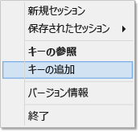

# Windows での PuTTY から HDInsight (Hadoop) で SSH を使用します。

> [!div class="op_single_selector"]
> * [PuTTY (Windows)](hdinsight-hadoop-linux-use-ssh-windows.md)
> * [SSH (Windows、Linux、Unix、OS X)](hdinsight-hadoop-linux-use-ssh-unix.md)

[Secure Shell (SSH)](https://en.wikipedia.org/wiki/Secure_Shell) では、コマンドライン インターフェイスを利用し、Linux ベース HDInsight クラスターで操作をリモート実行できます。 このドキュメントでは、PuTTY SSH クライアントを使用した Windows ベースのクライアントからの HDInsight への接続について説明します。

> [!NOTE]
> この記事の手順では、PuTTY SSH クライアントと Windows ベースのシステムを使用していることを前提としています。 `ssh` コマンドが用意されている Linux、Unix、OS X、または Windows システムを使用する場合は、「[Linux、Unix、または OS X から HDInsight 上の Linux ベースの Hadoop で SSH キーを使用する](hdinsight-hadoop-linux-use-ssh-unix.md)」をご覧ください。

## 前提条件

* **PuTTY** と **PuTTYGen** (Windows クライアント)。 これらのユーティリティは [http://www.chiark.greenend.org.uk/~sgtatham/putty/download.html](http://www.chiark.greenend.org.uk/~sgtatham/putty/download.html)から入手できます。
* HTML5 をサポートする最新の Web ブラウザー

## SSH とは

SSH は、リモート サーバーにログインしたり、リモート サーバーでコマンドをリモート実行したりするためのユーティリティです。 Linux ベースの HDInsight では、SSH によりクラスター ヘッド ノードへの暗号化された接続が確立され、コマンドの入力に使用するコマンド ラインが提供されます。 コマンドは、直接サーバーで実行されます。

Windows では、SSH クライアントが提供されていませんでした。 PuTTY は、Windows にインストールできるグラフィカルな SSH クライアントです。

### SSH ユーザー名

SSH ユーザー名は HDInsight クラスターの認証に使用する名前です。 クラスター作成中に SSH ユーザー名を指定するとき、このユーザーがクラスターのすべてのノードで作成されます。 クラスターを作成したら、このユーザー名を使用し、HDInsight クラスター ヘッド ノードに接続できます。 ヘッド ノードから、個々のワーカー ノードに接続できます。

### SSH パスワードまたは公開キー

SSH ユーザーはパスワードと公開キーのいずれかを認証に利用できます。 パスワードはユーザーが考えたテキスト文字列です。公開キーはユーザーを一意に識別するために生成された暗号化キー ペアの片割れです。

キーはパスワードより安全ですが、追加の手順でキーを生成する必要があり、キーが入っているファイルを安全な場所に保管しなければなりません。 そのキー ファイルにアクセスされると、アカウントにもアクセスされます。 また、キー ファイルをなくした場合、アカウントにログインできなくなります。

キー ペアは公開キー (HDInsight サーバーに送信されます) と秘密キー (クライアント コンピューターで保存されます) から構成されます。SSH を利用して HDInsight に接続すると、SSH はコンピューターに保存されている秘密キーを利用し、サーバーで認証します。

## SSH キーの作成

クラスターで SSH キーを使用する場合は、次の手順を実行します。 パスワードを使用する場合、このセクションを省略できます。

1. PuTTYGen を開きます。

2. **[生成するキーの種類]** に **[SSH-2 RSA]** を選択し、**[生成]** をクリックします。
   
    

3. 進行状況バーが塗りつぶされるまで、バーの下の領域にマウスを移動します。 マウスを移動すると、キーの生成に使用するランダム データが生成されます。
   
    
   
    キーが生成されると、パブリック キーが表示されます。

4. セキュリティを強化するために、**[キーのパスフレーズ]** フィールドにパスフレーズを入力し、**[パスフレーズの確認]** フィールドに同じ値を入力します。
   
    
   
   > [!NOTE]
   > キーにセキュリティで保護されたパスフレーズを使用することを強くお勧めします。 ただし、パスフレーズを忘れた場合、それを回復する方法はありません。

5. **[Save private key (秘密キーの保存)]** をクリックして、キーを **.ppk** ファイルに保存します。 このキーは、Linux ベースの HDInsight クラスターへの認証に使用されます。
   
   > [!NOTE]
   > こキーは Linux ベースの HDInsight クラスターへのアクセスに使用できるため、セキュリティ保護された場所に保存する必要があります。

6. **[Save public key (公開キーの保存)]** をクリックして、キーを **.txt** ファイルとして保存します。 これにより、Linux ベースの HDInsight クラスターを今後追加で作成するときにパブリック キーを再利用できます。
   
   > [!NOTE]
   > また、パブリック キーは PuTTYGen の上部に表示されます。 Azure ポータルを使用してクラスターを作成するときに、このフィールドを右クリックし、値をコピーして、フォームに貼り付けることができます。

## Linux ベースの HDInsight クラスターの作成

Linux ベースの HDInsight クラスターを作成するときには、以前に作成した公開キーを指定する必要があります。 Windows ベースのクライアントから、次の&2; つの方法で、Linux ベースの HDInsight クラスターを作成できます。

* **Azure ポータル** - Web ベースのポータルを使用してクラスターを作成します。

* **Mac、Linux、Windows 用の Azure CLI** - コマンドラインでコマンドを使用してクラスターを作成します。

これらの各メソッドにはパブリック キーが必要です。 Linux ベースの HDInsight クラスターを作成する方法の詳細については、 [HDInsight での Hadoop Linux クラスターのプロビジョニング](hdinsight-hadoop-provision-linux-clusters.md)に関するページを参照してください。

### Azure ポータル

[Azure Portal][preview-portal] を使用して Linux ベースの HDInsight クラスターを作成する場合は、**SSH ユーザー名**を入力して、**パスワード**と **SSH 公開キー**のどちらを入力するかを選択する必要があります。

**[SSH 公開キー]** を選択した場合は、公開キー(PuttyGen の **OpenSSH authorized\_keys ファイル** フィールドに貼り付けるための公開キーに表示されている) を **[SSH 公開キー]** フィールドに貼り付けるか、**[ファイルの選択]** を選択し、公開キーを含むファイルを参照して選択できます。

これにより、指定したユーザーのログインが作成され、パスワード認証または SSH キー認証のいずれかが有効になります。

### Mac、Linux、Windows の Azure コマンド ライン インターフェイス

[Mac、Linux、Windows 用の Azure CLI](../cli-install-nodejs.md) で、`azure hdinsight cluster create` コマンドを使用して新しいクラスターを作成できます。

このコマンドの使用方法の詳細については、「 [カスタム オプションを使用した HDInsight での Hadoop Linux クラスターのプロビジョニング](hdinsight-hadoop-provision-linux-clusters.md)」を参照してください。

## Linux ベースの HDInsight クラスターへの接続

1. PuTTY を開きます。
   
    
2. ユーザー アカウントの作成時に SSH キーを指定した場合は、次の手順に従って、クラスターへの認証に使用するプライベート キーを選択する必要があります。
   
    **[カテゴリ]** で **[接続]**、**[SSH]** の順に展開し、**[認証]** を選択します。 最後に、 **[参照]** をクリックし、プライベート キーが含まれた .ppk ファイルを選択します。
   
    

3. **[カテゴリ]** で **[セッション]** を選択します。 **[PuTTY セッションの基本設定]** 画面で、**[ホスト名 (または IP アドレス)]** フィールドに HDInsight サーバーの SSH アドレスを入力します。 クラスターに接続する際に使う可能性がある SSH アドレスは&2; つあります。

    

    * **ヘッド ノード アドレス**: クラスターのヘッド ノードに接続する場合は、クラスター名に続けて「**-ssh.azurehdinsight.net**」と入力します  (**mycluster-ssh.azurehdinsight.net** など)。
   
    * **エッジ ノード アドレス**: HDInsight クラスター上の R Server に接続する場合は、アドレス **RServer.CLUSTERNAME.ssh.azurehdinsight.net** を使用して R Server のエッジ ノードに接続できます (CLUSTERNAME は実際のクラスターの名前です)。 たとえば、**RServer.mycluster.ssh.azurehdinsight.net**になります。
     

4. 後で使用するために接続情報を保存するには、**[保存されたセッション]** にこの接続の名前を入力し、**[保存]** をクリックします。 接続が、保存済みセッションの一覧に追加されます。
5. **[開く]** をクリックして、クラスターに接続します。
   
   > [!NOTE]
   > クラスターに初めて接続する場合は、セキュリティ の警告が返されます。 問題はありません。 **[はい]** を選択し、サーバーの RSA2 キーをキャッシュして続行します。

6. プロンプトが表示されたら、クラスターの作成時に入力したユーザーを入力します。 ユーザーにパスワードを指定している場合は、その入力も求められます。

> [!NOTE]
> 上記の手順ではポート 22 を使用していると仮定しています。このポートは、HDInsight クラスターのプライマリ ヘッド ノードに接続します。 ポート 23 を使用すると、セカンダリに接続されます。 ヘッド ノードの詳細については、「 [HDInsight における Hadoop クラスターの可用性と信頼性](hdinsight-high-availability-linux.md)」を参照してください。

### ワーカー ノードへの接続

ワーカー ノードは、Azure データセンターの外部からは直接アクセスできませんが、SSH を使用してクラスター ヘッド ノードからアクセスできます。

ユーザー アカウントの作成時に SSH キーを指定した場合は、ワーカー ノードに接続するクラスターを認証するときに、次の手順に従ってプライベート キーを使用する必要があります。

1. [http://www.chiark.greenend.org.uk/~sgtatham/putty/download.html](http://www.chiark.greenend.org.uk/~sgtatham/putty/download.html)から Pageant をインストールします。 このユーティリティを使用して、PuTTY の SSH キーをキャッシュします。

2. Pageant を実行します。 ステータス トレイにアイコンが表示されます。 アイコンを右クリックし **[キーの追加]**を選択します。
   
    

3. [参照] ダイアログ ボックスが表示されたら、キーを含む .ppk ファイルを選択し、 **[開く]**をクリックします。 キーは Pageant に追加され、クラスターに接続すると PuTTY に渡されます。
   
   > [!IMPORTANT]
   > SSH キーを使用してアカウントのセキュリティを保護する場合は、前の手順を完了してからワーカー ノードに接続する必要があります。

4. PuTTY を開きます。

5. SSH キーを使用して認証する場合は、**[カテゴリ]** セクションで **[接続]**、**[SSH]** の順に展開し、**[認証]** を選択します。
   
    **[認証パラメーター]** セクションで、**[Allow agent forwarding (エージェント転送の許可)]** を有効にします。 これにより、PuTTY はワーカー ノードに接続するときに、自動的にクラスター ヘッド ノードに接続して証明書認証を渡すことができます。
   
    ![[Allow agent forwarding]](./media/hdinsight-hadoop-linux-use-ssh-windows/allowforwarding.png)

6. 上記の説明と同様に、クラスターに接続します。 認証に SSH キーを使用する場合は、キーを選択する必要はありません。Pageant に追加された SSH キーがクラスターの認証に使用されます。

7. 接続が確立されたら、次のコマンドを使用してクラスター内のノードの一覧を取得します。 *ADMINPASSWORD* をクラスターの管理者アカウントのパスワードに置き換えます。 *CLUSTERNAME* をクラスターの名前に置き換えます。
   
        curl --user admin:ADMINPASSWORD https://CLUSTERNAME.azurehdinsight.net/api/v1/hosts
   
    クラスター内のノードの `host_name` などの情報が JSON 形式で返されます。これには、各ノードの完全修飾ドメイン名 (FQDN) が含まれています。 **curl** コマンドによって返された `host_name` エントリの例を次に示します。
   
        "host_name" : "workernode0.workernode-0-e2f35e63355b4f15a31c460b6d4e1230.j1.internal.cloudapp.net"

8. 接続するワーカー ノードの一覧を取得したら、PuTTY セッションから次のコマンドを使用して、ワーカー ノードへの接続を開きます。
   
        ssh USERNAME@FQDN
   
    *USERNAME* を SSH ユーザー名に置き換え、*FQDN* をワーカー ノードの FQDN に置き換えます。 たとえば、「 `workernode0.workernode-0-e2f35e63355b4f15a31c460b6d4e1230.j1.internal.cloudapp.net`」のように入力します。
    
    > [!NOTE]
    > SSH セッションの認証にパスワードを使用する場合は、もう一度パスワードを入力するように求めるメッセージ表示されます。 SSH キーを使用する場合は、何も表示されずに接続が完了します。

9. セッションが確立されると、PuTTY セッションのプロンプトが `username@hn#-clustername` から `username@wn#-clustername` に変わり、ワーカー ノードに接続したことを示します。 この時点で実行するすべてのコマンドは、ワーカー ノードで実行されます。

10. ワーカー ノードでの操作が終了したら、 `exit` コマンドを使用してワーカー ノードのセッションを閉じます。 これにより、 `username@hn#-clustername` プロンプトが表示されます。

## 複数のアカウントの追加

クラスターに複数のアカウントを追加する必要がある場合は、次の手順を実行します。

1. 前述の説明に従って、新しいユーザー アカウントの新しいパブリック キーとプライベート キーを生成します。

2. クラスターへの SSH セッションから、次のコマンドを使用して新しいユーザーを追加します。
   
        sudo adduser --disabled-password <username>
   
    これにより、新しいユーザー アカウントが作成されますが、パスワード認証は無効になります。

3. 次のコマンドを使用して、キーを格納するディレクトリとファイルを作成します。
   
        sudo mkdir -p /home/<username>/.ssh
        sudo touch /home/<username>/.ssh/authorized_keys
        sudo nano /home/<username>/.ssh/authorized_keys

4. ナノ エディターが開いたら、新しいユーザー アカウントのパブリック キーの内容をコピーして貼り付けます。 最後に、 **Ctrl + X** キーを使用してファイルを保存し、エディターを終了します。
   
    

5. 次のコマンドを使用して、新しいユーザー アカウントに対する .ssh フォルダーの所有権をとコンテンツを変更します。
   
        sudo chown -hR <username>:<username> /home/<username>/.ssh

6. これで、新しいユーザー アカウントおよびプライベート キーを使用してサーバーへの認証を行えるようになります。

## SSH トンネリング

SSH を使用して、Web 要求などのローカルの要求を HDInsight クラスターにトンネリングできます。 ここでは、最初から HDInsight クラスター ヘッド ノード上にあったかのように、要求が要求済みリソースにルーティングされます。

> [!IMPORTANT]
> SSH トンネルは、Hadoop サービス用の Web UI にアクセスするための要件です。 たとえば、ジョブ履歴 UI とリソース マネージャー UI は、両方とも SSH トンネルでのみアクセスできます。

SSH トンネルの作成と使用の詳細については、 [SSH トンネリングを使用して Ambari Web UI、ResourceManager、JobHistory、NameNode、Oozie、およびその他の Web UI にアクセスする](hdinsight-linux-ambari-ssh-tunnel.md)方法に関するページを参照してください。

## 次のステップ

これで、SSH キーを使用して認証する方法、また、HDInsight 上の Hadoop で MapReduce を使用する方法についてご理解いただけたと思います。

* [HDInsight での Hive の使用](hdinsight-use-hive.md)
* [HDInsight の Hadoop での Pig の使用](hdinsight-use-pig.md)
* [HDInsight での MapReduce ジョブの使用](hdinsight-use-mapreduce.md)

[preview-portal]: https://portal.azure.com/

