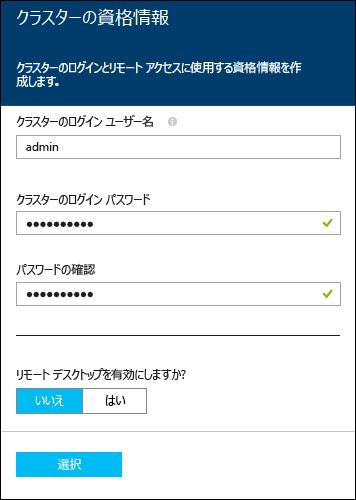

<properties
   pageTitle="Hadoop のチュートリアル: Windows での Hadoop の使用 | Microsoft Azure"
   description="HDInsight での Hadoop の使用Windows での Hadoop クラスターのプロビジョニング、データに対する Hive クエリの実行、Excel での出力の分析を行う方法について説明します。"
   keywords="hadoop tutorial,hadoop on windows,hadoop cluster,learn hadoop, hive query"
   services="hdinsight"
   documentationCenter=""
   authors="nitinme"
   manager="paulettm"
   editor="cgronlun"
   tags="azure-portal"/>

<tags
   ms.service="hdinsight"
   ms.devlang="na"
   ms.topic="hero-article"
   ms.tgt_pltfrm="na"
   ms.workload="big-data"
   ms.date="09/03/2015"
   ms.author="nitinme"/>

# Hadoop のチュートリアル: Windows 上の HDInsight で Hadoop と Hive クエリを使用する

> [AZURE.SELECTOR]
- [Windows](../hdinsight-hadoop-tutorial-get-started-windows.md)
- [Linux](../hdinsight-hadoop-linux-tutorial-get-started.md)

Hadoop on Windows を理解して HDInsight の使用を開始できるように、このチュートリアルでは、Hadoop クラスターの非構造化データで Hive クエリを実行し、その結果を Microsoft Excel で分析する方法について説明します。

[AZURE.INCLUDE [hdinsight-azure-preview-portal](../../includes/hdinsight-azure-preview-portal.md)]

* [HDInsight での Hadoop の使用 (Windows)](hdinsight-hadoop-tutorial-get-started-windows-v1.md)

## この Hadoop チュートリアルでは何が達成されますか?

大規模な非構造化データ セットがあり、このデータ セットに対して Hive クエリを実行して、意味のある情報を抽出する場合を仮定します。これが、このチュートリアルで目的としていることです。これを実現するには、次の手順を実行します。

   !["Hadoop tutorial: Create an account; provision a Hadoop cluster; submit a Hive query; analyze data in Excel.][image-hdi-getstarted-flow]

HDInsight での Hadoop の説明については、このチュートリアルのデモ ビデオをご覧ください。

![初めての Hadoop チュートリアル動画: Hadoop クラスターでの Hive クエリーの送信、Excel によるデータ分析][img-hdi-getstarted-video]

**[YouTube で HDInsight の Hadoop チュートリアルを見る](https://www.youtube.com/watch?v=Y4aNjnoeaHA&list=PLDrz-Fkcb9WWdY-Yp6D4fTC1ll_3lU-QS)**

Azure の HDInsight を一般に利用可能にすると共に、Microsoft は HDInsight Emulator for Azure (旧称 *Microsoft HDInsight 開発者プレビュー*) もリリースしました。このエミュレーターは開発者シナリオを対象としており、単一ノード デプロイメントのみをサポートします。HDInsight Emulator の使用法については、「[HDInsight Emulator の概要][hdinsight-emulator]」に関するページをご覧ください。

## 前提条件

このチュートリアルを開始する前に、以下の条件を満たしている必要があります。

- **Azure サブスクリプション**。[Azure 無料試用版の取得](http://azure.microsoft.com/documentation/videos/get-azure-free-trial-for-testing-hadoop-in-hdinsight/)に関するページを参照してください。
- Office 2013 Professional Plus、Office 365 Pro Plus、Excel 2013 Standalone、または Office 2010 Professional Plus がインストールされた**ワークステーション**。

##Hadoop クラスターのプロビジョニング

クラスターをプロビジョニングすると、Hadoop と関連アプリケーションを含む Azure コンピューティング リソースがプロビジョニングされます。このセクションでは、HDInsight バージョン 3.2 クラスターをプロビジョニングします。他のバージョンの Hadoop クラスターも作成できます。手順については、「[Provision HDInsight clusters using custom options (カスタム オプションを使用した HDInsight クラスターのプロビジョニング)][hdinsight-provision]」を参照してください。HDInsight バージョンとその SLA については、「[HDInsight コンポーネントのバージョン](hdinsight-component-versioning.md)」をご覧ください。

**Hadoop クラスターをプロビジョニングするには**

1. [Azure プレビュー ポータル](https://ms.portal.azure.com/)にサインインします。
2. **[新規]**、**[データ分析]**、**[HDInsight]** の順にクリックします。

    

3. **[クラスター名]** を入力し、**[クラスターの種類]** で **[Hadoop]** を選択し、**[クラスターのオペレーティング システム]** ボックスの一覧から **[Windows Server 2012 R2 Datacenter]** を選択します。クラスターを使用できる場合は、クラスター名の横に緑色のチェック マークが表示されます。

	

4. 複数のサブスクリプションがある場合は、**[サブスクリプション]** エントリをクリックし、クラスターで使用する Azure サブスクリプションを選択します。

5. **[リソース グループ]** をクリックして既存のリソース グループの一覧を表示し、その中にクラスターを作成するグループを選択します。または、**[新規作成]** をクリックし、新しいリソース グループの名前を入力できます。新しいグループ名を使用できる場合は、緑のチェック マークが表示されます。

	> [AZURE.NOTE]このエントリには、既存のリソース グループを使用できる場合は、そのうちの 1 つが既定値として設定されます。

6. **[資格情報]** をクリックし、**[クラスターのユーザー名]** と **[クラスターのログイン パスワード]** を入力します。クラスター ノードでリモート デスクトップを有効にする場合は、**[リモート デスクトップを有効にする]** で **[はい]** をクリックし、必要な値を指定します。このチュートリアルではリモート デスクトップは必要ないため、この手順はスキップできます下部にある **[選択]** をクリックして、資格情報の構成を保存します。

	

7. **[データ ソース]** をクリックし、クラスターの既存のデータ ソースを選択するか、新しいデータ ソースを作成します。HDInsight で Hadoop クラスターをプロビジョニングするときに、Azure ストレージ アカウントを指定します。Hadoop 分散ファイルシステム (HDFS) と同様、このアカウントの特定の BLOB ストレージ コンテナーが、既定のファイル システムとして設定されます。既定では、HDInsight クラスターは、指定されたストレージ アカウントと同じデータ センターにプロビジョニングされます。詳細については、「[HDInsight での Azure BLOB ストレージの使用][hdinsight-storage]」をご覧ください。

	![[データ ソース] ブレード](./media/hdinsight-hadoop-tutorial-get-started-windows/HDI.CreateCluster.4.png "データ ソース構成の指定")
	
	現在、HDInsight クラスターのデータ ソースとして Azure ストレージ アカウントを選択できます。次の説明を参照して、**[データ ソース]** ブレードのエントリを理解してください。
	
	- **選択方法**: すべてのサブスクリプションのストレージ アカウントを参照できるようにする場合は、**[すべてのサブスクリプションから]** を設定します。既存のストレージ アカウントの **[ストレージ名]** と **[アクセス キー]** を入力する場合は、**[アクセス キー]** を設定します。
	
	- **ストレージ アカウントの選択/新規作成**: クラスターに関連付ける既存のストレージ アカウントを参照して選択する場合は **[ストレージ アカウントの選択]** をクリックします。または、**[新規作成]** をクリックして、新しいストレージ アカウントを作成します。表示されたフィールドに、ストレージ アカウントの名前を入力します。名前を使用できる場合は、緑色のチェック マークが表示されます。
	
	- **既定のコンテナーの選択**。 これを使用して、クラスターで使用する既定のコンテナーの名前を入力します。任意の名前を入力できますが、コンテナーが特定のクラスターで使用されていることを簡単に認識できるように、クラスターと同じ名前を使用することをお勧めします。
	
	- **場所**: ストレージ アカウントが存在するリージョン、またはその中にストレージ アカウントが作成されるリージョン。
	
		> [AZURE.IMPORTANT]既定のデータ ソースの場所を選択すると、HDInsight クラスターの場所も設定されます。クラスターと既定のデータ ソースは、同じリージョンに存在する必要があります。
		
	**[選択]** をクリックしてデータ ソースの構成を保存します。

8. **[ノード価格レベル]** をクリックして、このクラスターのために作成されるノードに関する情報を表示します。クラスターで必要なワーカー ノードの数を設定します。クラスターの推定コストがブレード内に表示されます。

	![[ノード価格レベル] ブレード](./media/hdinsight-hadoop-tutorial-get-started-windows/HDI.CreateCluster.5.png "クラスター ノード数の指定")
	
	**[選択]** をクリックして、ノードの価格構成を保存します。

9. **[新しい HDInsight クラスター]** ブレードで、**[スタート画面にピン留めする]** が選択されていることを確認し、**[作成]** をクリックします。これでクラスターが作成され、Azure ポータルのスタート画面にクラスター用のタイルが追加されます。アイコンはクラスターがプロビジョニング中であることを示し、プロビジョニングが完了すると、[HDInsight] アイコンを表示するように変化します。

	| プロビジョニング中 | プロビジョニング完了 |
	| ------------------ | --------------------- |
	|  |  |

	> [AZURE.NOTE]クラスターが作成されるまで、通常は約 15 分かかります。プロビジョニング プロセスをチェックするには、スタート画面のタイルまたはページの左側の **[通知]** エントリを使用します。

10. プロビジョニングが完了したら、スタート画面でクラスター用のタイルをクリックして、クラスター ブレードを起動します。

##ポータルからサンプル データを実行する

正常にプロビジョニングされた HDInsight クラスターは、ポータルからサンプルを直接実行する概要ギャラリーを含むクエリ コンソールを提供します。サンプルを使っていくつかの基本的なシナリオを検証することで、HDInsight の操作方法を学ぶことができます。これらのサンプルには、分析対象のデータ、データに対して実行するクエリなど、必要なものがすべて用意されています。概要ギャラリーのサンプルの詳細については、「[Learn Hadoop in HDInsight using the HDInsight Getting Started Gallery (HDInsight 概要ギャラリーを使用した HDInsight での Hadoop の説明](hdinsight-learn-hadoop-use-sample-gallery.md)」をご覧ください。

**サンプルを実行するには**

1. Azure プレビュー ポータル スタート画面で、作成したクラスターのタイルをクリックします。
 
2. [新しいクラスター] ブレードで、**[ダッシュボード]** をクリックします。プロンプトが表示されたら、クラスターの管理者のユーザー名とパスワードを入力します。

	
 
3. 開いた Web ページの **[概要ギャラリー]** タブをクリックし、**[サンプル データでのソリューション]** カテゴリで、実行するサンプルをクリックします。Web ページの指示に従ってサンプルを実行します。次の表では、いくつかのサンプルを一覧し、各サンプルについて詳しく説明します。

サンプル | 内容
------ | ---------------
[センサー データの分析][hdinsight-sensor-data-sample] | HDInsight を使用して、暖房、換気、空調 (HVAC) システムによって生成された履歴データを処理し、設定した温度を正確に維持できないシステムを識別する方法について説明します。
[Web サイト ログの分析][hdinsight-weblogs-sample] | HDInsight を使用して、Web サイトのログ ファイルを分析する方法について説明します。このサンプルでは、1 日の間に発生した外部 Web サイトからの Web サイトへのアクセス数を調べ、ユーザーが経験した Web サイト エラーの概要を取得します。
[Twitter の傾向分析](hdinsight-analyze-twitter-data.md) | HDInsight を使用して、Twitter の傾向を分析する方法について説明します。

##ポータルから Hive クエリを実行する
HDInsight クラスターがプロビジョニングされたら、サンプルの Hive テーブルを照会する Hive ジョブを実行します。HDInsight クラスターに付属する *hivesampletable* を使用します。このテーブルには、モバイル デバイスの製造元、プラットフォーム、モデルに関するデータが格納されています。このテーブルの Hive クエリは、特定の製造元のモバイル デバイスのデータを取得します。

> [AZURE.NOTE]HDInsight Tools for Visual Studio は、Azure SDK for .NET バージョン 2.5 以降に付属しています。Visual Studio からこのツールを使用すると、HDInsight クラスターに接続し、Hive テーブルを作成し、Hive クエリを実行できます。詳細については、「[HDInsight Hadoop Tools for Visual Studio の使用開始][1]」をご覧ください。

**クラスター ダッシュボードから Hive ジョブを実行するには**

1. [Azure プレビュー ポータル](https://ms.portal.azure.com/)にサインインします。
2. **[すべて参照]**、**[HDInsight クラスター]** の順にクリックして、前のセクションで作成したクラスターを含むクラスターの一覧を表示します。
3. Hive ジョブの実行に使用するクラスターの名前をクリックし、ブレードの上部にある **[ダッシュボード]** をクリックします。
4. 別のブラウザー タブで Web ページが開きます。Hadoop ユーザー アカウントとパスワードを入力します。既定のユーザー名は **admin** で、パスワードはプロビジョニング処理中に入力したパスワードです。
5. ダッシュボードの **[Hive エディター]** タブをクリックします。次の Web ページが開きます。

	![Hive Editor tab in the HDInsight cluster dashboard.][img-hdi-dashboard]

	ページの上部にいくつかのタブがあります。既定のタブは **[Hive エディター]** です。これ以外に、**[ジョブ履歴]** タブと **[ファイル ブラウザー]** タブがあります。ダッシュボードでは、Hive クエリの送信、Hadoop ジョブ ログの確認、ストレージ内のファイルの参照などの操作を実行できます。

	> [AZURE.NOTE]Web ページの URL は *&lt;ClusterName&gt;.azurehdinsight.net* です。ポータルからダッシュボードを開く代わりに、URL を使用して Web ブラウザーからダッシュボードを開くこともできます。

6. **[Hive エディター]** タブで、**[クエリ名]** に「**HTC20**」と入力します。クエリ名は、ジョブのタイトルです。クエリ ウィンドウで、次の図に示すように、Hive クエリを入力します。

	![[Hive エディター] に入力された Hive クエリ][img-hdi-dashboard-query-select]

4. **[Submit]** をクリックします。結果が返されるまでしばらく時間がかかります。画面は 30 秒ごとに更新されます。**[最新の情報に更新]** をクリックして画面を更新することもできます。

    ![Results from a Hive query in listed at the bottom of the cluster dashboard.][img-hdi-dashboard-query-select-result]

5. 状態にジョブの完了が表示されたら、画面のクエリ名をクリックして出力を表示します。**[ジョブの開始時刻 (UTC)]** の値をメモしておきます。この情報は後で必要になります。

    ![Job Start Time listed in the Job History tab of the HDInsight cluster dashboard.][img-hdi-dashboard-query-select-result-output]

    このページには、**ジョブの出力**と**ジョブのログ**も表示されます。出力ファイル (\_stdout) とログ ファイル (\_stderr) をダウンロードすることもできます。

**出力ファイルを参照するには**

1. クラスターのダッシュボードで、**[ファイル ブラウザー]** をクリックします。
2. ストレージ アカウント名、コンテナー名 (クラスター名と同じ名前)、**[ユーザー]** の順にクリックします。
3. **[管理者]** をクリックし、以前書き留めたジョブの開始時刻よりも少し後の最終変更時刻の GUID をクリックします。この GUID をコピーします。これは、次のセクションで必要になります。

   	![[ファイル ブラウザー] タブに表示された Hive クエリ出力ファイルの GUID][img-hdi-dashboard-query-browse-output]

##Excel 用 Microsoft Business Intelligence ツールに接続する

Microsoft Excel 用 Power Query アドインを使用すると、HDInsight からのジョブ出力を Excel にインポートして、Microsoft Business Intelligence ツールで結果をさらに分析することができます。

チュートリアルのこの部分を完了するには、Excel 2013 または 2010 がインストールされている必要があります。

**Microsoft Power Query for Excel をダウンロードするには**

- [Microsoft ダウンロード センター](http://www.microsoft.com/download/details.aspx?id=39379)から Microsoft Power Query for Microsoft Excel をダウンロードして、インストールします。

**HDInsight データをインポートするには**

1. Excel を開き、新しいブックを作成します。
3. **[Power Query]** メニューをクリックし、**[その他のデータ ソース]**、**[Azure HDInsight から]** の順にクリックします。

	![Excel PowerQuery Import menu open for Azure HDInsight.][image-hdi-gettingstarted-powerquery-importdata]

3. クラスターに関連付けられた Azure BLOB ストレージ アカウントの名前を **[アカウント名]** ボックスに入力し、**[OK]** をクリックします。(これは、このチュートリアルで作成済みのストレージ アカウントです。)
4. Azure BLOB ストレージ アカウントのアカウント キーを **[アカウント キー]** ボックスに入力し、**[保存]** をクリックします。
5. 右側のウィンドウで、BLOB 名をダブルクリックします。既定で、BLOB名はクラスター名と同じです。

6. **[名前]** 列で **stdout** を見つけます。対応する **[フォルダーのパス]** 列の GUID が前にコピーした GUID と一致していることを確認します。一致している場合、出力データは送信したジョブに対応しています。**[stdout]** の左側の列の **[バイナリ]** をクリックします。

	![コンテンツの一覧の GUID でデータ出力を検索中。][image-hdi-gettingstarted-powerquery-importdata2]

9. 左上隅にある **[閉じて読み込む]** をクリックして、Hive ジョブ出力を Excel にインポートします。

##次のステップ
この Hadoop のチュートリアルでは、HDInsight で Windows ベースの Hadoop クラスターをプロビジョニングした後、そのデータ上で Hive クエリを実行し、結果を Excel にインポートする方法を説明しました。このデータは、ビジネス インテリジェンス ツールを使用してさらに処理し、グラフィカルに表示することができます。詳細については、次のチュートリアルをご覧ください。

- [HDInsight Hadoop Tools for Visual Studio の使用開始][1]
- [HDInsight Emulator の概要][hdinsight-emulator]
- [HDInsight での Azure BLOB ストレージの使用][hdinsight-storage]
- [PowerShell を使用した HDInsight の管理][hdinsight-admin-powershell]
- [HDInsight へのデータのアップロード][hdinsight-upload-data]
- [HDInsight での MapReduce の使用][hdinsight-use-mapreduce]
- [HDInsight での Hive の使用][hdinsight-use-hive]
- [HDInsight での Pig の使用][hdinsight-use-pig]
- [HDInsight での Oozie の使用][hdinsight-use-oozie]
- [Develop C# Hadoop streaming programs for HDInsight (HDInsight 用 C# Hadoop ストリーミング プログラムの開発)][hdinsight-develop-streaming]
- [HDInsight 用 Java MapReduce プログラムの開発][hdinsight-develop-mapreduce]

[1]: ../HDInsight/hdinsight-hadoop-visual-studio-tools-get-started.md

[hdinsight-versions]: hdinsight-component-versioning.md

[hdinsight-provision]: hdinsight-provision-clusters.md
[hdinsight-admin-powershell]: hdinsight-administer-use-powershell.md
[hdinsight-upload-data]: hdinsight-upload-data.md
[hdinsight-use-mapreduce]: hdinsight-use-mapreduce.md
[hdinsight-use-hive]: hdinsight-use-hive.md
[hdinsight-use-pig]: hdinsight-use-pig.md
[hdinsight-use-oozie]: hdinsight-use-oozie.md
[hdinsight-storage]: hdinsight-hadoop-use-blob-storage.md
[hdinsight-emulator]: hdinsight-hadoop-emulator-get-started.md
[hdinsight-develop-streaming]: hdinsight-hadoop-develop-deploy-streaming-jobs.md
[hdinsight-develop-mapreduce]: hdinsight-develop-deploy-java-mapreduce.md
[hadoop-hdinsight-intro]: hdinsight-hadoop-introduction.md
[hdinsight-weblogs-sample]: hdinsight-hive-analyze-website-log.md
[hdinsight-sensor-data-sample]: hdinsight-hive-analyze-sensor-data.md

[azure-purchase-options]: http://azure.microsoft.com/pricing/purchase-options/
[azure-member-offers]: http://azure.microsoft.com/pricing/member-offers/
[azure-free-trial]: http://azure.microsoft.com/pricing/free-trial/
[azure-management-portal]: https://ms.portal.azure.com/
[azure-create-storageaccount]: ../storage-create-storage-account.md

[apache-hadoop]: http://go.microsoft.com/fwlink/?LinkId=510084
[apache-hive]: http://go.microsoft.com/fwlink/?LinkId=510085
[apache-mapreduce]: http://go.microsoft.com/fwlink/?LinkId=510086
[apache-hdfs]: http://go.microsoft.com/fwlink/?LinkId=510087
[hdinsight-hbase-custom-provision]: hdinsight-hbase-tutorial-get-started.md

[powershell-download]: http://go.microsoft.com/fwlink/p/?linkid=320376&clcid=0x409
[powershell-install-configure]: ../install-configure-powershell.md
[powershell-open]: ../install-configure-powershell.md#Install

[img-hdi-dashboard]: ./media/hdinsight-hadoop-tutorial-get-started-windows/HDI.dashboard.png
[img-hdi-dashboard-query-select]: ./media/hdinsight-hadoop-tutorial-get-started-windows/HDI.dashboard.query.select.png
[img-hdi-dashboard-query-select-result]: ./media/hdinsight-hadoop-tutorial-get-started-windows/HDI.dashboard.query.select.result.png
[img-hdi-dashboard-query-select-result-output]: ./media/hdinsight-hadoop-tutorial-get-started-windows/HDI.dashboard.query.select.result.output.png
[img-hdi-dashboard-query-browse-output]: ./media/hdinsight-hadoop-tutorial-get-started-windows/HDI.dashboard.query.browse.output.png

[img-hdi-getstarted-video]: ./media/hdinsight-hadoop-tutorial-get-started-windows/hdi-get-started-video.png

[image-hdi-storageaccount-quickcreate]: ./media/hdinsight-hadoop-tutorial-get-started-windows/HDI.StorageAccount.QuickCreate.png
[image-hdi-clusterstatus]: ./media/hdinsight-hadoop-tutorial-get-started-windows/HDI.ClusterStatus.png
[image-hdi-quickcreatecluster]: ./media/hdinsight-hadoop-tutorial-get-started-windows/HDI.QuickCreateCluster.png
[image-hdi-getstarted-flow]: ./media/hdinsight-hadoop-tutorial-get-started-windows/HDI.GetStartedFlow.png

[image-hdi-gettingstarted-powerquery-importdata]: ./media/hdinsight-hadoop-tutorial-get-started-windows/HDI.GettingStarted.PowerQuery.ImportData.png
[image-hdi-gettingstarted-powerquery-importdata2]: ./media/hdinsight-hadoop-tutorial-get-started-windows/HDI.GettingStarted.PowerQuery.ImportData2.png
 

<!---HONumber=Oct15_HO3-->