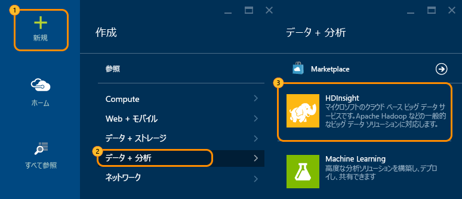
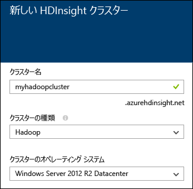

# Hadoop チュートリアル: Windows 上の HDInsight で Hadoop を使用する

> [!div class="op_single_selector"]
> * [Linux ベース](hdinsight-hadoop-linux-tutorial-get-started.md)
> * [Windows ベース](hdinsight-hadoop-tutorial-get-started-windows.md)
> 
> 

Hadoop on Windows を理解して HDInsight の使用を開始できるように、このチュートリアルでは、Hadoop クラスターの非構造化データで Hive クエリを実行し、その結果を Microsoft Excel で分析する方法について説明します。

> [!IMPORTANT]
> このドキュメントの手順は、Windows ベースの HDInsight クラスターに対してのみ機能します。 Windows では、バージョン 3.4 より前の HDInsight のみを使用できます。 Linux は、バージョン 3.4 以上の HDInsight で使用できる唯一のオペレーティング システムです。 詳細については、[Window での HDInsight の廃止](hdinsight-component-versioning.md#hdi-version-32-and-33-nearing-deprecation-date)に関する記事を参照してください。 Linux ベースのクラスターの作成については、「[Hadoop チュートリアル: HDInsight で Linux ベースの Hadoop を使用する](hdinsight-hadoop-linux-tutorial-get-started.md)」を参照してください。

大規模な非構造化データ セットがあり、このデータ セットに対して Hive クエリを実行して、意味のある情報を抽出する場合を仮定します。 これが、このチュートリアルで目的としていることです。 これを実現するには、次の手順を実行します。

   !["Hadoop tutorial: Create an account; create a Hadoop cluster; submit a Hive query; analyze data in Excel.][image-hdi-getstarted-flow]

HDInsight での Hadoop の説明については、このチュートリアルのデモ ビデオをご覧ください。

![初めての Hadoop チュートリアル動画: Hadoop クラスターでの Hive クエリーの送信、Excel によるデータ分析][img-hdi-getstarted-video]

**[YouTube で HDInsight の Hadoop チュートリアルを見る](https://www.youtube.com/watch?v=Y4aNjnoeaHA&list=PLDrz-Fkcb9WWdY-Yp6D4fTC1ll_3lU-QS)**

Azure の HDInsight を一般に利用可能にすると共に、Microsoft は HDInsight Emulator for Azure (旧称 *Microsoft HDInsight 開発者プレビュー*) もリリースしました。 このエミュレーターは開発者シナリオを対象としており、単一ノード デプロイのみをサポートします。 HDInsight Emulator の使用法については、[HDInsight Emulator の概要][hdinsight-emulator]に関するページをご覧ください。

[!INCLUDE [delete-cluster-warning](../../includes/hdinsight-delete-cluster-warning.md)]

## 前提条件
このチュートリアルを開始する前に、以下の条件を満たしている必要があります。

* **Azure サブスクリプション**。 [Azure 無料試用版の取得](https://azure.microsoft.com/documentation/videos/get-azure-free-trial-for-testing-hadoop-in-hdinsight/)に関するページを参照してください。
* **ワークステーション** 。

### アクセス制御の要件
[!INCLUDE [access-control](../../includes/hdinsight-access-control-requirements.md)]

## Hadoop クラスターを作成する
クラスターを作成すると、Hadoop と関連アプリケーションを含む Azure コンピューティング リソースが作成されます。 このセクションでは、HDInsight バージョン 3.2 クラスターを作成します。 他のバージョンの Hadoop クラスターも作成できます。 手順については、[カスタム オプションを使用した HDInsight の作成][hdinsight-provision]に関するページを参照してください。 HDInsight バージョンとその SLA については、「 [HDInsight コンポーネントのバージョン](hdinsight-component-versioning.md)」をご覧ください。

**Hadoop クラスターを作成するには**

1. [Azure Portal](https://portal.azure.com/) にサインインします。
2. **[新規]**、**[データ分析]**、**[HDInsight]** の順にクリックします。 ポータルで **[新しい HDInsight クラスター]** ブレードが開きます。
   
    
3. 次の値を入力または選択します。
   
    
   
   | フィールド名 | 値 |
   | --- | --- |
   | クラスター名 |クラスターを識別するための一意の名前 |
   | クラスターの種類 |このチュートリアルでは **[Hadoop]** を選択します。 |
   | クラスターのオペレーティング システム |このチュートリアルでは **[Windows Server 2012 R2 Datacenter]** を選択します。 |
   | HDInsight のバージョン |このチュートリアルでは最新バージョンを選択します。 |
   | サブスクリプション |このクラスターに使用する Azure サブスクリプションを選択します。 |
   | リソース グループ |既存の Azure リソース グループを選択するか、新しいリソース グループを作成します。 基本的な HDInsight クラスターには、クラスターとその既定のストレージ アカウントが含まれています。  管理を容易にするために、これら&2; つを&1; つのリソース グループにグループ化できます。 |
   | 資格情報 |クラスターのログイン ユーザー名とパスワードを入力します。 Windows ベースのクラスターでは、2 つのユーザー アカウントを使用できます。  クラスター ユーザー (または HTTP ユーザー) は、クラスターの管理とジョブの送信に使用されます。  必要に応じて、リモート デスクトップ (RDP) ユーザー アカウントを作成し、クラスターにリモート接続することもできます。 リモート デスクトップを有効にした場合は、RDP ユーザー アカウントが作成されます。 |
   | データ ソース |新しい既定の Azure ストレージ アカウントを作成する場合は、[新規作成] をクリックします。 クラスター名を既定のコンテナー名として使用します。 すべての HDinsight クラスターでは、Azure ストレージ アカウントに既定の BLOB コンテナーがあります。  既定の Azure ストレージ アカウントの場所によって、HDInsight クラスターの場所が決まります。 |
   | ノード料金レベル |このチュートリアルでは、既定の worker ノードとヘッド ノードの価格レベルで 1 つまたは 2 つの worker ノードを使用します。 |
   | オプションの構成 |この部分はスキップします。 |
4. **[新しい HDInsight クラスター]** ブレードで、**[スタート画面にピン留めする]** が選択されていることを確認し、**[作成]** をクリックします。 これでクラスターが作成され、Azure Portal のスタート画面にクラスター用のタイルが追加されます。 アイコンはクラスターが作成中であることを示し、作成が完了すると、[HDInsight] アイコンを表示するように変化します。
   
   | 作成中 | 作成の完了時 |
   | --- | --- |
   |  | |
   
   > [!NOTE]
   > クラスターが作成されるまで、通常は約 15 分かかります。 作成プロセスをチェックするには、スタート画面のタイル、またはページの左側にある **[通知]** エントリを使用してください。
   > 
   > 
5. 作成が完了したら、スタート画面でクラスター用のタイルをクリックして、クラスター ブレードを起動します。

## ポータルから Hive クエリを実行する
HDInsight クラスターが作成されたら、サンプルの Hive テーブルを照会する Hive ジョブを実行します。 HDInsight クラスターに付属する *hivesampletable*を使用します。 このテーブルには、モバイル デバイスの製造元、プラットフォーム、モデルに関するデータが格納されています。 このテーブルの Hive クエリは、特定の製造元のモバイル デバイスのデータを取得します。

> [!NOTE]
> HDInsight Tools for Visual Studio は、Azure SDK for .NET バージョン 2.5 以降に付属しています。 Visual Studio からこのツールを使用すると、HDInsight クラスターに接続し、Hive テーブルを作成し、Hive クエリを実行できます。 詳細については、「[HDInsight Hadoop Tools for Visual Studio の使用開始][1]」をご覧ください。
> 
> 

**クラスター ダッシュボードから Hive ジョブを実行するには**

1. [Azure ポータル](https://portal.azure.com/)にサインインします。
2. **[すべて参照]**、**[HDInsight クラスター]** の順にクリックして、前のセクションで作成したクラスターを含むクラスターの一覧を表示します。
3. Hive ジョブの実行に使用するクラスターの名前をクリックし、ブレードの上部にある **[ダッシュボード]** をクリックします。
4. 別のブラウザー タブで Web ページが開きます。 Hadoop ユーザー アカウントとパスワードを入力します。 既定のユーザー名は **admin**で、パスワードはクラスターの作成時に入力したパスワードです。
5. ダッシュボードの **[Hive エディター]** タブをクリックします。 次の Web ページが開きます。
   
    ![Hive Editor tab in the HDInsight cluster dashboard.][img-hdi-dashboard]
   
    ページの上部にいくつかのタブがあります。 既定のタブは **[Hive エディター]** です。これ以外に、**[ジョブ履歴]** タブと **[ファイル ブラウザー]** タブがあります。 ダッシュボードでは、Hive クエリの送信、Hadoop ジョブ ログの確認、ストレージ内のファイルの参照などの操作を実行できます。
   
   > [!NOTE]
   > Web ページの URL は *&lt;ClusterName&gt;.azurehdinsight.net* です。 ポータルからダッシュボードを開く代わりに、URL を使用して Web ブラウザーからダッシュボードを開くこともできます。
   > 
   > 
6. **[Hive エディター]** タブで、**[クエリ名]** に「**HTC20**」と入力します。  クエリ名は、ジョブのタイトルです。 クエリ ウィンドウで、次の図に示すように、Hive クエリを入力します。
   
    ![[Hive エディター] に入力された Hive クエリ][img-hdi-dashboard-query-select]
7. **[Submit]**をクリックします。 結果が返されるまでしばらく時間がかかります。 画面は 30 秒ごとに更新されます。 **[最新の情報に更新]** をクリックして画面を更新することもできます。
   
    ![クラスターのダッシュボードの下部に表示される Hive クエリの結果。][img-hdi-dashboard-query-select-result]
8. 状態にジョブの完了が表示されたら、画面のクエリ名をクリックして出力を表示します。 **[ジョブの開始時刻 (UTC)]**の値をメモしておきます。 この情報は後で必要になります。
   
    ![HDInsight クラスターのダッシュボードの [ジョブ履歴] タブに表示されるジョブ開始時間。][img-hdi-dashboard-query-select-result-output]
   
    このページには、**ジョブの出力**と**ジョブのログ**も表示されます。 出力ファイル (\_stdout) とログ ファイル \(_stderr) をダウンロードすることもできます。

**出力ファイルを参照するには**

1. クラスターのダッシュボードで、 **[ファイル ブラウザー]**をクリックします。
2. ストレージ アカウント名、コンテナー名 (クラスター名と同じ名前)、 **[ユーザー]**の順にクリックします。
3. **[管理者]** をクリックし、以前書き留めたジョブの開始時刻よりも少し後の最終変更時刻の GUID をクリックします。 この GUID をコピーします。 これは、次のセクションで必要になります。

       ![The Hive query output file GUID listed in the File Browser tab.][img-hdi-dashboard-query-browse-output]

## Excel 用 Microsoft Business Intelligence ツールに接続する
Microsoft Excel 用 Power Query アドインを使用すると、HDInsight からのジョブ出力を Excel にインポートして、Microsoft Business Intelligence ツールで結果をさらに分析することができます。

チュートリアルのこの部分を完了するには、Excel 2013 または 2010 がインストールされている必要があります。

**Microsoft Power Query for Excel をダウンロードするには**

* [Microsoft ダウンロード センター](http://www.microsoft.com/download/details.aspx?id=39379) から Microsoft Power Query for Microsoft Excel をダウンロードして、インストールします。

**HDInsight データをインポートするには**

1. Excel を開き、新しいブックを作成します。
2. **[Power Query]** メニューをクリックし、**[その他のデータ ソース]**、**[Azure HDInsight から]** の順にクリックします。
   
    ![Excel PowerQuery Import menu open for Azure HDInsight.][image-hdi-gettingstarted-powerquery-importdata]
3. クラスターに関連付けられた Azure Storage アカウントの名前を **[アカウント名]** ボックスに入力し、**[OK]** をクリックします。 (これは、このチュートリアルで作成済みのストレージ アカウントです。)
4. Azure Storage アカウントのアカウント キーを **[アカウント キー]** ボックスに入力し、**[保存]** をクリックします。
5. 右側のウィンドウで、BLOB 名をダブルクリックします。 既定で、BLOB名はクラスター名と同じです。
6. **[名前]** 列で **stdout** を見つけます。 対応する **[フォルダーのパス]** 列の GUID が前にコピーした GUID と一致していることを確認します。 一致している場合、出力データは送信したジョブに対応しています。 **[stdout]** の左側の列の **[バイナリ]** をクリックします。
   
    ![コンテンツの一覧の GUID でデータ出力を検索中。][image-hdi-gettingstarted-powerquery-importdata2]
7. 左上隅にある **[閉じて読み込む]** をクリックして、Hive ジョブ出力を Excel にインポートします。

## サンプルの実行
HDInsight クラスターには、ポータルからサンプルを直接実行するための概要ギャラリーを含むクエリ コンソールがあります。 サンプルを使っていくつかの基本的なシナリオを検証することで、HDInsight の操作方法を学ぶことができます。 これらのサンプルには、分析対象のデータ、データに対して実行するクエリなど、必要なものがすべて用意されています。

**サンプルを実行するには**

1. Azure Portal のスタート画面で、作成したクラスターのタイルをクリックします。
2. [新しいクラスター] ブレードで、 **[ダッシュボード]**をクリックします。 プロンプトが表示されたら、クラスターの管理者のユーザー名とパスワードを入力します。
   
    
3. 開いた Web ページの **[作業の開始に役立つギャラリー]** タブをクリックし、**[サンプル データでのソリューション]** カテゴリで、実行するサンプルをクリックします。 Web ページの指示に従ってサンプルを実行します。 次の表では、いくつかのサンプルを一覧し、各サンプルについて詳しく説明します。

| サンプル | 内容 |
| --- | --- |
| [センサー データの分析][hdinsight-sensor-data-sample] |HDInsight を使用して、暖房、換気、空調 (HVAC) システムによって生成された履歴データを処理し、設定した温度を正確に維持できないシステムを識別する方法について説明します。 |
| [Web サイト ログの分析][hdinsight-weblogs-sample] |HDInsight を使用して、Web サイトのログ ファイルを分析する方法について説明します。このサンプルでは、1 日の間に発生した外部 Web サイトからの Web サイトへのアクセス数を調べ、ユーザーが経験した Web サイト エラーの概要を取得します。 |
| [Twitter の傾向分析](hdinsight-analyze-twitter-data.md) |HDInsight を使用して、Twitter の傾向を分析する方法について説明します。 |

## クラスターを削除する
[!INCLUDE [delete-cluster-warning](../../includes/hdinsight-delete-cluster-warning.md)]

## 次のステップ
この Hadoop のチュートリアルでは、HDInsight で Windows ベースの Hadoop クラスターを作成した後、そのデータ上で Hive クエリを実行し、結果を Excel にインポートする方法を説明しました。このデータは、ビジネス インテリジェンス ツールを使用してさらに処理し、グラフィカルに表示することができます。 詳細については、次のチュートリアルをご覧ください。

* [HDInsight Hadoop Tools for Visual Studio の使用開始][1]
* [HDInsight Emulator の概要][hdinsight-emulator]
* [HDInsight での Azure Storage の使用][hdinsight-storage]
* [PowerShell を使用した HDInsight の管理][hdinsight-admin-powershell]
* [HDInsight へのデータのアップロード][hdinsight-upload-data]
* [HDInsight での MapReduce の使用][hdinsight-use-mapreduce]
* [HDInsight での Hive の使用][hdinsight-use-hive]
* [HDInsight での Pig の使用][hdinsight-use-pig]
* [HDInsight での Oozie の使用][hdinsight-use-oozie]
* [HDInsight 用 Java MapReduce プログラムの開発][hdinsight-develop-mapreduce]

[1]: ../HDInsight/hdinsight-hadoop-visual-studio-tools-get-started.md

[hdinsight-versions]: hdinsight-component-versioning.md

[hdinsight-provision]: hdinsight-provision-clusters.md
[hdinsight-admin-powershell]: hdinsight-administer-use-powershell.md
[hdinsight-upload-data]: hdinsight-upload-data.md
[hdinsight-use-mapreduce]: hdinsight-use-mapreduce.md
[hdinsight-use-hive]: hdinsight-use-hive.md
[hdinsight-use-pig]: hdinsight-use-pig.md
[hdinsight-use-oozie]: hdinsight-use-oozie.md
[hdinsight-storage]: hdinsight-hadoop-use-blob-storage.md
[hdinsight-emulator]: hdinsight-hadoop-emulator-get-started.md
[hdinsight-develop-mapreduce]: hdinsight-develop-deploy-java-mapreduce-linux.md
[hadoop-hdinsight-intro]: hdinsight-hadoop-introduction.md
[hdinsight-weblogs-sample]: hdinsight-hive-analyze-website-log.md
[hdinsight-sensor-data-sample]: hdinsight-hive-analyze-sensor-data.md

[azure-purchase-options]: http://azure.microsoft.com/pricing/purchase-options/
[azure-member-offers]: http://azure.microsoft.com/pricing/member-offers/
[azure-free-trial]: http://azure.microsoft.com/pricing/free-trial/
[azure-management-portal]: https://portal.azure.com/
[azure-create-storageaccount]: ../storage-create-storage-account.md

[apache-hadoop]: http://go.microsoft.com/fwlink/?LinkId=510084
[apache-hive]: http://go.microsoft.com/fwlink/?LinkId=510085
[apache-mapreduce]: http://go.microsoft.com/fwlink/?LinkId=510086
[apache-hdfs]: http://go.microsoft.com/fwlink/?LinkId=510087
[hdinsight-hbase-custom-provision]: hdinsight-hbase-tutorial-get-started.md

[powershell-download]: http://go.microsoft.com/fwlink/p/?linkid=320376&clcid=0x409
[powershell-install-configure]: /powershell/azureps-cmdlets-docs
[powershell-open]: /powershell/azureps-cmdlets-docs#step-1-install

[img-hdi-dashboard]: ./media/hdinsight-hadoop-tutorial-get-started-windows/HDI.dashboard.png
[img-hdi-dashboard-query-select]: ./media/hdinsight-hadoop-tutorial-get-started-windows/HDI.dashboard.query.select.png
[img-hdi-dashboard-query-select-result]: ./media/hdinsight-hadoop-tutorial-get-started-windows/HDI.dashboard.query.select.result.png
[img-hdi-dashboard-query-select-result-output]: ./media/hdinsight-hadoop-tutorial-get-started-windows/HDI.dashboard.query.select.result.output.png
[img-hdi-dashboard-query-browse-output]: ./media/hdinsight-hadoop-tutorial-get-started-windows/HDI.dashboard.query.browse.output.png

[img-hdi-getstarted-video]: ./media/hdinsight-hadoop-tutorial-get-started-windows/hdi-get-started-video.png

[image-hdi-storageaccount-quickcreate]: ./media/hdinsight-hadoop-tutorial-get-started-windows/HDI.StorageAccount.QuickCreate.png
[image-hdi-clusterstatus]: ./media/hdinsight-hadoop-tutorial-get-started-windows/HDI.ClusterStatus.png
[image-hdi-quickcreatecluster]: ./media/hdinsight-hadoop-tutorial-get-started-windows/HDI.QuickCreateCluster.png
[image-hdi-getstarted-flow]: ./media/hdinsight-hadoop-tutorial-get-started-windows/HDI.GetStartedFlow.png

[image-hdi-gettingstarted-powerquery-importdata]: ./media/hdinsight-hadoop-tutorial-get-started-windows/HDI.GettingStarted.PowerQuery.ImportData.png
[image-hdi-gettingstarted-powerquery-importdata2]: ./media/hdinsight-hadoop-tutorial-get-started-windows/HDI.GettingStarted.PowerQuery.ImportData2.png

