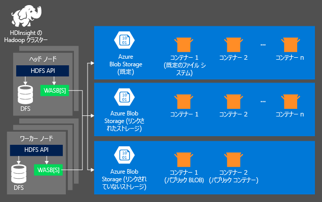
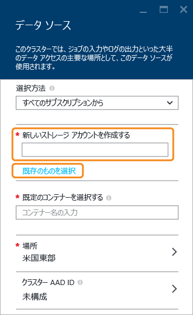

# Azure HDInsight クラスターで Azure Storage を使用する

HDInsight クラスターでデータを分析するために、Azure Storage と Azure Data Lake Store のいずれか、または両方にデータを格納できます。 両方のストレージ オプションにより、計算で使用される HDInsight クラスターを安全に削除できます。このとき、ユーザー データは失われません。

Hadoop は、既定のファイル システムの概念をサポートしています。 既定のファイル システムは、既定のスキームとオーソリティを意味します。 これは相対パスの解決に使用することもできます。 HDInsight クラスターの作成プロセス時に、Azure Storage 内の BLOB コンテナーを既定のファイル システムとして指定できます。また、HDInsight 3.5 では、Azure Storage と Azure Data Lake Store のいずれかを既定のファイル システムとして選択できます (いくつか例外があります)。 既定のストレージおよびリンクされたストレージとして Data Lake Store の使用がサポートされるかどうかについては、「[HDInsight クラスターの利用可能性](./hdinsight-hadoop-use-data-lake-store.md#availability-for-hdinsight-clusters)」を参照してください。

この記事では、HDInsight クラスターでの Azure Storage の動作について説明します。 THDInsight クラスターでの Data Lake Store の動作については、「[Azure HDInsight クラスターで Data Lake Store を使用する](hdinsight-hadoop-use-data-lake-store.md)」をご覧ください。 HDInsight クラスターの作成について詳しくは、「[HDInsight で Hadoop クラスターを作成する](hdinsight-hadoop-provision-linux-clusters.md)」をご覧ください。

Azure Storage は、堅牢な汎用ストレージ ソリューションであり、HDInsight とシームレスに統合されます。 HDInsight は、クラスターの既定のファイル システムとして Azure Storage 内の BLOB コンテナーを使用できます。 HDInsight のすべてのコンポーネントは、Hadoop 分散ファイル システム (HDFS) のインターフェイスを利用して、BLOB として格納された構造化データまたは非構造化データを直接操作できます。

> [!WARNING]
> Azure ストレージ アカウントを作成する場合、いくつかの選択肢があります。 以下の表は、HDInsight に関して利用できる選択肢についての情報です。
> 
> | ストレージ アカウントの種類 | ストレージ層 | HDInsight でのサポート |
> | ------- | ------- | ------- |
> | 汎用ストレージ アカウント | 標準 | __はい__ |
> | &nbsp; | Premium | いいえ  |
> | BLOB ストレージ アカウント | ホット | いいえ  |
> | &nbsp; | クール | いいえ  |

ビジネス データの格納には、既定の BLOB コンテナーを使用しないことをお勧めします。 ストレージ コストを削減するために、既定の BLOB コンテナーの使用後、コンテナーを毎回削除することをお勧めします。 既定のコンテナーには、アプリケーション ログとシステム ログが格納されます。 コンテナーを削除する前に、ログを取り出してください。

1 つの BLOB コンテナーを複数のクラスターの既定のファイル システムとして共有することはサポートされていません。

## HDInsight のストレージ アーキテクチャ
次の図は、Azure Storage を使う HDInsight のストレージ アーキテクチャを示しています。

HDInsight では、それぞれのコンピューティング ノードにローカルに割り当てられている分散ファイル システムにアクセスします。 このファイル システムには、完全修飾 URI を使用してアクセスできます。次に例を示します。

    hdfs://<namenodehost>/<path>

さらに、HDInsight では、Azure Storage に格納されたデータにアクセスすることもできます。 の構文は次のとおりです。

    wasb[s]://<containername>@<accountname>.blob.core.windows.net/<path>

HDInsight クラスターで Azure ストレージ アカウントを使用するときの考慮事項を次に示します。

* **クラスターに接続されているストレージ アカウント内のコンテナー:** アカウントの名前とキーは作成中にクラスターと関連付けられるため、これらのコンテナー内の BLOB に対するフル アクセス許可が与えられます。

* **クラスターに接続されていないストレージ アカウント内のパブリック コンテナーまたはパブリック BLOB:** コンテナー内の BLOB に対する読み取り専用のアクセス許可が与えられます。
  
  > [!NOTE]
  > パブリック コンテナーの場合、そのコンテナー内に配置されているすべての BLOB のリストとコンテナー メタデータを取得できます。 パブリック BLOB の場合、正確な URL がわかっているときのみ、その BLOB にアクセスできます。 詳細については、「<a href="http://msdn.microsoft.com/library/windowsazure/dd179354.aspx">コンテナーと BLOB へのアクセスの制限</a>」をご覧ください。
  > 
  > 
* **クラスターに接続されていないストレージ アカウント内のプライベート コンテナー:** WebHCat ジョブを送信するときにストレージ アカウントを定義しない限り、コンテナー内の BLOB にはアクセスできません。 詳しくは、この記事の後半で説明します。

作成プロセスで定義されたストレージ アカウントとそのキーは、クラスター ノードの %HADOOP_HOME%/conf/core-site.xml に格納されます。 HDInsight の既定の動作では、core-site.xml ファイルに定義されたストレージ アカウントが使用されます。 この設定は、[Ambari](./hdinsight-hadoop-manage-ambari.md) を使用して変更できます。

Hive、MapReduce、Hadoop ストリーミング、Pig など、複数の WebHCat ジョブを利用して、ストレージ アカウントの説明とそのメタデータを伝達できます。 (現在、ストレージ アカウントについては Pig が対応していますが、メタデータについては対応していません)。詳細については、「 [Using an HDInsight Cluster with Alternate Storage Accounts and Metastores (代替のストレージ アカウントおよびメタストアでの HDInsight クラスターの使用)](http://social.technet.microsoft.com/wiki/contents/articles/23256.using-an-hdinsight-cluster-with-alternate-storage-accounts-and-metastores.aspx)」を参照してください。

BLOB は、構造化データと非構造化データに使用できます。 BLOB コンテナーには、"キーと値のペア" としてデータが格納されます。ディレクトリ階層はありません。 ただし、キー名でスラッシュ (/) を使用すれば、ファイルがディレクトリ階層に保存されているように見せかけることができます。 たとえば、BLOB のキー名を「 *input/log1.txt*」とします。 この場合、*input* ディレクトリは実際に存在しませんが、キー名でスラッシュが使用されているのでファイル パスのように見えます。

## Azure Storage の利点
コンピューティング クラスターとストレージ リソースを同じ場所で併置しないとなるとパフォーマンスの低下が懸念されますが、これは、Azure リージョン内のストレージ アカウント リソースの近くにコンピューティング クラスターを作成することで軽減されます。高速ネットワークが整備されているので、コンピューティング ノードは Azure Storage 内のデータに効率的にアクセスできます。

HDFS ではなく、Azure Storage にデータを格納することにはいくつかの利点があります。

* **データの再使用と共有:** HDFS のデータはコンピューティング クラスター内に配置されます。 HDFS API を使用してデータを操作できるのは、コンピューティング クラスターへのアクセスが許可されているアプリケーションだけです。 Azure Storage 内のデータには、HDFS API または [Blob Storage REST API][blob-storage-restAPI] を使用してアクセスできます。 したがって、さまざまなアプリケーション (その他の HDInsight クラスターを含む) やツールを使用してデータの生成と利用ができます。
* **データのアーカイブ:** Azure Storage にデータを格納した場合、計算で使用する HDInsight クラスターを削除してもユーザー データは失われません。
* **データ ストレージ コスト:** コンピューティング クラスターは Azure Storage よりコストがかかるため、DFS に長期間データを格納すると、Azure Storage にデータを格納した場合よりコストが高くなります。 さらに、コンピューティング クラスターを生成するたびにデータを読み込む必要がないので、データの読み込みコストも節約できます。
* **柔軟なスケールアウト:** HDFS は大規模なファイル システムを提供しますが、規模を拡張するにはクラスターに対して作成するノードの数を増やさなければならないので、作業が複雑になります。 一方、Azure Storage には柔軟なスケール機能がもともと備わっています。
* **geo レプリケーション:** Azure Storage は、別の拠点に geo レプリケートできます。 災害発生時には別の拠点でデータを回復でき、データの冗長性が高まりますが、geo レプリケートした別拠点へのフェールオーバーはパフォーマンスに大きな影響を与え、追加コストが発生する可能性もあります。 geo レプリケーションを利用するときは、追加コストがかかっても保護する価値のあるデータかどうかを十分に考慮してください。

MapReduce の一部のジョブやパッケージでは中間結果が生成されますが、Azure Storage には保存したくない場合もあります。 このような場合、中間結果データをローカルの HDFS に保存できます。 実際、HDInsight では、Hive ジョブやその他のプロセスで生成される中間結果の一部が DFS に格納されます。

> [!NOTE]
> ほとんどの HDFS コマンド (<b>ls</b>、<b>copyFromLocal</b>、<b>mkdir</b> など) は通常と同じように機能します。 ただし、<b>fschk</b> や <b>dfsadmin</b> など、HDFS ネイティブ実装 (DFS) に固有のコマンドについては、Azure Storage 上で実行した場合に動作が異なります。
> 
> 

## BLOB コンテナーの作成
BLOB を使用するには、まず、[Azure ストレージ アカウント][azure-storage-create]を作成します。 その一環として、ストレージ アカウントを作成する Azure リージョンを指定します。 クラスターとストレージ アカウントは、同じリージョンに置く必要があります。 Hive メタストア SQL Server データベースと Oozie メタストア SQL Server データベースも、同じリージョンに配置する必要があります。

作成される各 BLOB は、どこにあるとしても、Azure ストレージ アカウント内のコンテナーに属します。 このコンテナーは、HDInsight の外部で作成された既存の BLOB ストレージ コンテナーか、HDInsight クラスター用に作成されたコンテナーであってもかまいません。

既定の BLOB コンテナーには、ジョブ履歴やログなどのクラスター固有の情報が格納されます。 既定の BLOB コンテナーと複数の HDInsight クラスターを共有しないでください。 ジョブ履歴が破損する場合があります。 各クラスターで別のコンテナーを使用し、既定のストレージ アカウントではなく、関連するすべてのクラスターのデプロイメントで指定された、リンクされているストレージ アカウントに共有データを格納することをお勧めします。 リンクされているストレージ アカウントの構成の詳細については、[HDInsight クラスターの作成][hdinsight-creation]に関するページを参照してください。 ただし、元の HDInsight クラスターを削除した後でも既定のストレージ コンテナーを再利用できます。 HBase クラスターでは、削除された HBase クラスターで使用される既定の BLOB コンテナーを使用して、新しい HBase クラスターを作成することで、HBase テーブルのスキーマとデータを実際に保持できます。

[!INCLUDE [secure-transfer-enabled-storage-account](../../includes/hdinsight-secure-transfer.md)]

### Azure ポータルの使用
ポータルから HDInsight クラスターを作成するとき、ストレージ アカウントの詳細を提供するオプション (以下を参照) を使用できます。 また、クラスターに関連付けられている追加のストレージ アカウントが必要かどうかを指定し、必要な場合は、Data Lake Store または他の Azure Storage Blob から追加のストレージとして選択することもできます。

> [!WARNING]
> HDInsight クラスター以外の場所で追加のストレージ アカウントを使用することはできません。

### Azure PowerShell の使用
[Azure PowerShell のインストールと構成][powershell-install]が完了している場合は、Azure PowerShell プロンプトで次のスクリプトを使用して、ストレージ アカウントとコンテナーを作成できます。

[!INCLUDE [upgrade-powershell](../../includes/hdinsight-use-latest-powershell.md)]

    $SubscriptionID = "<Your Azure Subscription ID>"
    $ResourceGroupName = "<New Azure Resource Group Name>"
    $Location = "EAST US 2"

    $StorageAccountName = "<New Azure Storage Account Name>"
    $containerName = "<New Azure Blob Container Name>"

    Connect-AzureRmAccount
    Select-AzureRmSubscription -SubscriptionId $SubscriptionID

    # Create resource group
    New-AzureRmResourceGroup -name $ResourceGroupName -Location $Location

    # Create default storage account
    New-AzureRmStorageAccount -ResourceGroupName $ResourceGroupName -Name $StorageAccountName -Location $Location -Type Standard_LRS 

    # Create default blob containers
    $storageAccountKey = (Get-AzureRmStorageAccountKey -ResourceGroupName $resourceGroupName -StorageAccountName $StorageAccountName)[0].Value
    $destContext = New-AzureStorageContext -StorageAccountName $storageAccountName -StorageAccountKey $storageAccountKey  
    New-AzureStorageContainer -Name $containerName -Context $destContext

### Azure CLI の使用

[!INCLUDE [use-latest-version](../../includes/hdinsight-use-latest-cli.md)]

[Azure CLI のインストールと構成](../cli-install-nodejs.md)が完了している場合は、次のコマンドを使用して、ストレージ アカウントとコンテナーを作成できます。

    azure storage account create <storageaccountname> --type LRS

> [!NOTE]
> `--type` パラメーターは、ストレージ アカウントのレプリケート方法を指定します。 詳細については、 [Azure Storage のレプリケーション](../storage/storage-redundancy.md)に関するページを参照してください。 ZRS は、ページ BLOB、ファイル、テーブル、キューをサポートしないため、使用しないでください。
> 
> 

ストレージ アカウントの作成先となる地理的リージョンを指定するよう要求されます。 ストレージ アカウントは、HDInsight クラスターの作成を計画しているリージョンと同じリージョンに作成する必要があります。

ストレージ アカウントを作成した後は、次のコマンドを使用して、ストレージ アカウント キーを取得します。

    azure storage account keys list <storageaccountname>

コンテナーを作成するには、次のコマンドを使用します。

    azure storage container create <containername> --account-name <storageaccountname> --account-key <storageaccountkey>

## Azure Storage 内のファイルの指定
HDInsight から Azure Storage 内のファイルにアクセスするための URI スキームは次のとおりです。

    wasb[s]://<BlobStorageContainerName>@<StorageAccountName>.blob.core.windows.net/<path>

この URI スキームは、暗号化なしのアクセス (*wasb*: プレフィックス) と SSL で暗号化されたアクセス (*wasbs*) に対応しています。 同じ Azure リージョン内のデータにアクセスする場合でも、できる限り *wasbs* を使用することをお勧めします。

&lt;BlobStorageContainerName&gt; では、Azure Storage 内の BLOB コンテナーの名前を指定します。
&lt;StorageAccountName&gt; は Azure ストレージ アカウント名です。 完全修飾ドメイン名 (FQDN) を指定する必要があります。

&lt;BlobStorageContainerName&gt; と &lt;StorageAccountName&gt; を両方とも指定しない場合は、既定のファイル システムが使用されます。 既定のファイル システム上にあるファイルに関しては、相対パスか絶対パスを使用できます。 たとえば、HDInsight クラスターに付属している *hadoop-mapreduce-examples.jar* ファイルは、次のどちらかを使用して確認できます。

    wasb://mycontainer@myaccount.blob.core.windows.net/example/jars/hadoop-mapreduce-examples.jar
    wasb:///example/jars/hadoop-mapreduce-examples.jar
    /example/jars/hadoop-mapreduce-examples.jar

> [!NOTE]
> HDInsight バージョン 2.1 クラスターと 1.6 クラスターでは、ファイル名は <i>hadoop-examples.jar</i> です。
> 
> 

&lt;パス&gt;は、ファイルまたはディレクトリの HDFS パス名です。 Azure Storage のコンテナーにはキーと値のペアが格納されるだけであるため、階層ファイル システムは存在しません。 ただし、BLOB キー内でスラッシュ (/) を使用すると、ディレクトリの区切りと見なされます。 たとえば、 *hadoop-mapreduce-examples.jar* に対応する BLOB 名は、次のとおりです。

    example/jars/hadoop-mapreduce-examples.jar

> [!NOTE]
> HDInsight の外部から BLOB を操作する場合、ほとんどのユーティリティで WASB 形式が認識されず、代わりに `example/jars/hadoop-mapreduce-examples.jar` などの基本的なパス形式が要求されます。
> 
> 

## BLOB へのアクセス 

###  Azure PowerShell の使用
> [!NOTE]
> このセクションでは、PowerShell を使用して BLOB に格納されているデータにアクセスする基本的なコマンドの例を紹介します。 HDInsight を使用した操作にカスタマイズされた高度な例については、 [HDInsight ツール](https://github.com/Blackmist/hdinsight-tools)に関するページを参照してください。
> 
> 

BLOB 関連のコマンドレットを一覧表示するには、次のコマンドを使用します。

    Get-Command *blob*

![BLOB 関連の PowerShell コマンドレットの一覧。][img-hdi-powershell-blobcommands]

#### ファイルのアップロード
[HDInsight へのデータのアップロード][hdinsight-upload-data]に関するページを参照してください。

#### ファイルをダウンロードする
次のスクリプトは、ブロック BLOB を現在のフォルダーにダウンロードします。 スクリプトを実行する前に、書き込みアクセス許可があるフォルダーにディレクトリを変更します。

    $resourceGroupName = "<AzureResourceGroupName>"
    $storageAccountName = "<AzureStorageAccountName>"   # The storage account used for the default file system specified at creation.
    $containerName = "<BlobStorageContainerName>"  # The default file system container has the same name as the cluster.
    $blob = "example/data/sample.log" # The name of the blob to be downloaded.

    # Use Add-AzureAccount if you haven't connected to your Azure subscription
    Connect-AzureRmAccount 
    Select-AzureRmSubscription -SubscriptionID "<Your Azure Subscription ID>"

    Write-Host "Create a context object ... " -ForegroundColor Green
    $storageAccountKey = (Get-AzureRmStorageAccountKey -ResourceGroupName $resourceGroupName -Name $storageAccountName)[0].Value
    $storageContext = New-AzureStorageContext -StorageAccountName $storageAccountName -StorageAccountKey $storageAccountKey  

    Write-Host "Download the blob ..." -ForegroundColor Green
    Get-AzureStorageBlobContent -Container $ContainerName -Blob $blob -Context $storageContext -Force

    Write-Host "List the downloaded file ..." -ForegroundColor Green
    cat "./$blob"

リソース グループ名とクラスター名を指定して、次のコードを使用できます。

    $resourceGroupName = "<AzureResourceGroupName>"
    $clusterName = "<HDInsightClusterName>"
    $blob = "example/data/sample.log" # The name of the blob to be downloaded.

    $cluster = Get-AzureRmHDInsightCluster -ResourceGroupName $resourceGroupName -ClusterName $clusterName
    $defaultStorageAccount = $cluster.DefaultStorageAccount -replace '.blob.core.windows.net'
    $defaultStorageAccountKey = (Get-AzureRmStorageAccountKey -ResourceGroupName $resourceGroupName -Name $defaultStorageAccount)[0].Value
    $defaultStorageContainer = $cluster.DefaultStorageContainer
    $storageContext = New-AzureStorageContext -StorageAccountName $defaultStorageAccount -StorageAccountKey $defaultStorageAccountKey 

    Write-Host "Download the blob ..." -ForegroundColor Green
    Get-AzureStorageBlobContent -Container $defaultStorageContainer -Blob $blob -Context $storageContext -Force

#### ファイルの削除
    Remove-AzureStorageBlob -Container $containerName -Context $storageContext -blob $blob

#### ファイルの一覧表示
    Get-AzureStorageBlob -Container $containerName -Context $storageContext -prefix "example/data/"

#### 定義されていないストレージ アカウントを使用する Hive クエリの実行
このサンプルでは、作成プロセス時に定義されていないストレージ アカウントのフォルダーを一覧表示する方法を示しています。
$clusterName = "<HDInsightClusterName>"

    $undefinedStorageAccount = "<UnboundedStorageAccountUnderTheSameSubscription>"
    $undefinedContainer = "<UnboundedBlobContainerAssociatedWithTheStorageAccount>"

    $undefinedStorageKey = Get-AzureStorageKey $undefinedStorageAccount | %{ $_.Primary }

    Use-AzureRmHDInsightCluster $clusterName

    $defines = @{}
    $defines.Add("fs.azure.account.key.$undefinedStorageAccount.blob.core.windows.net", $undefinedStorageKey)

    Invoke-AzureRmHDInsightHiveJob -Defines $defines -Query "dfs -ls wasb://$undefinedContainer@$undefinedStorageAccount.blob.core.windows.net/;"

### Azure CLI の使用
BLOB 関連のコマンドを一覧表示するには、次のコマンドを使用します。

    azure storage blob

**Azure CLI を使用してファイルをアップロードする例**

    azure storage blob upload <sourcefilename> <containername> <blobname> --account-name <storageaccountname> --account-key <storageaccountkey>

**Azure CLI を使用してファイルをダウンロードする例**

    azure storage blob download <containername> <blobname> <destinationfilename> --account-name <storageaccountname> --account-key <storageaccountkey>

**Azure CLI を使用してファイルを削除する例**

    azure storage blob delete <containername> <blobname> --account-name <storageaccountname> --account-key <storageaccountkey>

**Azure CLI を使用してファイルを一覧表示する例**

    azure storage blob list <containername> <blobname|prefix> --account-name <storageaccountname> --account-key <storageaccountkey>

## 追加ストレージ アカウントの使用

HDInsight クラスターを作成しているときに、そのクラスターに関連付ける Azure ストレージ アカウントを指定します。 作成プロセス時またはクラスターが作成された後に、このストレージ アカウントに加えて、同じ Azure サブスクリプションか、別の Azure サブスクリプションに属するストレージ アカウントをさらに追加することもできます。 ストレージ アカウントをさらに追加する手順については、[HDInsight クラスターの作成](hdinsight-hadoop-provision-linux-clusters.md)に関するページをご覧ください。

> [!WARNING]
> HDInsight クラスター以外の場所で追加のストレージ アカウントを使用することはできません。

## 次の手順
この記事では、HDInsight で HDFS と互換性のある Azure Storage を使う方法について説明しました。 これにより、収集したデータを長期にわたって格納できるスケーラブルなソリューションを構築できます。さらに HDInsight を使用すると、格納されている構造化データと非構造化データから有益な情報を得ることができます。

詳細については、次を参照してください。

* [Azure HDInsight の概要][hdinsight-get-started]
* [Azure Data Lake Store の概要](../data-lake-store/data-lake-store-get-started-portal.md)
* [HDInsight へのデータのアップロード][hdinsight-upload-data]
* [HDInsight での Hive の使用][hdinsight-use-hive]
* [HDInsight での Pig の使用][hdinsight-use-pig]
* [Azure Storage の Shared Access Signature を使用した HDInsight でのデータへのアクセスの制限][hdinsight-use-sas]

[hdinsight-use-sas]: hdinsight-storage-sharedaccesssignature-permissions.md
[powershell-install]: /powershell/azureps-cmdlets-docs
[hdinsight-creation]: hdinsight-hadoop-provision-linux-clusters.md
[hdinsight-get-started]:hadoop/apache-hadoop-linux-tutorial-get-started.md
[hdinsight-upload-data]: hdinsight-upload-data.md
[hdinsight-use-hive]:hadoop/hdinsight-use-hive.md
[hdinsight-use-pig]:hadoop/hdinsight-use-pig.md

[blob-storage-restAPI]: http://msdn.microsoft.com/library/windowsazure/dd135733.aspx
[azure-storage-create]:../storage/common/storage-create-storage-account.md

[img-hdi-powershell-blobcommands]: ./media/hdinsight-hadoop-use-blob-storage/HDI.PowerShell.BlobCommands.png
[img-hdi-quick-create]: ./media/hdinsight-hadoop-use-blob-storage/HDI.QuickCreateCluster.png
[img-hdi-custom-create-storage-account]: ./media/hdinsight-hadoop-use-blob-storage/HDI.CustomCreateStorageAccount.png  
